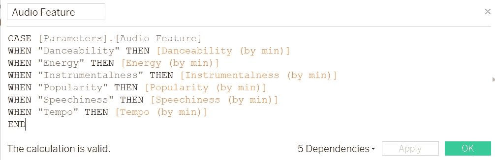

# Spotify API 和音频功能

> 原文：<https://towardsdatascience.com/spotify-api-audio-features-5d8bcbd780b2?source=collection_archive---------5----------------------->

## [实践教程](https://towardsdatascience.com/tagged/hands-on-tutorials)

## 一个女孩的旅程，使她的妈妈可以跳舞的播放列表

[**Tableau 公共仪表盘**](https://public.tableau.com/app/profile/anne.bode/viz/SpotifyAudioFeatures_16329242047150/Dashboard1#1) *(只在桌面上好看，说实话)* [**Jupyter 笔记本**](https://jovian.ai/abode118/spotify-audio-features)

这是我上一篇文章 [**用 Python 和 Tableau 可视化 Spotify 数据**](/visualizing-spotify-data-with-python-tableau-687f2f528cdd) 的后续。

通过“跳舞能力”过滤的仪表板——右下方图表中不可见的是 Fergalicious，排名第九。这绝对是犯罪，不是第一名。

我在晚上出去跳舞的最开心的一次是在 2015 年的一个星期二，我去了伦敦的一个独立之夜。我经常一边听菲比·布里杰斯的音乐一边锻炼。今天早上我看着 Spotify 上的“ [**悲伤女孩首发包**](https://open.spotify.com/playlist/37i9dQZF1DWW2hj3ZtMbuO) ”播放列表，心想“哇，这些歌都是波普音乐！”不用说，我不是邀请去做派对 DJ 的最佳人选。

今年夏天，我的任务是为我 66 岁的父亲、62 岁的母亲、13 岁的狗和 4 岁的侄子的 12 小时汽车旅行挑选音乐。标准？“我可以跟着跳舞的东西，”我妈妈说。我知道这意味着没有拉娜·德尔·雷，但除此之外我不确定。我登陆了这个 [**银河护卫队播放列表**](https://open.spotify.com/playlist/4e4Usly6uvVPAn5FKEyflr) ，这绝对是一个大众喜闻乐见的。但我很好奇我自己的图书馆里有哪些歌曲被认为是“适合跳舞的”

幸运的是，在从 Spotify 下载了我的库之后，我能够使用 Spotify 的 API 来提取每首歌曲的一些音频特征:**舞蹈性**、**能量**、**乐器性**、**流行度**、**语速**和**速度**。我现在可以看到我的曲库中哪些歌曲在这些指标上得分最高/最低，以及我最常播放的歌曲&的艺术家在谱上的排名。

看看下面你能做什么！

这里选择的音频特性是“可跳舞性”——你是说你不能在看台上跳舞？？？？？(图片由作者提供)。

# 步骤 1:请求数据

在此 向 Spotify [**索取您的数据副本。耐心等几天。**](https://www.spotify.com/account/privacy/)

# 步骤 2:准备流/库数据

请参考我之前的文章，[用 Python 和 Tableau 可视化 Spotify 数据](/visualizing-spotify-data-with-python-tableau-687f2f528cdd)。请注意，唯一的变化是，当我们合并两个数据帧时，我们将通过过滤掉空值来丢弃所有不在库中的流式歌曲(见下文)。

# 步骤 3:创建新的 Spotify 项目

在这里 登录你的开发者账号 [**。在仪表板中，创建一个新项目。创建后，您可以检索您的“客户 ID”和“客户机密”我们将在步骤 4 中使用这些。**](https://developer.spotify.com/dashboard)

# 步骤 4:使用 Spotify 的 API 创建音频特征数据帧

首先，我们将使用我们的客户端 ID 和客户端密码来生成一个访问令牌，这样我们就可以从 Spotify 的 API 中提取数据。注意:此令牌必须在一小时后重新生成。我利用 [**这篇文章**](https://stmorse.github.io/journal/spotify-api.html) 的帮助，想出了如何做到这一点。

jovian embed 不能在这个单元上工作——很抱歉！

现在，我们将提取与库中每个 track_uri 相关联的指标，并将它们添加到字典中。我选择了上面列出的六个指标，但请查看 Spotify 的 [**控制台**](https://developer.spotify.com/console/) 以了解如何提取您感兴趣的指标。

我们将把这个字典转换成一个数据帧( **df_features** )并将 **df_tableau** 和 **df_features** 保存为 csv 文件，我们可以将它们加载到 tableau 中。

# 步骤 5:将数据加载到 Tableau 中

连接到您的 Excel 文件(MySpotifyLibraryStreams.csv)作为数据源。这应该会在左侧弹出您的 AudioFeaturesTable.csv 文件。将后一个文件拖到右边，并在两个表之间添加一个关系。确保基于 track_uri 创建关系。

(图片由作者提供)

# 步骤 6:编辑 Tableau 中的字段

我们将在数据表中添加一些计算字段和一个参数。

**#1:** 创建计算字段**上场时间**:

新的计算字段:“上场时间”(图片由作者提供)。

**#2:** 为每个功能创建聚合计算字段(即**dance ability(by min)】**，这样当我们可视化数据时，我们可以通过**播放分钟数**而不是流数来计算加权平均值(因为每次启动汽车时，您可能会听到 5 毫秒的 [**、A-Team**](https://open.spotify.com/track/6F25tznBMyPJpXx7Gj1ch0?si=e719687384ec43a4) )。对您感兴趣的每个功能重复:

新的计算字段:“舞蹈能力(按分)”(图片按作者)。

**#3:** 创建参数和计算字段**音频特征** 详细说明，我参考了 Tableau 中的 [**这篇帖子**](https://help.tableau.com/current/pro/desktop/en-us/parameters_swap.htm) 。结果应该如下所示:

新参数:“音频特征”(图片由作者提供)。

新计算字段:“音频特征”(图片由作者提供)。

然后，您需要单击新创建的参数并选择“Show Parameter ”,这样您就可以在变量之间切换，并在同一个图表中显示结果。

# 步骤 7:创建可视化效果

[**下载仪表盘**](https://public.tableau.com/app/profile/anne.bode/viz/SpotifyAudioFeatures_16329242047150/Dashboard1#1) 看看我是怎么创建下面的可视化效果的。它们都是相互关联的，因此可以相互过滤，以便更好地浏览数据！

1.  **音频特征与最小值。已播放**:每首歌曲的播放时间与所选音频特征的分数的散点图
2.  平均。音频特性 : 显示每个音频特性的平均值(按播放分钟数加权)；请注意，筛选仪表板时，将重新计算此平均值
3.  **播放次数最多的艺术家**:气泡图，圆圈的大小表示播放的分钟数，而颜色表示我听的该艺术家的歌曲在所选音频功能上的得分(蓝色=低，红色=高)
4.  **艺术家**:根据我听的该艺术家的歌曲在所选音频功能上的评分从高到低排序；颜色代表播放的分钟数(蓝色=低，红色=高)
5.  **歌曲**:根据歌曲在所选音频功能上的评分高低排序；颜色代表播放的分钟数(蓝色=低，红色=高)

请注意，对于每个标签，我都按照 sum(播放分钟数)≥ 2 进行了过滤，以剔除今年我从未完整听过的歌曲(也就是说，当它们出现时，我只是跳过了它们)。

按“受欢迎程度”过滤的仪表板—贾斯汀比伯、坎耶等。是我听的(目前)最受欢迎的艺术家。

# 最后

原来我不是特别喜欢很适合跳舞或者很不适合跳舞的歌。下面图表上的 R 低得可怕，所以我想我只是#不可预测！也许这就是为什么我很难理解当我妈妈问她要一首可以跳舞的歌时，她是什么意思…因为我可以跳任何歌(见:贝尼托·斯金纳的不可思议系列 [**“你不能随着民间传说跳舞”**](https://www.instagram.com/p/CDHKs0eBVwj/?utm_source=ig_embed) 和[**“你不能永远地跳舞……”**](https://www.instagram.com/p/CI3ZGRmhTq5/?hl=en))。

散点图:舞蹈能力与上场时间(图片由作者提供)。

相反，我想我只能依靠 Spotify 给我的排名了。我要让我妈妈进监狱！另一方面，我了解到，显然 Bleachers 不是一个很适合跳舞的乐队，尽管我全心全意地不同意，尽管我承认 Phoebe Bridgers 很难跳舞。

根据可跳舞性从高到低排序的歌曲；瑞金娜·斯派克特的《忠诚》有点令人惊讶，但我是为它而来的(图片由作者提供)。

同样的分析也可以在仪表盘中包含的所有其他音频功能上进行，如**能量**、**乐器**、**流行度**、**语速**和**速度**。这就是我发现这个项目最有用的地方:学习如何在 Tableau 中创建一个参数，允许我在相同的图表中切换不同的变量。例如，下面的散点图与上面的**跳舞度**散点图相同，只是针对**语速**进行了过滤。你可以看到，我并不真的听那些在语音上得分很高的歌曲，我认为这与某些说唱风格有关。如果是这样的话，散点图是相当准确的，因为我不太听说唱。将这些散点图与我的不同偏好流派的朋友的散点图进行比较会很有趣！

散点图:语速与播放时间(图片由作者提供)。

这是一种探索我音乐品味的有趣方式。我希望你也能使用这个指南来了解更多关于你的东西！