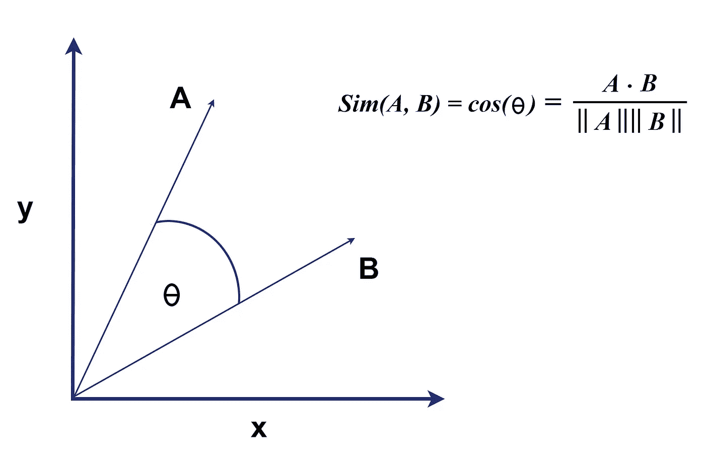
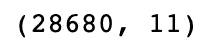
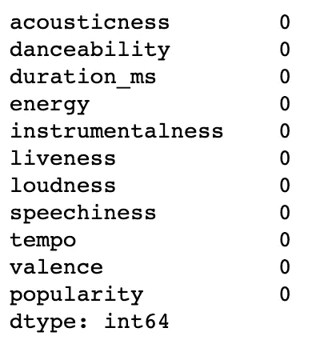
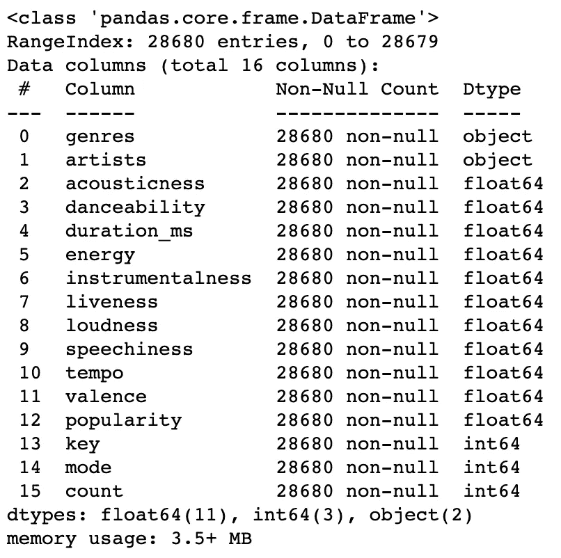
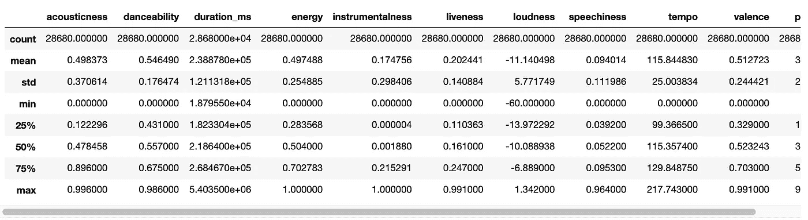
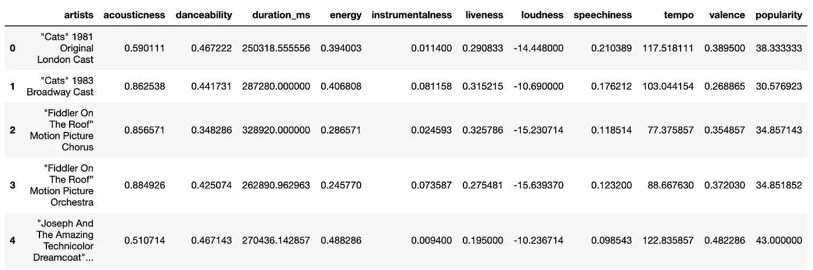
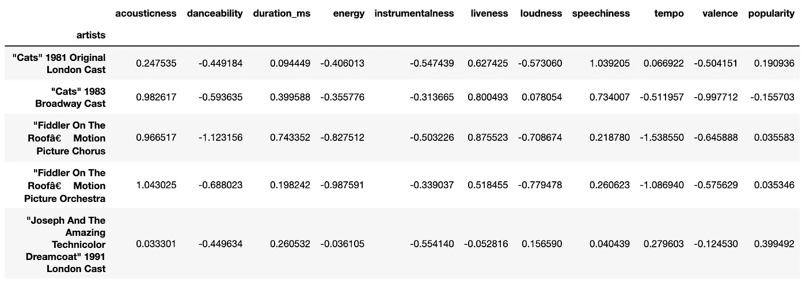
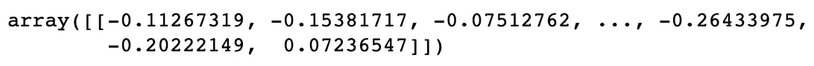
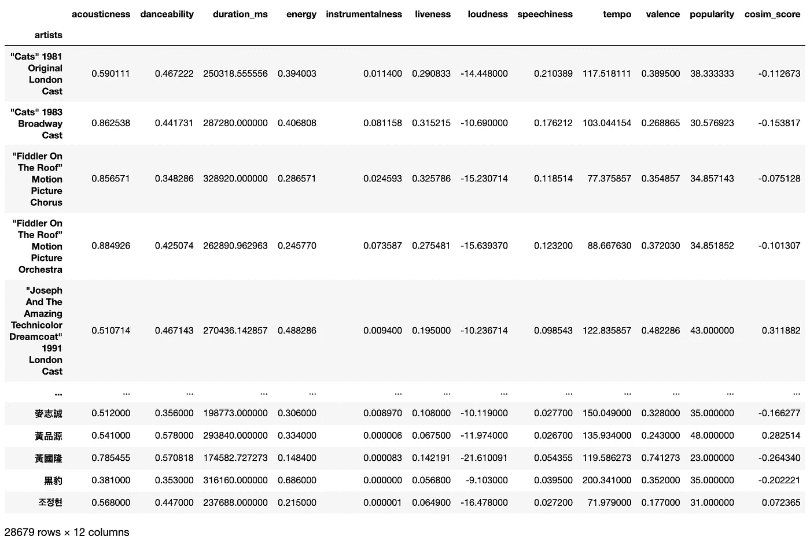
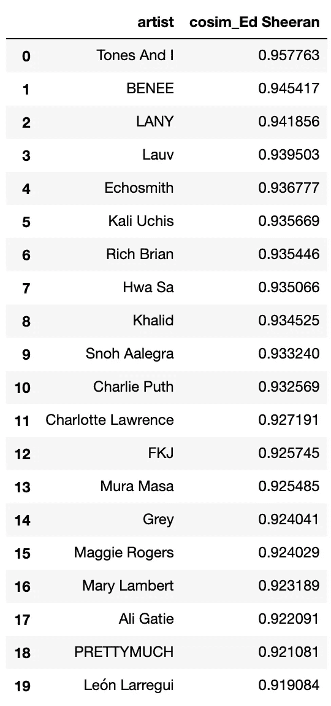

# Spotify 艺术家推荐

> 原文：<https://towardsdatascience.com/spotify-artist-recommender-7950af1fe20a?source=collection_archive---------27----------------------->

## 使用余弦相似度轻松构建智能推荐系统


图片来自 [Pixabay](https://pixabay.com/photos/music-on-your-smartphone-spotify-1796117)

应用程序和服务中的推荐系统不再是一个“好东西”。用户现在已经习惯于将此功能作为标准。音频流、视频流、广告、搜索引擎、博客等。仅举几个例子。

说到推荐系统，有一些常见的技术。我最喜欢的技巧是“**余弦相似度**”。很容易理解，速度也很快。即使没有数据科学背景，这个概念也不应该太难理解。

基本概念如下。



作者图片

画出你想要比较的项目的数字表示(上面的 A 和 B ),然后计算点之间的**余弦距离**。背后的理论是距离越小，它们越相似。

# 让我们看一个例子…

## 步骤 1:确定项目范围

创建一个推荐系统，在 Spotify 上找到相似的艺术家。

## 第二步:收集数据

我在 [Kaggle](https://www.kaggle.com/) 上下载了数据集“[Spotify Dataset 1922–2021，~600k 曲目](https://www.kaggle.com/yamaerenay/spotify-dataset-19212020-160k-tracks)”。我将使用的文件名为“ [data_by_artist_o.csv](https://www.kaggle.com/yamaerenay/spotify-dataset-19212020-160k-tracks?select=data_by_artist_o.csv) ”。

```
import pandas as pd
import numpy as npfrom sklearn.metrics.pairwise import cosine_similarity
from sklearn.preprocessing import StandardScalerdf_artists = pd.read_csv('./data_by_artist_o.csv', encoding='utf-8')df_artists.shape
```



这个数据集有 28680 首歌曲，有 11 个特征/列。

## 步骤 3:清理数据

数据实际上已经处于很好的状态，没有任何空值。

```
df_artists.isnull().sum()
```



```
df_artists.info()
```



```
df_artists.describe()
```



有几个特征是非数字的或者没有真正增加多少价值，所以我们将删除它们。

```
df_artists.drop(columns={'genres', 'key', 'mode', 'count'}, inplace=True)df_artists.head()
```



我们现在面临的问题是，所有这些描述性特征的比例都不同。我们需要对数据进行缩放，以便它们都具有可比性。

```
ss = StandardScaler()df_artists_scaled = ss.fit_transform(df_artists)
df_artists_scaled = pd.DataFrame(data=df_artists_scaled, index=df_artists.index, columns=df_artists.columns)df_artists_scaled.head()
```



正如您现在看到的，这些特性都在-1 到 1 的范围内。

## 步骤 4:探索性数据分析(EDA)

让我们看看“**艾德·希兰**”作为艺术家是如何工作的。

```
artist_array = np.array(df_artists_scaled.T['Ed Sheeran']).reshape(1,-1)
artist_dataset_array = df_artists_scaled.drop(index='Ed Sheeran').values
cosine_similarity(artist_array, artist_dataset_array)
```



```
df_Ed_Sheeran = df_artists.drop(index='Ed Sheeran').copy()
df_Ed_Sheeran['cosim_score'] = cosine_similarity(artist_array, artist_dataset_array).reshape(-1,1)df_Ed_Sheeran
```



看看最后新创建的“ **cosim_score** ”。这向我们展示了该艺术家与其他艺术家的相似性，使用了“**余弦相似度**”。

我们现在有了为自己创建一个方便的函数的构件。

```
def get_cosim_artist_df(artist_name, df, n):
    ss = StandardScaler() df_scaled = ss.fit_transform(df)
    df = pd.DataFrame(data=df_scaled, index=df.index)

    artist_array = np.array(df.T[artist_name]).reshape(1,-1)
    dataset_array = df.drop(index=artist_name).values

    cosim_scores = cosine_similarity(artist_array, dataset_array).flatten()artist_names_array = df.drop(index=artist_name).index.values

    df_result = pd.DataFrame(
        data = {
            'artist'               : artist_names_array,
            'cosim_' + artist_name : cosim_scores,
        }
    )

    df_result = df_result.sort_values(by='cosim_' + artist_name, ascending=False).head(n)    
    return df_result.reset_index(drop=True)
```

让我们看看它的实际效果…

```
get_cosim_artist_df('Ed Sheeran', df_artists, 20)
```

根据我们新创建的函数，与“**艾德·希兰**”相似的前 20 位艺人…



我不得不承认我不认识名单上的大多数艺术家。我打开 Spotify，听了余弦相似度超过 93%的前三名，我认为它做得相当好。想知道你在评论中的想法会很有趣。

## 结论

这种技术不仅限于音频和视频流，这可能是第一个想到的用例。只要你能把你的数据组织成一个数据透视表，这就可以了。我再给你举一个例子供你思考。假设您有一个网站，您想向您的用户推荐页面或文档。您可以创建一个数据透视表，将页面名称或文档标题作为索引(行)，还可以创建一个“标签”列表作为列。如果标签描述了页面或文档，你可以将它标记为 0 或 1，或者如果一些标签比其他标签更重要，甚至可以标记为权重。然后你运行它通过完全相同的过程，因为它会像魅力一样工作。

如果你喜欢这篇文章，我写了一些其他的文章，我想你可能会感兴趣。我正在通过例子解释各种机器学习概念。

<https://levelup.gitconnected.com/predicting-titanic-survivors-using-ml-8570ef4e89e8>  <https://levelup.gitconnected.com/predicting-house-sale-prices-using-ml-30b829fd9556>  <https://levelup.gitconnected.com/categorising-using-machine-learning-5601baf9a05e>  

我希望你觉得这篇文章有趣并且有用。如果您想随时了解情况，请不要忘记关注我，注册我的[电子邮件通知](https://whittle.medium.com/subscribe)。

# 迈克尔·惠特尔

*   ***如果你喜欢这个，请*** [***跟我上媒***](https://whittle.medium.com/)
*   ***更多有趣的文章，请*** [***关注我的刊物***](https://medium.com/trading-data-analysis)
*   ***有兴趣合作吗？*** [***我们上领英***](https://www.linkedin.com/in/miwhittle/) 连线吧
*   ***支持我和其他媒体作者*** [***在此报名***](https://whittle.medium.com/membership)
*   ***请别忘了为文章鼓掌:)←谢谢！***