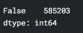

# Spotify 案例研究:制作热门歌曲有秘诀吗？

> 原文：<https://towardsdatascience.com/spotify-case-study-is-there-a-secret-to-producing-hit-songs-aab8c2dc64c1?source=collection_archive---------15----------------------->


照片由 [Yomex Owo](https://unsplash.com/@yomex4life) 在 [Unsplash](https://unsplash.com/) 上拍摄

## 我可以用我的车库之歌让自己成为明星吗？

几个月后，我参加了一个数据科学项目，并为
的职业转型做好了准备，我发现要想在这个领域取得真正的成功
，应该将获得的知识应用到项目中。这些
知识可以回答任何关于分析数据的问题。

然而，人们可能会遇到几个新问题:这个问题是否符合我目前的技能组合，或者它是否过于雄心勃勃？一个人应该从哪里开始？这个问题有意义吗？

在这里，我提出了一个对初学者更友好的方法:回答一个已经回答过的问题，但加入自己的个人风格。

我将带你了解我在 Spotify 音乐数据集上的第一个探索性数据分析(EDA)项目。这将有助于提供更多的背景。

你可以在这里找到这个数据集[(tracks . CSV)](https://www.kaggle.com/yamaerenay/spotify-dataset-19212020-160k-tracks?select=tracks.csv)。

## **第 1 部分:数据操作和清理**

首先，我们必须导入这个项目所需的库:

```
import pandas as pd
import numpy as np
import matplotlib.pyplot as plt
import seaborn as sns
import plotly.express as px
import datetime
import calendar
```

接下来，让我们阅读我们的数据框架，看看第一个样本:

```
df = pd.read_csv('../Spotify Tracks.csv')df.sample(10)
```


现在，我们已经看到了数据框架中不同类型变量的列，让我们看看它的数据类型，看看是否需要一些争论:

```
df.info()
```


有趣的是，似乎**发布日期**列被设置为一个字符串。我们最好把它定为一个日期，以确保更顺利的分析。让我们也为音轨的发布年份和月份创建一个新的列。

为此，我们将使用***PD . to _ datetime()****函数将该列设置为日期，并使用**。 *dt* 法**提取其年月。我们还将使用一个 ***lambda*** 函数来为日历库中的每个月指定相应的名称:*

```
*df['release_date'] = pd.to_datetime(df['release_date'])
df['release_year'] = df['release_date'].dt.year
df['release_month'] = df['release_date'].dt.month
df['release_month'] = df['release_month'].apply(lambda x : calendar.month_name[x])*
```

*让我们再看一看:*

```
*df.info()*
```

**

*这个看起来没错！但是看起来 id 和 id_artists 对我们的分析没什么用。所以我们要用。**下降方法:***

```
***columns_to_drop = ['id','id_artists']
df.drop(columns = columns_to_drop, inplace = True)df.sample(5)***
```

******

***好了，现在我们有了正确的列，在开始有趣的东西之前，让我们做最后一件事:检查重复项。***

```
***df.duplicated().value_counts()***
```

******

***消除重复:***

```
***df.drop_duplicates(inplace = True)

df.duplicated().value_counts()***
```

******

***非常有效。现在让我们进入正题。***

## *****第二部分:数据探索和分析*****

***好了，现在我们应该阐明驱动我们分析的主要问题:**“有人能根据音轨属性数据发布一首热门歌曲吗？”*****

***我们将为我们的图表设置样式和调色板(如果我们正在处理 Spotify 数据，它必须是绿色的，对吗？)***

```
***sns.set_palette('BuGn_r')
sns.set_style('darkgrid')***
```

***让我们来看看流行歌曲的分布情况:***

```
***plt.figure(figsize = (14,8))sns.histplot(df['popularity'], kde = True)
plt.title('Distribution of Tracks by Popularity')
plt.show()***
```

******

***有趣的是，超过 45，000 首歌曲在流行的墓地里。并且大多数歌曲分布在大约 1 到 40 点的流行度之间。***

***看起来音乐市场现在竞争很激烈，是吧？但是一直都是这样吗？让我们来看看:***

```
***plt.figure(figsize = (20, 8))
sns.countplot(data = df, x = 'release_year', color = '#1DB954')
plt.title('Distribution of Tracks Produced Over Time')
plt.xticks(rotation = 90)
plt.show()***
```

******

***看起来它的竞争一年比一年激烈，2020 年生产了近 14 万首歌曲，这一年许多人在家里有很多空闲时间。该数据集包含截至 2021 年 4 月的歌曲数据，因此我们必须等待，看看今年会产生多少首歌曲。***

***现在，让我们看看数据集中的一些总体指标。我们将使用。 ***describe()*** 方法，但是添加了一些附加参数来沿着几个百分点分布数据:***

```
**df.describe([.01,.1,.2,.3,.4,.5,.6,.7,.8,.9,.99])**
```

****

**这张表中有几个发现，但真正引起我注意的是，与之前的(19 点)相比，受欢迎程度变量中的 90%和 99%之间有一个很大的飞跃。因此，似乎有几首热门歌曲的人气接近 100 分。**

**这意味着 Spotify 中有一组精选的歌曲非常受欢迎。通过在我们的歌曲中加入正确的和弦和节奏，有可能达到这个目标吗？让我们绘制一个相关图表来找出答案:**

```
**#First we make a list with the track attributes we want to comparetrack_attributes = ["popularity","acousticness",
                    "danceability", 
                    "energy", 
                    "duration_ms", 
                    "instrumentalness", 
                    "valence", 
                    "tempo", 
                    "liveness", 
                    "loudness", 
                    "speechiness"] #Then we plot
plt.figure(figsize = (10,8), dpi = 80)sns.heatmap(df[track_attributes].corr(),vmin=-1, vmax=1, annot=True, cmap = 'BuGn_r' )
plt.xticks(rotation = 45)
plt.show()**
```

****

**我们可以在这张热图中看到，流行度和赛道属性之间没有明显的相关性。尽管如此，深入研究显示出正相关的三个属性仍然是值得的:**可跳舞性**、**能量**和**响度。****

**让我们试一试:**

```
**corr_vars = ['danceability', 'energy', 'loudness']

list(enumerate(corr_vars))**
```

****

**因此，在列出了我们想要检查的变量并将其转换成一个生成器对象之后，我们从每个图表中随机抽取 500 个出现次数的样本来绘制这三个属性:**

```
**plt.figure(figsize = (20, 15))

for i **in** enumerate(corr_vars):
    plt.subplot(1,3,i[0]+1)
    sns.regplot(data = df.sample(500), y = 'popularity', x = i[1])
plt.show()**
```

****

**看起来这证实了我们最初在相关性热图中看到的情况，但揭示了一些对我们的分析非常有趣的事情:大多数高受欢迎度异常值都在三个属性的最高范围内，特别是响度。这可能是解决我们主要问题的一块巨大的垫脚石。**

**最好将我们的数据分成子集，以获得最流行的歌曲，这样我们就可以看到这些属性的存在程度:**

```
**popular_songs = df[df['popularity'] >= 80]

print(popular_songs.shape)

popular_songs.sample(10)**
```

****

**这里我们有 954 首歌曲，让我们通过 mean 绘制它们的属性来看看它们有什么共同点:**

```
**#First we list the attributes we want to see reflected in the plot
labels = [ "valence", "danceability", "energy", "acousticness","instrumentalness", "liveness","speechiness"]#Then we plot those attributes by meanfig = px.line_polar(popular_songs, theta = labels, r = popular_songs[labels].mean(), line_close = True)

fig.show()**
```

********

**这是个好消息，因为我们又发现了一个可能有助于我们创作热门歌曲的属性:化合价。**

**另一方面，响度是一个非常强的竞争者，因为它的值范围从-60 到 0，平均值为-6 表明最流行的歌曲往往很大声。**

**现在，让我们来看看随着时间的推移，这些是如何成为最受欢迎的歌曲的一部分的:**

```
**#First we make a list of our attributes of interest
audio_attributes = ["danceability","energy","valence"]#Now we plot our charts
plt.figure(figsize = (20, 8))
sns.set_palette('Accent')
plt.subplot(2,1,1)
for attribute in audio_attributes:
    x = popular_songs.groupby("release_year")[attribute].mean()
    sns.lineplot(x=x.index,y=x,label=attribute)
    plt.title('Audio Attributes Over Time for Popular Songs')plt.subplot(2,1,2)
sns.lineplot(x = popular_songs.groupby('release_year')['loudness'].mean().index, y = popular_songs.groupby('release_year')['loudness'].mean())plt.ylabel('Range')
plt.xlabel('Year')**
```

****

**看起来垃圾音乐真的让价在 90 年代下降了，是吗？**

**似乎在过去的 50 年里，流行歌曲总是充满活力，声音洪亮，也很欢快。这看起来像是人们音乐品味的一个明确指标。**

**所以，任何创作出具有这些特质的歌曲的人肯定会成为明星，对吗？**

**让我们来看看目前最受欢迎的 25 位歌手的歌曲，并与随机样本进行比较:**

```
**popular_songs['artists'].value_counts().nlargest(25)popular_songs['artists'].value_counts().sample(30)**
```

****

**看起来贾斯汀比伯和比莉·艾莉丝现在很受欢迎，有 11 首热门歌曲！但这并不令人惊讶，因为前 25 名名单中的所有艺术家都非常知名，样本名单中的许多艺术家也是如此。**

## ****第三部分:结论****

**制作一首热门歌曲不一定取决于你的歌曲有多快乐、有活力或响亮，但更有可能的是，它与你目前作为一名艺术家的受欢迎程度有关。**

**尽管如此，为了增加推出流行歌曲的几率，在其中添加流行属性可能是好的，就像我们在分析中看到的那样。这对新音乐人来说也是一个很好的建议，让他们真正投入时间和精力来营销他们的内容。**

**感谢阅读！**

**在 [LinkedIn](http://www.linkedin.com/in/richard-rivas-data) 上找到我**