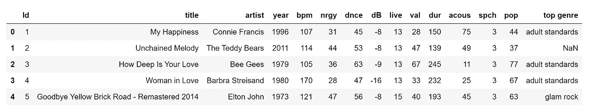
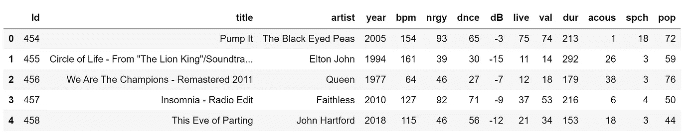
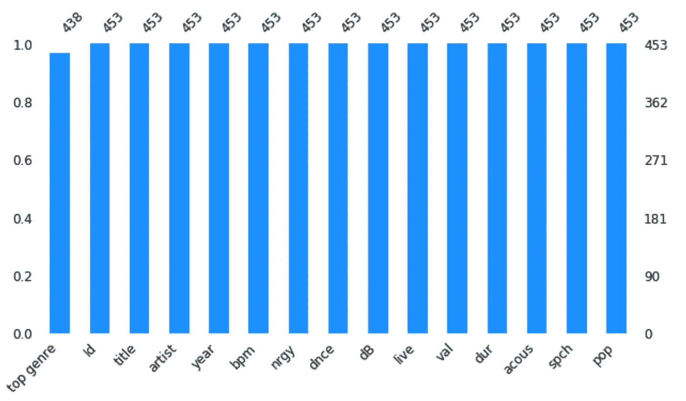
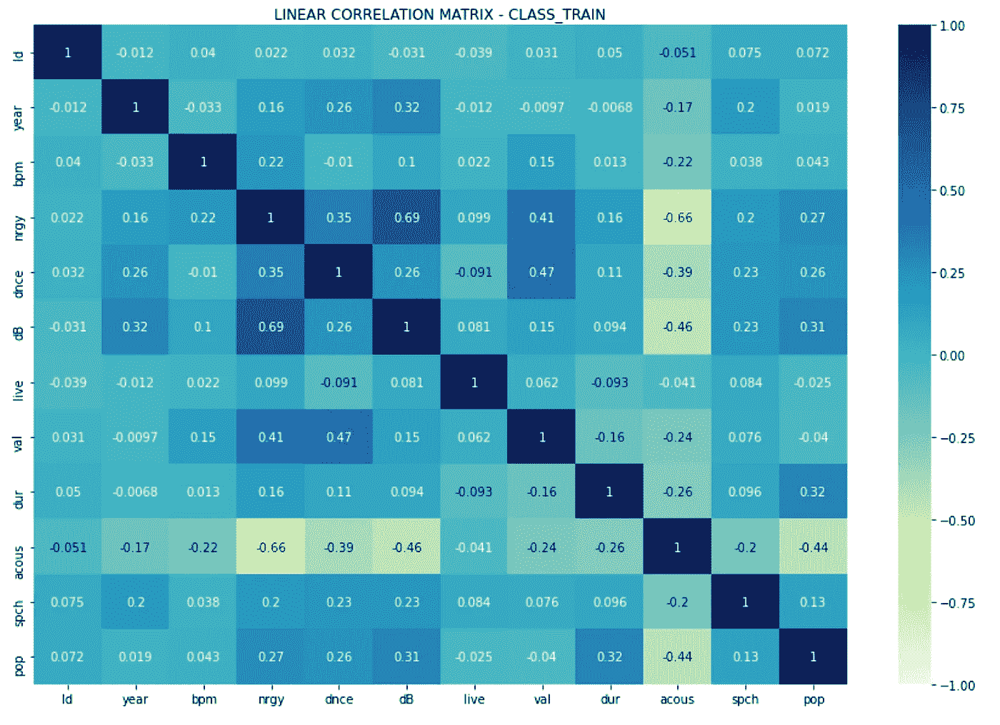
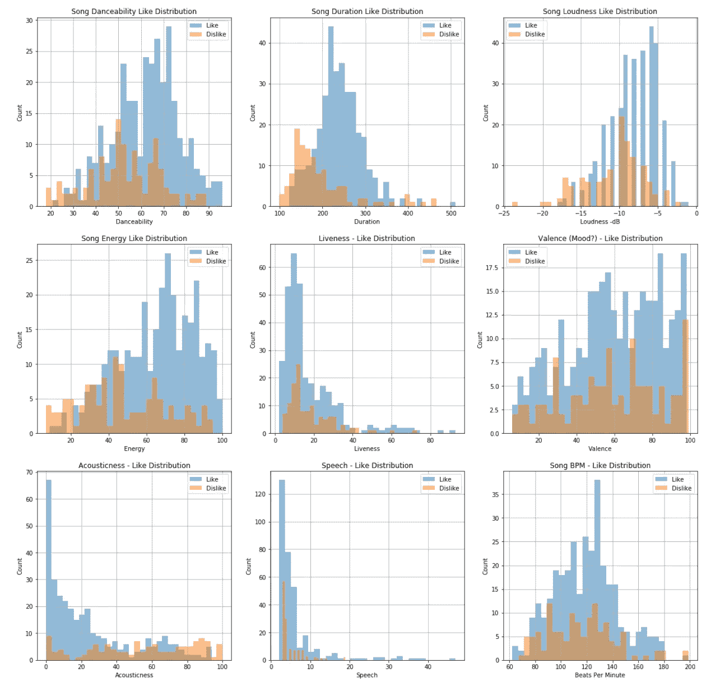
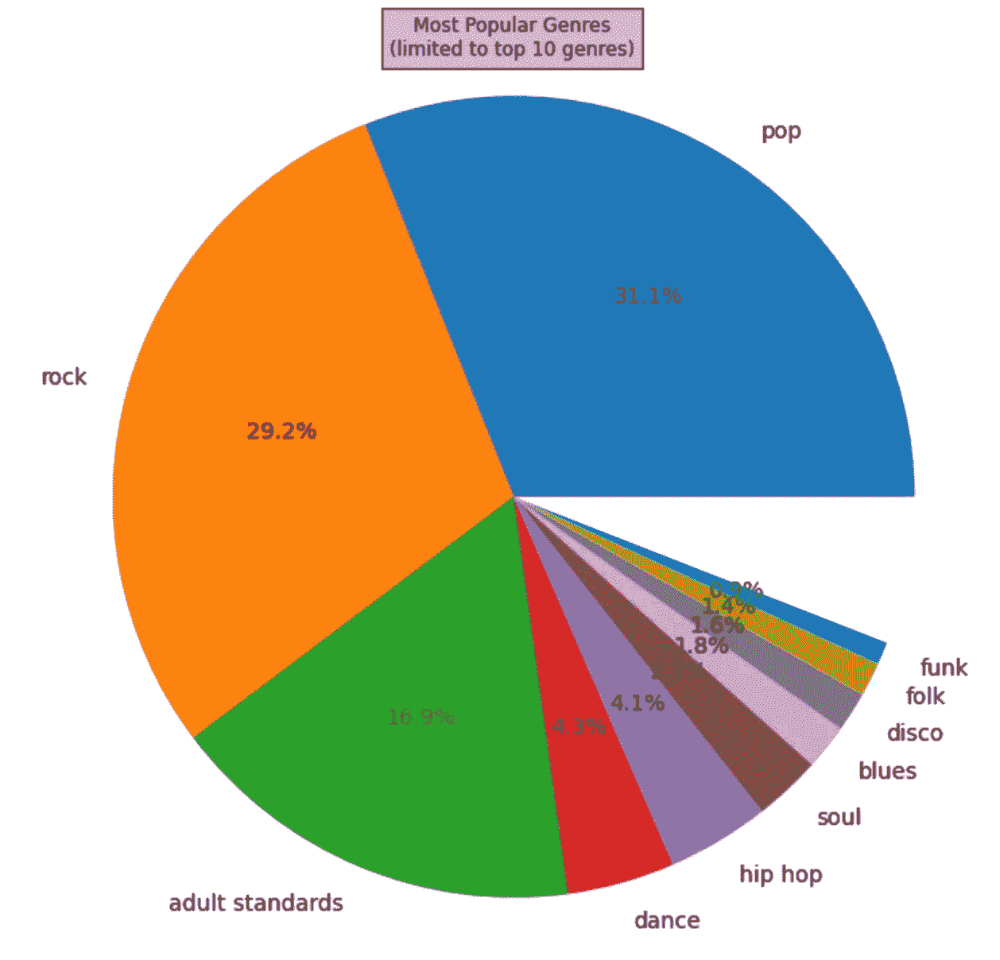
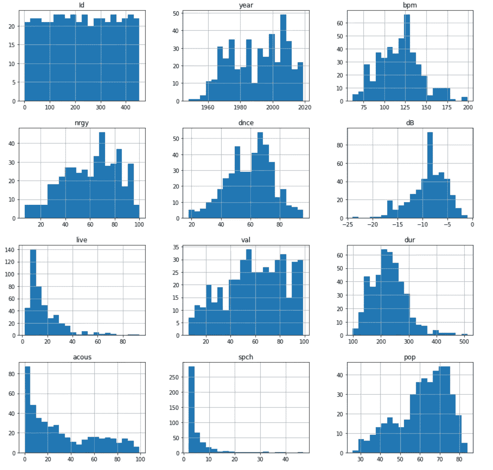
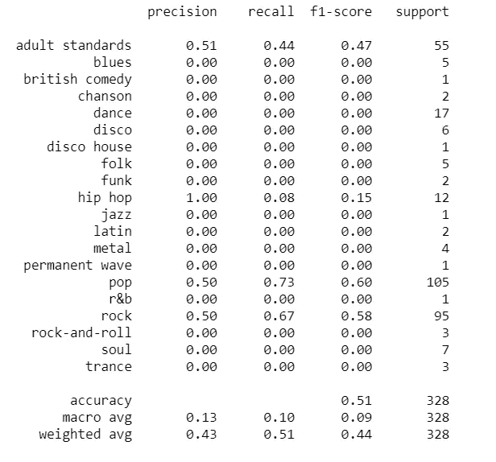
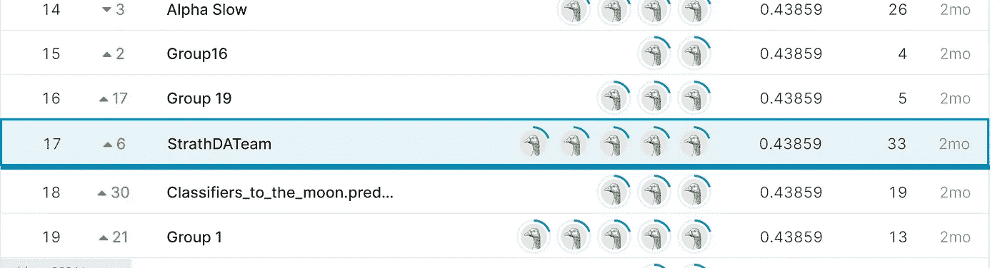

# Spotify 流派分类算法

> 原文：<https://towardsdatascience.com/spotify-genre-classification-algorithm-88051db23d42?source=collection_archive---------10----------------------->

## 监督机器学习— SVM、随机森林、逻辑回归

本文假设对机器学习算法和数据科学技术有基本的了解。

文章大纲:

*   监督机器学习
*   分类—多类
*   数据集-初步分析和特征选择
*   算法选择— SVM、逻辑回归、随机森林
*   模型性能—准确性得分
*   改进—超参数调整和集成学习
*   结论—更多数据！


亚历山大·沙托夫在 [Unsplash](https://unsplash.com?utm_source=medium&utm_medium=referral) 上拍摄的照片

## 什么是有监督的机器学习？

正如所有技术都有术语一样，监督学习是一个总括术语，用来描述机器学习的一个领域(在实践中使用最频繁)，其中使用的数据是标记为的**。监督学习算法的目标是利用数据集来产生一个模型，该模型以特征向量(x)作为输入，以变量(Y)作为输出。使用一种算法来学习从输入到输出的映射函数，然后使用新的未知输入数据来预测该数据的输出变量。**

## 什么是分类？

分类算法将已标记示例的数据集作为输入来产生模型，该模型可以获取未标记的新数据并自动将标签分配给未标记的示例。

如果分类问题有一组两个标签(例如“垃圾邮件”或“非垃圾邮件”)，那么它就是一个二元分类问题。当集合中的标签数量为三个或更多时，多类分类是一个问题。我们正在寻找的问题是一个多类，因为在这个集合中有许多类型。

## 给我看看数据

被检查的数据集是歌曲信息的集合。它可以在我的 python 代码旁边的 [Kaggle](https://www.kaggle.com/c/cs9856-spotify-classification-problem-2021/overview/description) 和 [Github](https://github.com/rorybain96/spotifyclass) 上获得。

数据已经被分成标记的训练数据和未标记的测试数据。



按作者分类的图像(标记为训练数据)



作者提供的图片(未标记的测试数据)

*   Id —任意唯一的轨道标识符
*   标题—音轨标题
*   艺术家——歌手或乐队
*   年份—发布(或重新发布)的年份
*   bpm —每分钟节拍数(节奏)
*   nrgy —能量:数值越高，能量越大
*   dnce — danceability:值越高，越容易随着这首歌跳舞
*   dB —响度(dB):值越高，歌曲的音量越大
*   live-liveness:该值越高，歌曲越有可能是现场录制的
*   val-valence:值越高，歌曲的情绪越积极
*   dur —持续时间:歌曲的长度
*   acous-acoustic:值越高，歌曲的声音越大
*   spch-speechiness:值越高，歌曲包含的口语单词越多
*   流行度:值越高，歌曲越流行
*   热门流派—曲目的流派(以及此问题的目标变量)

在 top_genre 列的训练集中识别出 15 个空值。missingo 库为缺失值提供了很好的可视化效果，使得识别具有空值的列变得很容易。15 个空值被删除。

```
import missingno as msno
msno.bar(class_train, color="dodgerblue", sort="ascending", figsize=(10,5), fontsize=12)
class_train["top genre"].isnull().value_counts()
# dropping NULL values
class_train = class_train.dropna(axis=0)
```



作者图片

在创建任何模型之前，最好检查[多重共线性](https://statisticsbyjim.com/regression/multicollinearity-in-regression-analysis/)，多重共线性是数据集中独立要素之间的相关性。检查这一点最简单的方法是使用关联热图。显然不存在多重共线性。

```
# Plot linear correlation matrix
fig, ax = plt.subplots(figsize=(15,10))
sns.heatmap(class_train.corr(), annot=True, cmap='YlGnBu', vmin=-1, vmax=1, center=0, ax=ax)
plt.title('LINEAR CORRELATION MATRIX - CLASS_TRAIN')
plt.show()
```



作者图片

pop(流行度)列可用于创建另一个列，表示一首歌曲是否受欢迎(1)或不受欢迎(2)。直方图可用于显示数据集中每个要素的“相似”分布。这是特征工程的一个例子。

```
conditions = [
    (class_train['pop'] >= 55),
    (class_train['pop'] < 55) ]
values = [1, 2]
class_train['like'] = np.select(conditions, values)# for all features
pos_bpm = class_train[class_train['like'] == 1]['bpm']
neg_bpm = class_train[class_train['like'] == 2]['bpm']
pos_nrgy = class_train[class_train['like'] == 1]['nrgy']
neg_nrgy = class_train[class_train['like'] == 2]['nrgy']
pos_db = class_train[class_train['like'] == 1]['dB']
neg_db = class_train[class_train['like'] == 2]['dB']
pos_live = class_train[class_train['like'] == 1]['live']
neg_live = class_train[class_train['like'] == 2]['live']
pos_dur = class_train[class_train['like'] == 1]['dur']
neg_dur = class_train[class_train['like'] == 2]['dur']
pos_acous = class_train[class_train['like'] == 1]['acous']
neg_acous = class_train[class_train['like'] == 2]['acous']
pos_spch = class_train[class_train['like'] == 1]['spch']
neg_spch = class_train[class_train['like'] == 2]['spch']
pos_val = class_train[class_train['like'] == 1]['val']
neg_val = class_train[class_train['like'] == 2]['val']
pos_dnce = class_train[class_train['like'] == 1]['dnce']
neg_dnce = class_train[class_train['like'] == 2]['dnce']fig2 = plt.figure(figsize=(20,20))
#dnce
ax3 = fig2.add_subplot(331)
ax3.set_xlabel('Danceability')
ax3.set_ylabel('Count')
ax3.set_title('Song Danceability Like Distribution')pos_dnce.hist(alpha=0.5, bins=30)
ax4 = fig2.add_subplot(331)neg_dnce.hist(alpha=0.5, bins=30)
plt.legend(['Like', 'Dislike'])#duration
ax5 = fig2.add_subplot(332)
ax5.set_xlabel('Duration')
ax5.set_ylabel('Count')
ax5.set_title('Song Duration Like Distribution')pos_dur.hist(alpha=0.5, bins=30)
ax6 = fig2.add_subplot(332)neg_dur.hist(alpha=0.5, bins=30)
plt.legend(['Like', 'Dislike'])# loudness (dB)
ax7 = fig2.add_subplot(333)
ax7.set_xlabel('Loudness -dB')
ax7.set_ylabel('Count')
ax7.set_title('Song Loudness Like Distribution')
plt.legend(['Like', 'Dislike'])pos_db.hist(alpha=0.5, bins=30)
ax8 = fig2.add_subplot(333)neg_db.hist(alpha=0.5, bins=30)
plt.legend(['Like', 'Dislike'])# energy
ax9 = fig2.add_subplot(334)
ax9.set_xlabel('Energy')
ax9.set_ylabel('Count')
ax9.set_title('Song Energy Like Distribution')pos_nrgy.hist(alpha=0.5, bins=30)
ax9 = fig2.add_subplot(334)neg_nrgy.hist(alpha=0.5, bins=30)
plt.legend(['Like', 'Dislike'])# live
ax10 = fig2.add_subplot(335)
ax10.set_xlabel('Liveness')
ax10.set_ylabel('Count')
ax10.set_title('Liveness - Like Distribution')pos_live.hist(alpha=0.5, bins=30)
ax11 = fig2.add_subplot(335)neg_live.hist(alpha=0.5, bins=30)
plt.legend(['Like', 'Dislike'])# val
ax12 = fig2.add_subplot(336)
ax12.set_xlabel('Valence')
ax12.set_ylabel('Count')
ax12.set_title('Valence (Mood?) - Like Distribution')pos_val.hist(alpha=0.5, bins=30)
ax13 = fig2.add_subplot(336)neg_val.hist(alpha=0.5, bins=30)
plt.legend(['Like', 'Dislike'])# acous
ax14 = fig2.add_subplot(337)
ax14.set_xlabel('Acousticness')
ax14.set_ylabel('Count')
ax14.set_title('Acousticness - Like Distribution')pos_acous.hist(alpha=0.5, bins=30)
ax15 = fig2.add_subplot(337)neg_acous.hist(alpha=0.5, bins=30)
plt.legend(['Like', 'Dislike'])# speech
ax16 = fig2.add_subplot(338)
ax16.set_xlabel('Speech')
ax16.set_ylabel('Count')
ax16.set_title('Speech - Like Distribution')pos_spch.hist(alpha=0.5, bins=30)
ax17 = fig2.add_subplot(338)neg_spch.hist(alpha=0.5, bins=30)
plt.legend(['Like', 'Dislike'])# bpm
ax18 = fig2.add_subplot(339)
ax18.set_xlabel('Beats Per Minute')
ax18.set_ylabel('Count')
ax18.set_title('Song BPM - Like Distribution')pos_bpm.hist(alpha=0.5, bins=30)
ax19 = fig2.add_subplot(339)neg_bpm.hist(alpha=0.5, bins=30)
plt.legend(['Like', 'Dislike'])
```



作者图片

然后调查歌曲在训练集中的流派分布。在训练集中，有 86 个独特的流派名称，这实在是太多了。经过进一步调查，这些流派名称中有许多只是地理上的差异，例如，“英国摇滚”和“专辑摇滚”——它们可以归入“摇滚”类别。因此，流派被进一步概括，将流派的数量从 86 个减少到 20 个。

```
class_train = class_train.replace({'top genre': {"album rock": "rock", "glam rock": "rock", "dance rock":"rock", "art rock":"rock",
                                  "soft rock":"rock", "country rock": "rock", "classic rock":"rock", "blues rock":"rock", "celtic rock":"rock",
                                  "australian rock":"rock", "german alternative rock":"rock", "alternative rock":"rock", "dance pop":"pop",
                                "brill building pop": "pop", "europop": "pop", "barbadian pop": "pop", "classic uk pop":"pop", 
                                "new wave pop":"pop", "canadian pop":"pop", "art pop":"pop", "belgian pop": "pop", "britpop": "pop", 
                                "italian pop":"pop", "classic danish pop": "pop", "bow pop": "pop", "baroque pop": "pop", "bubblegum pop": "pop",
                                "afropop":"pop", "hip pop":"pop", "atl hip hop": "hip hop", "east coast hip hop": "hip hop", "detroit hip hop":"hip hop", 
                                "bronx hip hop": "hip hop", "bubblegum dance": "dance", "eurodance":"dance", "belgian dance":"dance", "german dance": "dance",
                                "classic soul": "soul", "british soul": "soul", "chicago soul": "soul", "british folk": "folk", "american folk revival":"folk",
                                "drone folk":"folk","canadian folk":"folk", "deep adult standards":"adult standards", "glam metal": "metal", "alternative metal": "metal",
                                "acoustic blues":"blues", "british blues":"blues", "louisiana blues":"blues", "g funk":"funk", "brit funk":"funk",
                                "afrobeat":"dance", "british invasion":"rock", "doo-wop":"blues", "boy band":"pop", "merseybeat":"rock-and-roll", "blue":"blues",
                                                "bebop":"jazz", "avant-garde jazz":"jazz", "boogaloo": "latin", "big room": "trance", "bubble trance":"trance", "glam punk":"rock",
                                                "australian talent show":"pop", "mellow gold":"rock", "hi-nrg": "dance", "neo mellow": "pop", "yodeling":"folk", "classic girl group":"pop",
                                                "british dance band":"jazz", "deep house":"dance", "uk garage": "dance", "chicago rap":"hip hop"}})
```

下面的饼状图显示了前 10 个流派，只是为了保持可读性。很明显，训练数据集中的大多数歌曲属于摇滚和流行音乐类别——这种情况的影响将在结论中讨论。

```
# Find percent of each genre
df_genre = class_train['top genre'].value_counts()[:10].sort_values(ascending=False) / len(class_train)
sizes = df_genre.values.tolist()
labels = df_genre.index.values.tolist()# Pie chart for genre
fig1, ax1 = plt.subplots(figsize=(10,10))
ax1.pie(sizes, labels=labels, autopct='%1.1f%%', shadow=False, textprops={'fontsize': 14})
ax1.axis('equal')
plt.title("Most Popular Genres\n" + "(limited to top 10 genres)", bbox={'facecolor':'0.8', 'pad':5})
plt.show()
```



作者图片

然后观察特征的分布。这是因为我们希望每个特征的直方图显示正态分布。

```
import matplotlib.pyplot as plt
%matplotlib inline
class_train.hist(bins=20, figsize=(15,15))
plt.show()
```



作者图片

上面的直方图显示一些变量是偏斜的(acous，live，spch)，这种偏斜可能是异常值的原因。因此，可以通过移除潜在的异常值来纠正这种偏差。可以使用箱线图和 [z 值](https://www.geeksforgeeks.org/z-score-for-outlier-detection-python/)来识别异常值。z 值大于 3 的数据点将被移除。移除异常值以减少噪声可以提高模型的性能并防止过度拟合。

```
import seaborn as sns
# acoustic
sns.boxplot(x=class_train['acous']) # no visible outliers
# dur
sns.boxplot(x=class_train['dur']) # OUTLIERS !!
# live
sns.boxplot(x=class_train['live']) #OUTLIERS !!
# spch
sns.boxplot(x=class_train['spch']) #OUTLIERS !!class_train = class_train[np.abs(class_train.dur-class_train.dur.mean()) <= (3*class_train.dur.std())]
# keep only the ones that are within +3 to -3 standard deviations in the column 'live'.class_train = class_train[np.abs(class_train.live-class_train.live.mean()) <= (3*class_train.live.std())]
# keep only the ones that are within +3 to -3 standard deviations in the column 'live'.class_train= df[np.abs(class_train.spch-class_train.spch.mean()) <= (3*class_train.spch.std())]
# keep only the ones that are within +3 to -3 standard deviations in the column 'spch'.
```

将在模型创建过程中使用的特征是第 3 列到第 13 列。被删除的功能有标题、艺术家和 Id。为模型训练选择的特征是:“年份”、“bpm”、“nrgy”、“dnce”、“dB”、“spch”、“pop”、“live”、“acous”。

然后使用 train_test_split 函数对训练集进行分离，以进一步将数据划分为 75% / 25%的分割。通过进一步分割训练数据集，我们创建了一个[验证集](https://machinelearningmastery.com/difference-test-validation-datasets/#:~:text=The%20%E2%80%9Ctraining%E2%80%9D%20data%20set%20is,is%20used%20to%20qualify%20performance.&text=Perhaps%20traditionally%20the%20dataset%20used,called%20the%20%E2%80%9Ctest%20set%E2%80%9D.)。

```
y = class_train.values[:,14]
X = class_train.values[:,3:13]from sklearn.model_selection import train_test_split
X_train, X_test, y_train, y_test = train_test_split(X, y, test_size=0.25, random_state=42)
```

## 算法选择+模型性能+改进

这三个部分紧密交织在一起。因为所选择的算法在很大程度上取决于它与其他算法相比的表现，反过来，改进在很大程度上是一个迭代过程。

支持向量机(SVM)算法是分析的好选择，因为训练集具有少量实例和大量特征。这是[合适的](https://machinelearningmastery.com/gentle-introduction-to-the-bias-variance-trade-off-in-machine-learning/)，因为 SVM 算法可以处理高偏差/低方差。 [OneVersusRest](https://machinelearningmastery.com/one-vs-rest-and-one-vs-one-for-multi-class-classification/#:~:text=One%2Dvs%2Drest%20(OvR%20for%20short%2C%20also%20referred,into%20multiple%20binary%20classification%20problems.) 是一种启发式方法，涉及将训练数据拆分为多个二元分类问题。如前所述，这个问题被认为是多重标签。然而，SVM 算法要求正标签的数值为+1，负标签的数值为-1。因此，使用 OneVersusRest 技术，它对每个二元分类问题训练二元分类器，并根据最有把握的模型进行预测。

```
from sklearn import datasets
from sklearn.preprocessing import StandardScaler
from sklearn.svm import LinearSVC
from sklearn.multiclass import OneVsRestClassifier

std_scaler = StandardScaler()
X_scaled_train = std_scaler.fit_transform(X_train)
X_scaled_train **=** std_scaler.fit_transform(X_train)X_scaled_train **=** std_scaler.fit_transform(X_train)svm_clf **=** OneVsRestClassifier(LinearSVC(C**=**1, loss **=** "hinge", random_state **=** 1))svm_clf.fit(X_scaled_train, y_train)
```

在构建我们的 SVM 之前进行缩放，因为它们对要素比例很敏感。这是为了防止模型中[最宽的可能街道](https://zhuanlan.zhihu.com/p/349758659#:~:text=The%20fundamental%20idea%20behind%20Support%20Vector%20Machines%20is%20to%20fit,classes%20and%20the%20training%20instances.)过于靠近决策边界。

超参数不是由学习算法优化的，必须由我们这些数据分析师来完成。网格搜索是最简单的超参数调整方法，可以在 scikit-learn Python 机器学习库中找到。在使用 C=1 的超参数的模型的第一次运行中，精确度非常低，为 26%。使用网格搜索将 C(算法的超参数之一)减少到 0.01。这将防止过度拟合。

```
SVCpipe = Pipeline([('scale', StandardScaler()),
                   ('SVC',LinearSVC())])# Gridsearch to determine the value of C
param_grid = {'SVC__C':np.arange(0.01,100,10)}
linearSVC = GridSearchCV(SVCpipe,param_grid,cv=5,return_train_score=True)
linearSVC.fit(X_train,y_train)
print(linearSVC.best_params_)svm_clf = OneVsRestClassifier(LinearSVC(C=0.01, loss = "hinge", random_state=1))

preds = svm_clf.predict(X_scaled_train)
from sklearn.metrics import classification_report
print(classification_report(y_train,preds))
```



作者图片

最终达到的模型精度为 46%。其中准确度是正确分类的例子的数量除以分类的例子的总数。

逻辑回归算法是一种分类算法，而不是回归算法，可用于二元和多类问题。获得的准确度分数为 50%。

```
from sklearn.linear_model import LogisticRegression
ovr_clf = OneVsRestClassifier(LogisticRegression(max_iter=1000, random_state=1))
ovr_clf.fit(X_train, y_train)
y_test_pred = ovr_clf.predict(X_test)from sklearn.metrics import accuracy_score
confusion_matrix(y_test, y_test_pred)
print(accuracy_score(y_test, y_test_pred))
```

[随机森林算法](/understanding-random-forest-58381e0602d2)使用一种改进的树学习算法来检查“学习”过程中每个分裂处的随机特征子集。这样就避免了树的相关性。随机森林减少了最终模型的方差，从而减少了过度拟合。Random Forest 取得了 46%的准确率。

```
from sklearn.ensemble import RandomForestClassifier
rnd_clf = RandomForestClassifier(n_estimators=25, max_leaf_nodes=16, n_jobs=-1, random_state=1)
rnd_clf.fit(X_train, y_train)
ypred = rnd_clf.predict(X_test)
print(accuracy_score(y_test, ypred))
```

选择最好的 3 个模型用于集成学习:SVM、逻辑回归和随机森林。使用硬投票分类器，因为它实现了高精度。

```
from sklearn.ensemble import RandomForestClassifier
from sklearn.ensemble import VotingClassifier
from sklearn.linear_model import LogisticRegression
from sklearn.svm import SVClog_clf = OneVsRestClassifier(LogisticRegression(max_iter=1000, penalty = "l2", C=1, random_state=1))
rnd_clf = RandomForestClassifier(random_state=1)
svm_clf = OneVsRestClassifier(LinearSVC(C=0.01, loss = "hinge", random_state = 1))
voting_clf = VotingClassifier(estimators=[('lr', log_clf), ('rf', rnd_clf), ('svc', svm_clf)],voting='hard')
voting_clf.fit(X_train, y_train)from sklearn.metrics import accuracy_score
for clf in (log_clf, rnd_clf, svm_clf, voting_clf):
    clf.fit(X_train, y_train)
    ypred = clf.predict(X_test)
    print(clf.__class__.__name__, accuracy_score(y_test, ypred))
```

逻辑回归和投票分类器得分相同。选择投票分类器是因为它更稳健，因为它减少了预测和模型性能的传播。

## 结论

当提交给 Kaggle 竞赛时…一个可接受的第 17 名(50 支队伍中)。



当选定的模型应用于测试数据时(一旦提交给 Kaggle 竞赛)，准确性得分明显较低。这被称为过度拟合，即模型可以很好地预测训练数据的标签，但在应用于新数据时会经常出错。这意味着模型有很高的方差。

尝试过的过度拟合的可能解决方案:

*   添加更多数据
*   移除异常值
*   降维(通过主成分分析)

通过识别 15 个空值并在训练集中手动添加流派标签，试图增加总体样本大小。然而，使用 z 分数移除异常值会产生很大的反作用。总体而言，可用于训练模型的数据量非常有限，这可能是导致过度拟合的原因。

```
# reload the data
class_train = pd.read_csv("CS98XClassificationTrain.csv")
class_test = pd.read_csv("CS98XClassificationTest.csv")# update the genres for the missing values
class_train.loc[class_train['title'] == 'Unchained Melody', 'top genre'] = 'pop'
class_train.loc[class_train['title'] == 'Someone Elses Roses', 'top genre'] = 'adult standards'
class_train.loc[class_train['title'] == 'Drinks On The House', 'top genre'] = 'pop'
class_train.loc[class_train['title'] == 'Pachuko Hop', 'top genre'] = 'blues'
class_train.loc[class_train['title'] == 'Little Things Means A Lot', 'top genre'] = 'blues'
class_train.loc[class_train['title'] == 'The Lady Is A Tramp', 'top genre'] = 'pop'
class_train.loc[class_train['title'] == 'If I Give My Heart To You', 'top genre'] = 'pop'
class_train.loc[class_train['title'] == 'Happy Days And Lonely Nights','top genre'] = 'rock'
class_train.loc[class_train['title'] == 'Stairway Of Love','top genre'] = 'rock'
class_train.loc[class_train['title'] == 'You', 'top genre'] = 'pop'
class_train.loc[class_train['title'] == 'No Other Love' , 'top genre'] = 'adult standards'  
class_train.loc[class_train['title'] == "Hot Diggity" , 'top genre'] = 'folk'
class_train.loc[class_train['title'] == "Ain't That Just the Way" , 'top genre'] = 'r&b'
class_train.loc[class_train['title'] == "I Promised Myself" , 'top genre'] = 'pop'# dropping NULL values  (I've Waited So Long Anthony Newley = ? (Dance/ Electronic))
class_train = class_train.dropna(axis=0)# check again for null values
class_train.info()
```

PCA(主成分分析)是一种降维方法。降维移除数据集中冗余和高度相关的特征。它还有助于减少数据中的总体噪声。

```
from sklearn.decomposition import PCApca = PCA()
X_train = pca.fit_transform(X_train)
X_test = pca.transform(X_test)explained_variance = pca.explained_variance_ratio_
pca = PCA(n_components=0.95)
X_reduced = pca.fit_transform(X_train)
print(pca.explained_variance_ratio_)pca = PCA(n_components=6)
X_train = pca.fit_transform(X_train)
X_test = pca.transform(X_test)
```

使用主成分分析来降低维数没有显示出对 Kaggle 分数的改善。当特征之间有很强的相关性时，PCA 是最有效的。正如之前在关联热图中所强调的，训练数据集中的要素之间没有强关联。

虽然该模型在测试数据上表现不佳，但希望有一些有用的经验教训和可视化，可以为您未来的项目重铸！

安德烈·布尔科夫的百页机器学习书是一个很好的免费资源来学习更多关于 ML 的知识。