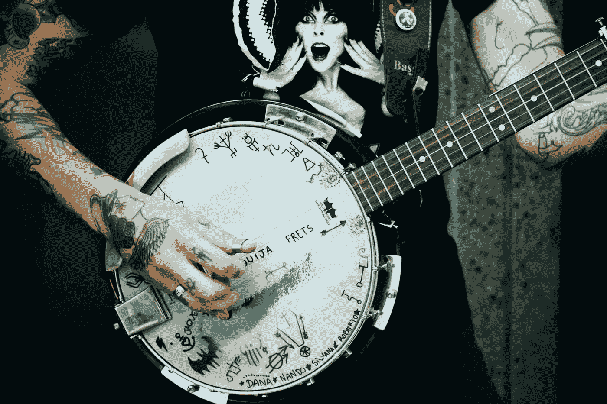
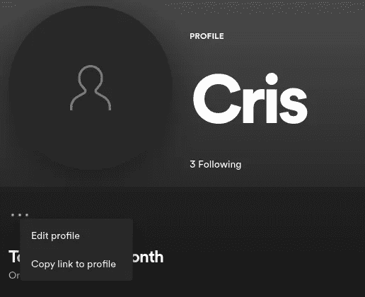
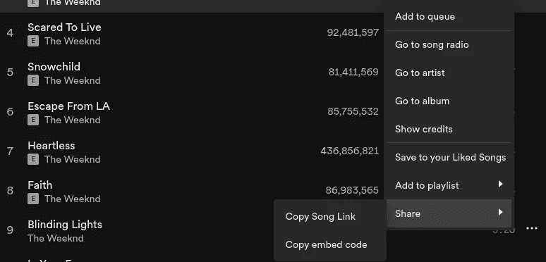

# Spotiscience:数据科学家和音乐爱好者的工具

> 原文：<https://towardsdatascience.com/spotiscience-a-tool-for-data-scientists-and-music-lovers-a3e32bd82ed1?source=collection_archive---------25----------------------->

## Spotiscience 致力于简化下载和预测 Spotify 音乐数据的工作



马修·费雷罗在 [Unsplash](https://unsplash.com/s/photos/data-music?utm_source=unsplash&utm_medium=referral&utm_content=creditCopyText) 上的照片

谁不喜欢和音乐一起工作？我们中的许多人整天都在电脑的后台进程中运行 Spotify，而播放列表中的随机音乐和我们喜欢的艺术家正在用他们的旋律营造一种神奇的氛围。它们提供了充分发挥生产力所必需能量。

为了整合我作为数据科学家的工作和我对音乐的热情，我决定创建一个名为“ **Spotiscience** 的工具，它允许使用官方 Spotify API 下载歌曲、艺术家、专辑和播放列表的数据。此外，这些数据被建模以生成新的数据，例如知道一首歌的情绪或歌词的主题，并找到类似的歌曲，这一切听起来很有趣，对吗？如果你想了解更多，请继续阅读这篇文章！

# 在本文中，您将学习:

*   从 Spotify API 下载歌曲、专辑、播放列表和艺术家的数据
*   从 API Genius 下载歌曲歌词
*   预测歌曲的音乐情绪
*   查找歌词的最相关主题
*   从 Spotify 的专辑、艺术家目录和播放列表中搜索相似的歌曲

# 索引

## 1.1 SpotiscienceDownloader

*   初始设置
*   1.1.2 歌曲特征的提取
*   1.1.3 影集提取
*   1.1.4 提取播放列表
*   1.1.5 播放列表和艺术家信息的提取

## 1.2 SpotisciencePredicter

*   初始设置
*   1.2.2 歌曲情绪的预测
*   1.2.3 歌词主题预测
*   1.2.4 相似歌曲预测

# 1.斑点科学

Spotiscience 是我在 GitHub 上用 Python 编程创建的一个项目，在这个项目中，你可以与 Spotify API 和 Genius API 进行交互，以提取歌曲、专辑、艺术家和播放列表的数据和特征。您还可以分析这些数据来生成新的信息，如情绪预测、主题建模和数学距离，以找到相似的歌曲。要下载 Spotiscience，您可以访问 Github 资源库。

<https://github.com/cristobalvch/spotiscience>  

为了理解 Spotiscience 的应用和配置，我将详细介绍该工具的两个主要类别:

## 1.1 SpotiscienceDownloader

这个类从 Spotify API 和 Genius API 中提取数据。

## 初始设置

要使用它，必须进行如下设置:

```
import spotiscience

#create a dictionary with authorization keys
CREDENTIALS = {}
CREDENTIALS['client_id'] = "your_spotify_client_id"
CREDENTIALS['client_secret'] = "your_spotify_client_secret"
CREDENTIALS['redirect_url'] = "your_redirect_url"
CREDENTIALS['user_id'] = "your_spotify_user_id"
CREDENTIALS['genius_access_token'] = "your_genius_access_token"

"""You also can set your credentials id on credentials.py"""# returns 'downloader class'
sd = spotiscience.SpotiScienceDownloader(credentials=CREDENTIALS)
```

要获得 Spotify API 和 Genius API 的授权凭证，您可以观看以下教程:

[认证 Spotify API 教程](https://www.youtube.com/watch?v=cU8YH2rhN6A&t=152s)

[认证天才 API 教程](https://www.youtube.com/watch?v=cU8YH2rhN6A&t=405s)

要获取您的 Spotify 帐户的“ **user_id** ，您需要打开桌面 Spotify 应用程序，转到“ **profile** ”，然后复制指向 profile 的链接，如下所示:



作者照片

您将获得这个结果，您的 **user_id** 是粗体部分，链接的所有其他部分都可以删除。

" https://open . Spotify . com/USER/{**USER _ ID**}？si=9f52cafadbf148b2 "

## 1.1.2 歌曲特征的提取

要提取歌曲的特征，您应该在 Spotify 上搜索歌曲，然后复制歌曲的链接，如下所示:



在这种情况下，我复制了威肯的歌曲“眩目的灯光”的链接:

```
song_copy_link = "https://open.spotify.com/track/0VjIjW4GlUZAMYd2vXMi3b?si=369f90167c9d48fb"song = sd.get_song_features(song_id=song_copy_link)
```

结果将是具有以下歌曲特征的字典。要获得关于这些功能的更多信息，您可以在 Web API Spotify 上阅读关于[音频功能的官方文档](https://developer.spotify.com/documentation/web-api/reference/#category-tracks)

```
{'id': '0VjIjW4GlUZAMYd2vXMi3b',
 'name': 'Blinding Lights',
 'artist': 'The Weeknd',
 'album': 'After Hours',
 'release_date': '2020-03-20',
 'popularity': 94,
 'length': 200040,
 'acousticness': 0.00146,
 'danceability': 0.514,
 'energy': 0.73,
 'instrumentalness': 9.54e-05,
 'liveness': 0.0897,
 'valence': 0.334,
 'loudness': -5.934,
 'speechiness': 0.0598,
 'tempo': 171.005,
 'key': 1,
 'time_signature': 4}
```

您还可以提取歌曲的音乐类型和歌词，如下所示:

```
# Returns song lyric
sd.get_song_lyrics(songname=song['name'],artistname=song['artist'])#Returns song Genre
sd.get_song_music_genre(song_id=song['id'])
```

## 1.1.3 影集提取

要从专辑中提取歌曲的特征，您必须在 Spotify 上搜索专辑并复制专辑的链接。相册提取方法有一个 id 参数，接收相册链接的字符串或字符串列表，需要在“False”中指定参数 **is_artist** :

```
#Returns songs features of album or albumsalbums =[
‘https://open.spotify.com/album/4yP0hdKOZPNshxUOjY0cZj?si=p5ItRNgXRlarmq4cihAVmA&dl_branch=1',
‘https://open.spotify.com/album/6Yf9kML4wT3opmXhTUIfk7?si=clKN-hzuTB236hINPATp-Q&dl_branch=1'
]sd.get_albums_song_features(id=albums,is_artist=False)
```

结果将是一个字典，其中的关键字是专辑的名称，内容对应于专辑歌曲的所有特征的列表。

也可以下载艺术家的唱片目录，在这种情况下，参数 **id** 只接收一个字符串，需要在“True”中指定 **is_artist** ，如下所示:

```
#Returns songs features of artist's discographyartist = 'https://open.spotify.com/artist/4fvA5FEHcdz97gscK90xZa?si=HNLNN7-dS5OR2W9TIUqQug&dl_branch=1'sd.get_albums_song_features(id=artist,is_artist=True)
```

## 1.1.4 提取播放列表

也可以从播放列表中提取歌曲特征。在这种情况下，playlist_id 参数只接收一个字符串，要提取的歌曲总数必须指定如下:

```
#Return song features of playlistplaylist = ‘https://open.spotify.com/playlist/37i9dQZF1DXcfZ6moR6J0G?si=da1435f1a0804933'sd.get_playlist_song_features(playlist_id=playlist,n_songs=50)
```

结果将是一个字典，其中的关键字是播放列表的名称，内容对应于一个包含播放列表歌曲所有特性的列表。

## 1.1.5 播放列表和艺术家信息的提取

最后，可以如下提取播放列表和艺术家的主要信息:

```
playlist = ‘https://open.spotify.com/playlist/37i9dQZF1DXcfZ6moR6J0G?si=da1435f1a0804933'artist = 'metallica'#Returns playlist information
sd.get_playlist_information(playlist_id=playlist)#Returns song information
sd.get_artist_information(artist=artist)
```

结果将是包含播放列表和艺术家信息的 2 个字典。

为了更好地理解所有的 SpotiscienceDownloader 方法，您可以通过点击[这里](https://github.com/cristobalvch/spotiscience/blob/main/spotiscience/downloader.py)来查看 GitHub repo 中模块 downloader.py 的源代码。

# 1.2 SpotiSciencePredicter

本课程使用监督学习的分类技术对歌曲数据建模，使用自然语言处理对主题建模，使用数学距离对歌曲相似性建模。

## 初始设置

要设置这个类，您只需要如下调用它:

```
import spotiscience
# returns 'predicter class'
sp = spotiscience.SpotiSciencePredicter()
```

## 1.2.2 歌曲情绪的预测

为了进行歌曲情绪预测，我使用了一种机器学习方法，从 Spotify 创建的情绪播放列表中标记一组歌曲，然后我用随机森林分类器算法训练一个模型，根据歌曲的特征标记歌曲。

关于这个话题的更多信息，你可以点击[这里](/predicting-the-music-mood-of-a-song-with-deep-learning-c3ac2b45229e)阅读我的文章《音乐情绪预测》

要预测情绪，只需传递用 SpotiscienceDownloader 提取的歌曲数据，如下所示:

```
#returns the tag of mood 
sp.predict_song_mood(song=song)
```

结果将是一个带有相应情绪类别的字符串，这些类别是；“悲伤、平静、活力和快乐”

## 1.2.3 歌词主题预测

歌词的主题预测使用潜在狄利克雷分配模型(LDA)、非负矩阵分解模型(NMF)或潜在语义索引模型(LSI)中的任何算法。为此，我将我的代码基于下面这篇文章，你可以在这里阅读。

要预测歌词的主题，您必须配置以下参数:

歌词=歌曲的歌词

model =要使用的模型[选项有“lsi”、“lda”或“NMF”]

lang =歌词语言[选项为“英语”或“西班牙语”]

n_grams =要分组的单词的子集数

n_topics =返回主题的数量

top_n =每个返回主题的字数

关于参数 n_grams 的更多信息，你可以点击[这里](https://scikit-learn.org/stable/modules/generated/sklearn.feature_extraction.text.CountVectorizer.html)阅读关于 sklearn 矢量化的官方文档

```
lyric = song_lyrics
model = 'lda' (available type 'lda', 'lsi', 'nmf')
lang = 'english' (available type 'english','spanish')
n_grams = (1,1)
n_topics = 1
top_n = 5#predict the topics of the song lyric
sp.predict_topic_lyric(lyric,model,lang,n_grams,n_topics,top_n)
```

## 1.2.4 相似歌曲预测

为了预测歌曲的相似性，我使用曼哈顿距离(l1)和欧几里德距离(l2)来计算歌曲特征之间的距离，并按升序对结果进行排序。

要预测歌曲相似性，您必须配置以下参数:

*   object =要比较的参考歌曲
*   target =要在专辑、播放列表或艺术家中评估的歌曲组
*   距离=使用距离[选项为“l1”和“L2”]
*   n_features =用于计算距离的歌曲特征的数量
*   top_n =在元组结果中返回的歌曲数

关于参数 n_features 的更多信息，可以点击[这里](https://github.com/cristobalvch/spotiscience/blob/main/spotiscience/prediction.py)阅读方法的源代码。

**例 1** :通过**亚声调**预测“ **Nu Metal Generation** ”播放列表中哪些歌曲与歌曲**Change(In the House of Flies)】**最相似。

```
playlist_link = "[https://open.spotify.com/playlist/37i9dQZF1DXcfZ6moR6J0G?si=452e104160384c8e](https://open.spotify.com/playlist/37i9dQZF1DXcfZ6moR6J0G?si=452e104160384c8e)"song_link = "[https://open.spotify.com/track/51c94ac31swyDQj9B3Lzs3?si=5aca903582464acd](https://open.spotify.com/track/51c94ac31swyDQj9B3Lzs3?si=5aca903582464acd)"target = sd.get_playlist_song_features(playlist_link,n_songs=70)
object  = sd.get_song_features(song_link)
distance = 'l2'
n_features = 6
top_n = 10#returns most similar songs from playlistsp.predict_similar_songs(object,target,distance,n_features,top_n)
```

**例 2** :预测“**杜阿·利帕**唱片公司的哪些歌曲与“**威肯**的歌曲“**眩目的灯光**”最相似

```
artist_link = "https://open.spotify.com/artist/6M2wZ9GZgrQXHCFfjv46we?si=VJ3J-isZRbSM5x2pNUnrhw&dl_branch=1"song_link = "https://open.spotify.com/track/0VjIjW4GlUZAMYd2vXMi3b?si=369f90167c9d48fb"target = sd.get_albums_song_features(id=artist_link,is_artist=True)
object  = sd.get_song_features(song_link)
distance = 'l2'
n_features = 6
top_n = 10#returns most similar songs from playlistsp.predict_similar_songs(object,target,distance,n_features,top_n)
```

这两个例子的结果都是一个字典，其中的关键字是引用歌曲的名称(对象),内容是一个元组列表。每个元组都是歌曲名称及其与参考歌曲(对象)的距离的一对值。

注意:也可以预测专辑中的类似歌曲，而不必下载艺术家的整个唱片目录。为此，您可以在目标参数上使用相册功能。

# 2.结论

将数据科学和音乐这两个不同的领域结合起来，可以产生很好的选择，有助于理解音乐在不断变化的文化中是如何发展的，在这种文化中，乐器的声音、歌词和声乐技巧可以有许多不同的解释。在技术的帮助下，我们试图获得这些解释和意义的近似值，以研究是什么无形的能量使音乐伴随我们一生。我希望 Spotiscience 可以成为帮助像我一样的数据科学家、开发人员和音乐爱好者的技术之一。

# **3。参考文献**

*   https://www . ka ggle . com/the brownviking 20/topic-modeling-with-spacy-and-sci kit-learn
*   [https://towards data science . com/predicting-the-music-mood of-a song-with-deep-learning-c3ac2b 45229 e](/predicting-the-music-mood-of-a-song-with-deep-learning-c3ac2b45229e)

# 我的其他文章

<https://medium.com/datos-y-ciencia/data-science-para-todos-4cb84264bb5f>  <https://cristobal-veas-ch.medium.com/artificial-intelligence-extracting-qualifying-adjectives-from-comments-on-donald-trump-facebook-84bf60be5c8e>  </how-to-analyze-emotions-and-words-of-the-lyrics-from-your-favorite-music-artist-bbca10411283>  <https://medium.datadriveninvestor.com/automate-the-process-of-adding-your-users-saved-tracks-by-genre-to-playlists-on-spotify-d6402da60285>  <https://medium.datadriveninvestor.com/automating-playlists-on-spotify-from-the-music-folders-of-your-computer-c79060eadab2>  </clustering-music-to-create-your-personal-playlists-on-spotify-using-python-and-k-means-a39c4158589a>  <https://medium.com/datos-y-ciencia/una-forma-interactiva-para-buscar-y-analizar-ofertas-de-trabajo-en-la-web-ef9327b0a8d3>  <https://medium.com/datos-y-ciencia/una-forma-genial-para-buscar-y-analizar-arriendos-de-departamentos-en-la-web-e20727390a8c>  <https://medium.com/datos-y-ciencia/c%C3%B3mo-hacer-reflexionar-a-tu-computador-con-las-noticias-del-pa%C3%ADs-dc14d2fc0a67> 