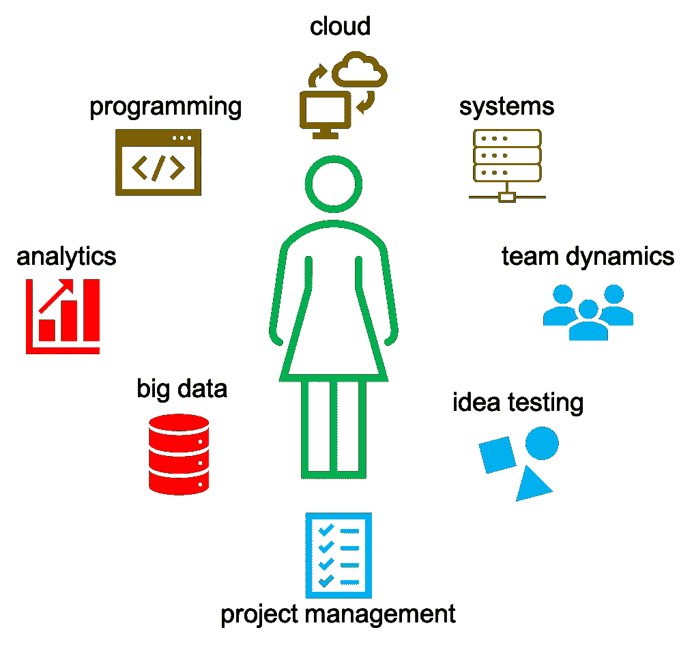

# 发现天才的机器学习工程师

> 原文：<https://towardsdatascience.com/spotting-talented-machine-learning-engineers-5298a76427a0?source=collection_archive---------14----------------------->

## 了解关键技能领域，以识别有才华的机器学习工程师。这种理解将有助于招聘、分配和提升工程师。

图 1:与机器学习工程师相关的学科。作者图。

机器学习工程师(MLE)是目前最热门的角色之一。虽然许多人会将这样的角色与 [Python](https://docs.python.org/3/) 、 [R](https://cran.r-project.org/manuals.html) 、[随机森林](https://en.wikipedia.org/wiki/Random_forest)、[卷积神经网络](https://en.wikipedia.org/wiki/Convolutional_neural_network)、 [PyTorch](https://pytorch.org/tutorials/beginner/deep_learning_60min_blitz.html) 、 [scikit-learn](https://scikit-learn.org/stable/user_guide.html) 、[偏差-方差权衡](https://en.wikipedia.org/wiki/Bias%E2%80%93variance_tradeoff)等联系起来。在这些工程师前进的道路上，会有更多的事情发生。MLE 需要处理的事情不仅来自机器学习领域，还来自其他技术和软学科。如图 1 所示，除了拥有 ML 技能，MLE 还需要了解编程、(大)数据管理、云解决方案和系统工程。此外，此人需要有相当多的项目管理技能，以及成为一个坚实的团队成员，而不牺牲个人的好奇心和野心。

在这篇文章中，我们分享了如何根据这些学科的能力来发现有才华的 mle。我们将学科分为四类，其中只有一类是纯技术性的。其余的更软，组织和项目管理技能，这可能与其他专业人士有关。随着工程师成熟度的发展，我们也分享了期望的演变。你应该考虑到，除了在早期阶段获得的技能之外，处于某一成熟水平的工程师还会获得新的技能。在文章中，我们只展示了三个级别:初级、高级和领导。如果您不同意这些级别，而更喜欢更细粒度的级别，那么就按照您认为合适的方式进行调整。

# 可扩展的机器学习系统

如图 2 所示，支持基于 ML 的系统需要的不仅仅是 ML 代码。因此，MLEs 需要了解来自数据科学、计算机科学、软件工程、云工程和系统工程的概念。此外，MLEs 需要精通编程语言、数据科学库、大数据工程库、云和系统管理平台。在这种设置中，MLEs 感知笔记本或脚本之外的机器学习代码。相反，他们将它们视为可以模块化的应用程序，以便在生产基础设施中轻松工作。他们也知道 ML 代码需要使用一组协同工作的系统来托管、管理、执行、调试、记录和监控。我们在这些维度上捕捉 mle 的能力。

图 2:只有一小部分真实世界的机器学习系统由机器学习代码组成，如中间的小黑框所示。所需的周边基础设施庞大而复杂。MLE 需要深入研究所有这些系统。最初发表在论文[机器学习系统中隐藏的技术债务。](https://papers.nips.cc/paper/5656-hidden-technical-debt-in-machine-learning-systems.pdf)

**核心技术学科的基础知识**

*   初级工程师拥有这些学科的功能知识。
*   高级工程师在某些领域拥有广泛而深入的知识。这些工程师也可以指导低年级学生提高他们的知识。
*   领导级别的工程师可以重新定义某些领域的概念和知识，以更好地适应问题领域。这些工程师还可以指导高年级学生如何成为这些学科的专家或多面手。

**核心学科的库和框架知识**

*   初级工程师熟悉知名的库和框架。
*   高级工程师与许多备选方案合作过，了解其中一些方案的设计原则和底层实现。这些工程师还可以帮助团队采用和解密这些库。
*   领先水平的工程师自举或贡献了一些众所周知的被许多人使用。工程师还可以识别出团队应该关注的库和框架。

**端到端机器学习工作流的实现**

*   初级工程师知道如何实现典型的端到端 ML 流程。
*   高级工程师知道如何为大规模或复杂的部署改进/重新设计/重新实施工作流中的组件。工程师也知道如何测试和验证流程。
*   领导级别的工程师可以提出参考架构，他们的概念证明，并使其他团队能够采用这些架构。

**系统设计与实现**

*   初级工程师知道如何与操作和开发系统互动。
*   高级工程师知道如何使用常见的虚拟化、DevOps 和云技术来实现其中的一些系统。他们还可以指导初级工程师更熟练地使用和掌握构建模块。
*   首席工程师可以设计参考体系结构及其概念验证。他们还可以帮助团队制定采用这些架构的策略。他们还知道容错、可测试性、可调试性等的实现方法。

# 最佳实践

像任何其他工程一样，机器学习工程是一项团队活动。这基本上意味着某些实践需要微调，以便团队可以有效地相互作用，从而更容易交付。MLE 还需要能够原型很多。此外，MLEs 需要开发易于共享的东西，并且必须愿意建立在其他人的工作之上，这来自于内部源文化(想象一下，只在组织的范围内采用开源文化)。

**工程最佳实践**

*   初级工程师擅长执行坚持原则的任务
*   高级工程师帮助团队采用某些最佳实践，同时继续价值交付。
*   一流的工程师可以将这些原则具体化为可行的实践。他们还可以找出团队的(长期)策略，通过采用关键的最佳实践，在不牺牲当前价值交付太多的情况下，爬上技术成熟度的阶梯。

**原型制作**

*   初级工程师偶尔可以通过查看已知的例子来开始一个新的组件。
*   高级工程师可以在没有已知示例的情况下实现/验证新组件。
*   首席工程师可以提出设计原则和流程来实施/验证新组件，并推动核心组件的开发，从而实现快速原型开发。

## 内部来源

*   初级工程师知道如何对内在源泉做出贡献。
*   高级工程师可以推动一些关键的最佳实践和部落知识文档。工程师可以帮助团队在不同的环境中翻译这些内容。
*   领导级别的工程师可以确定内部源文化的框架，这将使高级工程师能够起草最佳实践和部落知识文档的内容。

# 项目管理

像任何工程师一样，MLEs 需要在日常工作中保持高效。这意味着掌握项目管理技能，包括设计思维、计划、理解交付和敏捷原则。对于 MLE 来说尤其如此，因为 MLE 很可能在跨职能团队中处于核心地位，需要发挥很大的作用。

**设计思维**

*   初级工程师知道如何进行简单的需求分析。
*   高级工程师知道如何执行全面的需求分析，验证需求，并帮助团队充实细节。
*   领导级工程师与利益相关者建立牢固的关系。他们知道如何参与描绘涉众旅程的对话，并将它们转化为一组系统需求。工程师还知道如何定义度量，以便通过分析理解需求及其解决方案。

**通信**

*   只要有需要，初级工程师就能与团队很好地沟通。
*   只要有需要，高级工程师也会与利益相关者进行良好的沟通。
*   领导级别的工程师努力建立便于沟通的环境。

**策划**

*   初级工程师知道如何针对工程问题实施计划。
*   高级工程师知道如何充实此类计划的细节，并细化实施细节。
*   领导级别的工程师知道如何为工程问题定义里程碑，并帮助团队区分活动的优先级，以确保达到里程碑。他们知道如何做出正确的取舍，不会过度设计事情。

**交付心态**

*   初级工程师知道如何在合理的时间内按计划交付。
*   高级工程师知道如何将交付分解成可管理的集合，并能够支持扩展目标，例如降低成本、提高效率等。，用于专注的工作。
*   领导级别的工程师知道如何通过复杂的调度来推动并行交付议程。他们还充分预测即将到来的情况和跑道上的进展，以使其易于交付。

**敏捷原则**

*   初级工程师通常能熟练掌握敏捷方法的仪式(看板、Scrum 等)。).
*   高级工程师知道如何坚持原则，并帮助团队坚持原则。
*   领导级别的工程师知道如何为团队翻译敏捷仪式的原则，并帮助他们选择正确的变体

# **文化契合度**

MLEs 的存在是为了支持团队，而不是相反。因此，很多重点应该放在 MLEs 如何融入团队文化上。这并不意味着 MLEs 应该同意团队其他成员决定的所有事情。更确切地说，MLEs 和其他专业人士一样，应该做一些让团队变得更好的事情，即使这意味着不同意团队的其他成员，但无论如何都要遵守工作计划。此外，无论工程师开的是什么，他们都应该尽可能拥有全部所有权。争取多元化是建立一个健康团队的方法，这个团队知道如何处理赞美的意见。机器学习旨在解决复杂的全球问题，这不可能由一个狭隘的背景团队来完成。最重要的是，工程师需要有一种成长的心态，这种心态显然来自于主动和被动的学习。

**团队第一**

*   只要团队需要，初级工程师随时准备介入。
*   高级工程师知道如何介入，并可以随着情况的变化调整参与程度。
*   一流的工程师积极致力于创造一个培养健康团队的环境。

**所有权**

*   初级工程师知道如何掌控他们觉得舒服的领域。
*   当被要求时，高级工程师知道如何掌控所有领域，即使他们对其中一些领域感到不舒服。
*   领导级别的工程师知道如何掌控一切，无论舒适程度如何，并建立一个鼓励他人这样做的环境。

**包容性**

*   初级工程师知道如何在多样化的工作环境中工作。
*   高级工程师知道如何支持团队保持包容性。
*   领导级别的工程师知道如何努力创造一个更包容的工作环境。

**学习心态**

*   初级工程师有很大的动力提升自己的技能。
*   高级工程师知道如何在满足他们自己的学习目标的同时促进一群人的学习活动。
*   领导级别的工程师知道如何通过流程和策略实现团队学习。

# 评论

我确信我没有充实许多其他重要的特征。然而，至少上面提到的那些会让你开始。如果您不同意以上某些观点，请分享您的观点。如果你觉得其他一些观点需要提及，请分享你的观点。如果您同意这些观点并认为它们很有帮助，请分享您的观点。