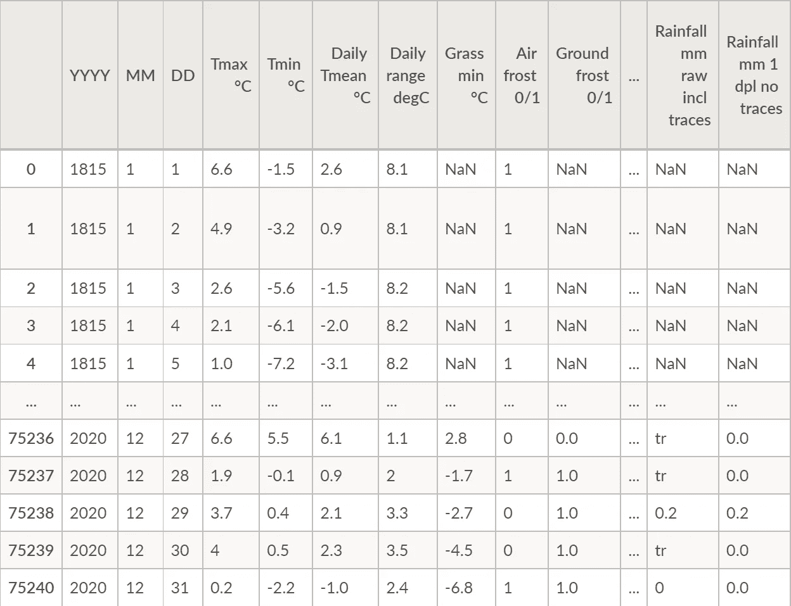
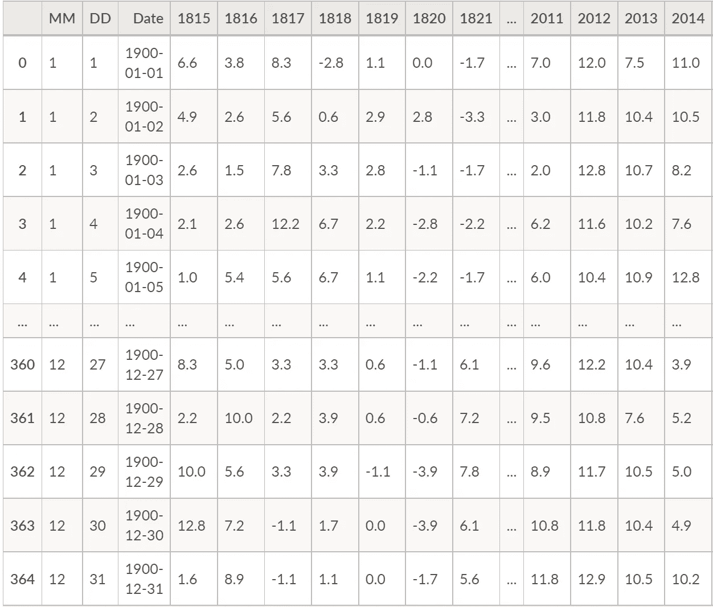
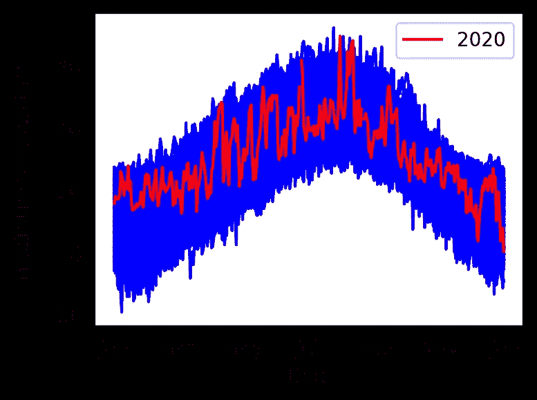
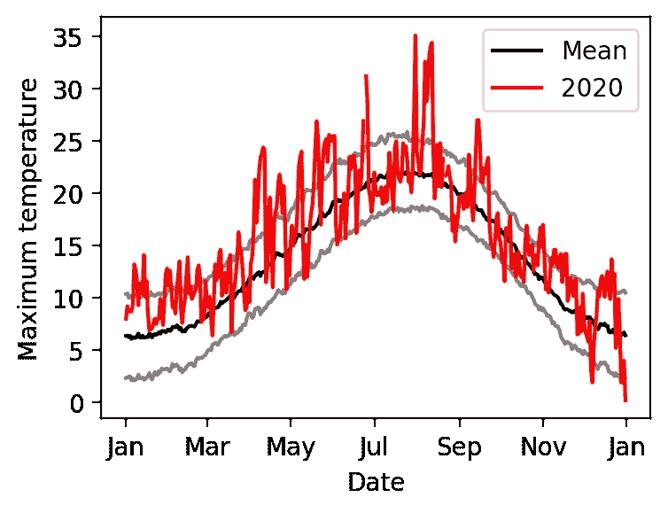
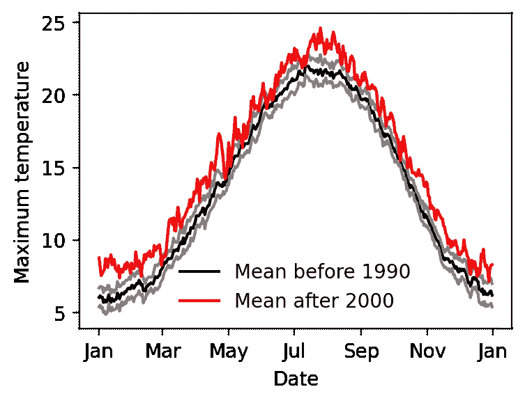
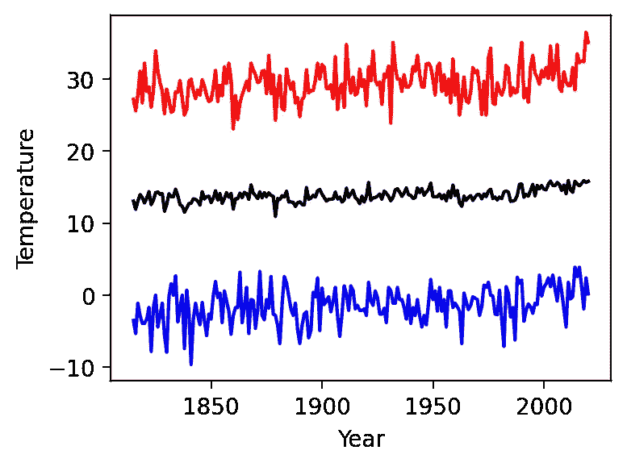
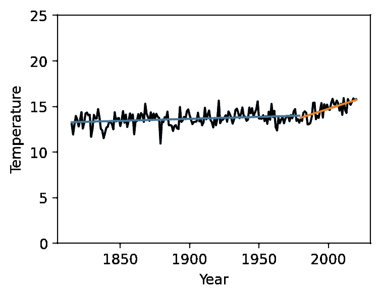
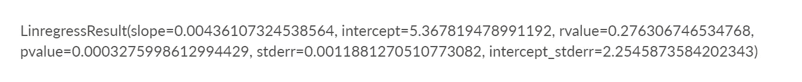

# 电子表格到 Python:是时候进行转换了

> 原文：<https://towardsdatascience.com/spreadsheets-to-python-its-time-to-make-the-switch-ef49cf9463d5?source=collection_archive---------5----------------------->

## [电子表格到 Python](https://towardsdatascience.com/tagged/spreadsheets-to-python)

## 使用代码更可靠，更可复制，也更有趣

照片由[米卡·鲍梅斯特](https://unsplash.com/@mbaumi?utm_source=medium&utm_medium=referral)在 [Unsplash](https://unsplash.com?utm_source=medium&utm_medium=referral) 上拍摄

大多数人对数据分析的入门是使用电子表格，比如 Microsoft Excel。

电子表格非常强大和受欢迎，但也有明显的局限性，特别是在可重复性、可共享性和处理大型数据集方面。

当到了认真对待数据分析的时候，有经验的从业者会告诉你使用代码:它更可靠，更容易复制，而且更令人愉快。

但是，如果您是编码新手，从基于电子表格的数据分析过渡到基于代码的数据分析可能会令人望而生畏。

为了让您更容易开始基于代码的分析，我创建了一系列博客文章，使用日常示例展示代码如何取代电子表格来可视化、分析和建模数据。

我们将使用流行的编程语言 Python，它已经成为基于代码的数据分析的事实上的标准。代码都是通过在线协作工作空间运行的。

让我们开始吧。

# 你所在的地方天气怎么样？

为了向您展示为什么 Python 中的分析更优越，我将稍微聊一下天气。

具体来说，牛津的天气，但你也可以把它应用到你的城镇。这篇文章将向你展示如何从服务器自动下载天气数据，生成包含温度信息的数据帧，绘制不同的平均值，并拟合趋势线。

所有这些活动*都可以在电子表格*中完成，但使用代码可以更容易地更改分析，随着新数据的出现更新分析，分析更大的数据集，并以可重复的方式分享我们的分析。也更容易产生漂亮的图形！

# 下载数据

牛津的拉德克利夫气象站有可下载的天气数据。对于这个例子，我将探索从 1815 年开始的每日温度测量！

我们需要做的第一件事是导入 Pandas，这是一个用于数据分析的强大的 Python 包。然后，我们可以使用 Pandas 函数 read_csv 直接从牛津大学网站读取天气数据。这给了我一个数据框架，我们可以将它可视化如下:

作者图片

数据帧由数据列组成，标题指示每列的内容。

这看起来非常像你在电子表格中看到的。在没有数据的地方，我们看到 NaN。然而，在某些单元格中，csv 文件包含文本解释，稍后我们可以很容易地用 NaN 替换它。

通过查找包含我们需要的年、月和日的行，我们可以找到特定日期的数据。在 Excel 中，我们可以通过在列上放置过滤器来实现这一点。

作者图片

如果我们只想知道当天的温度，我们可以使用:

这给出了 4.7℃的输出

这比在电子表格中滚动大量数据要容易得多。这里唯一棘手的是记住如何写学位标志！

我们现在将做一些数据处理，以便我们可以比较不同年份的温度。

我们想要的是一个数据帧，其中列代表年份，行代表一年中的每一天。

我们要做的第一件事是删除 2 月 29 日的所有数据。我们通过查找所有行的索引(最左边的一列)来实现，其中 month 是 2，day 是 29。

然后我们使用。拖放以删除这些行。同样，这可以在电子表格中完成，但是使用 Python 和 Pandas 要简单得多。

完成后，保存新的数据帧是很有用的，这样我们就不必再次下载和操作它。

# 绘制温度图

现在让我们制作一些漂亮的图表来显示每天的温度。

我们将使用三个最常见的 Python 库中的函数:Pandas、Numpy 和 Matplotlib。首先我们需要导入这些库。

现在读入我们之前保存的数据。

利用这些数据回答一个有趣的问题可能是，“今天异常热吗？”，所以我们来看看 Tmax。为此，我们创建了一个包含每天最高温度的新数据帧。

作者图片

虽然这段代码最初看起来很复杂，但实际上比在 Excel 中执行同样的任务要简单得多。

现在我们有了每天的最大温度，很容易画出每年每天的最高温度，并突出显示我们想要的任何一年。然而，这并没有太大的意义，正如我们从下图中看到的。

作者图片

在这个图中，很难看出 2020 年是否是一个异常值。为此，我们需要计算 Tmax 的均值和标准差，并重新绘制。

作者图片

这里灰色的线代表标准差。看起来 2020 年有些热天！

当然，如果我们选取任何一年，都可能有异常值:我们预计大约有三分之一的日子在标准偏差之外，大约六分之一高于标准偏差，六分之一低于标准偏差。

如果我们想知道温度总体上是否在上升，也许最好取两个时间段的平均值，如下所示:

我们现在可以将最近 20 年的平均值与 1990 年以前的平均值和标准误差进行对比。

作者图片

所以，看起来过去 20 年比长期平均气温要高；尤其是冬天的气温明显更高。

# 计算趋势

让我们通过仔细观察 Tmax 这些年来的变化来进一步探讨这一点。我们感兴趣的是每年最热和最冷的一天，以及全年 Tmax 的平均值。

这显示了使用 Pandas 数据框架的一些威力；上面我们计算了行的平均值，现在我们找到了列的平均值，我们甚至可以在绘制图表的同时进行计算。

作者图片

从这张图表中可以看出，在过去的几年中，气温有所上升；让我们通过拟合一些趋势线来量化这一点。在这里，我们将从 1980 年开始重新定义“最近”的年份。

作者图片

该代码告诉我们，1980 年之前的梯度为每世纪 0.44 摄氏度，但自 1980 年以来，它已相当于每世纪 4.9 摄氏度。

在代码中这样做的一个巨大优势是，很容易改变用于比较的年份范围。

显然，近年来的梯度比过去 165 年要大。为了确定这是否有统计学意义，我们需要测量梯度计算中的误差。这就是所谓的标准误差，可以用不同的函数很容易地计算出来，相当于 Excel 中的 LINEST(我个人觉得用起来很痛苦)。

作者图片

该函数在那里输出相当多的信息；让我们只看我们想要的价值观

作者图片

+/-值代表 95%的置信区间。这意味着在过去的 40 年里，平均气温以每世纪 4 到 6 摄氏度的速度上升，这在统计学和这个词的日常意义上都是很重要的。

# 摘要

我已经展示了一个如何使用 Python 来执行简单的可视化和数据分析的例子。

有些步骤会比使用电子表格花费更长的时间。然而，对于大型数据集或重复操作，使用代码减少了错误的范围，同时使重复或修改计算变得容易。这绝对值得额外的时间投入。

最后，在这里的几乎所有例子中，我都使用了默认的 matplotlib 格式的图形，它们已经非常好地呈现了。这绝对是电子表格无法比拟的优势。

在这个博客系列中，我将进一步探索 Python 的功能，并希望能启发您迈出使用 Python 的第一步。

*这篇文章的文本、代码和图像是使用* [*灯丝*](http://www.filament.so) *创建的，这是一个用于数据、分析和报告的一体化工作空间。如需了解更多信息，请访问我们的网站***。Filament 目前正在运行一个封闭的测试程序；前 100 人到* [*报名*](https://get.filament.so/invite/) *使用推荐代码 TDSFILAMENT 可以跳过等候名单，提前报名。**

## *参考*

*[1] Stephen Burt 和 Tim Burt，[1767 年以来的牛津天气与气候](https://www.geog.ox.ac.uk/research/climate/rms/oxford-weather.html) (2019)牛津大学出版社。*