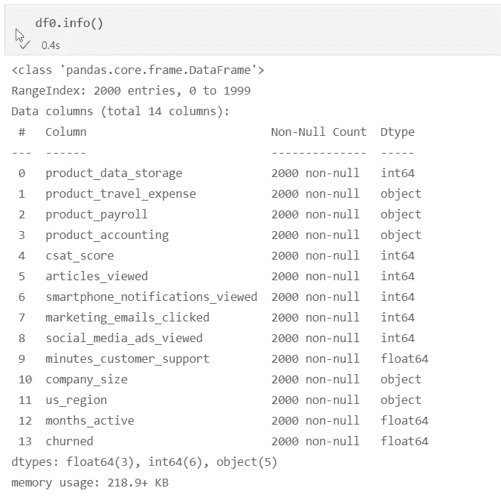
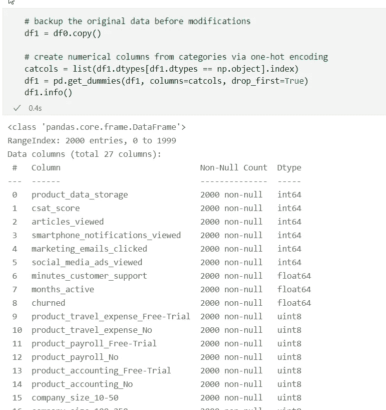
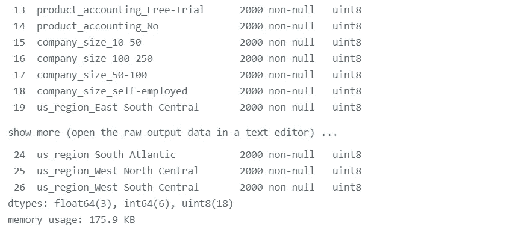
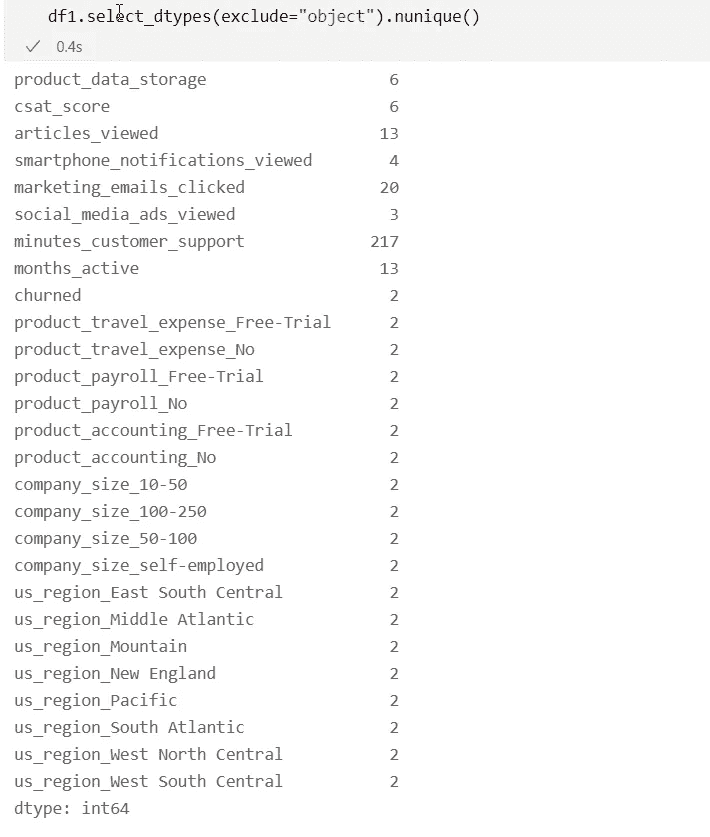
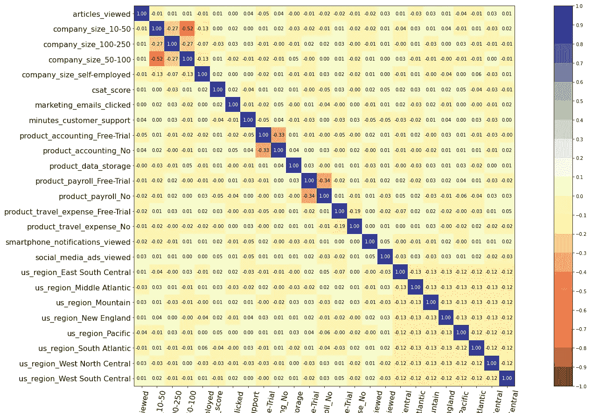
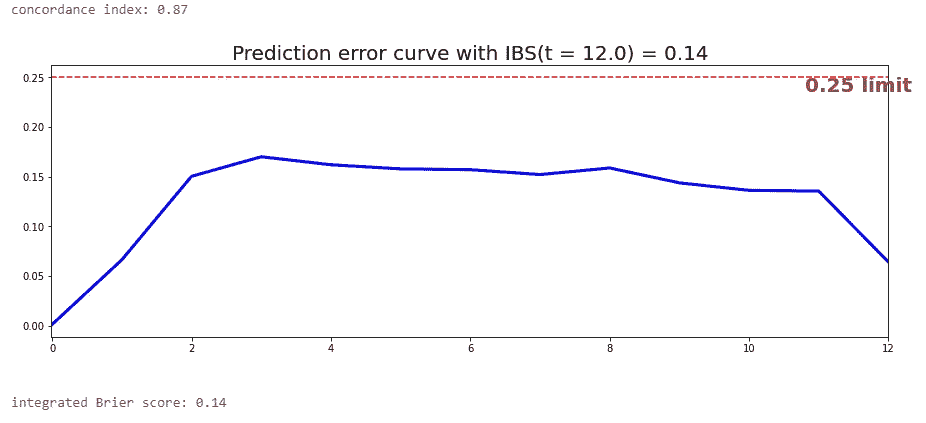
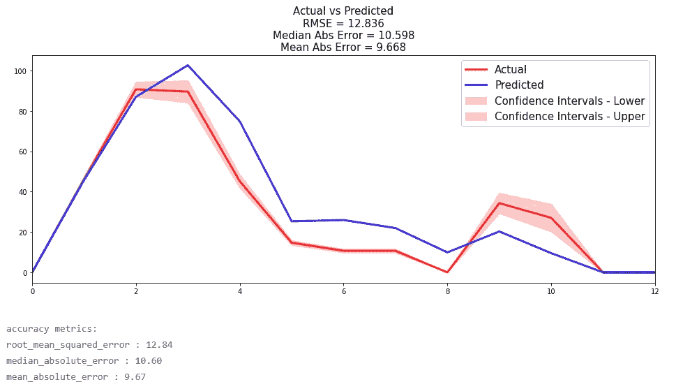
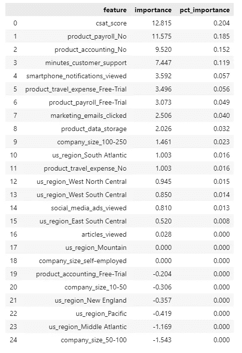
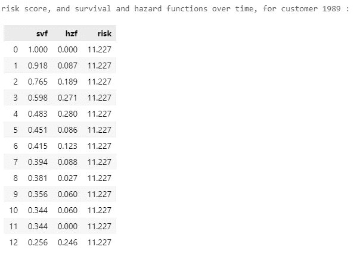

# 在生存森林中被抛弃:Python 中的客户流失预测

> 原文：<https://towardsdatascience.com/spurned-in-a-survival-forest-customer-churn-prediction-in-python-2083551f3cc5?source=collection_archive---------6----------------------->

## 具有 PySurvival 的条件生存森林模型

[年轻的爱被拒绝的股票照片——由伊斯托克/范德韦尔登(istockphoto.com)](https://www.istockphoto.com/photo/young-love-spurned-gm166679449-22094493)在标准许可下拍摄

一家公司的**客户流失率** **比率**是在给定的时间段内停止与该公司做生意的客户的百分比。他们中的大多数人肯定已经开始喜欢竞争对手的产品了。留住客户的努力旨在最大限度地降低流失率。

一般来说，试图吸引新客户——通过把他们从竞争对手那里引走——比留住现有客户的成本更高。贝恩公司(Bain & Company)的一篇论文曾指出，在金融服务行业，客户保持率每增加 5%，利润就会增加 25%以上[(bain.com)](https://media.bain.com/Images/BB_Prescription_cutting_costs.pdf)。

我们的目标是构建一个预测每个客户流失风险的模型。为了向销售和营销团队提供早期预警信号，该模型应识别那些与客户可能很快会拒绝我们的业务的风险增加相关的客户资料。

# 1.属国

除了我们的核心包如 pandas 和 numpy，我们将安装并导入 **PySurvival** 库。

和往常一样，在安装一个复杂的包之前，您应该创建一个新的虚拟环境，尤其是具有非 Python 依赖性的包。PySurvival 需要 C++可再发行版本。

要在 **MacOS 或 Linux 上 pip-install PySurvival，**您应该检查 gcc 是否已经安装在您的机器上:

*   [安装—py survival(square . github . io)](https://square.github.io/pysurvival/installation.html)

在 **Windows** 机器上，安装需要一些额外的步骤。PySurvival 开发人员似乎忘记了一个事实，即 Python 用户社区存在于操作系统划分的 Windows 端；或者他们只是没那么喜欢 Windows 用户。但是我们可以在 Windows 机器上运行 PySurvival，即使 pip 安装无法运行。请遵循以下步骤:

*   使用不高于 3.8 的 Python 版本创建新的虚拟环境。例如在 conda 中:$ conda create-n your chosen name python = 3.8。原因是当前的 PySurvival 版本使用了一种 3.8 以后已经不推荐使用的方法 tp_print。
*   你将需要微软的 C++编译器。如果您的计算机上还没有安装它，那么一种方法是从以下网址下载免费的 Visual Studio 构建工具:[下载 Visual Studio 工具—免费安装 Windows、Mac、Linux(microsoft.com)](https://visualstudio.microsoft.com/downloads/?q=build+tools)。在构建工具选择窗口的左上角，选择“用 C++进行桌面开发”选项。

截图:作者

*   从这个 GitHub 资源库下载分叉的 PySurvival 包，在 Windows 下工作:【github.com】bacalfa/py Survival:生存分析建模开源包【对其创建者 B. A. Calfa 的赞赏】。将下载的软件包保存在要用作其安装目录的文件夹中。
*   激活您的新虚拟环境，例如:$ conda activate yourchosenname
*   在命令提示符下，导航到保存并解压缩 PySurvival 包的目录。
*   在命令提示符下，首先重新打包下载的文件，然后安装软件包:

作者图片

作者图片

# 2.数据争论

PySurvival 附带了一个内置的数据集来分析客户流失。我们从*数据集*模块加载它。

原始数据代表 SaaS 提供商(软件即服务)的客户数据库，该提供商为中小型企业提供一系列服务:数据存储、工资和费用核算、在线营销和客户响应跟踪。它的商业模式是基于每月订阅。

这家 SaaS 公司要求我们实施一个预测客户流失风险的模型，以便销售和营销团队能够采取行动，增加留住这些高风险客户的机会。

作者图片

源数据由 13 列组成，其中 5 列是分类变量。Pandas 的 info()函数显示 dataframe 不包含空值。

当我们试图确定流失风险背后的模式时，有两列将作为我们的目标变量:

*   “搅动的”，标识过去没有续订的客户
*   “months_active”，它添加了一个时间维度，我们希望沿着这个维度来跟踪客户流失风险

其他列表示影响客户流失风险的特征。我们想确定哪种特征值组合——哪种客户特征——将流失概率提高了多少。

作者图片

作者图片

当我们查看分类变量时，我们看到每一列中唯一值的数量很少。它们的低计数将使它们更容易转换成数值。

作者图片

为了评估分类值对流失风险的影响，我们需要导出数值。

下面的列表 *catcols* 标识分类列的索引。然后， *ne-hot 编码，*通过使用熊猫的 *get_dummies()* 函数，为每个唯一分类值创建一个新列，并用二进制值 1 和 0 填充它:值 1 出现在找到匹配分类值的行中。

info()函数确认没有留下分类列。它还显示 dataframe 现在包含 26 列，而原来只有 13 列。例如，前一列“公司规模”中的四个唯一值被拆分为四列。

作者图片

作者图片

这个扩展的数据框架将使我们能够运行数据科学模型，量化特征变量对流失风险的影响。

作者图片

我们通过分离目标变量来完成我们的数据争论工作:

*   “事件”——在我们的例子中是“搅动”= 1 或 0
*   时间维度:“months_active”

然后，第 6 行中的 numpy 函数 *setdiff1d()* 从所有列名的列表中删除“churned”和“months_active ”,留下一个特性列的列表。

作者图片

# 3.识别流失风险

## 3.1 特征的相关性

在 PySurvival 的效用函数中，我们找到了*相关矩阵。*它显示了特征对齐的紧密程度。如果任何一对显示出惊人的高相关性，接近 1.0，我们应该删除其中一个来处理它们的多重共线性。

在我们的例子中，大中型客户公司之间的最高相关性不超过 0.52。这不是一个令人担忧的水平，所以我们继续我们的分析。

作者图片

## 3.2 训练与测试数据集

在第 3 行，Scikit 的 *train_test_split* 方法保留了 35%的数据集用于测试。

第 9 行到第 11 行对特性列 X、事件列 E ("churned ")和时间列 T ("months_active ")应用相同的分割。

作者图片

## 3.3 条件生存森林模型—概念

我们从生存分析之外的分类问题中知道决策树和随机森林。你可以在 Carolina Bento 的文章中找到关于决策树的优秀初级读本:[现实生活中解释的决策树分类器:挑选度假目的地| Carolina Bento |迈向数据科学](/decision-tree-classifier-explained-in-real-life-picking-a-vacation-destination-6226b2b60575)；在饶彤彤关于随机森林的文章中:[了解随机森林。算法如何工作|饶彤彤|走向数据科学](/understanding-random-forest-58381e0602d2)

生存问题增加了一个困难:模型必须处理*被审查的*数据。当数据集达到观察期的末尾时，许多(希望是大多数)客户将不会有动摇。他们的流失事件仍未被观察到，并将在未知的未来日期发生。因此，数据集是右删截的。

为了处理审查问题，生存模型使用一个修改的配置:

*   传统的回归模型对两个数据组 X 和 y 进行操作:回归变量 X 和目标向量 y。
*   而生存模型对 X、E 和 T 这三个变量起作用:
*   —特征数组 X(由代表客户属性或概况的列组成)
*   —二进制事件指示符(1 或 0)的向量 E，其表示是否已经为客户记录了流失事件；
*   —时间向量 T = min(t，c)，其中 T 表示事件时间，c 表示审查时间

生存模型预测感兴趣的事件在时间 t 发生的概率。

我们将实现由赖特/丹科夫斯基/齐格勒在 2017 年(【arxiv.org】)设计的**条件生存森林**模型。CSF 改进了旧的随机生存森林方法使用的训练算法。

## 3.4 拟合模型

PySurvival 的 CSF 模型采用以下参数:

*   每次分割的最大要素数
*   — int =绝对数字
*   —浮点=分数
*   —“sqrt”=特征数量的平方根
*   —“log2”=特征数量的二进制对数
*   —“全部”
*   最小节点大小=每个节点的最小样本数，默认为 10
*   alpha =允许拆分的显著性水平，默认为 0.05
*   样本大小百分比= %每个树构建中使用的原始样本，默认值为 0.63
*   num_threads =并行线程中可用内核的数量

拟合生存森林后，我们检查它的准确性。

## 3.5 准确性指标

**一致性指数**衡量模型的辨别能力。如果有四个客户在 2 年、3 年、4 年和 5 年后流失，而模型准确预测他们将按此顺序流失，则和谐指数达到其最佳值 1.0。如果模型预测了不同的等级顺序，则指数将低于 1。该指数并不评估预测的存活时间，而是评估*排名顺序*。如果模型为四个客户分配了 3、4、6 和 7 的流失周期，则指数仍将等于 1.0，因为它报告了客户的正确排序顺序( [C-index)](https://square.github.io/pysurvival/metrics/c_index.html) 。虽然这看起来像是一个弱点，但与 MAE 等其他准确性指标相比，我们需要一个像 concordance index 这样的指标来处理*右删截*数据:在观察数据集的结束日期，所有客户的流失事件将只记录一小部分。

就我们的目的而言，我们认为 0.87 的一致性指数是令人满意的。

**Brier 评分**衡量实际流失状态和估计概率之间的平均差异:观察到的生存状态(0 或 1)和给定时间 t 的生存概率之间的平均平方距离。它可以采用 0 到 1 之间的值，0 是最佳值:生存函数将完美地预测生存状态( [Brier 评分)](https://square.github.io/pysurvival/metrics/brier_score.html)。通常，最大值 0.25 被视为接受阈值。

在我们的例子中，Bier 分数不超过 0.14:低到可以接受。

作者图片

PySurvival 的**compare _ to _ actual***方法沿时间轴绘制了预测的和实际的风险客户数量。它还计算三个精度指标，RMSE、平均误差和中位数绝对误差。在内部，它计算 Kaplan-Meier 估计量，以确定源数据的实际生存函数。*

**

*作者图片*

## *3.6 模型结果:特征重要性*

*拟合模型报告了数据帧中每个特征的重要性。**重要性**衡量特性对流失风险的影响。积极的重要性分数会增加风险，消极的分数会减轻风险。*

*列“pct_importance”在从 0 到 1 的范围内校准相对重要性。相对重要性合计为 1.0。*

*   *不出所料,“csat _ score”——通过市场调查衡量的客户满意度得分——与客户流失风险密切相关。*
*   *没有*预订工资单或产品会计服务的客户更容易拒绝。要么其他顾客已经学会欣赏整个产品系列；或者，将这些更复杂的任务转移给竞争对手会花费他们更多的精力，因此，只要竞争对手不能展示出明显更好的竞争优势，他们就会继续留在 SaaS 公司。**
*   *“minutes_customer_support”将那些在取消订阅之前经常向支持热线投诉的客户视为高流失风险。*

**

*作者图片*

## *3.7 流失预测*

*让我们从源数据中随机抽取一个客户:index 1989。*

*请记住，我们创建了 dataframe X 来包含所有的特性列(不包括目标变量 *churned* 和*months _ active】*)。我们将随机选择的索引行 1989 的特征输入三个函数:生存、危害和风险评分函数。*

*如果我们将时间变量 t 设置为 None，那么 PySurvival 将计算数据帧中所有时间段的函数值，并显示它们的趋势——在我们的示例中是 12 个月。*

**

*作者图片*

***生存函数**是累积分布函数的补码:*

*   *svf(t > T) = 1 — cdf(t ≤ T)*

*变量 T 表示直到感兴趣的事件发生的时间。*

*累积分布函数沿着时间轴追踪事件的增长概率。流失风险会随着时间的推移而增加。最终，许多客户将会破产或尝试竞争对手的产品。*

*相反，生存函数 svf(t)报告事件在时间 t 之前没有发生的概率。*

***危险函数** hf(t)代表时间 t 的瞬时故障率:事件在下一个时刻 t*内发生的概率，假设事件在时间 t 之前没有发生。通常，危险函数不能单独解释。*

***风险分值**汇总了一段时间内的累积危险值。PySurvival 将其报告为我们选择的整个时间范围的标量。*

*下面的笔记本单元格计算每个客户在四个时间点的风险分数和生存概率:订阅期的 1、3、6 和 12 个月。它将生存概率作为四个新列插入数据帧:svf1、svf3、svf6 和 svf12。*

**

*作者图片*

*PySurvival 的方法 *create_risk_groups* 绘制了数据集中客户的得分。这有助于想象，例如，客户数量是否在接近标尺的高端时开始上升。*

*该方法采用可选数量的分组标准。在第 2 行到第 5 行，我选择用四分位数来划分风险分值。然后，图表通过许多不同的颜色代码来区分四个风险分值组。*

**

*作者图片*

# *结论*

*我们将生存分析技术——条件生存森林——应用于我们的客户数据库。*

*该模型确定了客户档案中的哪些特征决定了流失风险:每个特征的重要性权重。然后我们将生存概率输入客户数据库。这些指标将为营销团队提供他们所寻求的预先信号:什么时候接触客户是明智的？*

*Jupyter 笔记本可在 GitHub 下载:[h3ik0th/py survival _ CSF:py survival 的有条件生存森林(github.com)的客户流失](https://github.com/h3ik0th/pysurvival_csf)*