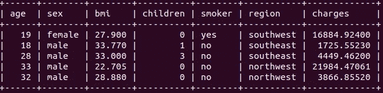

# SQL 作为数据分析工具

> 原文：<https://towardsdatascience.com/sql-as-a-data-analysis-tool-a18bf698a9cd?source=collection_archive---------29----------------------->

## 如何使用 SQL 来执行高效的数据过滤和转换


艾萨克·史密斯在 [Unsplash](https://unsplash.com/s/photos/analysis?utm_source=unsplash&utm_medium=referral&utm_content=creditCopyText) 上拍摄的照片

SQL 是一种用于管理关系数据库中的数据的语言。关系数据库的核心组件是表，它以带有标签的行和列的表格形式存储数据。

我们使用 SQL 的 select 语句从关系数据库中查询数据。就数据转换和过滤操作而言，select 语句具有高度的通用性和灵活性。

从这个意义上说，SQL 可以被认为是一种数据分析工具。使用 SQL 进行数据转换和过滤的好处是，我们只检索我们需要的数据。这比检索所有数据然后应用这些操作更加实用和高效。

在本文中，我们将通过 7 个例子来演示 SQL 如何被用作数据分析工具。例子的复杂性稳步增加，所以如果你到达结尾会更好。

我之前将 Kaggle 上的医疗费用数据集存储在一个名为 insurance 的 SQL 表中。让我们首先通过显示前 5 行来看看这个表。

```
mysql> select * from insurance
    -> limit 5;
```



保险表(图片由作者提供)

“*”表示我们想要显示所有列，limit 关键字指定要显示的行数。

该数据集包含一些个人信息和保险费用。

## 示例 1

我们可以计算吸烟者和不吸烟者的平均收费金额。

```
mysql> select smoker, avg(charges)
    -> from insurance
    -> group by smoker;+--------+-----------------+
| smoker | avg(charges)    |
+--------+-----------------+
| no     |  8434.268297857 |
| yes    | 32050.231831532 |
+--------+-----------------+
```

它类似于大熊猫的功能群。我们选择“吸烟者”和“费用”列，并对费用应用平均值函数。group by 语句允许根据 smoker 列中的不同类别来分隔行。因此，我们在结果中得到两个平均值。

如果我们想查看总体平均值，我们只需选择“费用”列。

```
mysql> select avg(charges) from insurance;+-----------------+
| avg(charges)    |
+-----------------+
| 13270.422265142 |
+-----------------+
```

## 示例 2

我们可能还希望看到吸烟者和非吸烟者的数量以及平均费用值。

```
mysql> select smoker, avg(charges), count(charges)
    -> from insurance
    -> group by smoker;+--------+-----------------+----------------+
| smoker | avg(charges)    | count(charges) |
+--------+-----------------+----------------+
| no     |  8434.268297857 |           1064 |
| yes    | 32050.231831532 |            274 |
+--------+-----------------+----------------+
```

除了前面的示例，我们还选择了“费用”列的计数。

## 示例 3

考虑一个案例，我们需要根据性别进一步区分吸烟者和不吸烟者。为了完成这个任务，我们需要将性别列到 group by 语句中。

```
mysql> select smoker, sex, avg(charges), count(charges)
    -> from insurance
    -> group by smoker, sex;+--------+--------+-----------------+----------------+
| smoker | sex    | avg(charges)    | count(charges) |
+--------+--------+-----------------+----------------+
| no     | female |  8762.297299542 |            547 |
| no     | male   |  8087.204731276 |            517 |
| yes    | female | 30678.996276260 |            115 |
| yes    | male   | 33042.005975283 |            159 |
+--------+--------+-----------------+----------------+
```

## 实例 4

select 语句还允许过滤。例如，我们可以针对居住在东南部地区的人运行前面语句中的查询。

```
mysql> select smoker, sex, avg(charges), count(charges)
    -> from insurance
    -> where region = 'southeast'
    -> group by smoker, sex;+--------+--------+-----------------+----------------+
| smoker | sex    | avg(charges)    | count(charges) |
+--------+--------+-----------------+----------------+
| no     | female |  8440.205551942 |            139 |
| no     | male   |  7609.003586716 |            134 |
| yes    | female | 33034.820716388 |             36 |
| yes    | male   | 36029.839366545 |             55 |
+--------+--------+-----------------+----------------+
```

我们使用 where 语句来指定过滤条件。请务必注意，在选择查询中，where 语句必须写在 group by 语句之前。

## 实例 5

我们希望根据吸烟者和儿童列找到不同类别的平均 bmi 值，但只显示平均 bmi 值最高的 3 个类别。

这个示例包括对聚合值进行排序，这可以通过 order by 语句来完成。

```
mysql> select smoker, children, avg(bmi) 
    -> from insurance
    -> group by smoker, children
    -> order by avg(bmi) desc
    -> limit 3;+--------+----------+------------+
| smoker | children | avg(bmi)   |
+--------+----------+------------+
| no     |        4 | 31.6754545 |
| yes    |        2 | 31.3041818 |
| no     |        2 | 30.8811622 |
+--------+----------+------------+
```

order by 语句根据给定的列按升序对行进行排序。我们可以通过在列名后使用 desc 关键字将其改为降序。

## 实例 6

让我们详细说明前面的例子。考虑这样一种情况，我们需要平均 bmi 值高于整体平均值的组。

一种方法是单独计算整体平均值，并将其作为过滤的条件。

```
mysql> select avg(bmi) from insurance;+------------+
| avg(bmi)   |
+------------+
| 30.6633969 |
+------------+ mysql> select smoker, children, avg(bmi)
    -> from insurance
    -> group by smoker, children
    -> having avg(bmi) > 30.6633969;+--------+----------+------------+
| smoker | children | avg(bmi)   |
+--------+----------+------------+
| no     |        2 | 30.8811622 |
| no     |        3 | 30.7384322 |
| no     |        4 | 31.6754545 |
| yes    |        1 | 30.8743443 |
| yes    |        2 | 31.3041818 |
+--------+----------+------------+
```

> 值得注意的是，当我们基于聚合值进行过滤时，我们使用 having 语句而不是 where 语句。

第二种选择是将这两个查询组合成一个嵌套查询。

```
mysql> select smoker, children, avg(bmi)
    -> from insurance
    -> group by smoker, children
    -> having avg(bmi) > (
    -> select avg(bmi) from insurance
    -> );+--------+----------+------------+
| smoker | children | avg(bmi)   |
+--------+----------+------------+
| no     |        2 | 30.8811622 |
| no     |        3 | 30.7384322 |
| no     |        4 | 31.6754545 |
| yes    |        1 | 30.8743443 |
| yes    |        2 | 31.3041818 |
+--------+----------+------------+
```

我更倾向于第二种选择，因为第一种更容易出错。

## 例 7

这个例子比上一个稍微复杂一点。我们不是只显示 bmi 值高于平均值的行，而是希望创建一个新列来指示一行是否高于平均值。

我们将在嵌套查询中使用 case-when 语句。

```
mysql> select smoke, children, avg(bmi),
    -> (case when avg(bmi) > (
    -> select avg(bmi) from insurance) then "more than avg"
    -> else "less than avg" end) as compared_to_avg
    -> from insurance
    -> group by smoker, children;
```

在显示结果之前，让我们试着理解查询中的每一步是做什么的。

我们选择了与上一个示例相似的三列。第四列是用 case-when 语句创建的。新列根据行的平均 bmi 值与总体平均 bmi 值的比较，取值“高于平均值”或“低于平均值”。

总体平均 bmi 值是通过使用 case-when 语句中的嵌套 select 语句来计算的。下面是这个查询的结果。

```
+--------+----------+------------+-----------------+
| smoker | children | avg(bmi)   | compared_to_avg |
+--------+----------+------------+-----------------+
| no     |        0 | 30.5519499 | less than avg   |
| no     |        1 | 30.5648859 | less than avg   |
| no     |        2 | 30.8811622 | more than avg   |
| no     |        3 | 30.7384322 | more than avg   |
| no     |        4 | 31.6754545 | more than avg   |
| no     |        5 | 30.2700000 | less than avg   |
| yes    |        0 | 30.5436957 | less than avg   |
| yes    |        1 | 30.8743443 | more than avg   |
| yes    |        2 | 31.3041818 | more than avg   |
| yes    |        3 | 30.5206410 | less than avg   |
| yes    |        4 | 29.3066667 | less than avg   |
| yes    |        5 | 18.3000000 | less than avg   |
+--------+----------+------------+-----------------+
```

## 结论

我们已经介绍了一些查询示例来展示 SQL 的数据分析能力。

我认为 SQL 是数据科学家或分析师的必备技能。我们至少应该知道如何查询关系数据库。在检索数据时执行数据转换和操作操作的复杂查询有可能节省内存。它们也减轻了以后需要完成的任务。

感谢您的阅读。如果您有任何反馈，请告诉我。