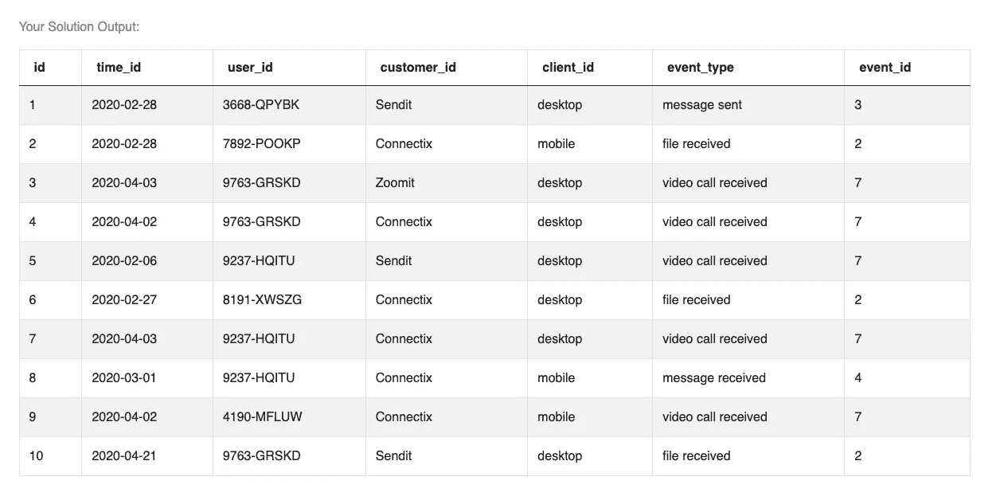
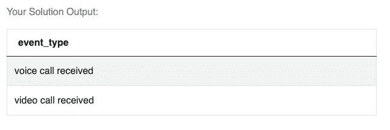
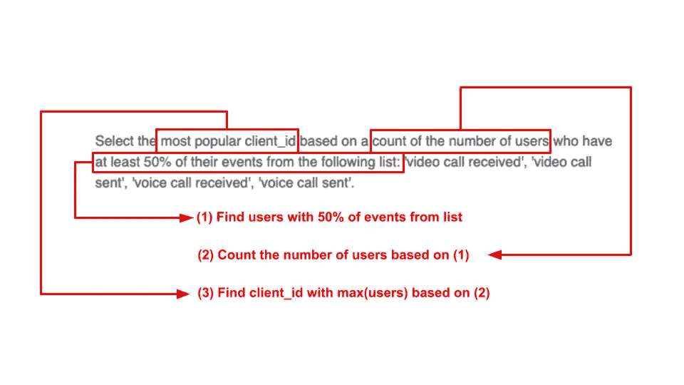
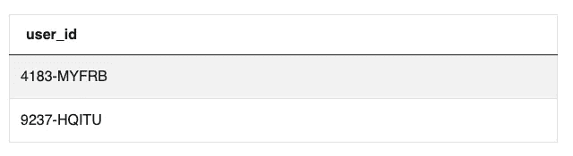
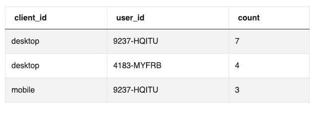
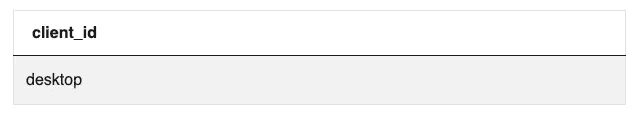

# SQL 挑战:案例研究

> 原文：<https://towardsdatascience.com/sql-challenge-case-study-7bd75eb864ac?source=collection_archive---------1----------------------->

## 顶级技术公司提出的 SQL 挑战的逐步演练


艾米丽·莫特在 [Unsplash](https://unsplash.com?utm_source=medium&utm_medium=referral) 上的照片

在[的上一篇文章](/acing-the-sql-challenge-d8b8feb0a041)中，我谈到了如何使用框架来解决 SQL 挑战。今天我就来做一个[这个挑战](https://platform.stratascratch.com/coding/2029-the-most-popular-client_id-among-users-using-video-and-voice-calls?python=)的演练，2021 年 2 月微软问的。在你继续阅读这篇文章之前，我强烈建议你尝试自己解决这个问题。你练习解决 SQL 问题越多，你就能越好地解决它们。好吧，让我们开始吧！

# 阅读提示

这个问题要求我们:

> 根据至少有 50%的事件发生在以下列表中的用户数，选择最受欢迎的 client_id:“收到视频通话”、“发送视频通话”、“收到语音通话”、“发送语音通话”。

在我开始研究这个问题之前，我想想象一下数据集中的信息是如何出现的。让我们运行一个简单的 SELECT 语句来检查存储在表 fact_events 中的数据。

```
SELECT *
FROM fact_events
LIMIT 10
```

该查询返回以下输出:



作者截图( [StrataScratch 网站](https://platform.stratascratch.com/coding-question/output-preview))

出于好奇，我想知道所提供的列表中的所有值是否都出现在数据集中:

```
SELECT 
    event_type
FROM fact_events
WHERE event_type IN ('video call received',
                    'video call sent', 'voice call received',
                    'voice call sent')
GROUP BY event_type
```



作者图片

看起来只包括了 4 个值中的 2 个。尽管其他两个值没有出现在当前数据集中，但它们可能会在数据追加到表中时出现。你不能假设数据会保持不变。因此，让我们在过滤器中保留所有 4 个值。

太好了！我现在对我正在做的事情有了更好的了解。下一步是分析提示，以便我们可以提出一个策略来应对这一挑战。

## 笔和纸

对于这一步，我喜欢把我的想法写在一张纸上📝然而，请随意使用你的电脑、iPad 或其他最适合你的设备。这里，我们需要分析提示，以准确理解要求我们做什么。



作者图片

在这种情况下，提示似乎分为三个部分:

1.  从上面的列表中找到发生了 50%事件的用户
2.  计算步骤(1)中找到的用户数量
3.  根据步骤(2)选择用户数量最多的客户端 id

我还会做如下假设:

*   我不需要使用 customer_id 和 event_id 列
*   时机并不重要
*   我用给定列表中事件的数量除以所有事件的数量来计算 50%。
*   我在统计用户总数，即使他们在列中出现多次。提示没有指定通过识别用户在数据集中出现的**不同**次数来选择最流行的 client_id。

在面试的这一点上，你应该花时间去理解挑战，并向面试官传达最初的想法。此外，如果你有任何问题，请随时向面试官寻求澄清。没有面试官在场的情况下，让我们进入下一步吧！

# 第一步

首先，让我们在下面的列表中获取具有 50%或更多事件的用户:“收到视频呼叫”、“发送视频呼叫”、“收到语音呼叫”和“发送语音呼叫”为了得到百分比，我们将在一个 CASE 语句中使用[一键编码](https://machinelearningmastery.com/why-one-hot-encode-data-in-machine-learning/)，将列表中的值返回为 1，其他值返回为 0。CASE 语句总和将是分子。分母是 event_type 列中所有元素的计数。

```
CAST(SUM(
            CASE
                WHEN event_type IN ('video call received',
                    'video call sent', 'voice call received',
                    'voice call sent')
                    THEN 1
                ELSE 0
            END) AS FLOAT)  / COUNT(event_type)
```

接下来，我们将在 GROUP BY/HAVING 子句中包装条件。记住，我们需要用列表中至少 50%的事件对 user_id 进行过滤。为此，我们需要执行聚合，根据条件进行过滤，最后按 user_id 进行分组。

```
SELECT  
    user_id
FROM fact_events
GROUP BY user_id
HAVING CAST(SUM(
            CASE
                WHEN event_type IN ('video call received',
                    'video call sent', 'voice call received',
                    'voice call sent')
                    THEN 1
                ELSE 0
            END) AS FLOAT)  / COUNT(event_type) >= 0.5
```

完成第一步后，我们得到以下输出:



作者图片

# 第二步

现在我们知道只有 2 个用户拥有列表中至少 50%的事件，让我们通过 client_id 和 user_id 找出用户的数量。

```
SELECT 
    client_id, 
    user_id, 
    COUNT(user_id)
FROM fact_events
WHERE user_id in 
        (SELECT  
            user_id
        FROM fact_events
        GROUP BY user_id
        HAVING CAST(SUM(
            CASE
                WHEN event_type IN ('video call received',
                    'video call sent', 'voice call received',
                    'voice call sent')
                    THEN 1
                ELSE 0
            END) AS FLOAT)  / COUNT(event_type) >= 0.5)
GROUP BY 
    client_id, 
    user_id
ORDER BY COUNT (user_id) DESC
```

输出已经指向了我们的答案。请注意，client_id“桌面”有 7 + 4 = 11 个用户，而“移动”只有 3 个。



作者图片

# 第三步

在最后一步，我们将清理上面的输出，只返回拥有最多用户的 client_id。这里不需要对 SQL 脚本进行太多的修改。我没有按 client_id 和 user_id 分组，而是只按 client_id 分组。我还确保限制返回最多用户数的 client_id 的行数。如果不限制选择，在最终输出中还会返回“mobile”。

```
--final querySELECT 
    client_id
FROM fact_events
WHERE user_id in 
        (SELECT  
            user_id
        FROM fact_events
        GROUP BY user_id
        HAVING CAST(SUM(
            CASE
                WHEN event_type IN ('video call received',
                    'video call sent', 'voice call received',
                    'voice call sent')
                    THEN 1
                ELSE 0
            END) AS FLOAT)  / COUNT(event_type) >= 0.5)
GROUP BY 
    client_id
ORDER BY COUNT(user_id) DESC
LIMIT 1
```

最终输出:



作者图片

# 结论

我希望你喜欢这个演练！有大量的资源供你练习面试问题。一些最受欢迎的网站是 Leetcode、StrataScratch 和 InterviewQuery，但我相信你可以找到许多其他网站，为你赢得 DA 面试做好准备。别忘了在下面的评论中分享反馈或提出问题！

*本帖最后编辑于 2021 年 10 月 30 日。这里表达的观点仅属于我自己，并不代表我的雇主的观点。*