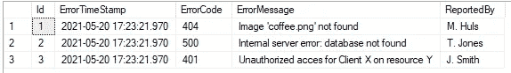

# SQL —删除到另一个表中

> 原文：<https://towardsdatascience.com/sql-delete-into-another-table-b5b946a42299?source=collection_archive---------15----------------------->

## 在一条语句中删除一个表中的记录，并将它们插入到另一个表中

把这个虎尾兰从一个锅里删除到另一个锅里！(图片由[像素](https://www.pexels.com/photo/green-plant-on-brown-clay-pot-4503267/)上的 [Cottonbro](https://www.pexels.com/@cottonbro) 拍摄)

“我为什么需要这样的查询？”一个**删除成**语句是有利的，主要有两个原因:

*   语句是[原子](https://en.wikipedia.org/wiki/Atomicity_(database_systems))；要么两者都发生，要么什么都不发生，即如果删除或插入失败，它将回滚更改。
*   它更便宜:你的数据库只需要查找一次记录。或者，执行单独的插入和删除需要两次查找
*   吹牛的权利:给你的老板和同事留下深刻印象

深信不疑？“给我看一些代码！”。好的，但是首先我们必须设置一些表来演示查询。让我们编码:

# 设置:创建一些包含数据的表

作为一个例子，我们假设我们有一个有很多流程的公司。每个进程都将其错误记录到一个名为 ErrorMessages 的表中，以便进行跟踪。一旦一个错误被解决，过期或者不再相关，我们可以从错误消息中删除它。不过，我们希望保存错误信息，这样我们以后就可以分析哪个进程失败得最多。为此，我们将创建 ErrorMessageBackup。我们的目标是将 ErrorMessages 删除到 ErrorMessageBackup 表中。让我们首先创建我们的表，并将一些数据插入到我们的错误消息中。

用一些记录创建我们的表

通过执行这些查询，我们看到 ErrorMessages 表的内容如下所示:

我们的错误消息表

# 执行我们的查询

这是魔法开始的地方。我们想从数据库中删除 404 错误。让我们检查一下我们的查询，然后再深入一点。

我们的删除查询

我们的目标是 Id 为 1 的错误消息。我们将它保存在@targetId 变量中。然后我们从 ErrorMessages 表中删除，过滤这个 Id。使用输出，我们可以访问已经删除的列。我们将这些列以及一个额外的列输出到 ErrorMessageBackup 表中。

就是这样！一个简单、安全的查询，允许您一次执行两个查询。

# 结论

通过这个查询，我们可以执行原子操作，从一个表中删除记录，并允许我们将它们插入到另一个表中。另请查看:

*   [更新到另一个标签页](https://mikehuls.medium.com/sql-update-into-another-table-bfc3dff79a66) le
*   [使用交易撤销查询](https://mikehuls.medium.com/sql-rolling-back-statements-with-transactions-81937811e7a7)
*   [在一条语句中插入、删除和更新](https://mikehuls.medium.com/sql-insert-delete-and-update-in-one-statement-sync-your-tables-with-merge-14814215d32c)
*   [更新选择一批记录](https://mikehuls.medium.com/sql-update-select-in-one-query-b067a7e60136)
*   [版本控制你的数据库](https://mikehuls.medium.com/version-control-your-database-part-1-creating-migrations-and-seeding-992d86c90170)

[这篇](https://mikehuls.medium.com/sql-update-into-another-table-bfc3dff79a66) 文章向您展示了如何更新到表格中。编码快乐！

—迈克

页（page 的缩写）学生:比如我正在做的事情？[跟我来](https://mikehuls.medium.com/)！