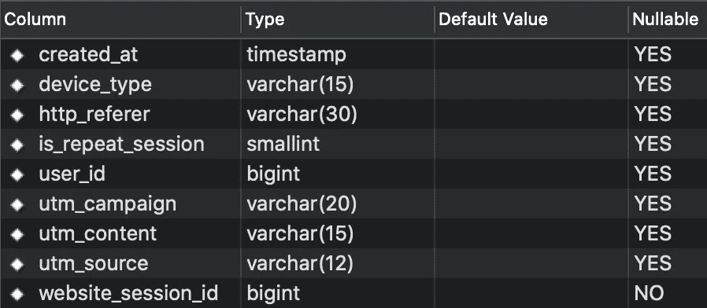
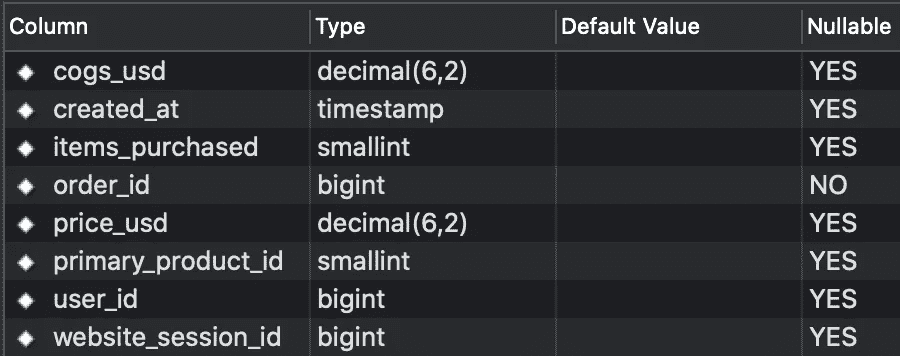
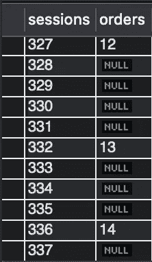
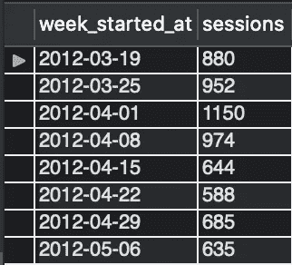
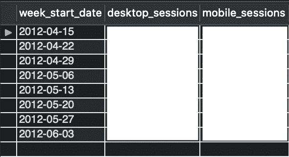
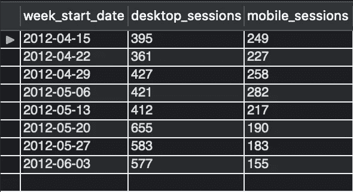
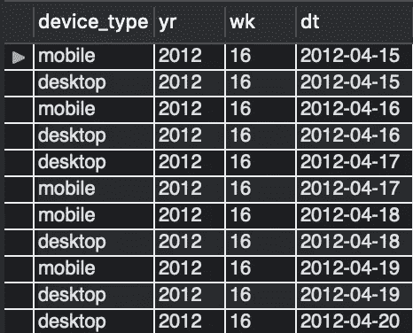
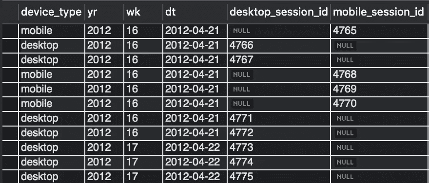
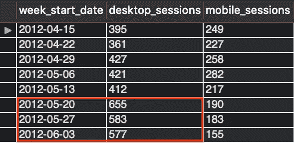

# SQL 数字营销分析

> 原文：<https://towardsdatascience.com/sql-digital-marketing-analysis-be52c14e39aa?source=collection_archive---------8----------------------->

## MySQL Workbench 中的一种方法，修改了应用于营销运营和常见分析请求的一些主要 SQL 查询


图片作者:gon alo GUI mares Gomes

# 介绍

SQL marketing analytics 设置的主要目标是帮助 *mediumcompany* *【虚构】*的营销团队根据他们的表现和收入，计算出不同付费流量细分市场的合理报价。

在 MySQL Workbench 环境中，我们将使用 SQL 数据库 *mediumcompany* ，具体来说，两个表格“网站 _ 会话”和“订单”，帮助我们了解流量来自哪里，以及流量和转化率方面的表现如何。我们还将调整出价，以优化营销预算。

连同以下选定的 5 个常见任务，我们将编写简单的 SQL 查询，但功能强大到足以回答几个运营营销问题。我们将处理关于连接表、计算转换率、设备性能和数量趋势的例子。

*From: CEO
主题:网站流量细分
日期:2012 年 4 月 12 日*

*我们已经上线快一个月了，我们开始创造销售。
能不能帮我了解一下我们* ***网站会话*** *的大头是从哪里来的，通过***？
我想看看* ***按来源、*** *和所指领域细分。**

***—思考** 我们要统计按 utm_source、utm_campaign、utm_referer 分组的 website_session_id(会话数)。
这是我们的预期结果表:*

**

*图片作者。*

*要解决这个问题，我们只需要 website_sessions 的表。*

**

*图片作者。*

```
*SELECT * FROM mediumcompany.website_sessions;*
```

**

*图片作者。*

```
*USE mediumcompany; -- set global use of the db.SELECT utm_source, utm_campaign, http_referer,
COUNT(DISTINCT website_session_id) AS nb_sessionsFROM website_sessionsWHERE created_at < ‘2012–04–12’GROUP BY utm_source, utm_campaign, http_refererORDER BY nb_sessions DESC;*
```

***—提示** 根据 SELECT 语句中的每个位置更快地分组和排序:*

```
*SELECT 
(...)
GROUP BY 1, 2, 3
ORDER BY 4 DESC;*
```

***—输出***

**

*图片作者。*

***—了解** 从从网站 _ 会话表中选择来源、活动和推荐人开始，直到 2012 年 4 月 12 日。*

```
*SELECT utm_source, utm_campaign, http_refererFROM website_sessionsWHERE created_at < “2012–04–12”*
```

**

*图片作者。*

*然后计算使用 GROUP BY 子句的会话数，合计每个组合的值。按降序排列会话(最高在顶部)。*

```
*SELECT (...)
COUNT(DISTINCT website_session_id) AS nb_sessions
(...)
GROUP BY 1, 2, 3ORDER BY 4 DESC;*
```

**

*图片作者。*

*我们可以得出结论， ***gsearch*** 和 ***nonbrand*** 在截至 2012 年 4 月 12 日的这段时间内，比任何其他活动或来源带来的流量(会话)都多。*

**发件人:市场总监
主题:g 搜索转换
日期:2012 年 4 月 14 日**

**看起来****g search non brand****是我们的主要流量来源，但我们需要了解这些会议是否在推动销售。
能否请您* ***计算一下从会话到订单的转化率(CVR)*** *？基于我们为点击支付的费用，我们需要至少 4%的 CVR 来让这些数字起作用。**

***—思考** 我们想统计截止到 2012 年 4 月 14 日的 gsearch 和 nonbrand 的会话和订单总数。
关于转化率，我们简单的按时段划分订单。
这是我们的预期结果表:*

**

*图片作者。*

*为了解决这个问题，我们需要 website_sessions(我们已经从前面的作业中知道了)和 orders 表(见下文)。*

**

*图片作者。*

```
*SELECT * FROM mediumcompany.orders;*
```

**

*图片作者。*

*我们将执行“website_sessions”左连接“orders ”,因为我们希望看到 website_sessions 表中的所有 website_session_id，并查看 orders 表中何时有匹配的订单。我们将在 website_session_id 上同时加入。*

```
*USE mediumcompany;SELECT
COUNT(DISTINCT ws.website_session_id) AS sessions,
COUNT(DISTINCT o.order_id) AS orders,
(COUNT(DISTINCT o.order_id) / COUNT(DISTINCT ws.website_session_id)) *100 AS session_to_order_conv_rateFROM website_sessions ws
LEFT JOIN orders o 
ON o.website_session_id = ws.website_session_idWHERE ws.created_at < ‘2012–04–14’ 
AND ws.utm_source = ‘gsearch’ 
AND ws.utm_campaign = ‘nonbrand’;*
```

***—提示**
按 **2 位**小数对‘session _ to _ order _ conv _ rate’进行舍入:*

```
*SELECT
(...)
ROUND((COUNT(DISTINCT o.order_id) / COUNT(DISTINCT ws.website_session_id)) * 100 **,2**) AS session_to_order_conv_rate*
```

***—输出***

**

*图片作者。*

***—了解** 首先，通过在 website_session_id 上使用左连接来连接两个表(website_sessions 和 order_id)，选择 website_session_id 和 order _ id。*

```
*SELECT 
ws.website_session_id AS sessions,
o.order_id AS orders

FROM website_sessions ws
LEFT JOIN orders o 
ON o.website_session_id = ws.website_session_idWHERE ws.created_at < “2012–04–14”
AND ws.utm_source = ‘gsearch’ 
AND ws.utm_campaign = ‘nonbrand’;*
```

**

*图片作者。*

*统计会话和订单的总数。*

```
*SELECT 
COUNT(DISTINCT ws.website_session_id) AS sessions,
COUNT(DISTINCT o.order_id) AS orders
(...)*
```

**

*图片作者。*

*通过将订单除以会话来计算转化率(比率为*100)。*

```
*SELECT (...)
(COUNT(DISTINCT o.order_id) / COUNT(DISTINCT ws.website_session_id)) *100 AS session_to_order_conv_rate 
(...)-- Round **2** decimals:
ROUND((COUNT(DISTINCT o.order_id) / COUNT(DISTINCT ws.website_session_id)) *100 **,2**) AS session_to_order_conv_rate*
```

**

*图片作者。*

*2.9%的转换率意味着 gsearch 非品牌出价没有像预期的那样推动销售，投资没有以最佳方式发挥作用。*

**发件人:市场总监
主题:g 搜索量趋势
日期:2012 年 5 月 10 日**

**基于您的转化率分析，我们于 2012 年 4 月 15 日投标****g search non brand****。
能不能调出* ***gsearch 非品牌趋势交易量，按周细分，*** *看看竞价变化有没有导致交易量下降？**

***—思考**
我们想按时间顺序按周统计 gsearch 非品牌会话，直到 2012 年 5 月 10 日。要做到这一点，按年和周将它们分组，找出每周的第一天或最小的一天。最后，看看交易量是否从 4 月 15 日开始下降。
这是我们的预期结果表:*

**

*图片作者。*

```
*USE mediumcompany;SELECT 
MIN(DATE(created_at)) as week_started_at,
COUNT(DISTINCT website_session_id) AS sessionsFROM website_sessionsWHERE created_at < ‘2012–05–10’ 
AND utm_source = ‘gsearch’ 
AND utm_campaign = ‘nonbrand’GROUP BY YEAR(created_at), 
WEEK(created_at);*
```

***—提示**
我们实际上可以按 SELECT 语句中没有包含的列(年、周)进行分组。*

***—输出***

**

*图片作者。*

***—了解**
先按年、周、日选择分组，统计场次。*

```
*SELECT 
YEAR(created_at) AS yr,
WEEK(created_at) AS wk,
DATE(created_at) AS dt,
COUNT(DISTINCT website_session_id) AS sessions
(...)
GROUP BY 1, 2, 3*
```

**

*图片作者。*

*找到一周中的第一天或最小的一天。因为我们继续按年和周对它们进行分组，但没有在 SELECT 子句中添加，所以日期的粒度将变得更粗。*

```
*SELECT 
MIN(DATE(created_at)) as week_started_at,
COUNT(DISTINCT website_session_id) AS sessions
(...)
GROUP BY YEAR(created_at), WEEK(created_at);*
```

**

*图片作者。*

*在 4 月 15 日之后，gsearch nonbrand 的流量明显下降。*

**发自:市场总监
主题:*g 搜索设备级性能 *日期:2012 年 5 月 11 日**

**前几天，我试图在手机上使用我们的网站，但体验并不好。
您能否按设备类型从会话到订单获取* ***转换率？*** *如果台式机的性能优于移动设备，我们或许可以提高台式机的价格，以获得更大的销量？**

***—思考** 我们想统计截至 2012 年 5 月 11 日期间 gsearch 和 nonbrand 的会话和订单总数。
关于转化率，我们简单的按时段划分订单。然后，我们按设备类型分组。这是我们的预期结果表:*

**

*图片作者。*

```
*USE mediumcompany;SELECT 
ws.device_type,
COUNT(DISTINCT ws.website_session_id) AS sessions,
COUNT(DISTINCT o.order_id) AS orders,
ROUND((COUNT(DISTINCT o.order_id) / COUNT(DISTINCT ws.website_session_id)) * 100, 2) AS session_to_order_conv_rtFROM website_sessions ws
LEFT JOIN orders o 
ON o.website_session_id = ws.website_session_idWHERE
ws.created_at < ‘2012–05–11’
AND ws.utm_source = ‘gsearch’
AND utm_campaign = ‘nonbrand’GROUP BY 1;*
```

***—输出***

**

*图片作者。*

***—理解**
从统计会话数、订单数，以及转化率开始。*

```
*SELECT
COUNT(DISTINCT ws.website_session_id) AS sessions,
COUNT(DISTINCT o.order_id) AS orders,
(COUNT(DISTINCT o.order_id) / COUNT(DISTINCT ws.website_session_id)) *100 AS session_to_order_conv_rate
(...)*
```

**

*图片作者。*

*呼叫和分组依据按设备细分。*

```
*SELECT 
**ws.device_type,**
COUNT(DISTINCT ws.website_session_id) AS sessions,
COUNT(DISTINCT o.order_id) AS orders,
ROUND((COUNT(DISTINCT o.order_id) / COUNT(DISTINCT ws.website_session_id)) * 100, 2) AS session_to_order_conv_rt
(...)
**GROUP BY 1**;*
```

**

*图片作者。*

*台式机的表现要好得多，因此我们应该提高这类设备的报价，以增加销量。*

**来自:市场总监
主题:*g 搜索设备级*趋势
日期:2012 年 6 月 9 日**

**在您对转化率进行设备层面的分析后，我们意识到台式机表现不错，因此我们在 2012 年 5 月 19 日对我们的 gsearch 非品牌台式机活动进行了竞价。
你能调出* ***桌面和移动的每周趋势*** *这样我们就能对销量产生影响了？
你可以用****2012–04–15****直到投标变更为基线。**

***—思考**
我们希望选择并过滤设备，以统计设备类型为“桌面”或“移动”的次数，然后按年和周对时间序列进行转换和分组，以查看周开始日期。
最后，检查桌面会话的数量是否从 4 月 15 日到 6 月 9 日有所下降。这是我们的预期结果表:*

**

*图片作者。*

```
*USE mediumcompany;SELECT 
MIN(DATE(created_at)) AS week_start_date,
COUNT(DISTINCT CASE WHEN device_type = ‘desktop’ THEN website_session_id ELSE NULL END) AS desktop_sessions,
COUNT(DISTINCT CASE WHEN device_type = ‘mobile’ THEN website_session_id ELSE NULL END) AS mobile_sessionsFROM website_sessionsWHERE created_at BETWEEN ‘2012–04–15’ AND ‘2012–06–09’ 
AND utm_source = ‘gsearch’ AND utm_campaign = ‘nonbrand’GROUP BY YEAR(created_at), WEEK(created_at)*
```

***—输出***

**

*图片作者。*

***—了解** 我们将从选择 device_type 开始，并转换年、周和日期。*

```
*USE mediumcompany;SELECT
**device_type**,
**YEAR(created_at)** AS yr,
**WEEK(created_at)** AS wk,
**DATE(created_at)** AS dt

FROM website_sessionsWHERE created_at BETWEEN ‘2012–04–15’ AND ‘2012–06–09’ AND utm_source = ‘gsearch’ AND utm_campaign = ‘nonbrand’;*
```

**

*图片作者。*

*接下来，根据设备类型(桌面或移动)过滤网站会话 id。*

```
*USE mediumcompany;SELECT
device_type,
YEAR(created_at) AS yr,
WEEK(created_at) AS wk,
DATE(created_at) AS dt,**CASE WHEN device_type = ‘desktop’ THEN website_session_id ELSE NULL END AS desktop_session_id,
CASE WHEN device_type = ‘mobile’ THEN website_session_id ELSE NULL END AS mobile_session_id**FROM website_sessionsWHERE created_at BETWEEN ‘2012–04–15’ AND ‘2012–06–09’ AND utm_source = ‘gsearch’ AND utm_campaign = ‘nonbrand’*
```

**

*图片作者。*

*接下来，我们将删除“device_type”列，因为我们希望汇总并计算 device _ type 为“desktop”或“mobile”的次数。*

*不要忘记按年、周和日期分组，这样计数才有意义。*

```
*USE mediumcompany;SELECT
YEAR(created_at) AS yr,
WEEK(created_at) AS wk,
DATE(created_at) AS dt,**COUNT(**CASE WHEN device_type = ‘desktop’ THEN website_session_id ELSE NULL END**)** AS desktop_sessions,
**COUNT(**CASE WHEN device_type = ‘mobile’ THEN website_session_id ELSE NULL END**)** AS mobile_sessionsFROM website_sessionsWHERE created_at BETWEEN ‘2012–04–15’ AND ‘2012–06–09’ AND utm_source = ‘gsearch’ AND utm_campaign = ‘nonbrand’**GROUP BY 1,2,3***
```

**

*图片作者。*

*最后，从 SELECT 语句中删除“yr”和“wk ”(但仍按它们分组),以获得更大的粒度。*

*对于日期列“dt ”,将日期转换并设置为第一(最小)天，按年“yr”和周“wk”分组，以便最小天等于每个分组周的第一天。*

*不要忘记按年和周分组，这样计数才有意义。*

```
*USE mediumcompany;SELECT
**MIN(**DATE(created_at)**)** AS week_start_date,
COUNT(CASE WHEN device_type = ‘desktop’ THEN website_session_id ELSE NULL END) AS desktop_session_id,
COUNT(CASE WHEN device_type = ‘mobile’ THEN website_session_id ELSE NULL END) AS mobile_session_idFROM website_sessionsWHERE created_at BETWEEN ‘2012–04–15’ AND ‘2012–06–09’ AND utm_source = ‘gsearch’ AND utm_campaign = ‘nonbrand’**GROUP BY YEAR(created_at), WEEK(created_at)***
```

**

*图片作者。*

*回答问题“*了解桌面和移动设备的每周趋势，这样我们就可以看到对销量的影响？你可以将 2012 年 4 月 15 日之前的出价作为基准。”*，gsearch 非品牌桌面的流量从 4 月 15 日至今有所增加。*

# *结论*

***流量来源分析**旨在了解客户来自哪里，以及哪些渠道带来了最高质量的流量。*

***竞价优化分析**是关于了解付费流量各个细分市场的价值，以便我们优化营销预算。*

*从营销人员的角度来看，目标是产生流量，为网站带来更多的流量，为企业赚更多的钱。*

*在分析方面，任务是分析流量来源和竞价优化，以了解付费流量各部分的价值，改善营销预算。*

*</15-business-questions-about-mobile-marketing-campaigns-roas-return-on-ad-spend-ff636a8095b6>  </machine-learning-costs-prediction-of-a-marketing-campaign-exploratory-data-analysis-part-i-758b8f0ff5d4>  

感谢阅读。*