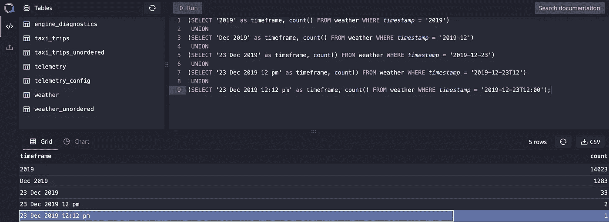
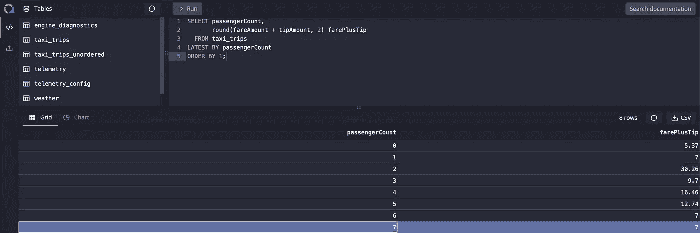
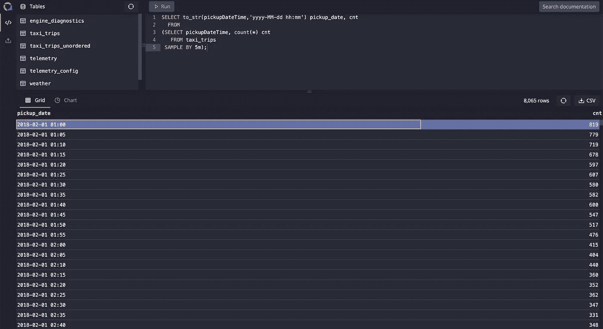
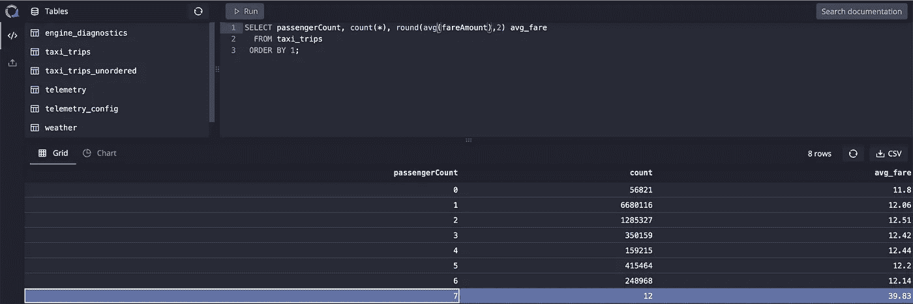
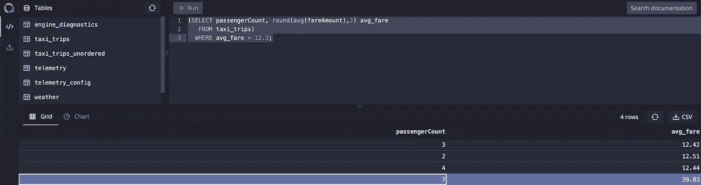

# QuestDB 中时序数据的 SQL 扩展

> 原文：<https://towardsdatascience.com/sql-extensions-for-time-series-data-in-questdb-f6b53acf3213?source=collection_archive---------43----------------------->

杰森·布里斯科在 [Unsplash](https://unsplash.com/s/photos/stock?utm_source=unsplash&utm_medium=referral&utm_content=creditCopyText) 上的照片

## [入门](https://towardsdatascience.com/tagged/getting-started)，数据工程

## 一个简短的实践教程，介绍如何在 QuestDB 中使用为时序数据构建的 SQL 扩展

在本教程中，您将学习 QuestDB SQL 扩展，它被证明对时间序列数据非常有用。通过使用一些示例数据集，您将了解指定的时间戳如何工作，以及如何使用扩展的 SQL 语法来编写对时间序列数据的查询。

# 介绍

传统上，SQL 被用于关系数据库和数据仓库。近年来，互联系统产生的数据量呈指数级增长，因此需要新的方法来存储和分析这些信息。因此，时间序列分析对于理解金融服务中的实时市场数据、来自物联网设备的传感器数据和应用指标至关重要。

时间序列数据量的爆炸式增长导致了专门数据库的开发，这些数据库旨在尽可能高效地接收和处理时间序列数据。QuestDB 实现了这一点，同时支持标准的 ANSI SQL 和用于时间序列分析的本地扩展。

除此之外，QuestDB 还通过实现隐式子句简化了语法。它还包括一个随机数据生成特性，这对于探索数据库的功能以及数据库测试非常有用。尽管有很多关于 QuestDB 的 SQL 方言的内容，但在本教程中，您将了解 SQL 扩展。

在整个教程中，我们将使用两个数据集。第一个是 2018 年 2 月纽约市的出租车出行数据。它包含关于乘客数量、旅程费用、小费金额和旅程开始日期的信息。你可以找到每位乘客的平均收入、纽约出租车司机的小费行为、一天中最繁忙的时间等等。

第二个数据集包含从 2010 年 1 月 1 日到 2020 年 1 月 1 日的 10 年的天气信息。该数据集包含温度、风速、降雨量、积雪深度、能见度等信息。你可以用这些数据来分析天气模式在很长一段时间内是如何出现的。你也可以比较不同年份同一时间的天气。首先，您可以使用以下 shell 脚本安装上述数据集:

安装示例数据集的脚本。

# SQL 扩展

在最大程度地实现 ANSI SQL 的同时，QuestDB 引入了一些特定于时间序列的 SQL 扩展，以增强数据库用户和开发人员的性能和查询读写体验。让我们逐一研究所有的 SQL 扩展。

## 时间戳搜索

如果时序数据库没有提供跨时间搜索的方法，那么它就是不完整的。在 QuestDB 中，您可以按照时间间隔对表进行[分区。每个分区将保存在磁盘上一组单独的文件中。为了提供类似关系数据库的优化，QuestDB 提供了时间戳搜索特性。](https://questdb.io/docs/concept/partitions/)

为了利用这个特性，一个表应该有一个指定的时间戳列。在创建表或在查询中创建临时子表时，可以将任何时间戳列标记为指定的时间戳列。指定的时间戳列强制表中的记录按时间顺序递增。因此，它隐式地实施了一个约束，该约束拒绝任何无序的插入。QuestDB 没有拒绝无序插入，而是[已经开始接受无序的延迟记录](https://github.com/questdb/questdb/issues/172)。也可以使用普通的≥、≤、<、>操作符来执行时间戳搜索，但是它不如使用指定时间戳有效。

> *指定时间戳列的另一个好处是，它能够有效地使用* `***ASOF***` *连接，这些连接是在时间戳不完全匹配的情况下基于时间戳连接表的专用连接。使用从* `***ASOF***` *连接获取确定性结果的先决条件是表中的数据应该按时间排序。指定的时间戳列强制表中的时间顺序。*

这两个样本数据集直接从一个 CSV 文件导入，并动态创建一个表。虽然您可以在导入数据时创建一个指定的时间戳，但是理解如何处理没有指定时间戳的表是很重要的。因此，现在让我们创建指定的时间戳，并按月份对这两个表进行分区。

CTAS 导入数据集的 SQL 脚本创建指定的时间戳列。

使用指定的时间戳搜索符号，可以简化基于时间戳的表上搜索。以下示例查询`**weather**` 数据集。在这个例子中，您可以看到同一个操作符可以用于查询许多不同的时间范围。`**UNION**`的第一部分将为您提供 2019 年全年的记录数，而`**UNION**`的第二部分将为您提供 2019 年 12 月的记录数，以此类推。

用于演示时间戳搜索符号的 SQL 查询。

## `[LATEST BY](https://questdb.io/docs/reference/sql/latest-by/)`

这个 SQL 扩展通过时间戳查找给定键或键组合的最新条目。`**LATEST BY**`的功能类似于`**FIRST**`、`**FIRST_VALUE**`等功能。这在传统的关系数据库和数据仓库中是可用的。

在关系数据库中，您要么必须首先找出最近的时间戳，并使用子查询找到`**passengerCount**`的`**farePlusTip**` 金额，要么必须使用前面提到的分析函数之一，如`**FIRST_VALUE**`。QuestDB 通过创建一个新的子句来查找每组的最新记录，使数据库用户和开发人员的工作变得更加轻松。

在下面的示例中，您将看到，通过使用`**LATEST BY**` 子句，基于`**passengerCount**`，我们可以找出最近完成的行程的`**farePlusTrip**` 金额。

**最新通过**条款的例子。

## [样品通过](https://questdb.io/docs/reference/sql/sample-by/)

这是另一个对时间序列数据最理想的扩展，因为它允许基于时间戳对数据进行分组，而无需在 where 子句中显式提供时间戳范围。使用这个扩展，您可以将数据分成时间块。

在常规的 SQL 中，您需要结合使用`**CASE WHEN**`语句、`**GROUP BY**`子句和`**WHERE**`子句来获得类似的结果。在 QuestDB 中，`**SAMPLE BY**`完成了这个任务。要使用这个 SQL 扩展，您需要确保该表有一个指定的时间戳列。

在下面的示例中，您将看到使用`**24h**` 作为`**SAMPLE BY**`子句中的`**SAMPLE_SIZE**`，按天对数据进行采样或分组。根据接收到表中的数据的频率，您可能需要通过调整`**SAMPLE_SIZE**`来调整存储桶的大小。

在时序数据库中，粒度非常低是很常见的。因此，通常将数据按时间间隔分组，时间间隔从几秒到几年不等。以下是更多的例子，展示了如何针对不同的样本量使用`**SAMPLE BY**`子句:

使用不同时段的 **SAMPLE BY** 子句示例。

# 对常用 SQL 语法的更改

除了 SQL 扩展之外，还对常用的 SQL 语法进行了一些更改，以增强数据库用户体验。变更与`GROUP BY`和`HAVING`条款相关。这样做的目的是简化查询的编写，提高可读性和 SQL 方言的易用性，同时减少 SQL 的冗长。

## 可选的[分组依据](https://questdb.io/docs/reference/sql/group-by/)子句

由于聚合函数在时序数据库中的广泛使用，QuestDB 隐式地对聚合结果进行分组，以使查询编写体验更好。虽然 QuestDB 支持`**GROUP BY**`关键字，但是无论您是否将它包含在查询中，都不会对结果集产生任何影响。让我们看一个例子:

在 QuestDB 中，使用 GROUP BY 子句是完全可选的。

## 隐含有条款

由于`**HAVING**`总是只与`**GROUP BY**`子句一起使用，因此`**HAVING**`子句自动隐含在上面提到的可选的`**GROUP BY**` 子句中。让我们来看一个例子:

不需要在 QuestDB 中使用 **HAVING** 子句。

## 可选的 [SELECT * FROM](https://questdb.io/docs/concept/sql-extensions/#optionality-of-select--from) 短语

QuestDB 更进一步，将`**SELECT * FROM**` 短语设为可选。当涉及到嵌套子查询时，这种方法确实有助于减少冗长性。在 QuestDB 中，只需写入表名并执行语句，就会充当一个`**SELECT * FROM TABLE_NAME**` 语句。请看下面的例子:

所有这些改进都有助于减少在像 QuestDB 这样的时序数据库中编写和维护查询所需的工作量。

# 结论

在本教程中，您了解了 QuestDB 如何通过编写专门为时序数据库设计的定制 SQL 扩展来支持 SQL 并增强性能和开发人员体验。您还了解了 QuestDB 的 SQL 方言中的一些语法变化。如果你有兴趣了解更多关于 QuestDB 的信息，请访问 QuestDB 的[官方文档](https://questdb.io/docs/introduction/)。