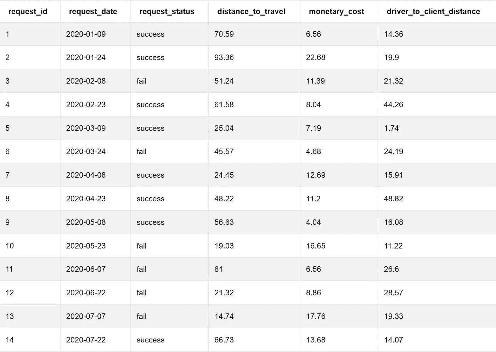
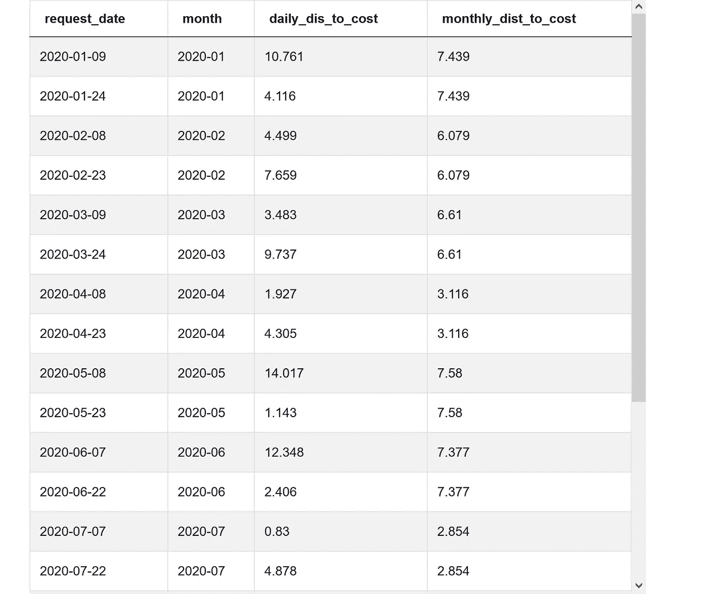
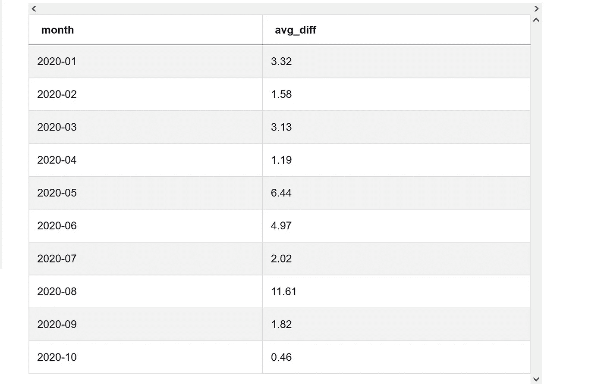
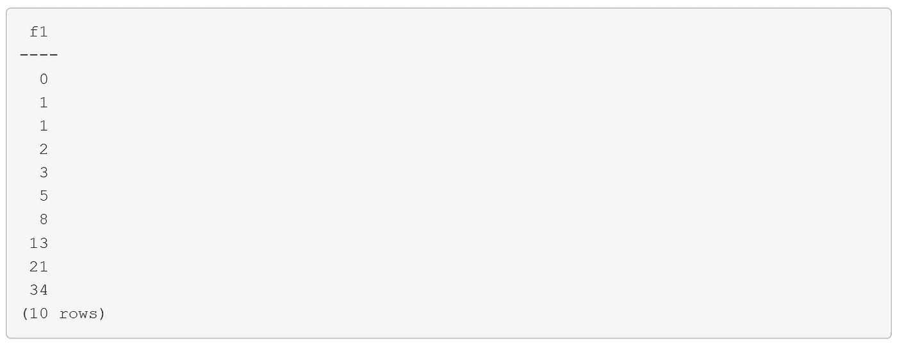

# 破解 SQL 面试问题:子查询 vs. CTE

> 原文：<https://towardsdatascience.com/sql-for-data-analysis-subquery-vs-cte-699ef629d9eb?source=collection_archive---------1----------------------->

## CTE 和子查询的区别


迈克·本纳在 [Unsplash](https://unsplash.com?utm_source=medium&utm_medium=referral) 上的照片

# 背景

SQL 是数据科学专业人员的必备技能。许多公司将其数据存储在关系数据库系统中，如 MySQL、PostgreSQL、MS SQL Server、SQLite。SQL 是我们与他们互动所需的编程语言。我们可以编写一个 SQL 查询来选择、过滤、转换、插入、更新和删除数据库中的底层数据。

**SQL 不仅可以用来查询数据库，还可以用来进行数据分析。**子查询和 CTE(公共表表达式)都是有用的工具，我们可以使用它们编写复杂的 SQL 查询来实现数据分析，就像其他数据科学工具一样，比如 Python 中的 [Pandas](https://medium.com/geekculture/data-manipulation-sql-vs-pandas-116bb33a9abf) 和 r 中的 dplyr

在本文中，我将解释子查询和 CTE 之间的异同。

# 子查询和 CTE 之间的相似性

我将使用一个常见的 SQL 访问问题来演示子查询和 CTE 之间的相似性。

**SQL 问题**:

```
Distance Per DollarYou’re given a dataset of Uber rides with the traveling distance ("distance_to_travel") and cost ("monetary_cost") for each ride. For each date, find the difference between the distance-per-dollar for that date and the average distance-per-dollar for that year-month. Distance-per-dollar is defined as the distance traveled divided by the cost of the ride.  
The output should include the year-month (YYYY-MM) and the average difference in distance-per-dollar for said year-month as an absolute value rounded to the 2nd decimal. You should also count both success and failed request_status as the distance and cost values are populated for all ride requests. Also, assume that all dates are unique in the dataset. Order your results by the earliest request date first.Source: [stratascratch.com](https://platform.stratascratch.com/coding-question?id=10302)
```



来源:[stratascratch.com](https://platform.stratascratch.com/coding-question?id=10302)

以下是我们需要采取的步骤来解决这个问题:

*   步骤 1:在给定的一天，计算每成本距离，并根据这一天创建年月
*   步骤 2:使用一个窗口函数[来计算年月级别的平均每成本距离](https://medium.com/geekculture/data-manipulation-sql-vs-pandas-116bb33a9abf)
*   步骤 3:使用一个[聚合函数](https://medium.com/geekculture/data-manipulation-sql-vs-pandas-116bb33a9abf)来计算年月级别上每日每成本距离和每月每成本距离之间的绝对差值的平均值
*   步骤 4:按最早年月顺序输出

# 使用子查询

顾名思义，**子查询**是中的**查询。要使用子查询，我们只需添加括号并将查询放入其中。子查询创建的输出将充当临时表。在我们执行完整个语句后，临时子查询将自动消失。**

对于这个 SQL 问题，如果我们使用子查询，我们将最终拥有多个**嵌套子查询**。

*   步骤 1:我们创建一个**内部查询** (a)来计算每成本的每日距离，并使用`TO_CHAR`创建一个新列 year-month。

```
SELECT *,
   TO_CHAR(request_date::DATE, 'YYYY-MM') AS month
   (distance_to_travel/monetary_cost) AS daily_dis_to_cost
FROM uber_request_logs
```

*   步骤 2:我们创建另一个**嵌套子查询** (b)来使用窗口函数`AVG(a.daily_dis_to_cost) OVER (PARTITION BY a.month)`计算每月平均每成本距离。使用窗口函数，输出将具有与原始数据集相同的行数。

```
SELECT 
     a.request_date,
     a.month,
     a.daily_dis_to_cost,
     AVG(a.daily_dis_to_cost) OVER(PARTITION BY a.month) AS monthly_dist_to_cost
  FROM 
   (SELECT *,
       TO_CHAR(request_date::DATE, 'YYYY-MM') AS month,
       (distance_to_travel/monetary_cost) AS daily_dis_to_cost
    FROM uber_request_logs) a
 ORDER BY request_date
```

**中间** **输出**:



(作者创作)

*   第 3 步和第 4 步，我们运行**外部查询**来实现聚合函数`AVG(ABS(b.daily_dis_to_cost-b.monthly_dis_to_cost))`和`GROUP BY b.month`来计算年月级别上每日每成本距离和每月每成本距离之间的绝对差值的平均值。最后，我们按月排序输出。

```
SELECT 
    b.month,
    ROUND(AVG(ABS(b.daily_dis_to_cost-b.monthly_dist_to_cost))::DECIMAL, 2) AS avg_diff
FROM
    (SELECT 
         a.request_date,
         a.month,
         a.daily_dis_to_cost,
         AVG(a.daily_dis_to_cost) OVER(PARTITION BY a.month) AS monthly_dist_to_cost
      FROM 
       (SELECT *,
           TO_CHAR(request_date::DATE, 'YYYY-MM') AS month,
           (distance_to_travel/monetary_cost) AS daily_dis_to_cost
        FROM uber_request_logs) a
     ORDER BY request_date) b
GROUP BY b.month
ORDER BY b.month
```

## **期望输出**:



(作者创作)

# 使用 CTE

一个 **CTE** ( **又名公共表表达式**)是我们在编写主查询之前使用`WITH`子句创建的结果集。我们可以简单地将其输出用作临时表，就像子查询一样。类似于子查询，我们也可以创建多个 cte。

为了使用 CTE 解决上述 SQL 问题，我们将创建多个 cte(cte 1 和 cte2)，它们相当于上面提到的子查询(a 和 b)。

```
WITH cte1 AS(
    SELECT *,
        TO_CHAR(request_date::DATE, 'YYYY-MM') AS month, 
        (distance_to_travel/monetary_cost) AS daily_dis_to_cost
    FROM uber_request_logs
),
cte2 AS(
    SELECT 
        request_date,
        month,
        daily_dis_to_cost,
        AVG(daily_dis_to_cost) OVER(PARTITION BY month) AS monthly_dis_to_cost
    FROM cte1
    ORDER BY request_date
)
SELECT
    month,
    ROUND(AVG(ABS(daily_dis_to_cost-monthly_dis_to_cost))::DECIMAL, 2) AS avg_diff
FROM cte2
GROUP BY month
ORDER BY month
```

子查询和 CTE 产生的结果完全相同。起初，我们可能认为这两个工具除了语法之外没有太多区别。在下一节中，我们将讨论这两种方法之间的区别。

# 子查询和 CTE 的区别

## 使用 CTE 的优势

**CTE 可以重用:**使用 CTE 的一个优点是 CTE 在设计上是可重用的。不必在需要使用子查询的每个地方都声明相同的子查询，可以使用 CTE 定义一次临时表，然后在需要时引用它。

CTE 更具可读性:CTE 的另一个优势是 CTE 比子查询更具可读性。因为 CTE 可以重用，所以使用 CTE 比使用子查询可以编写更少的代码。此外，人们倾向于按照顺序而不是嵌套的方式来遵循逻辑和想法。当你写一个查询时，使用 CTE 将一个复杂的查询分解成更小的部分会更容易。

**cte 可以递归:**CTE 可以递归运行，而子查询不能。这使得它特别适合于树形结构，在这种结构中，给定行中的信息是基于前面行中的信息的。递归特性可以用`RECURSIVE`和`UNION ALL`实现。

```
WITH RECURSIVE [cte_name] (column, ...) AS (
  [non-recursive_term]
UNION ALL
  [recursive_term])
SELECT ... FROM [cte_name];
```

让我们创建斐波纳契数列(**数列**中的每个数字都是它前面两个数字的和。)使用 CTE 的递归特性。

```
WITH RECURSIVE fib(f1, f2) AS ( 
    SELECT 0, 1 
    UNION ALL
    SELECT f2, (f1+f2) FROM fib ) 
SELECT f1 FROM fib LIMIT 10;
```

**输出:**



到目前为止，我们已经讨论了 CTE 和子查询之间的一些差异。看起来 CTE 比子查询有更多的优势。但是在下一节中，我们将讨论子查询的特性，这是使用 CTE 无法实现的。

## 使用子查询的优势

在 WHERE 子句中可以使用子查询:我们可以使用子查询返回值，然后在 WHERE 子句中使用它。在下面的示例中，我们希望返回工资高于平均工资的雇员。用一个计算平均工资的子查询很容易实现。

```
SELECT
   employee_name, salary 
FROM sample
WHERE
   salary > (SELECT AVG(salary) FROM sample)
```

**子查询可以充当具有单个值的列:**您也可以将子查询用作新列。唯一的约束是子查询必须只返回一个值。在下面的示例中，我们希望添加一个新列，其中包含平均工资。我们可以使用子查询来计算平均工资，然后将其包含在 SELECT 语句中。

```
SELECT
   employee_name,
   salary,
   (SELECT AVG(salary) FROM sample) AS average_salary
FROM sample
```

**子查询可以与相关子查询一起使用:**与 CTE 不同，我们可以将内部子查询用作相关子查询。这意味着对于外部查询处理的每个记录，将执行一个内部查询。

在下面的例子中，我们想返回工资第二高的雇员。下面是我们将使用相关子查询来解决这个问题的方法。对于每个雇员(在外部查询(a)中)，我们计算工资高于给定雇员的雇员数量(在内部查询(b)中)。如果只有一个其他雇员的工资比这个给定的雇员高，我们就保留这个雇员。

```
SELECT 
   employee_name, salary
FROM sample a
WHERE 1 = (SELECT COUNT(DISTINCT(salary)) FROM sample b WHERE a.salary < b.salary)
```

**但是请记住，因为外部查询每次处理每一行时都会计算内部子查询，所以它可能会很慢。**

如果你想探索更多的 **SQL 面试问题**，请查看我的文章:

*   [**综合 SQL 备忘单**](https://medium.com/geekculture/comprehensive-sql-cheat-sheet-f821c5abf85a)
*   [**破解 SQL 面试问题的有用程序**](/practical-sql-questions-for-data-science-interview-3b5c9d726baa)
*   [**破解 SQL 面试问题:子查询 vs CTE**](/sql-for-data-analysis-subquery-vs-cte-699ef629d9eb)
*   [**破解 SQL 面试题:Join vs Case-When 语句**](/crack-sql-interview-question-join-vs-case-when-statement-116d40a361f0)
*   [**破解 SQL 面试题:带分区的窗口函数-By**](/crack-sql-interview-question-window-functions-with-partition-by-599d792c07c3)
*   [**破解 SQL 面试问题:Date_Part 函数**](/crack-sql-interview-question-date-part-function-aff0b15478d9)
*   [**破解 SQL 面试题:ROW_NUMBER、RANK 和 DENSE_RANK**](https://medium.com/geekculture/crack-sql-interview-questions-row-number-rank-and-dense-rank-ef439749f3ff)
*   [**破解 SQL 面试问题:UNNEST，STRING_TO_ARRAY**](https://python.plainenglish.io/crack-sql-interview-question-unnest-string-to-array-1b75578cbe75)
*   [**破解 SQL 面试问题:GENERATE_SERIES，STRING_AGG，SPLIT_PART**](https://medium.com/geekculture/crack-sql-interview-question-generate-series-string-agg-split-part-fbc0e5e42d7d)
*   [**破解 SQL 面试问题:自连接和非等同连接**](https://medium.com/geekculture/crack-sql-interview-question-self-join-and-non-equi-join-1cb2a181104a)
*   [**破解 SQL 面试问题:任意运算符**](https://medium.com/geekculture/crack-sql-interview-question-any-operator-d39e07e0e224)
*   [**破解 SQL 面试问题:子查询**](https://medium.com/geekculture/crack-sql-interview-question-subquery-d9db4763eef4)

# 感谢您的阅读！！！

如果你喜欢这篇文章，并且想**请我喝杯咖啡，**请[点击这里](https://ko-fi.com/aaronzhu)。

您可以注册一个 [**会员**](https://aaron-zhu.medium.com/membership) 来解锁我的文章的全部访问权限，并且可以无限制访问介质上的所有内容。如果你想在我发表新文章时收到电子邮件通知，请订阅。