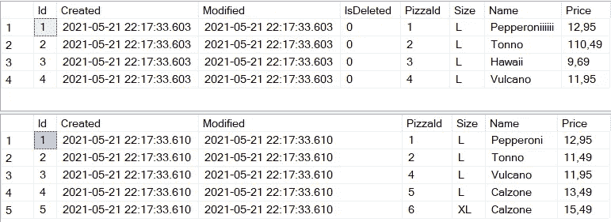
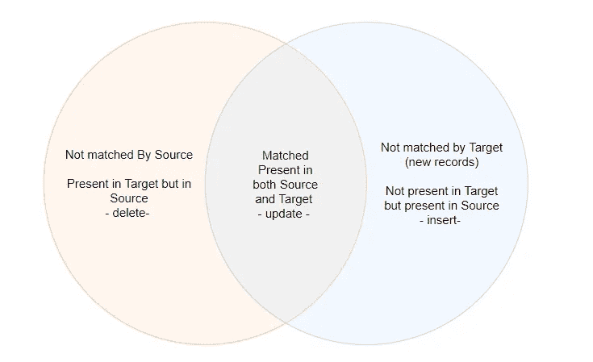
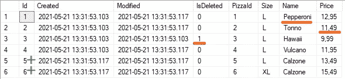
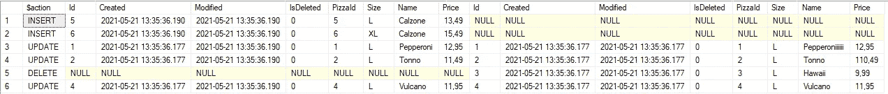
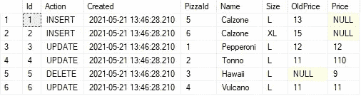

# SQL —在一条语句中插入、删除和更新:用 MERGE 同步表

> 原文：<https://towardsdatascience.com/sql-insert-delete-and-update-in-one-statement-sync-your-tables-with-merge-14814215d32c?source=collection_archive---------4----------------------->

## 用于合并两个表的灵活、安全和高效的解决方案

该进程一次只能处理一个表；我们必须合并(图片由罗杰·布拉德肖在[像素](https://unsplash.com/photos/1PPoNhMzAmY)上拍摄)

通过合并，你可以通过在一个语句中执行*插入*、*删除*和*更新*来“同步”两个表。合并远不止这些。它在比较和同步表格方面为您提供了广泛的选项。您甚至可以跟踪合并的输出。我们将在本文中深入探讨所有这些问题。合并的主要原因是:

*   它是原子的；它或者执行所有命令(例如*更新*、*插入*和*删除*)或者不执行。如果其中一个命令失败，它将回滚所有内容。
*   高效快速:SQL Server 需要比较记录*一次*
*   非常灵活
*   给你的经理和同事留下深刻印象

# 1 设置:创建一些包含数据的表

想象一下，我们有一家新成立的披萨公司。我们在一个名为 Pizzamenu 的表中记录披萨。每周我们都会收到一个新的数据集，其中包含最新的菜单。我们的目标是更新现有比萨饼的信息，添加新的和删除旧的。让我们首先创建表格并插入一些数据。

在这些查询中，您可以看到 PizzaMenu 和 NewPizzaMenu 几乎是相同的。唯一的区别是 PizzaMenu 包含一个额外的列，指示比萨饼是否在菜单上(IsDeleted)。

PizzaMenu 和 NewPizzaMenu

如你所见，新菜单不再包含夏威夷披萨。第一个比萨饼的名字和托诺的价格也是固定的。此外，还添加了两个比萨饼。让我们来看看如何做到这一点。

# 2 合并查询

合并查询比较目标表和源表。目标表是你真理的来源，这个来源将用来充实目标。看看下面的图表。

匹配源表和目标表(作者照片)

比较基于多个列进行，并提醒其中一个连接。把合并看作是一种连接；它比较两个表的记录。代替左、内和右连接，我们可以认为合并能够检测和处理匹配“左”、“内”和“右”的记录。查看我们的查询:

在合并中，我们将目标表与源表合并。目标标签是真相的来源。在查询的第一个块**中，我们定义了我们的源(newPizzaMenu)和目标(PizzaMenu)将会是什么。就像在连接中一样，我们定义了哪些列值必须匹配才能匹配记录。在这种情况下是“PizzaId”和“Size”。**

—新记录('右匹配')
**第二个块**处理当源中有新记录而目标中还没有时会发生什么。在我们的例子中，这是两种新披萨的情况:Calzone L 和 XL。在这个块中，我们决定将新记录插入到目标(PizzaMenu)中。

—匹配记录('内部匹配')
这部分代表文氏图的中心；源表和目标表之间的一种内部连接。在我们的例子中，匹配的记录是意大利香肠和 Tonno 比萨饼。在这一部分，我们更新了名称、价格和修改。

—已弃用的记录('左匹配')
处理目标中存在但源中不存在的记录。这表示存在于当前菜单中但不在新菜单中的记录，在我们的示例中，这由 pizza Hawaii 表示。我们决定不删除这条记录(它被注释掉了)，而是更新目标(我们当前的菜单)中的 IsDeleted 列。

当我们执行查询时，我们看到:

我们合并的结果

正是我们想要的！请注意:

*   红色:从“正确搭配”→披萨 tonno 从菜单中删除
*   橙色:更新:修正了前两个比萨饼的价格和名称
*   绿色:添加了底部的两条记录

# 3 灵活性

您不必更新出现在“匹配时”部分的记录；你想做什么都可以。合并只是检测记录是否匹配“左”、“右”或“内”。一些例子:

*   仅更新匹配记录并插入新记录；不要删除任何东西
*   如果记录出现在左匹配或右匹配中，则在错误表中插入记录
*   从目标中删除所有匹配的记录，只插入正确匹配的(新)记录

例如，在选择匹配记录时也有一些灵活性。尝试下面的代码，该代码使用特殊限制更新匹配记录的名称。

*   当匹配和目标匹配时。然后瞄准目标。Name = '被禁者'
*   当与 target.stock 匹配时！= '夏威夷'
    然后瞄准。名称=来源。Name
    只有当新股票是正数时，才会更新股票

现在让我们真正地用一些额外的用途来弄脏我们的手(图片由 [Cottonbro](https://www.pexels.com/@cottonbro) 在 [Pexels](https://www.pexels.com/photo/person-in-blue-denim-jacket-holding-brown-wooden-stick-7568433/) 上提供)

# 额外收获:查看合并的输出

在执行合并时，我们还可以输出它所做的所有更改。为了演示这一点，我们稍微调整了一下查询。唯一的变化是，我们没有在正确的匹配更新，我们现在完全删除它。查看下面的查询。

对于最后 5 条记录，我们将输出我们执行了什么操作以及我们具体更改了什么:

我们合并的输出

在第一列中，您会看到我们执行了什么操作，然后，在第 2 到第 9 列中，您会看到关于我们插入的记录的信息。最后 8 列您将看到关于已删除记录的信息。显然，插入的记录没有“插入的”信息，删除的记录没有“插入的”信息。被更新的记录两者都有。

# Bonus2:将合并的输出插入到日志记录表中

您可以使用合并的输出，并跟踪您的清单在所有新数据传递中的变化。让我们创建一个名为 PizzaMenuhistory 的表。

现在，我们可以在一个事务中合并两个表(更新、插入和删除),并将合并的输出删除到历史表中:

现在来看看这个小桌子披萨的历史:

我们 PizzaMenu 的历史变迁

# 结论

总之:merge 为合并两个表提供了灵活、安全和高效的解决方案。使用它的输出，你也可以很容易地跟踪所有的变化。另请查看:

*   [删除到另一个表中](https://mikehuls.medium.com/sql-delete-into-another-table-b5b946a42299)
*   [更新进入另一个标签页](https://mikehuls.medium.com/sql-update-into-another-table-bfc3dff79a66) le
*   [使用交易撤销查询](https://mikehuls.medium.com/sql-rolling-back-statements-with-transactions-81937811e7a7)
*   [更新选择一批记录](https://mikehuls.medium.com/sql-update-select-in-one-query-b067a7e60136)
*   [版本控制你的数据库](https://mikehuls.medium.com/version-control-your-database-part-1-creating-migrations-and-seeding-992d86c90170)

现在前进，优化！！编码快乐！

—迈克

页（page 的缩写）学生:比如我正在做的事情？[跟我来](https://mikehuls.medium.com/)！