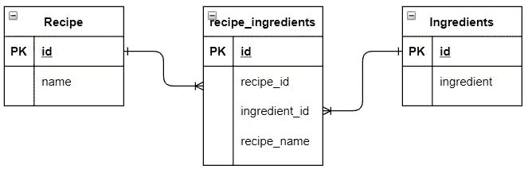
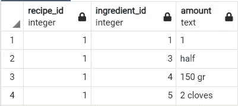

# SQL 从另一个表中插入具有关联 id 的值

> 原文：<https://towardsdatascience.com/sql-insert-values-with-joined-ids-from-another-table-83ff7f149296?source=collection_archive---------0----------------------->

## 在表中有 id 的值。一次性插入 id！

搜索一些身份证(图片由[像素](https://www.pexels.com/photo/sky-filled-with-stars-at-night-2106759/)上的[卢卡斯·佩泽塔](https://www.pexels.com/@lucaspezeta)提供)

当我们的表需要 id，但我们只有字符串时，该怎么办？假设我们是一家餐馆。我们将每一个菜单项及其成分存储到我们的数据库中，以便我们可以跟踪各种统计数据；多久点一道菜，哪些配料最受欢迎，例如

我们想在 recipes 表中存储一个新的食谱，但是有一个问题:这个表需要一个 ingredient_id，而不是我们当前拥有的 ingredient_name。当我们只有名字时，如何将这些 id 插入到食谱表中呢？

本文重点介绍如何通过使用独特的配料表，以最明智的方式存储这些食谱和配料。阅读本文后，您将:

*   了解独特的表
*   了解如何使用直通表
*   能够在唯一表中只插入唯一值
*   能够在从唯一表中检索 id 时插入到表中

首先，我们将设置一些表，然后进入查询。

# 设置

在这一节中，我们将定义数据库结构并创建所有的表。然后我们将在其中插入一些测试数据。在这之后，我们将进入如何插入连接的 id。注意，本文使用 Postgres，但是同样的技术适用于所有关系数据库

## 数据库结构

我们将定义 3 个表:一个保存配料，一个保存食谱，第三个表将这两个表连接在一起:

我们餐厅的数据库结构(图片由作者提供)

## 配料表

首先，我们将创建配料表并插入一些数据。查看 [**这篇文章**](https://mikehuls.medium.com/sql-inserting-only-unique-values-in-a-unique-table-af2eb3b9890a) 中的查询只能插入表中不存在的配料，确保我们永远不会出错。在本例中，我们将使用下面的“普通”插页:

所以我们的桌子看起来像这样:

我们新加入的配料

## 食谱表

该表将存储具有唯一 id 和名称的配方:

我们的食谱表

## 食谱配料表

该表将一个或多个配方与一种或多种配料联系起来。这种类型的表称为“直通表”；它充当具有多对多关系的两个表之间的中介。一个配方可以有多种配料，一种配料可以是多个配方的一部分。

我们将用 recipe_id 和 ingredient_id 将它们连接在一起:

T

现在我们所有的表都创建好了，让我们开始插入吧！

我们的桌子准备好了，让我们开始做饭吧！(图片由[马腾·范·登·霍维尔](https://www.pexels.com/@mvdheuvel)在[派克斯](https://www.pexels.com/photo/person-holding-sliced-vegetable-2284166/)拍摄)

# 插入到我们的食谱配料表中

让我们着手处理手头的问题。我们希望创建一些记录，将 recipe-table 中的记录与配料表中的一些记录连接起来。我们需要配方标识和一些配料标识。问题是我们没有配料 id，只有配料名称。我们如何将数据插入配方配料表？现在我们假设我们知道 recipe _ id 值 1。下面的查询解决了这个问题:

让我们看一看并浏览一下查询。

*   1 号线到 8 号线；这里我们定义了我们想要插入的数据集。我们知道成分的名称和数量。
*   在第 9 行，我们说我们想要将 recipe_id、ingredient_id 和数量插入 recipe_ingredients 表中。这是我们的目标
*   从我们定义为`d`的输入值(第 1 行到第 8 行)中选择数据。我们在配料表上连接这个数据集，匹配配料名称。
*   这就是神奇之处:正如您所看到的，我们为 recipe_id 选择值 1，id 来自连接的配料表，数量来自输入数据集。

## 考虑配方 id

诀窍是将我们的输入数据定义为一个数据集，将它与所需的表连接起来，然后只插入 id。很简单，对吧？让我们用一个更难的例子来尝试一下，在这个例子中，我们不仅要连接配料 id，还要连接配方 id。

我们将前一个查询中的技巧执行了两次:我们将 recipes 表中 recipe 列上的 inputvalues 中的 recipe 连接起来。然后，我们从该表中提取配方 id，并将其插入到 recipe_ingredients 中。查看以下结果:

我们已经插入了与正确配方标识相对应的配料标识。完美！

# 结论

在本文中，我们已经学习了一些非常巧妙的技术:一个唯一的表、一个直通表和插入连接值。我希望能给他们一些启发。如果你有建议/澄清，请评论，以便我可以改进这篇文章。同时，看看我的其他关于各种编程相关主题的文章,比如:

*   [删除到另一个表中](https://mikehuls.medium.com/sql-delete-into-another-table-b5b946a42299)
*   [更新到另一个标签页](https://mikehuls.medium.com/sql-update-into-another-table-bfc3dff79a66) le
*   [在一条语句中插入、删除和更新](https://mikehuls.medium.com/sql-insert-delete-and-update-in-one-statement-sync-your-tables-with-merge-14814215d32c)
*   [更新选择一批记录](https://mikehuls.medium.com/sql-update-select-in-one-query-b067a7e60136)
*   [保存上插](https://mikehuls.medium.com/python-to-sql-upsert-safely-easily-and-fast-17a854d4ec5a)
*   [插入唯一表格](https://mikehuls.medium.com/sql-inserting-only-unique-values-in-a-unique-table-af2eb3b9890a)

编码快乐！

—迈克

页（page 的缩写）学生:比如我正在做的事情？[跟我来](https://github.com/mike-huls)！