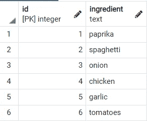
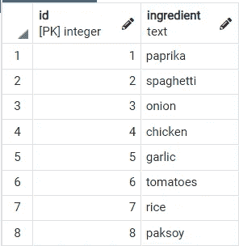

# SQL 仅在唯一表中插入唯一值

> 原文：<https://towardsdatascience.com/sql-inserting-only-unique-values-in-a-unique-table-af2eb3b9890a?source=collection_archive---------15----------------------->

## 如果表格中不存在值，则将其插入表格中


我们只想要我们的表中的唯一值(图片由 [Darius Cotoi](https://unsplash.com/@dariuscotoi) 在 [Unsplash](https://unsplash.com/photos/d8cKjamtQH4) 上提供)

想象我们是一家卖各种菜的餐厅。因为我们很聪明，我们在数据库中记录所有的成分。`ingredients`表将只包含唯一的成分，每个成分都有自己的 id。

本文的目标是创建一个查询，将表中没有的独特成分插入到表中。其他表可以引用 ingredient_id，这样我们就可以过滤和连接整数，这在大型数据集中要快得多。

# 1.创建表

首先，我们将创建包含配料的表。本文使用 Postgres，但同样的技术适用于所有关系数据库。成分表:

创建配料表

如您所见，我们有两列:

*   身份证。因为这个 id 是一个串行主键，所以它会在插入时自动递增。我们不必将这个 id 传递给表，表会为我们创建它
*   成分。成分名称。此列有一个`unique`约束；这意味着它只能包含唯一的值。

# 2 插入配料

下一步是编写一些代码，只将新的配料插入配料表:

让我们把意大利面的所有配料都放进桌子里

让我们浏览一下这段代码:

1.  首先我们定义想要输入的数据，这发生在`WITH` 子句中。可以把它想象成一个名为`inputvalues`的表，列为`ingredient`。我们将 6 种成分放入输入值中。
2.  我们将把输入值放到`public.ingredients`表中`INSERT`
3.  我们将过滤插入`WHERE`输入值中的成分还不存在于`public.ingredients`中。


这些是一些新鲜的原料(图片由 [Syd Wachs](https://unsplash.com/@videmusart) 在 [unsplash](https://unsplash.com/photos/epqNIYI6S7E) 上提供)

执行此查询将输出下表:



我们新加入的配料

让我们用咖喱来试试这个查询:

执行后，Postgres 说`INSERT 0 2`这是个好消息！这意味着我们只向表中插入了两条记录，尽管我们传递了六条记录。我们只插入了表中没有的两种配料:paksoy 和大米。让我们检查一下表格的内容，看看它是否有效:



我们的配料表

# 3.保存插入

使用上面的查询，我们只能插入独特的成分。如果我们试图插入 Postgres 中已经存在的成分，就会返回一个错误。

```
INSERT INTO public.ingredients (ingredient) VALUES (‘paprika’);
```

会产生以下错误:

```
ERROR: duplicate key value violates unique constraint “ingredients_ingredient_key” DETAIL: Key (ingredient)=(paprika) already exists. SQL state: 23505
```

因此，即使我们忘记了使用这个令人惊叹的新查询，表中的惟一约束也可以防止重复值。厉害！

# 结论

通过这篇文章，我希望对如何处理惟一值和使用惟一约束有所启发。如果你有建议/澄清，请评论，以便我可以改进这篇文章。与此同时，请查看我的[其他文章](https://mikehuls.medium.com/)关于各种与编程相关的主题，例如:

*   [删除到另一个表格](https://mikehuls.medium.com/sql-delete-into-another-table-b5b946a42299)
*   [更新到另一个标签页](https://mikehuls.medium.com/sql-update-into-another-table-bfc3dff79a66) le
*   [在一条语句中插入、删除和更新](https://mikehuls.medium.com/sql-insert-delete-and-update-in-one-statement-sync-your-tables-with-merge-14814215d32c)
*   [更新选择一批记录](https://mikehuls.medium.com/sql-update-select-in-one-query-b067a7e60136)
*   [保存上插](https://mikehuls.medium.com/python-to-sql-upsert-safely-easily-and-fast-17a854d4ec5a)

编码快乐！

—迈克

页（page 的缩写）学生:比如我正在做的事情？[跟我来](https://github.com/mike-huls)！