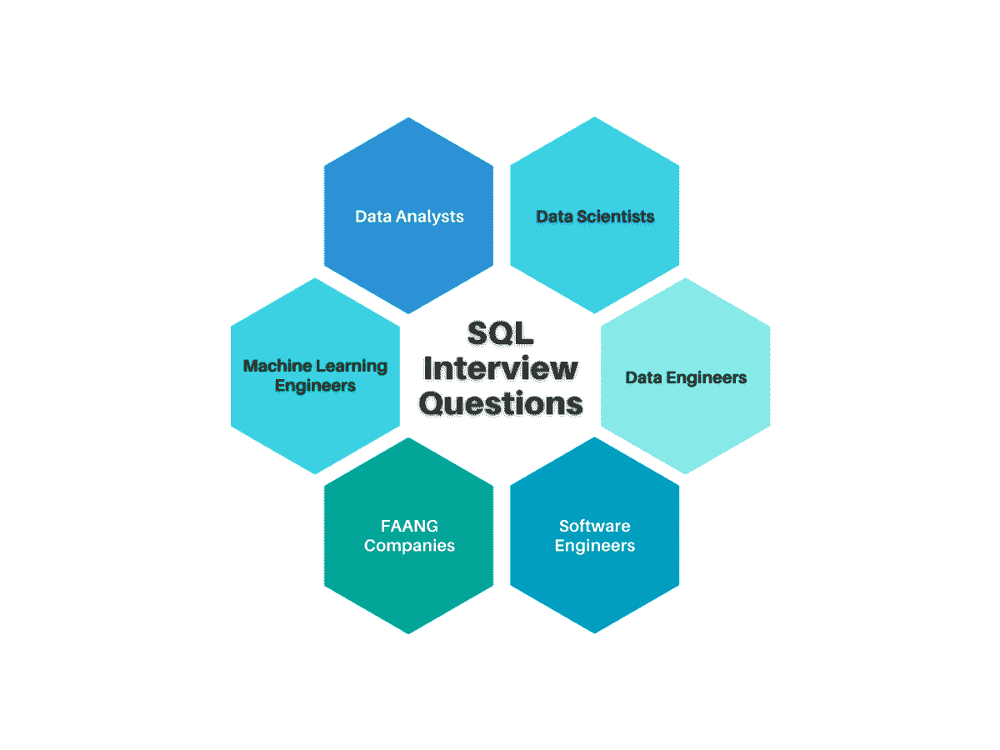
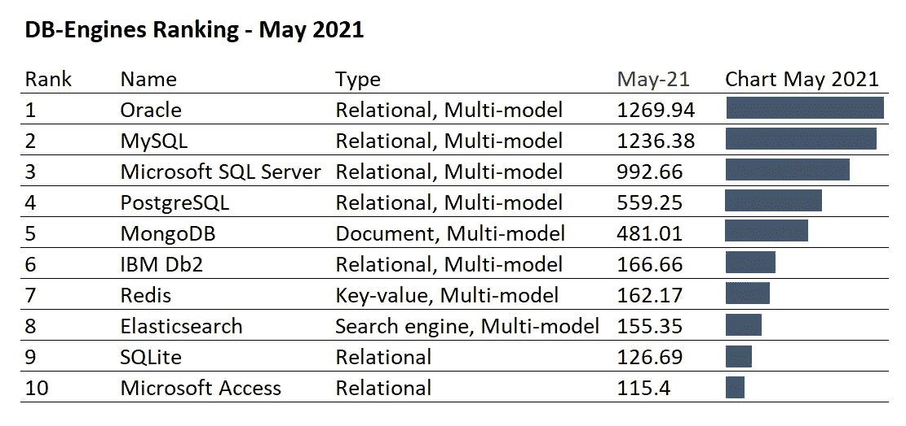
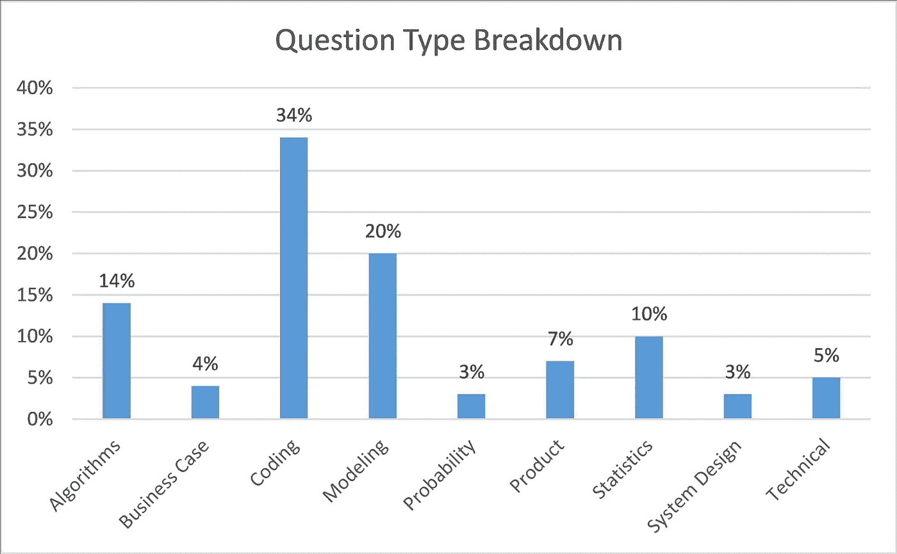
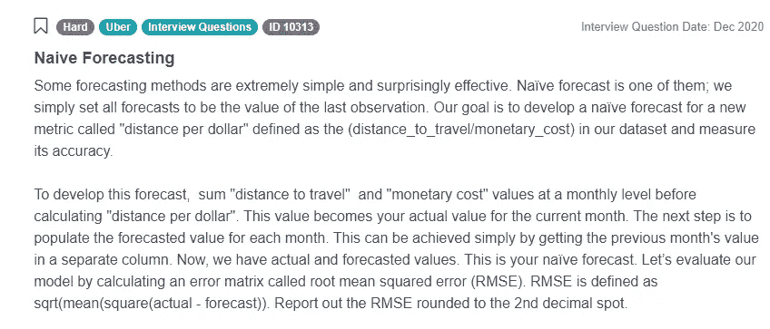

# 你必须准备的 SQL 面试问题:终极指南

> 原文：<https://towardsdatascience.com/sql-interview-questions-you-must-prepare-the-ultimate-guide-12f0546bfb8f?source=collection_archive---------5----------------------->

## 您是否想知道会被问到哪些 SQL 面试问题？这本终极指南将带你了解各种数据职位的 SQL 面试问题，以及迎接下一次 SQL 面试的技巧。



作者创造的形象

SQL 是任何有抱负的数据科学家的必备工具。在本文中，我们提供了一个大纲，帮助您学习、准备和赢得下一次数据科学职位的 SQL 面试。我们将探讨为什么 SQL 被如此广泛地使用，然后为您提供每个角色所需的 SQL 技能的细分，即数据分析师、数据科学家、机器学习工程师等。此外，我们还为您提供了来自 StrataScratch 平台的真实面试示例，展示了其中的一些技能，并为您提供了一个循序渐进的学习指南，让您即使不太熟悉 SQL 概念也能熟练掌握 SQL，并获得理想的工作。

因此，让我们从为什么 SQL 在数据科学领域如此广泛地使用开始。

# SQL 的流行

SQL 流行的最大原因之一是数据存储的表格格式。很容易将数据库想象成具有数百万行和数百万列的大型电子表格。SQL 允许用户快速操作这些表格来访问信息，并以最常见的格式、表格和相关的图形和可视化方式呈现结果。



作者创造的形象

虽然 MongoDB、Cassandra 等非 SQL 数据库随着大数据和实时应用程序的需求以及非结构化数据的日益流行而受到青睐，但 SQL 数据库仍然占据着十大最受欢迎的数据库引擎的前七名。事实上，No-SQL 数据库已经将自己定位为 No just SQL，以突出它们对 SQL 的支持，从而有助于增加它们在已经使用传统的基于 SQL 的数据库的组织中的接受度。

SQL 流行的另一个原因是易于使用。语法非常容易理解，任何人都能很快掌握。很容易理解下面的语句是做什么的。

```
SELECT name FROM EMPLOYEES;SELECT name FROM EMPLOYEES
     WHERE age >= 35;SELECT state, AVG(age) as average_age FROM EMPLOYEES
     WHERE age >= 35
     GROUP BY state;
```

学习 SQL 非常容易，对于招聘经理来说，这是一个方便而强大的工具，可以用来评估潜在员工的推理、编码和数据科学能力。我们对 [903 个数据科学面试问题](https://www.stratascratch.com/blog/data-science-interview-guide-questions-from-80-different-companies/?utm_source=blog&utm_medium=click&utm_campaign=medium)的分析显示，最突出的面试问题类别是编码。它几乎占了所有面试问题的三分之一，因为大多数情况下，在编码部分测试的最突出的概念是编写 SQL 查询。



作者创造的形象

在这些顶级公司，基于 SQL 的面试问题比基于 Python 或 R 的面试问题要多。随着对数据管理技能的日益关注，学习 SQL 是不会错的。那么，在培养数据科学和相关职位的 SQL 技能时，应该专注于什么呢？

# 按角色划分的数据科学中的 SQL 用法

并非数据科学中的每个职位都使用相同的 SQL 概念。虽然一些角色将主要关注查询和查询优化，但其他角色将倾向于数据架构和 ETL 过程。我们可以将数据科学访谈中问到的 SQL 命令分为以下几类。

*   数据定义语言(DDL)
    -创建
    -更改
    -删除
    -重命名
    -截断
    -注释
*   数据查询语言(DQL)
    -选择
*   数据操作语言(DML)
    -插入
    -更新
    -删除
    -合并
    -调用
    -解释计划
    -锁表
*   数据控制语言
    -授权
    -撤销

数据分析师或数据科学家通常会使用 SELECT 语句和相关的高级概念，如子查询、分组/汇总、窗口函数和 cte。如果您是一名分析师，您可能已经在使用 SQL 了。不管你是数据分析师、报告分析师、产品分析师，甚至是财务分析师。你的职位通常需要处理原始数据，并利用你的技能为管理层和其他利益相关者提供决策洞察力。

数据工程师与数据科学家和数据分析师密切合作。他们的主要任务是构建和维护数据架构，并创建算法以使数据科学家和分析师更容易地访问数据。通过做他们的工作，他们也在帮助数据科学家做他们的工作。作为一名数据工程师，你不能回避的是了解 SQL，与数据分析师和科学家相比，SQL 通常处于高级水平。要成为一名优秀的数据工程师，你需要成为一名 SQL 高手。这就是为什么你会被问到一些与数据分析师和科学家相同的问题。除了 DQL 命令之外，您还应该精通数据库建模，因此您还应该详细了解 DDL、DML 和 DCL 命令。

机器学习工程师是混合专家，他们正在弥合数据科学家和软件工程师之间的差距。由于他们是这两个职位之间的桥梁，他们需要拥有来自两个世界的特定技能。他们使用这些技能来设计、构建和维护机器学习系统。为了实现这一点，他们通常使用几种技能:

*   统计数字
*   数学
*   数据挖掘技术
*   数据分析
*   预测分析

机器学习工程师通常需要了解 Python 和/或 r。然而，由于机器学习工程师和数据科学家有一些共同的技能(数据挖掘、数据分析)，因此机器学习工程师通常还需要了解 SQL。这样，他们就能够根据自己的需要进行分析和使用数据。他们不需要某个中间人来提取数据并为他们进行分析。例如，这里有一个来自优步的关于创建一个[简单预测模型](https://platform.stratascratch.com/coding/10313-naive-forecasting?python=&utm_source=blog&utm_medium=click&utm_campaign=medium)的问题。​



截图来自 [StrataScratch](https://www.stratascratch.com/?utm_source=blog&utm_medium=click&utm_campaign=medium)

为一个新的指标开发一个天真的预测:“每美元的距离”。在我们的数据集中，每美元距离被定义为(旅行距离/货币成本)。计算指标并测量其准确性。

***算法概要:***

*每月对“旅行距离”和“货币成本”值求和，并计算“每美元的距离”。这是当月的实际值。
接下来，填充每个月的预测值。要实现这一点，取上个月的值。
现在，我们有了实际值和预测值。这是我们天真的预测。现在通过计算均方根误差(RMSE)来评估我们的模型。RMSE 是实际值和预测值之间的均方差的平方根。报告 RMSE，四舍五入到小数点后第二位。*

软件工程师的 SQL 面试通常也是各种技能的交汇点，如计算机科学、工程和数学。他们使用这些不同的规程来设计、编写、测试和维护软件。像机器学习工程师一样，他们也需要与各个部门和客户合作。这就是为什么他们也需要高水平的业务和技术技能，尽管他们的主要任务不是数据分析。这是为什么呢？当他们构建界面时，他们必须依赖后台运行的数据库。在实施新软件的过程中，他们需要使用这些数据库并分析数据。

您可以参考这篇关于[数据科学](https://www.stratascratch.com/blog/the-most-popular-job-roles-in-the-world-of-data-science/?utm_source=blog&utm_medium=click&utm_campaign=medium)中各种角色和职责的精彩文章，了解更多信息。本文分解了您每天可能会遇到的每个角色的最常见需求。

让我们看看在数据科学访谈中测试最频繁的 SQL 领域。

# SQL 面试问题中测试的技术概念

由于 SQL 角色差别很大，测试领域也有很大不同。根据您申请的职位类型和组织，您可能会遇到一种或多种 SQL 数据科学面试问题类型

*   基本 SQL 概念
*   SQL 基础面试问题
*   SQL 聚合面试问题
*   开放式 SQL 面试问题
*   数据转换面试问题
*   数据库建模面试问题
*   软件工程 SQL 面试问题

让我们分别看一下这些 SQL 面试问题类型，以了解它们之间的相似性和区别。

# 基本 SQL 概念

这些问题的重点在于您对基本数据库和 SQL 术语的理解和知识。不需要编写任何代码。这些是人们应该熟悉的宽泛概念和一些例题。

*   关于 SQL
    的一般信息——什么是 SQL？
    -SQL 有哪些不同的风格？
    ——什么是主键？
*   关系数据库及其工作原理？
    -有哪些顶级的 RDBMS 引擎？
    -RDBMS 与非 SQL 数据库有何不同？
*   SQL 子语言及其主要关键字
    ——DDL、DCL、DML 分别代表什么？
    -给出每个命令的例子。
*   数据类型及 SQL 如何处理(包括空格和空值)
    -SQL 中常见的数据类型有哪些？
    -SQLite 数据库支持日期时间对象吗？
*   属性约束
    -什么是属性约束，并解释它们？
*   连接类型
    -内连接和左外连接有什么区别？
    -UNION 和 UNION ALL 有什么区别？
*   聚合和汇总函数
    -什么时候应该在子查询上使用 CTE？
    -什么是窗口功能？
*   各种 SQL 函数的知识
    -WHERE 和 HAVING 有什么区别？一个应该使用另一个的例子
    -COALESCE 函数做什么？

虽然在最初的访谈中可能找不到这些问题，但这些问题可能会作为您提交的编码解决方案的后续问题。例如，如果您在解决方案中使用了内部联接，您可能会被问到为什么不使用左联接，或者如果使用了会发生什么情况？

# SQL 基础面试问题

SQL 基础面试问题要求你将上述一些理论概念付诸实践。这并不意味着这些问题一定是编码问题。它们也可以是描述性的。但是如果你想写一个代码，它们通常涵盖了你需要知道的概念。这些概念是:

*   使用 SUM()、COUNT()、AVG()、MIN()、MAX()和其他聚合函数
*   分组依据
*   CASE WHEN 语句
*   哪里有
*   连接
*   联合和联合所有

**问题示例**

这里有一个来自[邮政 SQL 数据科学采访](https://platform.stratascratch.com/coding-question?id=2013&python=&utm_source=blog&utm_medium=click&utm_campaign=medium)的例子

*“有多少客户下了订单，平均订单金额是多少？”*

解决方案:要回答这个 SQL 面试问题，您必须使用 postmates_orders 表。

```
SELECT count(DISTINCT customer_id), avg(amount) FROM postmates_orders
```

如你所见，这真的很简单。它测试聚合函数 COUNT()和 AVG()，还需要了解如何使用 DISTINCT 子句。

[这是另一个](https://platform.stratascratch.com/coding-question?id=2002&python=&utm_source=blog&utm_medium=click&utm_campaign=medium)，这次来自《信贷业》:

*“编写一个查询，返回创建了至少一个‘再融资’提交和至少一个‘在校’提交的所有用户的用户 ID。”*

解决方案:要回答这个 SQL 面试问题，您必须使用表 loans。

```
SELECT user_id
FROM loans
WHERE TYPE in ('Refinance', 'InSchool')
GROUP BY user_id
HAVING count(DISTINCT TYPE) =2
```

该代码从表 loans 中选择列 user_id，其中的值等于两个值之一:“Refinance”和“InSchool”。因为我们需要确保每种类型都有提交，所以我们需要使用 DISTINCT 子句。人们还需要理解在哪里和拥有之间的区别。因为我们在聚合函数中使用 DISTINCT 子句，所以我们在这里使用 HAVING 而不是 WHERE。

# SQL 聚合面试问题

聚合函数广泛用于报告指标和评估汇总结果。数据分析师和数据科学家必须做很多事情。聚合的目的是将数据转化为信息。这些信息以报告、仪表板和图表的形式呈现。您报告的是需要监控的不同指标。因此，基本上，您的两个主要任务是聚合和过滤数据，并对这些数据执行各种计算。

虽然严格来说，数据分析师和数据科学家不是报告而是分析数据，但有很多情况下需要定期监控和报告指标。如果您正在面试 SQL 数据分析师或数据科学家职位，您应该熟悉这些概念:

*   子查询
*   连接和自连接
*   窗口功能
*   CTEs
*   按扩展分组(汇总、多维数据集、分组集)

**问题示例**

这是一个来自 Zillow 的中等 SQL 面试问题[，测试你对聚合函数的理解](https://platform.stratascratch.com/coding-question?id=10315&python=&utm_source=blog&utm_medium=click&utm_campaign=medium)

*“编写一个查询，找出与全国平均水平相比房价高于平均水平的城市。输出城市名称。*

解决方案:要回答这个问题，您必须使用表 zillow_transactions。

```
SELECT city
FROM zillow_transactions a
GROUP BY city
HAVING avg(a.mkt_price) >
  (SELECT avg(mkt_price)
   FROM zillow_transactions)
ORDER BY city ASC
```

为了回答这个 SQL 面试问题，我们在 HAVING 子句中编写一个子查询。内部查询计算所有交易的总体平均市场价格。然后，主查询只筛选那些平均市场价格高于整体平均市场价格的城市。因为我们只需要在最终输出中报告城市，所以只报告那些指标。

这是另一个。这个来自 Lyft 的[稍微复杂一点。](https://platform.stratascratch.com/coding-question?id=10324&python=&utm_source=blog&utm_medium=click&utm_campaign=medium)

*“查找旅行距离最远的前 10 名用户。输出他们的名字和旅行的总距离。”*

解决方案:要回答这个问题，您必须使用 lyft_rides_log 和 lyft_users 表。

```
SELECT name, traveled_distance
FROM
    (SELECT lu.name,
           SUM(lr.distance) AS traveled_distance,
           rank () over (order by SUM(lr.distance) desc) as rank
    FROM lyft_users AS lu
    INNER JOIN lyft_rides_log AS lr ON lu.id = lr.user_id
    GROUP BY lu.name
    ORDER BY traveled_distance DESC
    ) sq
WHERE rank <= 10
```

这个 SQL 面试问题测试子查询、窗口函数和连接。我们首先用一个内部连接来连接两个表，因为我们需要那些使用过服务的用户，并删除带有不完整用户信息的乘车信息。然后，我们对这些用户的总行驶距离进行排名。我们最终根据排名选择前 10 名用户，并输出他们的姓名和总的旅行距离。

为了提高 SQL 数据科学面试的编码技能，您可以参考此视频，其中我们讨论了一些顶级数据科学面试问题，以及如何解决这些问题和避免常见错误。

作者通过 [YouTube](https://www.youtube.com/watch?v=j8kGqAAIhxA) 发布的视频

# 开放式 SQL 面试问题

在需要一些工作经验的数据分析师或数据科学家岗位上，你会遇到这类问题。这些问题中最大的挑战是缺少任何需要计算的特定指标，就像 SQL 聚合面试问题一样。您仍然需要编写一个 SQL 查询，返回一些指标作为结果。然而，有一个很大的不同。在开放式 SQL 面试问题中，您将被要求找到洞察力。

理解你的数据，什么样的计算回答了你被问到的问题，这完全取决于你。例如，你必须找出某个产品发布活动是否成功，或者新的呼叫程序是否节省了成本，或者新的车辆是否提高了用户的满意度。你必须拿出衡量标准来定义“成功”、“节约”或“改进”。

与 SQL 聚合问题相比，这些问题具有额外的维度，旨在测试您解决问题的思路。关于开放式 SQL 面试问题的编码部分，它们测试您将在基本级别和 SQL 聚合类型问题中使用的所有概念。

**问题示例**

看看脸书问的一个[问题:](https://platform.stratascratch.com/coding-question?id=10287&python=&utm_source=blog&utm_medium=click&utm_campaign=medium)

*“脸书开发了一种搜索算法，它可以解析用户评论，并将搜索结果呈现给用户。为了评估算法的性能，我们给出了一个表，其中包含用户点击的搜索结果(“notes”列)、用户的搜索查询以及针对特定评论返回的结果搜索位置。
位置越高越好，因为这些评论正是用户正在搜索的。编写一个查询，针对每个用户查询评估搜索算法的性能。*

解决方案:要回答这个问题，我们必须使用表 fb_search_results。

```
SELECT t.result_id,
      t.query,
      CASE
          WHEN t.check = FALSE THEN 1
          WHEN t.check = TRUE
                AND t.position >= 11 THEN 2
          WHEN t.check = TRUE
                AND (t.position BETWEEN 6 AND 10) THEN 3
          WHEN t.check = TRUE
                AND (t.position BETWEEN 4 AND 5) THEN 4
          WHEN t.check = TRUE
                AND t.position <=3 THEN 5
      END AS rating
FROM
  (
SELECT query,
          	result_id,
          	position,
          	 notes,
          	(regexp_replace(notes, '[^\w]+',' ','g') ilike concat
('% ', query,' %')) AS check
   FROM fb_search_results
  ) t
```

为了解决这个问题，我们首先需要定义评估的标准。我们将用户的搜索查询和算法返回的搜索结果之间的匹配评级定义如下(5 为最高，1 为最低)。

1.  如果没有匹配，则给出 1 的评级。
2.  如果匹配发生在查询的前 10 个字符之后，则评级为 2。
3.  如果匹配发生在 6 到 10 个字符之间，则评级为 3。
4.  如果匹配在前五个字符内，而不是在前三个字符内，则给出 4 的评级
5.  如果匹配在前三个字符中，则给出最高可能评分 5。

基于这些评级，我们评估每个搜索字符串。为了匹配搜索查询和结果，我们使用 SQL 中的[正则表达式](https://en.wikipedia.org/wiki/Regular_expression)匹配函数。主查询在 CASE WHEN 语句中使用该检查列。这是一个开放式的 SQL 面试问题，因为您没有获得区分优秀和不优秀绩效的指标。因此，你必须决定你的规模，将显示如何表现。您的比例可能与上面解决方案中的比例不同。然而，重要的是你要解释你的假设，以及为什么你决定采用某种评估标准。

# 数据转换面试问题

对于数据工程师或机器学习工程师职位来说，这些问题可能会经常被问到。尽管它在需要一些经验的职位的数据科学家面试中可能并不合适。数据转换或更一般的 ETL(提取、转换和加载)是用于从各种来源收集数据(提取)、根据业务规则改变数据(转换)、然后将这样提取和转换的数据加载到数据库中的过程。

当提取数据时，是从各种数据源中完成的，这些数据源通常以完全不同的格式存储数据。

通过转换，数据采用适合报告和分析的格式。数据通过数据聚合、过滤、排序、连接、基于业务需求规则集的计算等进行转换。

这种数据被加载到分析师或任何其他用户可能使用的另一个数据库或表中。

ETL 大量用于数据仓库，数据仓库是集成数据的中心来源，数据从一个或多个独立的来源流入数据仓库。如果你想在 SQL 工作面试中表现出色，这些是你需要知道的概念:

*   数据定义语言(DDL)关键字
*   数据操作语言(DML)关键字
*   数据控制语言关键字
*   事务控制语言(TCL)关键字
*   SQL 约束
*   连接
*   指数
*   处理
*   视图
*   用户定义的函数
*   存储过程
*   扳机
*   变量
*   查询优化

**问题举例**

这是来自[西南航空数据科学 SQL 面试](https://platform.stratascratch.com/technical/2084-delete-and-truncate?utm_source=blog&utm_medium=click&utm_campaign=medium)的最简单也是最常见的问题之一:

*“删除和截断有什么区别？”*

回答:

DELETE 是一个 DML 语句。TRUNCATE 是一个 DDL 语句。DELETE 语句可用于删除所有行或仅删除某些行。要删除一些行，您必须使用 WHERE 子句。执行此操作时，数据库会将删除的每一行记录为一个活动。另一方面，TRUNCATE 仅用于删除整个表，这将被记录为仅一个操作。这就是 TRUNCATE 比 DELETE 更快的原因，这在删除包含大量数据的表时表现出来。另外，如果表中有外键，就不能使用 TRUNCATE。

另一个常见的问题是

*“如何通过用 SQL 编写查询来更改列名？”*

回答:假设你用的是 PostgreSQL。对于一个假设的表，比如说 product，其中一列名为 year，但是我想将其重命名为 description。将实现这一点的查询是:

```
ALTER TABLE product
RENAME year TO description;
```

数据转换 SQL 面试问题的另一个例子是:

*“如何创建存储过程？”*

答:我们将为 Microsoft SQL Server 解决这个问题。例如，如果使用名为 employee 的表。您的过程应该有助于您获得在某个部门工作的员工。代码应该是

```
CREATE PROCEDURE employee_deparment @deparment nvarchar(50)
AS
SELECT * FROM employees WHERE department = @department
GO;
```

一旦创建了过程，我可以用以下方式调用它:

```
EXEC employee_deparment @department = 'Accounting';
```

# 数据库建模面试问题

这些问题旨在测试您在数据库设计或数据库建模方面的水平。那是什么意思？您需要展示根据业务流程和业务需求从头开始设计和构建数据库的能力。这需要高水平的技术和业务知识。您将与技术和非技术同事一起工作。因此，您需要了解他们需求的业务方面，以及如何以最合理的方式，在技术上满足他们对数据的业务需求。一般来说，这是一个经过这些步骤的过程(至少在理想世界中是这样的):

1.  定义数据库的用途
2.  收集和定义用户需求
3.  创建概念模型
4.  创建逻辑模型
5.  创建物理模型

**问题举例**

SQL 面试中出现的一个典型问题是[Audible 的这个问题](https://platform.stratascratch.com/technical/2148-build-a-recommendation-system?utm_source=blog&utm_medium=click&utm_campaign=medium):

*“你能告诉我们你将如何建立一个推荐系统吗？”*

回答:由于有各种各样的方法来回答这个问题，我们将让您自己想出一个构建方法。

数据库设计问题也可以包括 SQL 编码，比如[这个来自脸书](https://platform.stratascratch.com/technical/2170-group-or-order-by?utm_source=blog&utm_medium=click&utm_campaign=medium):

*“写一个 SQL 查询，计算涉及两个连接的某个属性的频率表。如果您想按某种属性进行分组或排序，该怎么办？你需要做出什么改变？您如何解释空值？”*

回答:由于问题的性质，我们将让您自己回答这个问题。

# 软件工程 SQL 面试问题

这些问题需要 SQL 知识，但通常情况下，所问的问题在实践中可能并不广泛适用。这些问题会在面试中出现，因为即使作为一名软件工程师，您可能不会每天都编写 SQL 代码，但您仍然需要与每天都使用 SQL 的同事进行交流，了解他们想要实现的目标，并在软件开发中实现他们的需求和 SQL 逻辑。这些问题更考验你的逻辑能力，而不是编码能力。在你面试时可能会被问到的一个问题是

假设您正在使用两张桌子。一个是产品表，它包含以下数据:

*   身份证明（identification）
*   产品名称
*   制造商 id

第二个表是制造商，包含以下数据:

*   身份证明（identification）
*   制造商

第一个表中有 8 条记录，第二个表中有 4 条记录。

以下 SQL 代码将返回多少行:

```
SELECT *
FROM product, manufacturer
```

答:查询将返回 32 行。每当省略 WHERE 子句时，默认结果是交叉连接或笛卡尔积。这意味着查询将返回第一个表中的所有行组合和第二个表中的所有行组合。

# FAANG 公司询问的 SQL 面试问题

FAANG 是五大最著名科技公司的首字母缩写:脸书、亚马逊、苹果、网飞和谷歌。除了对为他们工作的可能性心存敬畏之外，你为什么会特别准备那些公司问的问题？他们可能看起来甚至很有吸引力，但这不是你想在这些公司工作就要特别注意的主要原因。

主要原因是他们的 SQL 面试问题有点不一样。作为科技公司，他们的业务严重依赖数据。哪里有数据，哪里就有 SQL， [FAANG 公司](https://www.stratascratch.com/blog/ultimate-guide-to-the-top-5-data-science-companies/?utm_source=blog&utm_medium=click&utm_campaign=medium)经常使用。因此，他们希望绝对确定他们的员工深入了解 SQL。你总是会得到 SQL 面试问题，有点曲折。不同的是，他们的问题更实际，涉及某家公司在日常业务中面临的真实问题和数据的案例研究。这些可以说是我们前面看到的开放式 SQL 面试问题的下一个层次。

看看谷歌的这个[例子:](https://platform.stratascratch.com/coding-question?id=10165&python=&utm_source=blog&utm_medium=click&utm_campaign=medium)

*“找到每个用户的邮件活动排名。电子邮件活动等级由发送的电子邮件总数定义。发送电子邮件数量最多的用户的排名为 1，依此类推。输出用户，电子邮件总数，以及他们的活动排名。按邮件总数降序排列记录。按字母顺序对具有相同排名分数的用户进行排序。
在您的排名中，即使多个用户的电子邮件数量相同，也要返回唯一的值(即唯一的百分比)。”*

解决方案:要回答这个问题，你需要使用 google_gmail_emails 表。

```
SELECT  from_user, 
        count(*) as total_emails, 
        row_number() OVER ( order by count(*) desc)
    FROM google_gmail_emails 
    GROUP BY from_user
    order by 3, 1
```

如您所见，这个问题测试您的聚合函数和窗口函数知识，以及 GROUP BY 和 ORDER BY 子句。但是如果你找到工作，他们也会解决你可能需要解决的现实生活中的问题。

这是另一个类似问题的例子，这次是来自网飞的:

*“找出获得奥斯卡奖最多的提名者。
在结果旁边输出被提名人的姓名。
根据获胜次数降序排列结果。"*

解决方案:要回答这个问题，您需要使用 Oscar _ incentimites 表。

```
SELECT
    nominee,
    count(winner) AS n_times_won
FROM oscar_nominees
WHERE 
    winner = true
GROUP BY 
    nominee
ORDER BY
    n_times_won DESC
```

同样，这个问题测试一些常见的概念。但是问题集是你每天都要做的事情。如果你在网飞从事 SQL 工作，你肯定会分析一些包含奥斯卡提名和获奖者的数据。

# SQL 数据科学面试需要学习什么？

您可能已经注意到技术性 SQL 面试问题与其他 SQL 问题重叠。这是因为一个没有另一个就无法工作。知道理论却不能付诸实践，也就是 SQL 代码，是没有意义的。相反，您需要描述您编写的代码背后的技术概念。虽然您应该了解的 SQL 概念取决于您的职位、多年的工作经验以及您希望工作的公司，但我们已经了解了一些跨职位有用的概念。虽然这不是一个详尽的列表，但如果你参加 SQL 数据科学面试，这肯定是你应该知道的。

# SQL 和数据库概述

**SQL 定义**

SQL 代表“结构化查询语言”。它是一种编程语言，用于创建数据库结构，检索和操作其中的数据。

**SQL 命令关系数据库的类型**

*   数据定义语言(DDL)
    -创建
    -更改
    -删除
    -重命名
    -截断
    -注释
*   数据查询语言(DQL)
    -选择
*   数据操作语言(DML)
    -插入
    -更新
    -删除
    -合并
    -调用
    -解释计划
    -锁表
*   数据控制语言
    -授权
    -撤销

**关系数据库**

关系数据库是基于关系数据模型的数据库。这意味着数据库是关系的集合。这些关系显示为表格，由列、行和值组成。关系数据库旨在最小化或完全避免数据冗余，从而实现数据完整性并加快检索速度。

**数据库中的关系**

关系定义了数据库中表之间的连接类型。有三种主要类型的关系:

*   一对一的关系(一对一)
*   一对多关系(1:N)或多对一关系(N:1)
*   多对多关系(多对多)

**数据库规范化**

数据库规范化是组织数据库中的数据以实现其目的的过程:数据完整性、无冗余性和检索速度。

**约束条件**

约束是定义什么类型的数据可以和不可以作为值输入到数据库中的规则。最常见的属性是:

*   不为空
*   支票
*   独一无二的
*   主关键字
*   外键

**指标**

索引是数据库中为优化数据库性能而创建的结构。它们用于加速数据检索。索引的类型有:

*   聚集索引
*   非聚集索引
*   唯一索引
*   过滤指数
*   列存储索引
*   散列索引

**视图**

视图是一个虚拟表，包含 SQL 语句产生的一个或多个表中的数据。

**存储过程**

存储过程是由一个或多个 SQL 语句组成的 SQL 代码，这些 SQL 语句被保存起来，并可以在需要时被调用和执行。

**触发**

触发器是一种特殊类型的存储过程。每当数据库中发生一些特殊事件时，就会自动执行(触发)它。

# 连接表和查询

**内部连接**

内部联接只返回一个表中的数据与第二个表中的数据相匹配的那些行。

**左外连接**

左连接是一个表连接，它将从左表中检索所有的行，并且只从右表中检索匹配的行。

**右外连接**

这个连接返回右表中的所有行，只返回左表中匹配的行。

**全外连接**

完全外部联接将联接数据，这样结果将包括一个表中的所有行和第二个表中的所有行。

**交叉连接**

这就产生了笛卡尔积。这意味着它将返回一个表中所有行的组合以及另一个表中所有行的组合。

**工会**

这是一个将一个查询的结果与另一个查询的结果相结合的 SQL 命令。因此，它将只显示唯一的记录。

**联盟所有**

这一个也结合了来自两个或更多查询的结果。UNION 和 UNION ALL 的区别在于它还包括重复项。

# 聚合和分组数据

**聚合函数**

聚合函数对数据集执行计算，并返回单个值作为结果。聚合函数的示例有:

*   计数()
*   总和()
*   最小值()
*   最大()
*   AVG()
*   STDEV()
*   风险值()

**GROUP BY 子句**

GROUP BY 子句允许您根据定义的(一个或多个)标准对数据进行分组。

# 过滤和排序数据

**独特条款**

DISTINCT 子句是一个只返回不同或唯一值的子句，即结果中没有重复值。

**WHERE 子句**

WHERE 子句用于根据指定的条件筛选数据。

**HAVING 子句**

HAVING 子句还根据指定的标准过滤数据。与 WHERE 子句的区别在于 HAVING 子句使用聚合函数。因此，如果使用它，它总是位于 GROUP BY 子句之后，ORDER BY 子句之前。

**按条款排序**

ORDER BY 子句用于根据某个数据列对查询结果进行排序。

**案例陈述**

CASE 语句返回基于特定标准的定义值。正是 SQL 语句允许您应用 IF-THEN 逻辑。你不用 IF，而是用 WHEN。对于那时，你用那时。

# 子查询、公共表表达式(cte)和窗口函数

**子查询**

子查询是在查询中找到的查询。它可以出现在 SELECT 子句、FROM 子句或 WHERE 子句中。

**CTE**

CTE 或公用表表达式是由一个查询返回并由另一个查询使用的临时结果集。在这方面，它类似于子查询。但是主要的区别是 CTE 可以被命名并且可以引用它自己。

**窗口功能**

窗口函数是在定义的行集合(一个窗口)上执行计算的 SQL 函数。与返回单个值的聚合函数相比，窗口函数允许您将聚合值添加到单独列中的每一行。这意味着不对行进行分组，所有行都作为查询结果保存。窗口功能包括:

*   row_number()
*   排名()
*   密集等级()
*   百分比排名()
*   累计距离()
*   铅()
*   滞后()
*   ntile()
*   第一个值()
*   最后一个值()
*   第 n 个值()
*   平均值()
*   计数()
*   最小值()
*   最大()
*   总和()

# 如何组织你的 SQL 数据科学面试方案？

擅长 SQL 是在求职面试中表现出色的先决条件。然而，它不是唯一的技能。问题可能很棘手，因为看起来太复杂或太简单而让你分心或怀疑你的知识。这就是为什么在特定情况下有一个清晰的策略是很重要的。

# 1.确保你明白需要什么

如果你不明白这个问题是什么，以及对你的期望是什么，你很可能会得到错误的答案。为了避免这种情况，请确保您了解要求您做什么。大声重复这些要求，让面试官确认你是否正确理解了这个问题。不要害怕做那件事。面试官也是人。他们也可能无意中不清楚，犯了一个错误，或忘记给你足够的细节，让你正确回答。

# 2.花费你的方法

在你开始回答问题之前，特别是如果你正在写 SQL 代码，先考虑一下你的方法。这样，您将能够更快地找到解决方案，或者找到您打算编写的代码中的漏洞。你应该这样做，让面试官引导你，以防你错过了问题的要点。在提出最终解决方案之前，最好先进行修正。

# 3.尝试将输出可视化

这可以帮助你编写解决问题的代码。有时，当您阐明输出应该是什么样子，并将其与初始数据进行比较时，方法和解决方案就会显现出来。

# 4.编写 SQL 代码

在某些时候，你需要开始写代码。正如我们讨论过的，你不应该一头扎进去。但是你不能一直拖延最佳的写作方法。在你完成了前面所有的步骤之后，你仍然不确定你是否有正确的解决方案，那么就开始写代码吧。

原因之一是，有时候根本无解。意思是这个问题太复杂了，在给你的时间内无法解决。在这种情况下，面试官对你的解决方案不感兴趣。相反，他或她对你的思维方式和你处理问题的方式感兴趣。通常有多种使用 SQL 解决问题的方法，这也是一些面试官感兴趣的:过程，而不是目标。

# 5.逻辑部分中的代码

当你写代码的时候，注意它的结构。将代码分成逻辑部分。这样，你会让你的代码更容易阅读，这也是获得这份工作的要求之一。写一个乱七八糟的正确代码是没有意义的，而且在你写完之后没人能读懂它。你也不行！！如果你的代码被分成逻辑部分，你就更容易向面试官解释你做了什么。

# 6.优化代码

记住代码优化也很重要。当然，如果你的代码很复杂，你就不能在写作的时候优化它。但是你要注意一些通用的优化准则，这样你的代码才是合理优化的。你也可以和面试官讨论你还需要采取什么步骤来优化你的代码。这也是工作要求，类似于上一点。没有必要编写能让你得到想要的结果的代码，但是要花很长时间去执行。

# 7.解释你的答案和假设

即使你没有得到要求的答案，也不意味着你没有通过面试。这就是为什么你应该总是知道你为什么做某事，并解释你为什么这样做。也许你没有得到他们所提问题的答案，但是你得到了一些问题的答案。所以确保你陈述了你的假设，并解释了你为什么这么做。同样，他们可能正是在寻找这一点:符合假设的正确推理，即使假设是错误的。这也表明你知道自己在做什么，即使这不是他们要求的。

此外，解释假设的原因之一是问题中可能存在漏洞。所以想象一下，当你认为自己都错了的时候，在面试中指向它，简单地解释你为什么要做某事。

在这段视频中，StrataScratch 的 Nate 分享了一些关于如何组织 SQL 面试解决方案的技巧:

作者通过 [YouTube](https://www.youtube.com/watch?v=5-1ClCuQCIw) 的视频

# 额外的 SQL 面试技巧

这里有一些额外的提示，可能会帮助你在即将到来的 SQL 面试中取得成功。

## 了解你潜在的雇主

这在总体上很重要，不仅仅是面试的 SQL 部分。了解你未来的雇主、他们的产品和行业是很重要的。当考虑到 SQL 问题时，这一点尤其重要。这是为什么呢？

正如我们之前讨论的，FAANG 公司通常会问你一些非常实用的 SQL 编码问题，这些问题会让你使用相同的数据，解决相同的问题，就像你被雇佣时必须做的那样。FAANG 公司并不是唯一这样做的公司。所以当你准备面试时，试着想想哪些数据对这家公司来说是重要的，他们的数据库会是什么样的，等等。当你练习 SQL 问题时，试着从你感兴趣的公司或者至少从他们的竞争对手那里找到真正的问题。如果这些公司在同一个行业，他们使用的数据很可能会或多或少相同。

## 为白板做准备

被要求在白板上写 SQL 代码是很常见的。对某些人来说可能是震撼，这是可以理解的。您可能习惯于在真实的 RDBMS 中，在真实的数据上编写代码，这允许您定期检查查询是否有效。即使是最伟大的 SQL 大师，也无法在不运行代码以查看它是否工作或是否返回预期结果的情况下编写代码。但是，在 SQL 面试中，标准要高一点。

虽然这可能很可怕，但也是可以理解的。在白板上写代码表明你知道如何写代码。阅读你的(或别人的)代码也很重要。这也是在白板上测试的技能。如果您可以阅读代码并判断它是否会给出您想要的结果，而不依赖于数据库来告诉您，那么使用真正的数据库和 SQL 环境将会更容易。

## 编写干净的代码

我们不是在谈论你的笔迹。如果你的字迹潦草，你就无能为力了。但这并不意味着你的代码不可读。当你写代码的时候，试着把它格式化，以便你和面试官更容易阅读和检查你的解决方案。

> 代码被阅读的次数比它被编写的次数多。代码应该总是以提高可读性的方式编写。
> - Guido Van Rossum，Python 的创造者

经常使用空格和换行符使你的代码更容易阅读。如果需要(重新)命名表和列，请与您选择的命名约定保持一致。需要时添加注释。尽可能使用别名，但是当你使用别名时，要让它们听起来有逻辑，而不是一些随机的决定。

下面是 Nate 提供的一些关于如何组织冗长的 SQL 代码的有用提示。

作者通过 [YouTube](https://www.youtube.com/watch?v=vLjAG9eXkcU) 发布的视频

## 只有在你适应的情况下，才使用公司的 SQL 方言

如果你有使用多种 SQL 数据库(Oracle、PostgreSQL、Microsoft SQL Server、MySQL)的经验，试着适应并使用你未来雇主使用的数据库方言。那会很好，可以显示你的多才多艺，尤其是如果你知道他们喜欢什么方言。然而，如果你只熟悉一种方言，不要认为这是面试的结束。例如，如果您只使用 PostgreSQL，而公司使用 Microsoft SQL Server，那么在这两个数据库中，同一命令可能会有不同的关键字。也有可能 PostgreSQL 有一些 Microsoft SQL Server 不允许的功能，反之亦然。

问面试官是否有可能用 PostgreSQL 而不是 Microsoft SQL Server 编写代码，因为你对它更熟悉。如果你懂几种方言，那总是更好。但是如果你用一种熟悉的方言来写，即使是“错误的方言”，也比仅仅因为你太害怕去问你是否可以用你熟悉的方言来写而弄乱代码要好。方言之间的差异并不是很大。因此，如果您了解 SQL，您将轻松快速地适应新的数据库。

## 交流。自信。协作。

当面试评估你的时候，除了编码能力，雇主还会在雇员身上寻找其他东西。你将作为一个团队的一部分工作，因此你自信地表达你的想法的能力，对关于你的代码的积极反馈持开放态度的能力和作为一个团队工作的能力同样重要。雇主们试图衡量这些，即使是在编码这样的技术性工作中。

万一你遇到困难，寻求帮助是至关重要的。寻求帮助是自信的表现，而不是软弱的表现。让面试官了解你的思维过程，这样万一你陷入困境或者无意中遗漏了一些信息，她可能会帮助你。倾听所提供的任何解释，以确保您已经考虑了所有可能出现的边缘情况。

这些是每个数据科学家都必须具备的技能，不幸的是，没有多少候选人关注这些技能。面试官更有可能聘用一位对 SQL 有良好基础理解的数据科学家，他愿意适应变化，并在一个庞大但僵化的过程中获得额外的技能。雇主正在寻找长期关系的潜力。如果你给出正确的信号，你可能会得到你梦想中的工作。

查看这些关于如何准备数据科学面试的 [5 条建议](https://www.stratascratch.com/blog/5-tips-to-prepare-for-a-data-science-interview/?utm_source=blog&utm_medium=click&utm_campaign=medium)。

我们还收集了 2021 年真实公司提出的一些高级 SQL 问题，你可以在我们的[高级 SQL 面试问题你必须知道如何回答](https://www.stratascratch.com/blog/advanced-sql-interview-questions-you-must-know-how-to-answer/?utm_source=blog&utm_medium=click&utm_campaign=medium)文章中找到。

# 结论

在本文中，我们考察了 SQL 数据科学面试的各个方面。我们首先了解了为什么 SQL 在数据科学领域如此受欢迎，以及该行业中的不同角色。然后，我们详细概述了每个职位可能会遇到的问题类型，以及为了在数据科学面试中熟练使用 SQL，需要学习的内容。

即使你刚刚开始使用 SQL，要做好面试准备所需要的只是坚持、耐心和大量的练习。如果您没有太多使用 SQL 的实际经验，练习编写 SQL 代码是非常重要的。多做，有规律地做。连续性非常重要。试着回答尽可能多的 SQL 面试问题，无论是假设性的，还是更好的，来自你想去工作的公司的真实问题。只有通过编写大量代码，你才会获得经验，掌握一些需要用 SQL 解决的典型问题，语法也会变得像第二天性一样。

即使你在 SQL 方面有丰富的经验，并在商业环境中使用它，为面试做准备和提高你的技能总是好的。没有人了解 SQL 的一切。一般来说，人们知道他们需要什么，他们每天经常使用什么。所以有可能在工作几年后，你成为了 SQL 某一方面的大师。不要让它使你认为你知道一切。可能你的新工作会要求你了解一些不同的 SQL 函数和可能性，而这些你并不完全精通。

*最初发表于*[*【https://www.stratascratch.com】*](https://www.stratascratch.com/blog/sql-interview-questions-you-must-prepare-the-ultimate-guide/?utm_source=blog&utm_medium=click&utm_campaign=medium)*。*