# 以太坊上的 SQL:如何处理来自事务的所有数据

> 原文：<https://towardsdatascience.com/sql-on-ethereum-how-to-work-with-all-the-data-from-a-transaction-103f94f902e5?source=collection_archive---------3----------------------->


作者图片

## 关于如何在以太坊上查询交易、内部交易、事件日志和主题等最常见问题的所有答案。

*本文所有图片均由作者创作。*

*如果你在寻找更多的 web3 数据内容，请查看我的* [*30 天免费课程(带视频)*](https://ournetwork.mirror.xyz/gP16wLY-9BA1E_ZuOSv1EUAgYGfK9mELNza8cfgMWPQ) *！请务必* [*订阅我的简讯*](https://web3datadegens.substack.com/) *了解更多课程和教育技巧。*

## > >[我在这里写了一个初学者指南](https://web3datadegens.substack.com/p/a-basic-wizard-guide-to-dune-sql) < <

# 你钱包里有什么？

如果你曾经在以太坊(或任何支持区块链的智能合约)上进行过交易，那么你可能已经在 [block explorer](https://www.notion.so/8e12aac74db238ebf11252740c3f65a8) 上查找过，并且看到了这一堆信息:

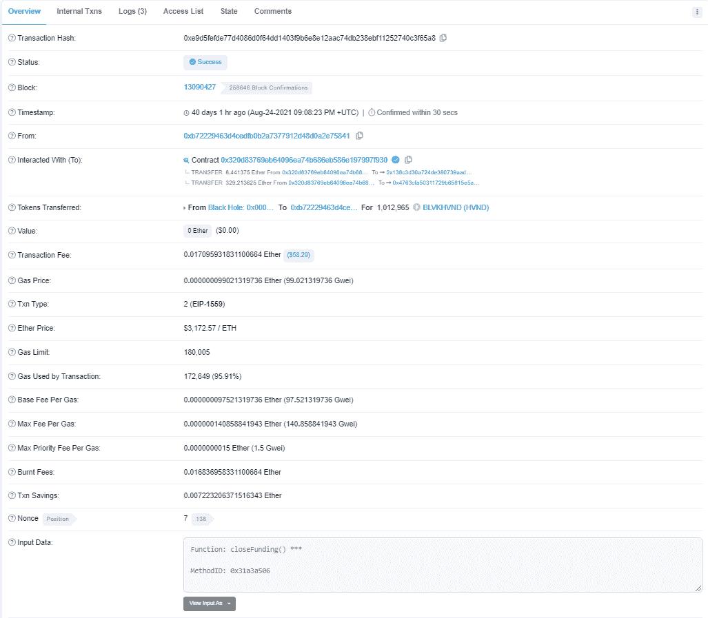

这只是第一个选项卡上的信息

学习阅读交易的细节将是你所有以太坊数据分析和知识的基础，所以让我们涵盖所有的部分以及如何在 SQL 中使用它们。我将使用 [Dune Analytics](https://dune.xyz/browse/dashboards) 来运行我的查询，但还有许多其他工具可以用来查询链，如 [Big Query](https://cloud.google.com/blog/products/data-analytics/ethereum-bigquery-public-dataset-smart-contract-analytics) 和 [Flipside Crypto](https://app.flipsidecrypto.com/) 。

*如果你对 SQL 和以太坊完全陌生，我建议你先从* [*我的完全初学者概述*](/your-guide-to-basic-sql-while-learning-ethereum-at-the-same-time-9eac17a05929) *开始。*

# 指南概述

我们将从四个层面讨论交易:

1.  交易基础
2.  函数调用和状态
3.  内部交易(跟踪)
4.  日志(发出的事件)

作为我们交易示例的基础，我们将使用[镜像众筹](https://etherscan.io/address/0x320d83769Eb64096Ea74B686Eb586E197997f930)契约。简而言之，这是一个智能合同，允许您通过向合同捐赠 ETH 来换取 ERC20(可替换)或 ERC721 (NFTs)令牌。合同的创建者可以通过关闭众筹基金来收回这些资金。这绝不是一个简单的契约，但我在这里想指出的一点是，你不需要理解所有的 solidity 代码来开始你的分析——你只需要知道如何导航上面的四层。

**我们将学习的三个事务是:**

1.  [众筹合同的创建/部署](https://www.notion.so/a80c56a2e510d95f41984e6b7af1b8db)
2.  [ETH](https://www.notion.so/51c8f3ef63ea0e4b65a1abfdbbb9d1ef)对合同的贡献
3.  [关闭并从合同中提取资金](https://www.notion.so/8e12aac74db238ebf11252740c3f65a8)

*这边注意，我们还刚刚开放了众筹供任何人使用，所以如果你很好奇或者想创建一个众筹头像的话，可以到*[*mirror.xyz/dashboard*](https://mirror.xyz/dashboard)*开始使用。趁现在，跳进* [*我们的不和谐*](https://discord.gg/xsxhV9rkWA) *！*

# 众筹合同的创建/部署

**第一笔交易:**[0x 5 e 5 ef 5 DD 9d 147028 F9 BC 21127 E3 de 774 a 80 c 56 a2 e 510d 95 f 41984 e 6 b 7 af 1 b 8 db](https://etherscan.io/tx/0x5e5ef5dd9d147028f9bc21127e3de774a80c56a2e510d95f41984e6b7af1b8db)

让我们从交易基础开始。

1.  每笔交易都有一个[唯一的几个不同变量的](https://ethereum.stackexchange.com/questions/29936/what-happens-on-hash-collisions-for-e-g-transactions-blocks-and-contracts)keccak 256`transaction hash`
2.  基于挖掘事务的时间，有一个关联的`blocknumber`,通常每 15 秒创建一个新块。
3.  `From`是签署交易的一方，`To`是被交互的合同地址
4.  `Value`是从签名者的钱包中转移的 ETH 值*。即使该值为 0，也不意味着在交易期间没有以太网被传输。*
5.  Gas 有点复杂(尤其是 EIP-1559)，但只要记住这个公式:`Gas Price * Gas Used by Transaction = Transaction Fee`

现在是肉和骨头，交易的`input data`:

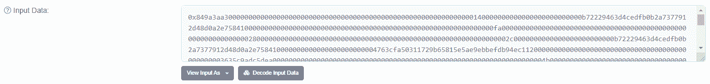

这只是任何函数调用和传入参数的字节码。前 8 个字符(4 个字节)是函数签名`0x849a3aa3`，本质上是函数名和参数类型的散列[。不，这些并不总是唯一的，可能会导致黑客攻击/安全问题。在这种情况下，该函数调用工厂契约来创建众筹契约(这是一个代理，但我们不会深入讨论)。](https://docs.ethers.io/v5/api/utils/abi/interface/#Interface--selectors)

```
**createCrowdfund**((uint256,uint256,bytes32)[], (address,uint256), string, string, address, address, uint256, uint256, uint256)
```

如果你点击“解码输入数据”，就会显示出来，你也可以看到各种变量值的设置。每个后续的 64 个字符(32 字节)是一个不同的输入变量。众筹基金有三层版本。在这次 [BLVKHVND](https://blvkhvnd.mirror.xyz/) 的众筹中，他们使用了 1000、250 和 50 的数量，价格分别为 0.1、0.3 和 1 ETH。

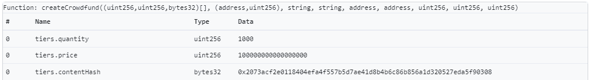

注意，价格实际上显示为`100000000000000000`，这是因为前 18 个零代表小数。我们必须通过除以数据中的`10^18`来进行转换。

这是很多，让我们开始查询。Dune 有一个名为`ethereum.transactions`的表，其中包含了我们在上面讨论过的从第一个块开始的每个事务的所有变量。我们可以在这个表中查询`0x849a3aa3`在过去几个月中的出现情况:

```
SELECT * FROM ethereum.transactions 
WHERE "block_time" > **now**() - interval '3 months'
AND "data" is not null
AND SUBSTRING ( encode("data", 'hex'), 1, 8 ) = '849a3aa3'
```

`ethereum.transactions`是一个非常大的表，所以如果您在没有过滤器的情况下查询，查询将会超时(超过 30 分钟)。按`block_time`过滤通常是最有用的，在这种情况下，我们取 3 个月内发生的所有行。此外，许多交易只是 ETH 传输，没有任何附加的`data`，因此我们将通过仅保留`data is not null`来过滤掉它。现在为了检查函数签名，我们需要将数据从十六进制转换成字符串，然后使用`SUBSTRING`只取从位置 1 到位置 8 的字符。

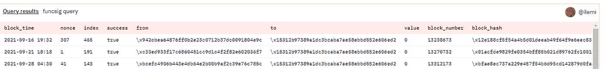

[https://dune.xyz/queries/192453](https://dune.xyz/queries/192453)

**现在把复杂的部分，**内部交易和事件发射出来。为此，查看代码会更容易。如果你转到 etherscan 上的`contract`选项卡，在 10 个文件中的第 1 个文件上按 ctrl+f，你会发现下面的代码(我编辑掉了一些位，使其更具可读性)。

```
function createCrowdfund(
        ...variables...
    ) external returns (address crowdfundProxy) {
        ...some variable prep code... crowdfundProxy = address(
            new CrowdfundWithPodiumEditionsProxy{
                salt: keccak256(abi.encode(symbol_, operator_))
            }(treasuryConfig, operator_)
        ); emit CrowdfundDeployed(crowdfundProxy, name_, symbol_, operator_); ...register to treasury code...
    }
```

**这里的第一个关键行是** `crowdfundProxy = address(contract_to_be_created)`，它部署新合同并创建一个`CREATE 0`类型的内部交易。转移 ETH 还会创建一个类型为`CALL`的内部事务，我们将在下一个学习的事务中看到。

我们可以查询通过以下方式创建的所有众筹合同:

```
SELECT tx."block_time", tx."from", tr."type", tr."code"
FROM ethereum.transactions tx 
LEFT JOIN ethereum.traces tr ON tx."hash"=tr."tx_hash" *--tracks internal transactions*
WHERE tx."to" = '\x15312b97389a1dc3bcaba7ae58ebbd552e606ed2' *-- crowdfund podiums edition*
AND tr."type" = 'create'
```

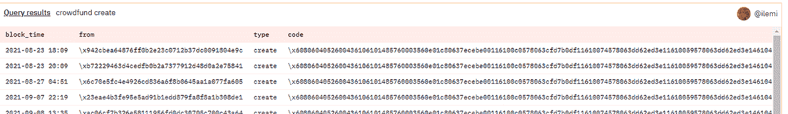

【https://dune.xyz/queries/192466】

我们需要`ethereum.transactions`,因为我们想要过滤仅与工厂合同上的事务相关的跟踪(内部事务)。我们需要这样做，因为一个内部交易的`to`并不总是与整个交易的`to`相同。我们可以根据事务散列连接这些表，然后只过滤掉`create`类型的内部事务。

**这里的第二个关键行是** `emit CrowdfundDeployed`，它创建了一个[存储在节点中而不是](https://ethereum.stackexchange.com/questions/1302/where-do-contract-event-logs-get-stored-in-the-ethereum-architecture)块中的日志。如果您查看日志，您会注意到也发出了`EditionCreated`事件，但是这是来自另一个契约的[，即](https://etherscan.io/address/0xc4e0f3ec24972c75df7c716922096f4270b7bb4e)实际上创建了 ERC721 令牌(因此地址不同)。

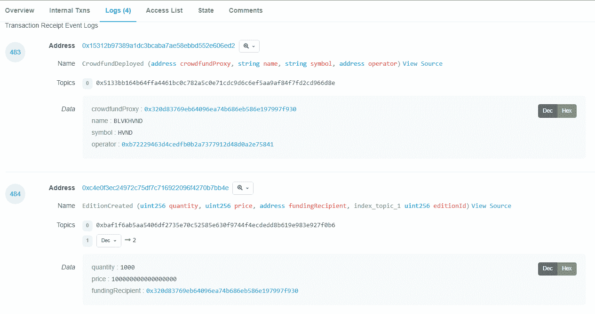

类似于函数签名，事件在`Topic 0`中也有唯一的散列。所以在上面的事件中，`0x5133bb164b64ffa4461bc0c782a5c0e71cdc9d6c6ef5aa9af84f7fd2cd966d8e`是`CrowdfundDeployed`的散列，`0xbaf1f6ab5aa5406df2735e70c52585e630f9744f4ecdedd8b619e983e927f0b6`是`EditionCreated`的散列。

我们可以查询 dune 中的`ethereum.logs`表，查看所有创建的众筹资金:

```
SELECT * FROM ethereum.logs
WHERE "topic1"='\x5133bb164b64ffa4461bc0c782a5c0e71cdc9d6c6ef5aa9af84f7fd2cd966d8e'::bytea
```

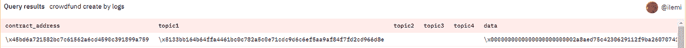

[https://dune.xyz/queries/192553](https://dune.xyz/queries/192553)

`topic2`和`topic3`通常保存 ETH 传输的数据，否则事件数据将显示在`data`栏中。稍后我们将深入探讨如何使用它。

日志非常有用，因为它们可以用来发出状态变量，而不仅仅是函数调用值(Graph [使用日志为 GraphQL 查询的子图](https://thegraph.com/docs/developer/create-subgraph-hosted)建模)。接下来，我们将利用我们所学的一切来研究 ETH 对我们新创建的众筹合同的贡献(位于地址`0x320d83769eb64096ea74b686eb586e197997f930`)。

如果你已经做到了这一步，那么你已经理解了所有艰难的概念。给自己一个鼓励！我们将在接下来的两个部分中详细讨论，所以如果需要的话，可以休息一下。

# ETH 对合同的贡献

**第二笔交易:**[0x D4 ce 80 a5 ee 62190 C5 F5 D5 a5a 7 e 95 ba 7751 c8 F3 ef 63 ea 0 E4 b 65 a1 abfdbbb 9 D1 ef](https://etherscan.io/tx/0xd4ce80a5ee62190c5f5d5a5a7e95ba7751c8f3ef63ea0e4b65a1abfdbbb9d1ef)

这本书读起来相当简单。杰西从 BLVKHVND 众筹基金支付 1 ETH 来铸造一版 tokenId 167。他还得到了 1000 HVND，这是众筹基金根据捐款规模发放的 20 元人民币。

但是，如果我们想知道一段时间以来 ETH 贡献了多少，或者卖出了多少个版本呢？有时合同在 etherscan 的`Read Contract`中会有一个查看功能，你可以在那里得到总余额。但在这种情况下，合同没有这一点。

请记住，函数调用会改变状态数据，我们需要通过聚合事务历史来拼凑整体状态数据。有时，契约的整体状态可以在事件中发出，比如复合 V2 的`AccrueInterest`事件。

在我们的例子中，我们需要在一个查询中做两件事来获得 ETH 贡献的总数:

1.  获取调用了“contribute”方法的事务
2.  通过对类型为`CALL`的内部交易进行过滤，对转移的总 ETH 进行求和

*记住，我可以通过解码 etherscan 上的* `input data`得到方法函数签名。

```
SELECT SUM(tr."value"/1e18) as contribution FROM ethereum.transactions tx 
LEFT JOIN ethereum.traces tr ON tx."hash" = tr."tx_hash"
--transactions filtering 
WHERE tx."to" = '\x320d83769eb64096ea74b686eb586e197997f930'::bytea
AND tx."data" is not null
AND SUBSTRING ( encode(tx."data", 'hex'), 1, 8 ) IN ('a08f793c', 'ce4661bb')
--traces filtering 
AND tr."success"
AND tr."value" > 0
AND tr."call_type" = 'call'
```

技术上有另一个方法叫做`contributeForPodium`，这就是为什么我们检查上面的两个函数签名。`CALL`类型实际上在操作码级别也有子类型，所以我们需要`call`的特定基`call_type`(如果你熟悉 delegatecall，那么你会知道这会给我们一个双重计数)。我们对事务散列进行连接，然后除以 10^18，得到 ETH 值的正确小数。

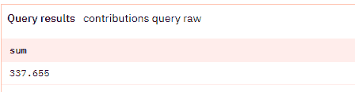

[https://dune.xyz/queries/192577](https://dune.xyz/queries/192577)

让我们继续最后一笔交易，数据开始变得非常棘手。

# 结束合同并从合同中提取资金

**第三笔交易:**[0x e 9 D5 Fe FDE 77d 4086d 0 f 64 DD 1403 f 9 b 6 E8 e 12 AAC 74 db 238 ebf 11252740 C3 f65 a 8](https://etherscan.io/tx/0xe9d5fefde77d4086d0f64dd1403f9b6e8e12aac74db238ebf11252740c3f65a8)

在这里，我们可以看到 337 个 ETH 被转移，1，012，965 个 HVND 令牌(后者在第一次交易中由`operatorPercent_`决定)。在调用这个函数之后，契约就像任何普通的 ERC20 一样运行。

在众筹已经结束的情况下，我们可以从该交易的数据中获得筹集的总额——例如在`CALL`类型的内部交易中转移的价值。不过，最好将这与一个事件联系起来，以防有一些我们不知道的转移行为。*但是等等，为什么日志不可读？*

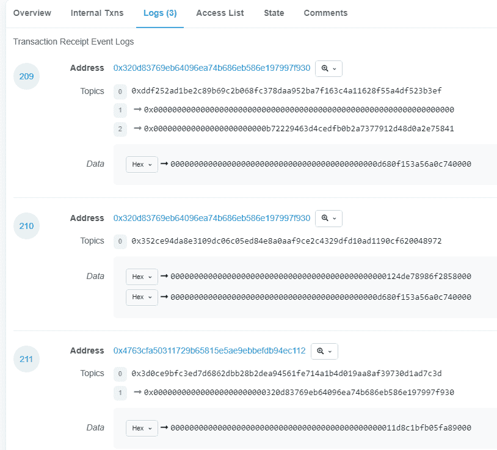

好吧，这就是我们开始进入一些非常混乱的模式的地方。早些时候我提到过，这个众筹基金是作为一个代理来部署的——这意味着它就像一个插入计算机的空 USB，实际上包含了逻辑。创建 USB 比创建计算机要便宜得多——这一逻辑也适用于链上(除了成本是汽油)。如果你想了解代理模式，我可以看看 OpenZeppelin 团队的这篇文章。

在这种情况下，计算机被称为*逻辑*，并且只部署一次。代理被多次部署，并且它不具有契约代码中的逻辑功能或事件。因此，etherscan 不能显示日志中的解码数据。那我们怎么把这些拼凑起来？我们可以获取事件的 [keccak256 散列，就像我们对函数签名所做的那样。但是在这里阅读代码将帮助您节省一些时间。如果你去工厂合同](https://codeburst.io/deep-dive-into-ethereum-logs-a8d2047c7371)上的`Read Contract` [，你会看到逻辑合同的地址:](https://etherscan.io/address/0x15312b97389a1dc3bcaba7ae58ebbd552e606ed2)

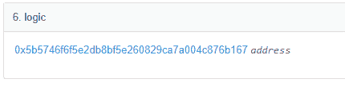

从那里，我们可以在代码中寻找`closeFunding()`函数:

```
function closeFunding() external onlyOperator nonReentrant {
        ...code... _mint(operator, operatorTokens);
        *// Announce that funding has been closed.*
        emit FundingClosed(address(this).balance, operatorTokens); ...ETH value transfers...
    }
```

ETH 值传输不会发出事件，因为它们只是内部事务。如果你熟悉 ERC20 标准是如何工作的，你会知道`_mint`实际上创建了一个`Transfer`事件(这意味着覆盖了我们的第一个事件)。这意味着`FundingClosed`一定是第二个日志，主题是`0x352ce94da8e3109dc06c05ed84e8a0aaf9ce2c4329dfd10ad1190cf620048972`。你能想出为什么不能是第三个日志吗(**提示:**前两个日志和第三个日志有什么关键区别吗？

有了这些知识，我们可以像查询任何其他事件一样查询这个事件，并进行一些复杂的数据解码(记住参数是每 64 个字符(32 个字节)。我们必须把它变成一个字符串来切片，然后我们把它变成一个数字，除以 10 ⁸来去掉小数。

```
SELECT "contract_address", 
        bytea2numeric( decode ( SUBSTRING ( encode("data", 'hex') , 1, 64 ), 'hex'))/1e18 as eth_raised, 
        bytea2numeric ( decode ( SUBSTRING ( encode("data", 'hex') , 65 , 64 ), 'hex'))/1e18 as tokens_allocated_owned
FROM ethereum.logs
WHERE "topic1"='\x352ce94da8e3109dc06c05ed84e8a0aaf9ce2c4329dfd10ad1190cf620048972'::bytea
AND "contract_address"='\x320d83769eb64096ea74b686eb586e197997f930'::bytea
```

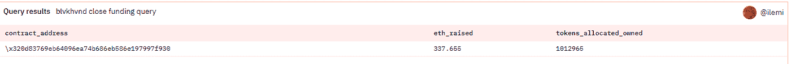

【https://dune.xyz/queries/192560】

恭喜你，你现在已经知道如何使用`ethereum.transactions`、`ethereum.traces`和`ethereum.logs`。它们总是可以通过事务散列来连接，然后剩下的就是知道如何用`encode/decode`、`substring`和一些`bytea`操作符来操作数据。呜哇！

*我们也可以在上一个交易中为* `contribute`方法做这个练习。因为这都发生在代理合同上。

# 把所有的放在一起

现在，如果我们必须跟踪函数签名和事件主题，以及解码每个查询中的所有变量，我想我们现在都应该退出数据分析了。幸运的是，大多数数据服务都有一些不同的 [**合同解码**](https://duneanalytics.com/decode) **，**的意思是我可以给一个合同地址，[ABI](https://docs.soliditylang.org/en/v0.8.7/abi-spec.html#:~:text=The%20Contract%20Application%20Binary%20Interface,contract%2Dto%2Dcontract%20interaction.&text=This%20specification%20does%20not%20address,known%20only%20at%20run%2Dtime.)和 Dune 会帮我处理解码。这样，事件/函数就变成了它们自己的表，我可以很容易地使用下面的语句进行与前面相同的“总贡献”查询:

```
WITH 
    union_sum as (
        SELECT **SUM**("amount")/1e18 as raised FROM mirror."CrowdfundWithPodiumEditionsLogic_evt_Contribution"
        WHERE "contract_address"='\x320d83769eb64096ea74b686eb586e197997f930'

        UNION ALL 

        SELECT **SUM**("amount")/1e18 as raised FROM mirror."CrowdfundWithPodiumEditionsLogic_evt_ContributionForEdition"
        WHERE "contract_address"='\x320d83769eb64096ea74b686eb586e197997f930'
    )

SELECT **SUM**("raised") FROM union_sum
```

[链接到查询](https://dune.xyz/queries/192571)

幸运的是，这个查询可读性更好，也更容易编写。他们甚至负责代理/工厂逻辑模式——感谢团队！如果没有这种抽象，我保证数据分析写起来会混乱十倍，调试起来会糟糕一百倍。Dune 还有很多其他有用的表格，比如用于每日代币价格的`prices.usd`和用于所有主要交易所的代币交易的`dex.trades`(以及用于 OpenSea NFT 行动的事件`nft.trades`)。

虽然大部分时间你都在玩解码的数据，但是了解数据背后真正隐藏的东西会帮助你在 Web3 中更快地升级。另外，你现在已经精通以太扫描——我保证这将成为未来所有加密工作描述的一部分。我希望这对您有所帮助，如果您需要一些帮助，请随时联系我们。