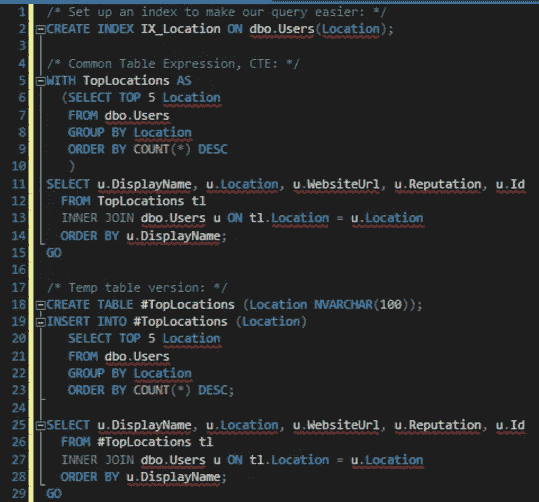
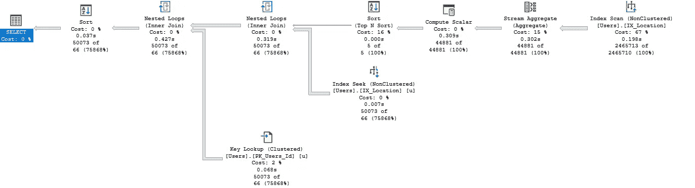
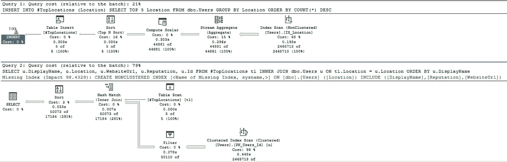
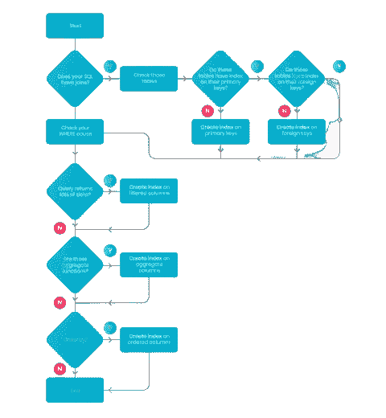

# SQL 性能提示#2

> 原文：<https://towardsdatascience.com/sql-performance-tips-2-128a31e8ecb?source=collection_archive---------37----------------------->

## 避免在堆和 cte 与临时表上运行

克里斯·奥瓦尔在 [Unsplash](https://unsplash.com/?utm_source=medium&utm_medium=referral) 上拍摄的照片

除了现代 SQL 世界中通常被忽略的有用概念之外，本文是关于提高 SQL 查询性能的两个小技巧系列中的第二篇:

*   [SQL 性能提示# 1:避免自连接和用于连接的操作/函数](/sql-performance-tips-1-50eb318cd0e5)

与之前的迭代类似，需要一个介绍性的注释:我绝不是 SQL 专家，非常欢迎反馈和建议。

# 用索引临时表替换 cte

cte 在大多数查询中是一个很大的帮助，简化了开发过程及其维护，提供了单一的事实来源。但是，它们的影响很大程度上取决于 SQL 引擎。例如，PostgreSQL 12+会自动具体化(将输出分配到内存中)被多次调用的 cte。众所周知，Microsoft SQL Server 不会具体化 cte，而是在每次调用时将其作为视图运行，这甚至会导致每次调用的输出不同，具体取决于序列化级别。但是，即使引擎像 PostgreSQL 一样实现了 CTE，它的索引呢？通常，引擎会利用底层源表的索引。

cte 在许多情况下是完美的，但是有时，您查看查询优化器并意识到正在进行全表扫描，这仅仅是因为查询不依赖于底层的现有索引。更糟糕的是，例如，当 CTE 自身被调用时，Microsoft SQL Server 往往会发生并发竞争，这通常会导致死锁。

认识到临时表的潜在好处的另一个有用的方法是使用 SQL 引擎的统计信息，通过逻辑读取的数量和类似的统计信息来发现过多的 I/O 操作。提示:阅读次数越少越好。

考虑[堆栈溢出数据库](https://archive.org/details/stackexchange)创建一个查询来:

1.  找到用户最多的 5 个位置
2.  检索居住在此位置的用户，按其显示名称排序

使用 CTE(上图)与临时表(下图)查询

执行计划— CTE

CTE 执行计划的亮点是:

*   好:CTE 将顶级位置和查找所述位置的顶级用户合并到一个语句中，这有一个好处，就是不必物化数据
*   好:CTE 正确估计了 5 个结果
*   坏:另一方面，它无法识别前 5 个结果的内容，估计有 50.073 个用户匹配所述结果，而不是实际的 66 个(75 868%的高估)
*   错误:SQL Server 依赖于索引查找和键查找

执行计划—临时表

临时表的执行计划的亮点是:

*   好:SQL Server 正确估计了位置的数量(5)
*   好:它正确识别了这 5 个位置
*   好:因此，临时表版本更好地接近了实际用户数，估计为 17 184 行，而实际为 50 073 行(低估了 291%)
*   好:它依赖于表扫描

那么什么时候选择 CTEs vs 临时表呢？

在以下情况下，cte 往往是合适的选择:

*   CTE 的内容对查询结果的其余部分没有影响
*   当 CTE 可能包括额外的不必要的信息时

另一方面，在下列情况下，临时表可能是一个不错的选择:

*   输出将被多次使用
*   数据需要传递给其他对象
*   出于性能方面的考虑，您需要将流程分成几个子流程

注意:这一部分是从 Brent Ozar 的博客中大量获取的。确保遵循它，因为他比任何人都了解 SQL Server。下面的链接。

<https://www.brentozar.com/blog/>  

# 避免在堆上运行查询

这是 SQL 101 的一个教训:在任何情况下，都不要在(集群)无索引表上运行查询*，除非你被强迫这样做*。即使它们是临时表，也要确保至少添加一个主键，最好是包含可查询列的组合键。如果不能使用主键，可以通过在可筛选列上指定非聚集键来进一步提高性能(尽管这是有代价的)。

描述表创建的典型索引决策工作流的图表。([信用 toptal.com](http://total.com)

在未编制索引的表上运行大型操作，无论是筛选还是连接，都将反映在全表扫描中，就像它听起来的那样，为每一行和每一个操作扫描整个表。听起来效率不高？那是因为它是。

> 但是等等，我永远不会有一个没有索引的表，当然也不会对它运行查询！

其实没那么简单。正如我在第一段中提到的，如果您的查询没有利用现有的索引(例如，在 where 谓词中使用一个没有索引的列)，那么将执行全表扫描。这就是执行计划可以成为您最好的朋友的地方，它暗示了正在执行全表扫描的情况，这表明可能需要额外的或经过调整的索引。

# 综上

*   如果您正在使用 Microsoft SQL server，并且不止一次地调用 CTE，请探索使用临时表或使用中间具体化的可能性(来自性能提示# 3)；
*   如果您不确定语句的哪些部分将被进一步使用，CTE 可能是一个不错的选择，因为 SQL Server 能够检测实际使用了哪一部分
*   如果在 CTE 上执行的操作不使用底层表的索引，则考虑将数据具体化到具有专用索引的临时表上；
*   尽可能依赖于诊断，使用执行计划来检测全表扫描，使用统计信息来检测可能的过量 I/O 源，这可以从实体化中受益；
*   看在基督的份上，给任何表添加索引；如果您事先知道将严重依赖其他列，而不是索引中的列，请考虑将它们包含在索引中，或者创建一个新的(非聚集)索引；