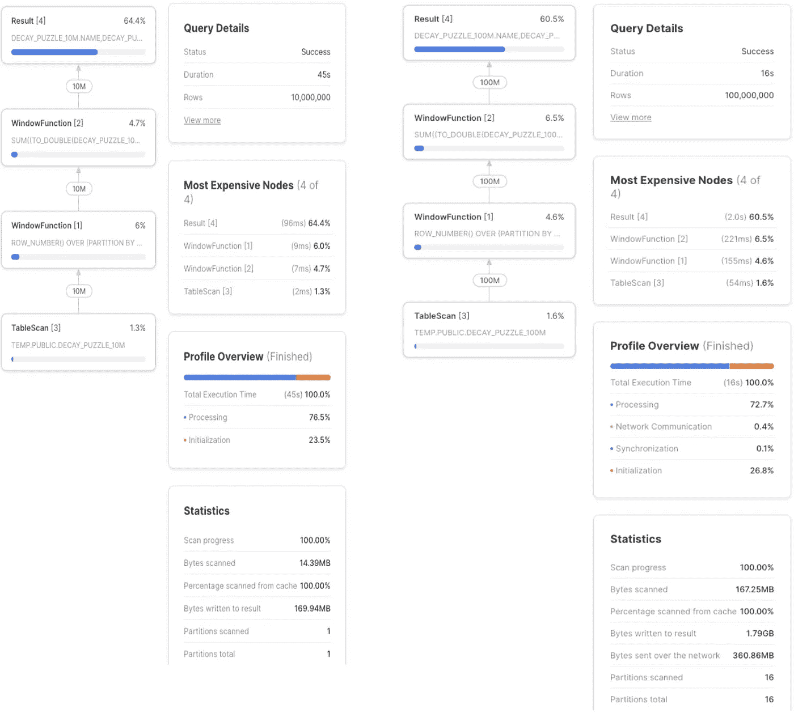

# SQL 难题优化:衰减函数的 UDTF 方法

> 原文：<https://towardsdatascience.com/sql-puzzle-optimization-the-udtf-approach-for-a-decay-function-4b4b3cdc8596?source=collection_archive---------16----------------------->

## 在 SQL 中构建一个衰减函数并不简单，但是很有趣。到目前为止，最好的答案是使用窗口函数，但我们能在雪花中使用 JS UDTF 做得更好吗？在此查找结果


一个 UDTF 解决了衰减分数 SQL 难题(图片由作者提供)

[在 YouTube 上观看](https://www.youtube.com/watch?v=xydidZrKGII)

[布列塔尼·贝内特](https://medium.com/u/6363936853d?source=post_page-----4b4b3cdc8596--------------------------------)和[克莱尔·卡罗尔](https://medium.com/u/6aceb4900e59?source=post_page-----4b4b3cdc8596--------------------------------) [用](https://xkcd.com/356/)[一个有趣的 SQL 谜题](https://invincible-failing-289.notion.site/SQL-Puzzle-Calculating-engagement-with-a-decay-function-661cda4a4e754cbaa45f42a5356138e7)剪贴数据-推特。几个小时后，Benn Eifert 用 SQL 窗口函数[提出了一个很棒的解决方案。然后](https://twitter.com/bennpeifert/status/1453003455325421583) [TJ Murphy](https://medium.com/u/eb13b4c116f4?source=post_page-----4b4b3cdc8596--------------------------------) 在雪花中测试了一下，解释了为什么窗口函数比 joins 好。现在，轮到我上场了。用 JavaScript UDTF 我能做得更好吗？找到下面的结果。

# 为什么要用 UDTF？

让我们首先来看看窗口纯 SQL 解决方案:

```
with t as (
    select *
        , row_number() over (
            partition by name order by week desc
        ) as week_count
    from decay_puzzle_10m
),select *
    , points_this_week * power(0.9, week_count - 1) as decayed_points
    , sum(decayed_points) over (
        partition by name order by week rows between unbounded preceding and current row
    ) as decayed_points_cumulative
    , decayed_points_cumulative / power(0.9, week_count - 1) as score_this_week_calc
from t
;
```

优点:它很聪明，效率也很高。

**缺点**:难以理解、解析、修改和复用。

与此同时一个 [**JS 表格 UDF**](https://docs.snowflake.com/en/developer-guide/udf/javascript/udf-javascript-tabular-functions.html) 正好可以做这个问题所需要的:

*   作为一个表格 UDF，它将**接收整个表格并逐行查看**。
*   由于它可以对在之前看到的行进行**存储，因此它可以为所需的衰减数学积累数据。**
*   由于它允许**分区**，先前行的内存可以为每个段拆分。
*   随着每一行被处理，它可以**输出每一行的正确结果**。

# 天真的 UDTF

这是 Claire & Brittany 针对该问题发布的原始 Python 逻辑:

```
for n in range(number_of_weeks):
    sum = 0
    for i in range(n+1):
        sum += points[i] * pow(0.9, n-i)
    print(f"Score: {sum}")
```

让我们把它翻译成一个 JS UDTF:

```
create or replace function decay_udtf_v1(points float)
returns table (output_col float)
language javascript
as $$
{
    processRow: function f(row, rowWriter, context){
        this.pointarr.unshift(row.POINTS); // store history
        sum = 0;
        this.pointarr.forEach(function (item, index) {
            sum += item * Math.pow(0.9, index);
        })
        rowWriter.writeRow({OUTPUT_COL: sum});
    }        
    , initialize: function(argumentInfo, context) {
         this.pointarr = [];
         this.counter = 0;
    }
}
$$;
```

这基本上是用`processRow`处理每一行，将前面的行值存储到数组`pointarr`中。它对衰减值进行`forEach`到`sum`，并输出结果。

使用它既简单又干净:

```
select output_col, a.*
from decay_puzzle_10m a
    , table(decay_udtf_v1(points_this_week::float) over(partition by name order by week));
```

但是这比窗口函数快吗？我们来测试一下。

# 基准测试天真的 JS UDTF 与窗口函数

首先，让我们从 Claire & Brittany 给我们的 4 个样本行中创建一个 1000 万行的表:

```
create table decay_puzzle asselect 'claire' as name, '2021-10-04'::date as week, 3 as points_this_week, 3.00 as score_this_week
union all select 'claire', '2021-10-11'::date, 1, 3.70
union all select 'claire', '2021-10-18'::date, 2, 5.33
union all select 'claire', '2021-10-25'::date, 0, 4.797
;create or replace table decay_puzzle_10m asselect name ||  seq8() % 25000 name, week+seq8()%100 week, points_this_week, score_this_week
from decay_puzzle, table(generator(rowcount => 100000)) g1, table(generator(rowcount => 25)) g2
;
```

这创建了 1000 万行，有 25，000 个不同的名称，每个名称有 400 周。日期需要清理，但这与我们的目的无关。

现在是时候对我们的 1000 万行样本进行基准测试了，将窗口函数解决方案与 XL 仓库中的 JS UDTF 朴素解决方案进行对比。获胜者是…

*   车窗功能:46s
*   JS 天真的 UDTF: 36s


窗口函数 vs JS UDTF 超过 10M 行——天真的 JS UDTF 赢了(图片由作者提供)

我们有赢家了！但这还不是全部。你可能已经注意到了，我一直称 UDTF 为“天真”。事实证明，如果我们在其中优化 JS，结果会更好:

*   车窗功能:46s
*   JS 天真的 UDTF: 36s
*   JS 优化的 UDTF: 9s


窗口函数与超过 10M 行的 JS UDTF 的对比——优化的 JS UDTF 胜出(图片由作者提供)

优化 JS 代码是一个巨大的胜利——原来我们的原始代码相当低效。稍后我会在这里分享它的代码，但首先我想看一些更有趣的东西:当我们从 10M 行增加到 100M 行时会发生什么？

# 用 100M 行对简单的 JS UDTF 和窗口函数进行基准测试

要生成 1 亿行，我们可以使用类似的 SQL:

```
create or replace table decay_puzzle_100m
as
select name ||  seq8() % 25000 name, week+seq8()%100 week, points_this_week, score_this_week
from decay_puzzle, table(generator(rowcount => 1000000)) g1, table(generator(rowcount => 25)) g2
;
```

仍然有 25，000 个不同的名字，但是现在每个名字有 4，000 周(而不是 400 周)。

如果我们再次尝试我们的 3 个解决方案，结果令人惊讶:

*   车窗功能:16s
*   JS naive: 378s
*   JS 优化:95s

真有意思！由于每个名字的观察次数增加了 10 倍，JS 解决方案的时间也增加了 10 倍。但是 SQL 窗口函数变得更快了！这是 1/3 时间内的 10x 行。

我们在这里看到的是并行化的力量，以及 SQL 优化器在根据输入和可用资源的大小决定路径时所做的假设。



10 倍的数据，1/3 的时间—使用 SQL 中的窗口函数(图片由作者提供)

# 优化的 JS UDTF 代码

让我们回到 JS 代码，以及为什么它可以被优化以 1/4 的时间运行:

*   `Array.push()`要求增加分配给数组的内存。如果我们知道输入的大小，我们可以预先分配一块连续的内存。
*   `reduce()`似乎比`foreach()`跑得快
*   `power(0.9, week_count — 1)`运行太多次，我们可以预先计算它——特别是如果我们知道输入的大小。如果我们不这样做，我们可以做一些懒惰的评估。

优化的 JS UDTF:

```
create or replace function decay_udtf_optimized(points float)
returns table (output_col float)
language javascript
as $$
{
    processRow: function f(row, rowWriter, context){
        this.pointarr[this.counter]=row.POINTS;
        reduce_func = function(prev, curr, idx, arr) {
            return prev + curr * this.precalc[this.counter - idx];
        };
        sum = this.pointarr.reduce(
            reduce_func.bind({precalc: this.precalc, counter: this.counter}), 0
        );
        rowWriter.writeRow({OUTPUT_COL: sum});
        this.counter++;
    }        
    , initialize: function(argumentInfo, context) {
        var preoptimized = 4000 // testing for 400|4000
        this.pointarr = Array(preoptimized);
        this.precalc = Array(preoptimized);
        this.precalc[0]=1;
        for (let i = 1; i < preoptimized; i++) {
            this.precalc[i] = this.precalc[i-1]*0.9;
        }
        this.counter = 0;
    }
}
$$;
```

附加说明:如果我们去掉乘法，用一个`prev + curr`代替`prev + curr * this.precalc[this.counter — idx]`，那么处理 1 亿行的时间从 95 秒减少到 75 秒。这不是我们想要计算的，但是它显示了通过优化 JS 中的数学可以节省多少时间。

# 我们学到了什么

*   UDTFs 是实现逻辑的一种自然方式，就像 Claire & Brittany 提出的难题中所要求的那样
*   这个 UDTF 不仅使用起来更优雅，而且在对 10M 行进行基准测试时，它比纯 SQL 更快。
*   在 JS UDF 中优化数学可以带来巨大的性能提升。
*   SQL 窗口函数很酷，并由 SQL 优化器进行了优化。
*   可伸缩性以奇怪的方式工作:有时增加 10 倍的数据会使整个事情花费的时间减少 3 倍。


对于 10 倍的数据，JS UDTFs 花费了 10 倍的时间，但是 SQL 窗口函数花费了 1/3 的时间(图片由作者提供)

# 后续步骤

*   爪哇 UDTF 的表现会更好吗？[雪花发生了很多事情](https://www.snowflake.com/snowday/)，包括 UDF。敬请关注。

[](/the-most-popular-languages-on-reddit-analyzed-with-snowflake-and-a-java-udtf-4e58c8ba473c) [## Reddit 上最流行的语言，用雪花和 Java UDTF 分析

### Reddit 上最流行的语言(除了英语)会让你大吃一惊。为了制作这张图表，我分析了几乎一个…

towardsdatascience.com](/the-most-popular-languages-on-reddit-analyzed-with-snowflake-and-a-java-udtf-4e58c8ba473c) 

*   检查衰减评分函数的真实用例，如轨道模型中的[所示。](https://github.com/orbit-love/orbit-model#Activity-Decay)


[轨道模型](https://github.com/orbit-love/orbit-model#Activity-Decay)中的衰变计分。

*   布列塔尼深入轨道模型:

[](https://www.brittanybennett.com/post/replicating-the-orbit-model-an-exercise-in-measuring-movement-power) [## 复制轨道模型:测量运动能力的练习🚀

### 由于克莱尔·卡罗尔的推荐，我最近发现了轨道模型。轨道模型是一个自我…

www.brittanybennett.com](https://www.brittanybennett.com/post/replicating-the-orbit-model-an-exercise-in-measuring-movement-power) 

*   [TJ 墨菲](https://medium.com/u/eb13b4c116f4?source=post_page-----4b4b3cdc8596--------------------------------)第一反应:

# 想要更多吗？

*   用一个[雪花免费试用](http://bit.ly/sf-free-trial)账户试试吧——你只需要一个电子邮件地址就可以开始了。

我是 Felipe Hoffa，雪花的数据云倡导者。谢谢你和我一起冒险。你可以在推特和 [LinkedIn](https://www.linkedin.com/in/hoffa/) 上关注我。查看 reddit.com/r/snowflake[的最有趣的雪花新闻。](https://www.reddit.com/r/snowflake/)