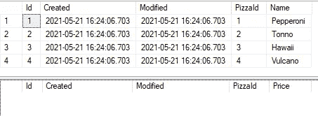

# SQL —了解如何回滚事务中的查询

> 原文：<https://towardsdatascience.com/sql-rolling-back-statements-with-transactions-81937811e7a7?source=collection_archive---------16----------------------->

## 要么执行所有查询，要么一个都不执行

这台机器是为处理交易而建造的，就像你这篇文章之后的代码一样(图片由[大卫·卡尔波尼](https://unsplash.com/@davidcarboni)在 [Unsplash](https://unsplash.com/photos/xvkSnspiETA) 上提供)

尽管有错误，事务负责保证数据的有效性，它们是 SQL 工具箱中的重要工具。事务中的所有查询要么成功，要么全部失败；如果最后一个失败，那么之前的查询将回滚(撤消)。在本文中，你将学习*如何*使用事务，但首先我们将讨论*何时*使用事务:

# 0.何时使用事务

在某些情况下，您需要在数据库中执行两个不能同时完成的操作(比如将[合并到](https://mikehuls.medium.com/sql-insert-delete-and-update-in-one-statement-sync-your-tables-with-merge-14814215d32c)、[更新到](https://mikehuls.medium.com/sql-update-into-another-table-bfc3dff79a66)，或者[删除到](https://mikehuls.medium.com/sql-delete-into-another-table-b5b946a42299))，但是它们仍然相互依赖。如果他们中的任何一个失败了，他们都不会成功。在 SQL 中使用事务就可以做到这一点；如果一个事务失败，则回滚以前的事务。

# 1.设置

让我们用一个例子来说明。在我们的披萨公司，我们有披萨菜单桌和披萨饼桌。每周我们都会收到这两个表格的文件。我们的目标很简单；我们必须将每周文件插入表格中。面临的挑战是，如果数据库中有价格，我们只能在菜单上有比萨饼。让我们创建表格:

# 2.用错误的方法解决它

错误的做法是将数据插入到两个表中:

你会注意到最后一条记录中的错误；我们在只允许浮点数的地方插入一个字符串。如果我们执行上面的代码，我们会注意到第一次插入成功了，第二次插入失败了。这不是我们想要的，因为我们现在菜单上有比萨饼，但没有价格。

❌ 我们的披萨已经满了，但是我们的披萨不见了！

# 3.拯救交易！

当我们使用事务和 try-catch-block 时，我们将得到我们想要的。让我们检查代码，然后解释。

上面的代码从 TRAN 开始。这启动了一个**事务**。**事务**有两种可能的执行方式:**提交**和**回滚**。从开始 TRAN 到提交 TRAN 或回滚 TRAN 之间执行的每个命令都被“记住”。一个**提交**确认所有已被记忆的命令。一个**回滚**撤销所有命令。

在上面的代码中，我们将 insert 语句包装在一个 try 中。如果他们中的任何一个失败了，我们就会在 CATCH 块中结束。如果我们在那里结束，我们回滚所有事务。 [✅](https://emojipedia.org/check-mark-button/) 如果我们执行上面的代码，两个表都是空的；**两次插入均未成功**。

回去走另一条路！(图片由[罗杰·布拉德肖](https://unsplash.com/@roger3010)在 [Unsplash](https://unsplash.com/photos/1PPoNhMzAmY) 上拍摄)

# 4.抛出一个交易

您的代码不一定要在事务中利用回滚；你可以自己决定:

在上面的代码中，我们将数据插入到 PizzaMenu 和 PizzaPrices 中。然后我们检查是否有菜单上所有比萨饼的价格。如果不是这样，我们抛出一个错误，触发回滚。否则我们提交我们的事务。执行上面的代码不会插入任何数据，因为我们已经注释掉了第 18 行。

# 5.保持你的桌子快速

一旦开始一个事务，执行操作的表就会被锁定。锁定的表不可编辑，因此为了保持表的速度，非常重要的一点是，一旦事务开始，它应该**尽快提交**或**回滚**。

# 结论

事务是您工具箱中的一个很棒的新工具，就像下面这些一样:

*   [删除到另一个表格](https://mikehuls.medium.com/sql-delete-into-another-table-b5b946a42299)
*   [更新到另一个标签页](https://mikehuls.medium.com/sql-update-into-another-table-bfc3dff79a66) le
*   [在一条语句中插入、删除和更新](https://mikehuls.medium.com/sql-insert-delete-and-update-in-one-statement-sync-your-tables-with-merge-14814215d32c)
*   [更新选择一批记录](https://mikehuls.medium.com/sql-update-select-in-one-query-b067a7e60136)
*   [版本控制你的数据库](https://mikehuls.medium.com/version-control-your-database-part-1-creating-migrations-and-seeding-992d86c90170)

编码快乐！

—迈克

页（page 的缩写）学生:比如我正在做的事情？[跟着我](https://mikehuls.medium.com/)！