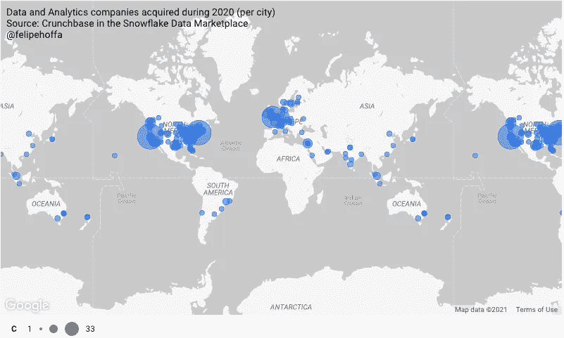
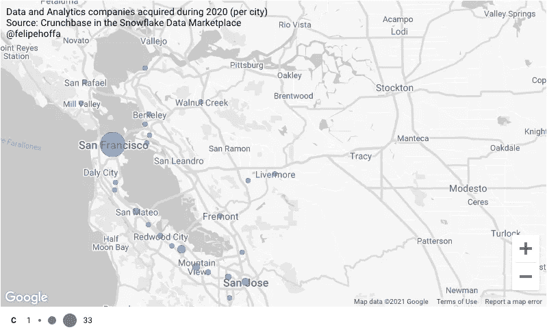
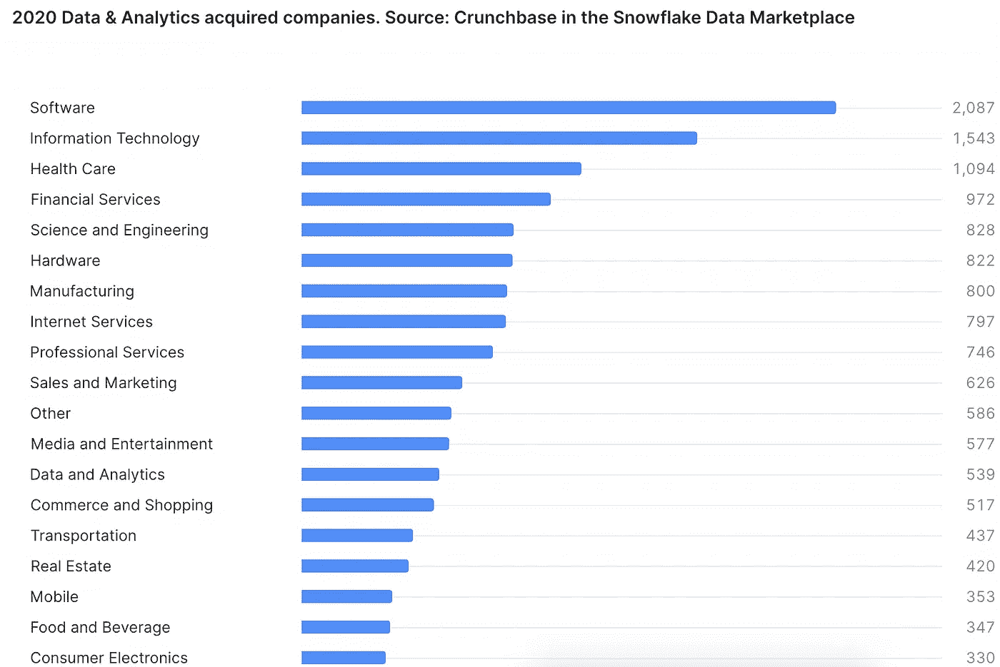
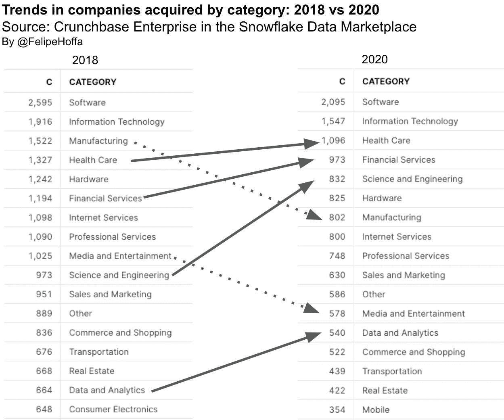
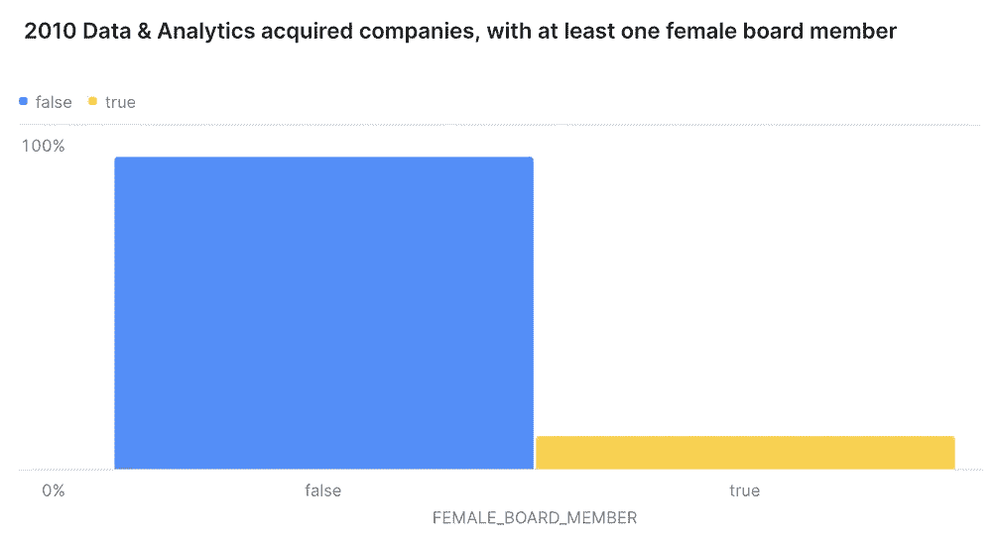
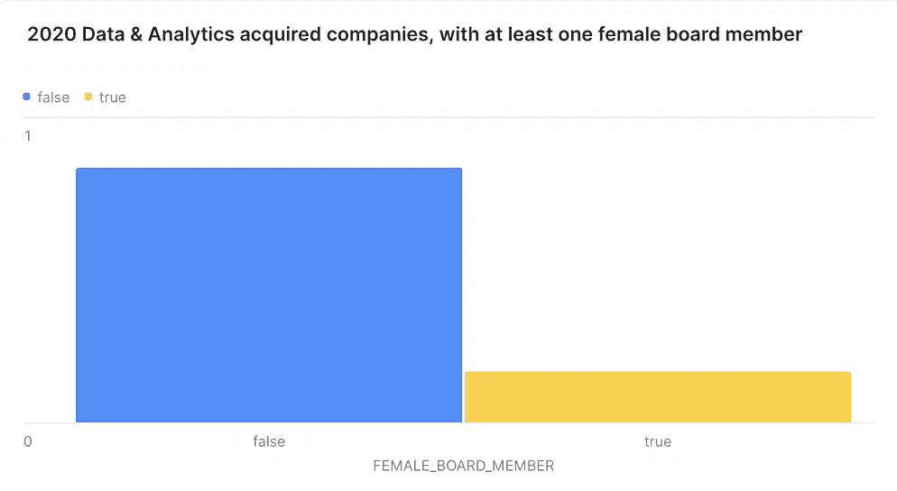
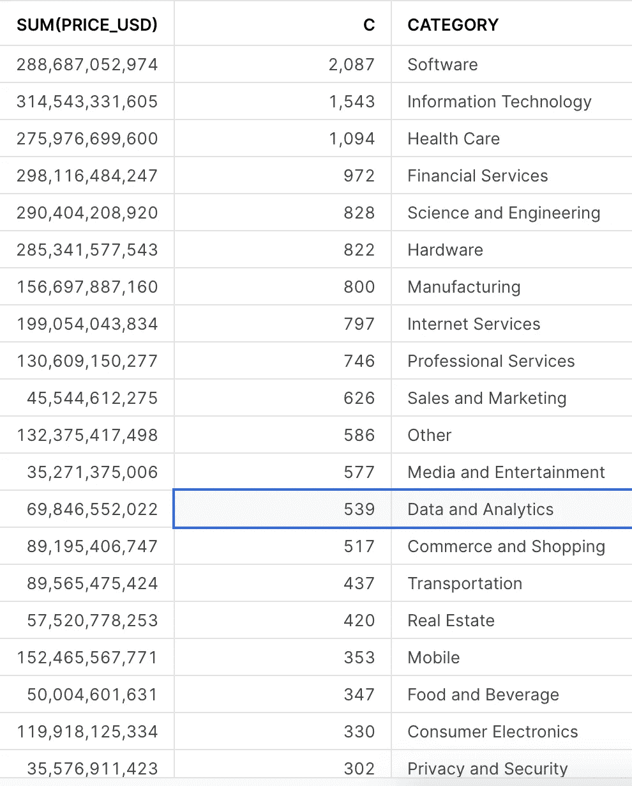
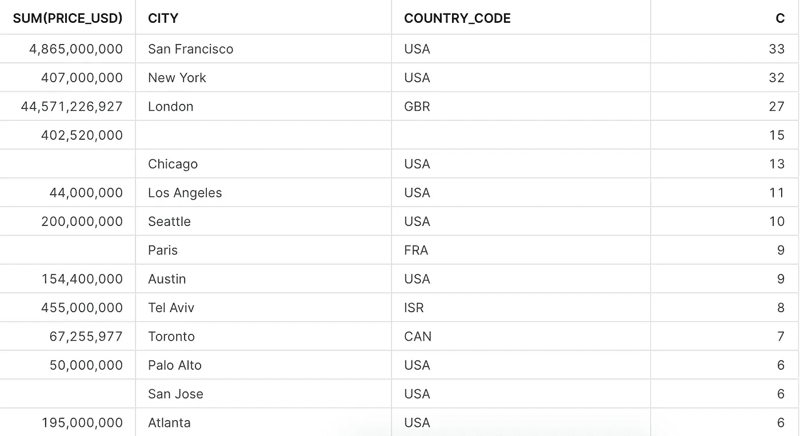

# SQL 跟踪创业公司，首次公开募股，等等:Crunchbase 企业与雪花

> 原文：<https://towardsdatascience.com/sql-to-track-startups-ipos-and-more-crunchbase-pro-with-snowflake-6c24175a0d50?source=collection_archive---------29----------------------->

## 借助雪花数据市场中的 Crunchbase，您可以使用 SQL 来跟踪并购、收购、首次公开募股以及这些故事背后的关键人物。

2020 年，全球超过 500 家数据和分析领域的公司被收购。你能猜出这些公司所在的前三个城市吗？



第三名是伦敦，第二名是纽约。排名第一的是旧金山，2020 年数据分析领域有 33 家公司被收购。



现在，你如何获得分析背后的原始数据呢？嗯，有一家公司在追踪并购和首次公开募股的疯狂世界。这是一个令人难以置信的数据集，包括公司、投资者、融资数据以及这一切背后的关键人物。我喜欢 Crunchbase 的一点是，他们希望让所有人都能获得这些数据。

他们在自己的网站上提供这个数据集，你可以免费获取其中的大部分。如果你想更深入，你可以获得 pro 订阅，但如果你想完全访问数据云中每天更新的这些数据呢？好吧，Crunchbase 已经可以在[雪花数据市场](https://www.snowflake.com/data-marketplace)买到了。你所需要做的就是进入你的雪花账户，找到 Crunchbase 列表并请求访问 premium 数据集。一旦 Crunchbase 批准了您的请求，您会发现数据就在那里，每天更新，没有任何麻烦。这就是数据云的力量。

这就是我如何运行我的查询，并发现 Crunchbase 跟踪了 2020 年期间收购的大约 8000 家公司。这些公司中有 7%属于数据和分析领域:



## 2018 年与 2020 年的趋势

对比 2018 年和 2020 年的趋势:

*   与两年前相比，今年跟踪的收购数量大大减少。
*   医疗保健、金融服务和科学与工程收购在排名中上升。
*   制造业、媒体和娱乐业下滑。



## 董事会的多元化

我们可以继续深入。例如，这些公司中有多少有女性董事会成员？只有 16%，比 2010 年的 9%要好。



2010 年与 2020 年相比:至少有一名女性董事会成员的数据和分析公司的百分比

但是让我们来谈谈可能性。一旦您在 Snowflake 中有了这些数据，您就可以使用 SQL 对其进行探索，应用您最喜欢的可视化工具对其进行可视化，或者将其与您的 Salesforce 数据进行链接以增强您的销售流程。

可能性是无穷无尽的，数据云可以助您一臂之力。

# 问题

## 每个类别在 2020 年收购的公司

```
select sum(price_usd), count(*) c, cat.value category
from acquisitions a
join organizations b
on a.acquiree_uuid=b.uuid
  , table(split_to_table(category_groups_list, ',')) cat
 where acquired_on between '2020-01-01' and '2021-01-01'
group by category
order by 2 desc nulls last;
```



## 数据和分析公司在 2020 年收购了每个城市

```
-- Data & Analytics companies aquired 2020 per city
select sum(price_usd), city, country_code, count(*) c --, acquiree_name, acquirer_name, city
from public.acquisitions a
join organizations b
on a.acquiree_uuid=b.uuid
where acquired_on between '2020-01-01' and '2020-12-31'
and category_groups_list like '%Data and Analytics%' 
group by 2, 3
order by c desc
```



## 董事会成员为女性的被收购公司的百分比

```
with acquired_da as (
    select price_usd, acquiree_name, acquirer_name, city, acquiree_uuid
    from public.acquisitions a
    join organizations b
    on a.acquiree_uuid=b.uuid
    where extract(year from acquired_on) = 2010
    and category_groups_list like '%Data and Analytics%' 
)select female_board_member, count(*) c, c/sum(c) over() percent
from (
    select org_name, boolor_agg(gender='female')::varchar female_board_member
    from (
        select person_name, org_uuid, gender, org_name
        from jobs a
        join people b
        on a.person_uuid=b.uuid
        join acquired_da c
        on a.org_uuid=c.acquiree_uuid
        where job_type = 'board_member'
    )
    group by 1
    order by 2
)
group by 1
;
```

## 结束语

通过这些查询，您可以看到将行业内发生的事情和您关心的事情联系起来是多么容易。在这篇文章中，我关注的是数据和分析领域，但是还有很多内容有待发现。

我会继续在 Twitter 帖子中添加更多关于 Crunchbase 数据集的有趣发现，请分享您的想法:

# 想要更多吗？

我是 Felipe Hoffa，雪花的数据云倡导者。谢谢你和我一起冒险。你可以[在 Twitter](https://twitter.com/felipehoffa) 上关注我，并查看 reddit.com/r/snowflake上最有趣的雪花新闻。

<https://github.com/Snowflake-Labs/awesome-snowflake>  