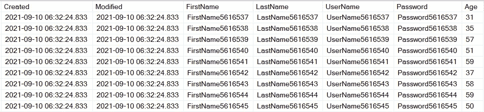
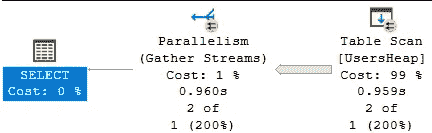
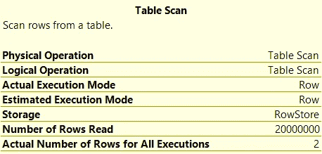
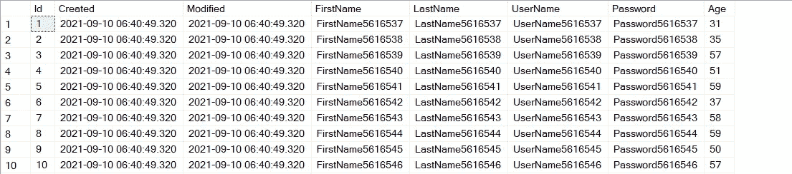
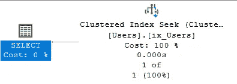
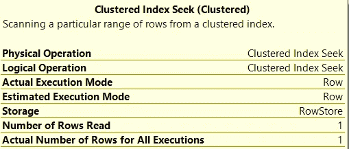
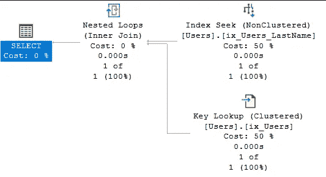

# SQL——了解索引如何在幕后加速您的查询

> 原文：<https://towardsdatascience.com/sql-understand-how-indices-work-under-the-hood-to-speed-up-your-queries-a7f07eef4080?source=collection_archive---------18----------------------->

## 不再需要等待缓慢的查询完成


如何在这些记录行中快速找到我们的数据？(图片由[杨奇煜·巴拉尔](https://unsplash.com/@iammrcup)在 [Unsplash](https://unsplash.com/photos/o6GEPQXnqMY) 上拍摄)

有没有想过数据库引擎如何快速返回你的查询数据*？它如何能在瞬间搜索许多表格和数百万条记录？本文探讨了数据库引擎是如何工作的，并揭示了如何以最佳方式设计表和索引。不再需要等待查询完成！*

像往常一样，我们将首先建立一个示例，创建一些样本数据，这样我们就有东西可以使用了。然后，我们将了解数据库引擎在没有索引的情况下如何运行。然后我们将添加索引来加速我们的查询，演示您也可以这样做。在本文结束时，您将:

*   了解什么是指数
*   理解指数的类型及其区别
*   理解指数是如何工作的
*   知道在什么情况下使用什么类型的索引

请注意，在本文中，我们使用的是 SQL Server，但该原则适用于许多其他关系数据库，如 Postgres 和 MySQL，例如语法可能会有所不同。让代码！

## 设置

为了说明本文中的代码，我创建了一个很多应用程序都使用的表格。它拥有 2000 万条用户信息记录，可用于注册新用户、登录时检查密码以及更改用户信息。我已经用 Python 生成了这个表，使用了本文 中描述的超快速插入方法。创建表的代码如下所示:

```
CREATE TABLE [dbo].[Users] (
   [Created] DATETIME NOT NULL DEFAULT GETUTCDATE()
   , [Modified] DATETIME NOT NULL DEFAULT GETUTCDATE()
   , [FirstName] NVARCHAR(100) NOT NULL
   , [LastName] NVARCHAR(100) NOT NULL
   , [UserName] NVARCHAR(100) NOT NULL
   , [Password] NVARCHAR(100) NOT NULL
   , [Age] INT NULL
);
```



我们的用户表(图片由作者提供)

如您所见，它包含一些与用户相关的列(最后 5 列)和两个跟踪记录创建和更新时间的列。这张桌子有一些问题，我们将在这篇文章中解决。

假设我们的 Users 表用于像 Reddit 这样的网站。每次登录时，我们都需要检查用户名和密码。此外，有时用户改变他们的电子邮件，用户名或密码，所以我们也需要更新。此外，我们需要能够通过插入新记录来添加新用户。如何在这么大的表中进行快速查询？

# 垃圾堆

我们目前已经用最笨最慢的方式设计了我们的桌子。当我们寻找一个特定的用户时，我们的表必须查看表中的每一条记录。这种表称为**堆表**，检查表中的每条记录称为**表扫描**。想象一下，去一家酒店，检查每一个房间，然后确定哪一个是你的！非常低效。


堆的精确表示(图片由 [Neonbrand](https://unsplash.com/@neonbrand) 在 [Unsplash](https://unsplash.com/photos/8Yk4T-tDSYY) 上拍摄)

## 询问

让我们尝试按姓氏列查找记录:

```
SELECT *
FROM Med.dbo.UsersHeap WITH (NOLOCK)
WHERE LastName = 'LastName123123'
```

执行上述查询将花费相当长的时间；数据库引擎必须扫描表中的每条记录。它不能在第一个找到的记录处停止，因为可能有更多的用户具有相同的姓氏。此外，数据是无序的，所以记录可以在任何位置(任何行号)。

让我们分析一下执行计划:



从堆表中选择记录的执行计划(图片由作者提供)

您将看到数据库引擎执行了一次表扫描，这几乎花了一秒钟的时间！当您将鼠标悬停在最右侧的块上时，它会显示下图:



执行计划详情(图片由作者提供)

您将看到它实际上读取了所有 2000 万条记录，但只返回了 2 条。这些类型的堆表和表扫描效率非常低，不应该使用。我们可以通过增加一个索引来提高很多。

# 聚集索引

让我们向表中添加一个聚集索引:我们将向表中添加一个存储主键的新列；每行具有唯一值的整数。然后，这些值被分类并物理存储在一个树状结构中。


从根部开始，沿着这个树状结构向上(图片由 [Max Nayman](https://unsplash.com/@maxniceman) 在 [Unsplash](https://unsplash.com/photos/n93ugNYul3w) 上提供)

## 它是如何工作的

但是数据库引擎如何使用这个索引来更快地检索行呢？让我们再次使用酒店的例子:你需要找到房间 E512。

*   字母 E 表示你必须去酒店的东翼
*   第一个数字(5)表示我们必须去 5 楼
*   一旦我们走出电梯，我们看到一个标志，上面写着 1-20 号房间在左边，21-40 号房间在右边。因为房间已经订好了，所以我们找房间时不需要找太远！

数据库引擎的工作方式很像这样。我们不需要访问酒店的每一个房间并检查是否是我们的，而是使用树状结构的索引来更快地引导我们到达目的地。唯一的区别是，数据库引擎使用更多的分支，而不是我们使用的三个分支(东翼，5 楼，大厅右侧)。

## 创建索引

让我们来收拾桌子:

```
CREATE TABLE [dbo].[Users] (
   [Id] INTEGER IDENTITY PRIMARY KEY NOT NULL
   , [Created] DATETIME NOT NULL DEFAULT GETUTCDATE()
   , [Modified] DATETIME NOT NULL DEFAULT GETUTCDATE()
   , [FirstName] NVARCHAR(100) NOT NULL
   , [LastName] NVARCHAR(100) NOT NULL
   , [UserName] NVARCHAR(100) NOT NULL
   , [Password] NVARCHAR(100) NOT NULL
   , [Age] INT NULL
);
```

神奇在二线；当您提供主键列时，数据库引擎会自动创建聚集索引。IDENTITY 部分将为每个记录生成一个新的整数。我们的 Id 栏是新的。新表如下所示:



带有聚集索引的用户表(作者图片)

## 询问

现在我们可以通过 Id 列检索记录。假设我们想要检索 Id = 42 的记录:

```
SELECT *
FROM Med.dbo.Users WITH (NOLOCK)
WHERE Id = 42
```

当我们执行这个时，数据库引擎使用我们新创建的索引；这是非常非常快，因为它使用了类似酒店的方法。我们还可以在执行计划中看到这一点:



我们的查询的聚集索引查询计划(图片由作者提供)

看到我们正在使用一个**聚集索引查找**了吗？这表明我们正在使用聚集索引。也要注意时间:0.000 秒；真快！我们还可以在该图块的执行细节中查看这一点:



聚集索引查找的执行详细信息(作者图片)

看到我们只读了一行吗？这与我们的表格扫描相比有很大的不同！但是如果我们想使用另一个列来过滤呢？

# 非聚集索引

好的，主键在 Id 列上，我们可以使用聚集索引很快找到我们的记录。我们如何优化在其他列上过滤的查询？对于这些列，我们可以创建一个非聚集索引。


蜘蛛侠使用书中的索引查找 SQL 术语的图片(图片由 [Raj](https://unsplash.com/@roadtripwithraj) 在 [Unsplash](https://unsplash.com/photos/o4c2zoVhjSw) 上提供)

## 它是如何工作的

非聚集索引的工作方式很像书中的索引。这些包含某些单词以及这些单词的使用位置。在一本经济学书中，你可能会在第 42、119 和 246 页看到“通货膨胀”一词。非聚集索引的工作方式非常类似:它将列中的所有值作为键，并注册所有相应的 id(来自聚集索引)。非聚集索引需要聚集索引才能运行。这些键-值-对被排序并存储在它们自己的树状结构中，因此我们可以快速定位它们。这个操作被称为**步进扫描**。

首先，我们将创建索引:

```
CREATE NONCLUSTERED INDEX ix_users_lastname 
    ON Med.dbo.Users(LastName)
```

您在 LastName = 'Cartman '上过滤的图像:

1.  然后，非聚集索引将执行**键查找**:它将遍历树，查找名为‘Cartman’的键。它将在我们的表中找到 3 个具有这个姓氏的记录；他们有编号 4，16 和 333。
2.  在步骤 2 中，我们将使用聚集索引，执行索引查找，返回实际记录。让我们看看这是怎么回事！

## 询问

现在，我们可以通过名称列检索记录。假设我们想要检索 LastName = 'LastName456456 '的记录:

```
SELECT *
FROM Med.dbo.Users WITH (NOLOCK)
WHERE LastName = 'LastName456456'
```

这个查询也非常快；正如您在下面的执行计划中看到的，所有操作都在 0.000 秒内完成:



我们的非聚集索引查询的执行计划(图片由作者提供)

您将看到它首先执行键查找；它查找我们的列的值并返回 id。然后这些 id 会在索引搜索中使用。这两个索引一起工作保证了用户友好的、超快的查询！

# 结论

在这篇文章中，我希望通过添加索引来加速你的表。本文主要关注创建索引和从表中检索数据。在以后的文章中，我们将讨论什么时候创建索引实际上会损害性能，以及如何最好地插入数据以防止频繁更新索引。请关注我，保持联系！

同时，看看我的[关于各种编程相关话题的其他文章](https://mikehuls.medium.com/)，比如:

*   [删除进入另一个表](https://mikehuls.medium.com/sql-delete-into-another-table-b5b946a42299)
*   [更新到另一个标签页](https://mikehuls.medium.com/sql-update-into-another-table-bfc3dff79a66) le
*   [在一条语句中插入、删除和更新](https://mikehuls.medium.com/sql-insert-delete-and-update-in-one-statement-sync-your-tables-with-merge-14814215d32c)
*   [更新选择一批记录](https://mikehuls.medium.com/sql-update-select-in-one-query-b067a7e60136)
*   [保存上插](https://mikehuls.medium.com/python-to-sql-upsert-safely-easily-and-fast-17a854d4ec5a)
*   [插入唯一表格](https://mikehuls.medium.com/sql-inserting-only-unique-values-in-a-unique-table-af2eb3b9890a)
*   [从另一个表中插入具有连接 id 的值](https://mikehuls.medium.com/sql-insert-values-with-joined-ids-from-another-table-83ff7f149296)

编码快乐！

—迈克

页（page 的缩写）学生:比如我正在做的事情？[跟我来](https://github.com/mike-huls)！