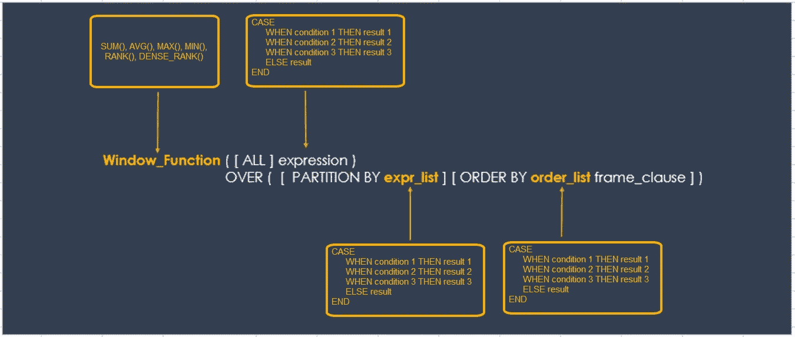
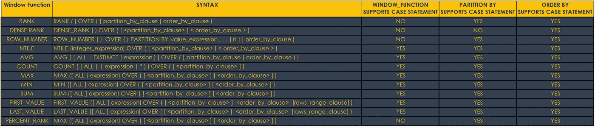
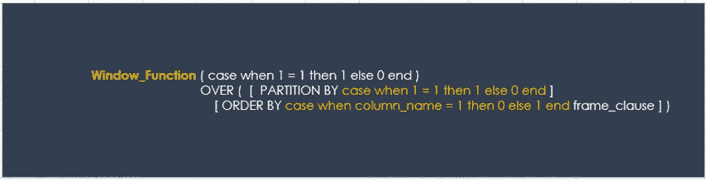
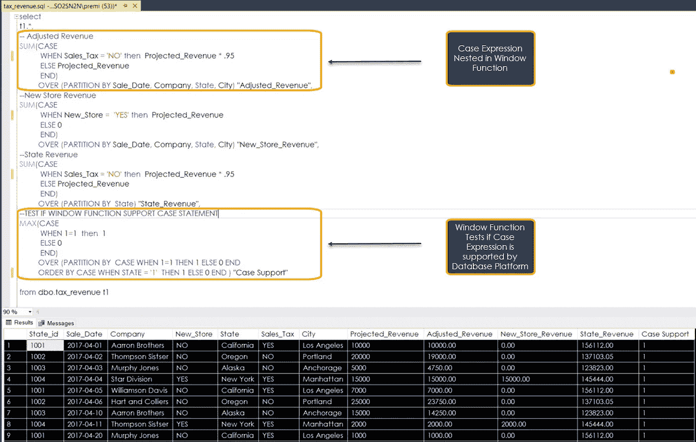
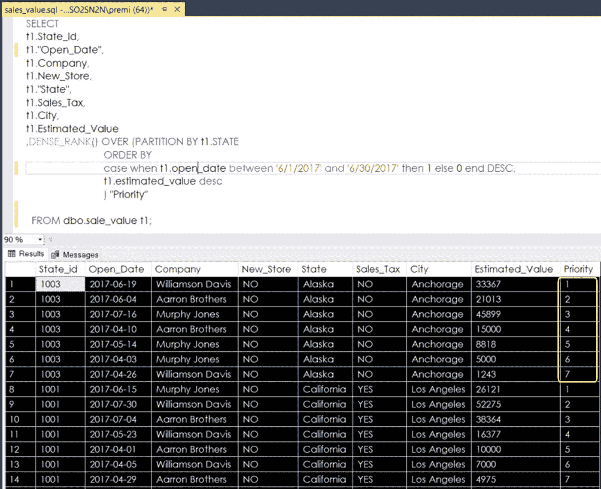

# SQL 嵌套窗口函数

> 原文：<https://towardsdatascience.com/sql-window-functions-64c26bd643fd?source=collection_archive---------16----------------------->

## 辅导的

## 嵌套的 Case 表达式:无限可能

卡尔·弗雷德里克森

> 不要用你自己的极限来定义我的宇宙的参数。—匿名

一个**日落**美得令人望而生畏。每当我看到它，我意识到我只受到视角和视野的限制。超越这些限制的是一个无限可能性的世界。在那个世界里，我是自由的。我可以自由想象，希望和梦想。我可以自由地**绘制一条**通向**想象力**和**创造力**未知目的地的路线。我不受年龄、背景、性别或种族的限制。我的思想是画布，想法是原材料。**所以**，是用 **SQL 窗口**功能实现的。**只有**有限的视角和视野阻碍了他们**创造性的**用法。

为了突破自我强加的限制，我鼓励想象和实验。在这篇**高级**教程中，我通过将`CASE Expression`添加到 SQL 窗口函数中，打开了深入学习的大门。作为一个高级主题，我将介绍与学习相关的基础知识。如果你需要一本关于 SQL 窗口函数的初级读本，我推荐我以前写的一篇文章， **SQL 窗口函数，一段爱恨交加的关系**。

 [## SQL 窗口函数

### 爱恨交加的关系

towardsdatascience.com](/sql-window-functions-78593bcabf4) 

## 基础知识

我们可以在任何允许有效表达式的语句或子句中使用`CASE Expression`。比如可以在`SELECT`、`UPDATE`、`DELETE`、`SET`等语句中，在`PARTITION BY`、`ORDER BY`、`WHERE`、`HAVING`等从句中使用`CASE Expression`。**利用**语句和 SQL 窗口函数的能力始于**语法**。我们可以将`CASE Expression`包含在`Window_Function()`中，如下图所示。

语法、窗口函数和 CASE 表达式

使用窗口功能时，记住**处理顺序事项**很重要。首先执行`OVER()`子句，然后执行`PARTITION BY`、`ORDER BY`和`Window_Function()`。`ORDER BY`子句确定`Window_Function`如何将计算、`AVG(), SUM(), MAX()`或`CASE Expression`逻辑应用于`PARTITION BY`子句中的行。`CASE Expression`遍历这些条件，并在第一个条件评估为真时返回一个**单值**。所以，一旦条件为真，它将停止读取并返回结果。如果没有条件为真，它将返回 ELSE 子句中的值。

## 入门指南

重要的是要知道，在 Oracle、SQL Lite、SQL Server、MySQL、Postgres 和 Redshift 等数据库平台上有不同的 SQL 窗口函数实现。`Window_Function()`功能中`CASE Expression`的数量和支持可能因平台而异。下面的**表**显示了`Window_Function(),` `PARTITION BY`或`ORDER BY`子句是否支持`CASE Expression`语法。表格**不包含** **不包含**所有的 SQL 窗口函数。然而，我列出了一些你可能会遇到的更常见的问题。

SQL 窗口函数

虽然该表是一个很好的参考，但确定您的数据库平台是否支持 case 语句的一个更快、更简单的方法是在`Window_Function`中使用`case when 1 = 1 then 1 else 0 end`，如下图所示。

窗口函数，案例表达式测试

测试时，我建议分别测试语法的各个部分，以确定 SQL 平台是否支持该函数。如果查询执行，窗口函数支持`CASE Expression`。

虽然有可能在`PARTITION BY`子句中使用`CASE Expression`，但我很少在项目中使用**。所以，我不在本教程中涉及。话虽如此，我还是很快补充一句，不要让那限制你从**探索**它。您可能会发现它有用的多个实例。所以，继续被**创意**和**推动**可能的极限。在本教程的剩余部分，我们将看看如何在`Window_Function()`和`ORDER BY`子句中使用`Case Expression`。**

## **我们的数据**

**我们虚构示例中的数据包括每个州的商店收入数据。目的是使用`SUM()`窗口函数和`CASE Expression`添加三个额外的指标，即调整后的收入、新店收入和州收入。我们想衡量**无销售税**或**新店开业**对一个州的公司收入的影响。我们可以编写**单独的查询**来获得答案，但是嵌套的`CASE Expression`是最高效的。在本教程结束时，您将看到如何**添加指标**，并对`CASE Expression`进行微小的修改。**

**也就是说，让我们深入研究 SQL Server 文本编辑器中显示在下面的代码**。对于**调整后的收入，**当`CASE Expression`执行且记录没有销售税时，`Sales_Tax = NO`，收入为预计收入的 95%。****

****

**使用**新店收入，**当`CASE Expression`执行时，记录是新店，`New_Store = 'YES'`，我们计算收入。否则，case 语句返回值零。对于**州收入，**当`CASE Expression`执行且记录没有销售税时，`Sales_Tax = NO`，收入为预计收入的 95%。**

**我可以通过修改`CASE Expression`来继续创建额外的指标。最后，`Case Support`列使用`case when 1 = 1 then 1 else 0 end`来测试`Max()`窗口函数是否支持 SQL Server 中的`CASE Expression`。成功的查询执行意味着`CASE Expression`被支持。**不要担心**填充`Case Support`列的值。目标只是确保查询语句运行。**

## **排序依据:我们的方案**

**`ORDER BY`条款是`Window_Function()`中隐藏的**超能力**。她平常的用法掩盖了她真正的美丽和优雅。理解并掌握她的优点将会打开解决问题的新境界。让我们看一个例子来帮助解释我的意思。**

**我们场景中的数据包括一个计算机制造商的计算机销售交易的**估计值**。每年 12 月，部门销售主管都试图通过与`OPEN_DATE`达成交易来增加收入。根据经验，她知道在**6 月**日`OPEN_DATE`的生意比其他月份更有价值。因此，她向她的数据团队发送了一个请求，要求提供一个列表，让**将 6 月**的交易排在每个州的最前面。当她收到清单时，她会将它分发给每个州的区域销售经理。数据分析师使用如下所示的 SQL 逻辑完成请求。**

****

****说明**:数据分析师使用`**DENSE_RANK()**`函数创建每个区域的优先级列表。`OVER()`子句创建执行空间。`PARTITION BY`子句将`State`数据分成不同的组。如果记录的日期在`6/1/2017`和`6/30/2017`之间，则`CASE Expression`返回一个`1`，而`ELSE`返回一个超出这些日期的`0`。`DESC`按照从 1 到 0 的降序对`CASE`表达式结果集进行排序。`DESC`将`Estimated_Value`从最高到最低排序。结果是一个`priority`列，根据`ORDER BY`排序，六月份的`OPEN_DATE`交易在估计价值中排名最高。**

## **一个关键:慢慢来**

**有效使用`Window_Function()`和`CASE Expression`的一个关键是**花时间**去了解你的数据集。这意味着将样本数据导出到电子表格中。当`Window_Function()`执行`CASE Expression`时，您可以做笔记或**模拟**预期的结果。一个`Window_Function()`和`CASE Expression`的组合提供了大量的**动力**，所以如果处理不当很容易死机和烧毁。你可以花上几个小时试图弄懂那些在电子表格中发现的结果。大多数情况下，当我犯了**错误**时，那是因为我**跳过了**这一步。**

**我用`Case Expressions`和`Window_Functions()`做过一些很神奇的项目。本教程只是触及了无限创造性编码可能性的表面。我希望这些信息能帮助你探索和创造性地解决复杂的问题。继续成长，用`CASE Expressions`和`Window_Functions()`推动可能的极限。**

*****分享灵感*** *:分享每一个按键和每一课，都让我想起我在 Vanguard Jr .高中八年级时的英语和打字老师 Reeves 女士。她帮助一个笨拙的小男孩相信，只要有足够的纪律、善良和爱，他可以做得更好。不断分享并激励他人变得比他们想象的更伟大。***