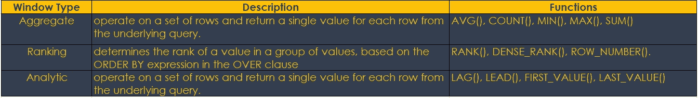
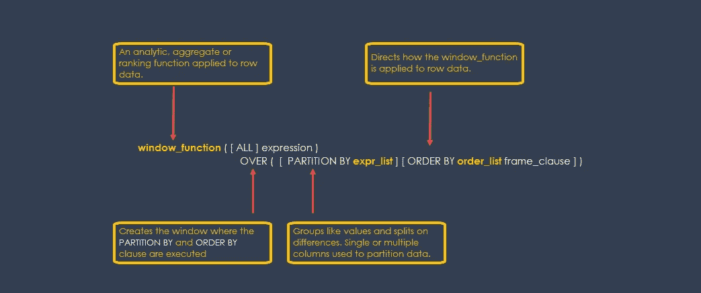
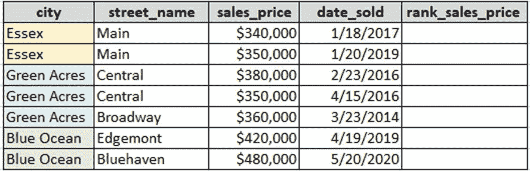
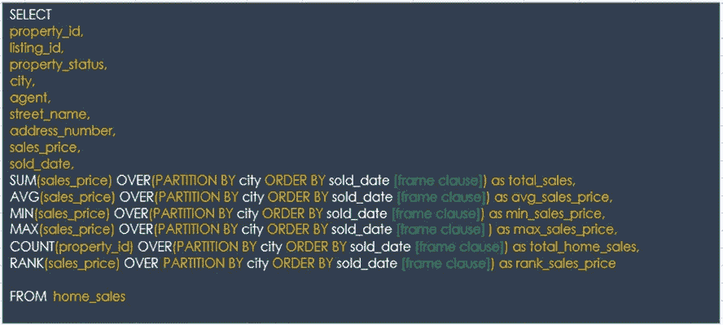
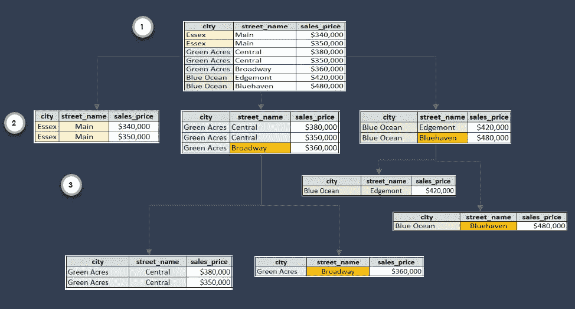
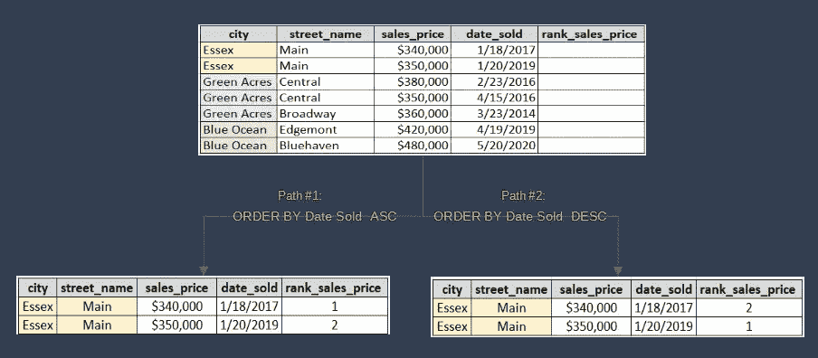

# SQL 窗口函数

> 原文：<https://towardsdatascience.com/sql-window-functions-78593bcabf4?source=collection_archive---------8----------------------->

## 辅导的

## 爱恨交加的关系

> 我爱你，即使我恨你— **亨利·利奥·苏贤**

我一直对 SQL 窗口函数又爱又恨。当他们工作时，我爱他们，当他们不工作时，我恨他们。我会花上几个小时与他们争论和斗争，直到我沮丧地走开，或者通过蛮力让他们工作。这些努力前后矛盾，令人困惑。如此强大的力量，却又如此难以驾驭。喝了几个小时的咖啡，或许还说了一些不友好的话，我意识到我误解了驱动 SQL 窗口函数算法的核心元素。

## 基础知识

如果你处理过大数据，你很可能在 Spark、Pandas、Tableau、MySQL、Postgres 和 Snowflake 中遇到过窗口函数。如下表所示，窗口函数可以分为三种类型。

在本**教程中，**我将重点介绍窗口函数的**核心语法**，即`OVER()`、`PARTITION BY`和`ORDER BY`子句。这些元素是大多数窗口函数背后的**驱动因素**，所以如果你正在**纠结**如何应用一个窗口函数，这很可能与不理解窗口函数算法如何执行这些元素有关。理解这些工作方式将为实现所有窗口函数类型打开大门。在本教程中，我不涉及`frame`条款。这是一个很大的话题，值得自己的教程。此外，它的实现因 SQL 平台而异。所以，我建议看平台的文档。

**开始**理解任何窗口功能都是语法。下图显示了窗口函数的基本语法，以及每个重要元素的描述。

语法，窗口函数

在下面的教程中你会学到更多。同时，我建议复制一份语法以供将来参考。当您使用越来越多的窗口函数时，它可以作为快速复习工具。

## 窗函数算法

用于处理窗口函数的算法步骤因窗口函数、分区和子句排序而异。虽然对算法处理的深入探究超出了本教程的范围，但我发现将算法想象成从`OVER()`子句开始，然后是`PARTITION BY`和最后的`ORDER BY`会很有帮助。

## 我们的 SQL 窗口函数

本教程探索了`RANK(sales_price) OVER(PARITITION BY city ORDERY BY sold_date [frame clause])`函数。`RANK()`窗口函数确定一个值在一组值中的排名。该表显示了数据集。

使用`sold_date`、`city`和`street_name`作为`RANK()`窗口功能的输入来填充`rank_sales_price`栏。您可能已经注意到`rank_sales_price`列是空白的。别担心。我们将介绍对销售价格进行排序所需的步骤。

## 我们的数据

我们示例中的数据来自我创建并填充到 SQL Server 表中的数据。在学习 SQL 窗口函数时，我鼓励您在电子表格中构建自己的示例，然后将它们导入到自己的 SQL 表中。另一种方法是使用现有的数据集，并将其导入 SQL 表。下面的 SQL 查询显示了我的数据表中的所有列函数以及我创建的窗口函数。

除了`RANK()`窗口功能外，`SELECT`语句还可以支持额外的窗口功能。这是测试不同的`PARTITION BY`和`ORDER BY`子句的强大功能。`OVER()`条款启用该功能。

## OVER()子句:总建筑师

`OVER()`条款就像建筑师设计住宅一样。家居设计通常包括卧室、浴室、厨房和几个其他房间；请参见下面的平面图。类似地，对于每个窗口，`OVER()`子句为`PARTITION BY`和`ORDER BY`子句构建了一个单独的**执行**T21 空间。

房子里的每个房间都有不同的功能。卧室是用来睡觉的，而厨房是用来做饭的。对于窗口类型，每个功能都有不同的用途。`AVG`窗口函数返回平均值(算术平均值),而`SUM`窗口函数返回输入列的总和。

一个`SELECT`语句中的窗口函数越多，创建执行空间的架构师、`OVER`子句就越多。这就是`OVER()`子句的强大之处，它**消除了**创建多个查询的需要。一条`SELECT`语句可以返回多个结果。

## 设计考虑

在查看窗口函数时，将`PARTITION BY`子句视为列中数据的**分组器**并将`ORDER BY`子句视为列中数据的**组织器**会很有帮助。作为**分组器**,`PARTITION BY`对数据列中的相似值进行分组。作为**组织者**,`ORDER BY`子句决定**聚合排序或分析窗口函数如何应用于行数据。由于可选的默认设置，很容易忽略`ORDER BY`子句，但这将是一个错误。条款很重要，理解它会让你省去几个小时的挫败感。我们稍后会深入探讨，但首先让我们更详细地看看条款。**

## 分区依据子句

使用`PARTITION BY`子句时，记住几条规则很有帮助:

*   `PARTITION BY`子句从左到右处理列。
*   `PARTITION BY`子句对相似值进行分组，并根据差异进行拆分。

我发现将`PARTITION BY`子句想象成在移动到`PARTITION`中的下一列之前扫描该列并对相同的值进行分组是很有用的。让我们看看下面的图片，了解它是如何工作的。

分组和拆分，分区依据

在**步骤 1 中，**处理从最左边的列**城市**开始。在城市列中有三个不同的值:**埃塞克斯**、**绿色英亩**和**蓝色海洋**。**算法将具有相同值的行**分组在一起，而**将差异分割在**上。结果是**步骤 2** 中的三个结果集。处理在下一列**街道名称**中继续。窗口算法继续对差异进行分组和分割。在**步骤 2** 中，以**埃塞克斯**为城市的数据不拆分。行值不存在差异。主街在两排。然而，街道名称中的一个**差异**导致数据分裂为绿色英亩和蓝色海洋的城市。图像显示了分组和分割**步骤 3** 的结果。

## ORDER BY 子句

我认为`ORDER BY`子句在编写`SELECT`语句查询时存在镜像问题。您可能几个月都不需要使用 SQL 窗口函数，因此在使用 SQL 窗口函数时很容易被忽略——这是一个高级主题。然而，在编写**窗口函数**时，`ORDER BY`子句是应用窗口函数结果的有力工具。它的排序属性(升序-降序)**控制**窗口函数如何应用于一行数据。

使用`ORDER BY`子句时，记住几条规则很有帮助:

*   `ORDER BY`子句从左到右处理列。
*   在`ORDER BY`子句中，列处理`PARTITION BY`子句中列的**独立**。在`PARTITION BY`子句中使用的列不必在`ORDER BY`子句中使用。
*   `ORDER BY`子句的 sort 属性决定了窗口函数如何应用于行数据。
*   在`ORDER BY`子句中发现整数和日期数据类型列是很常见的。日期列可以是开始日期、结束日期等。而整数列可能是价格、大小或距离。窗口函数算法不会将`ORDER BY`列限制为这些值或数据类型。这些示例旨在帮助理解用法。

我已经将**和**的`Date Sold`和`Rank`列添加到下面的数据中。`Date Sold`列包含在`ORDER BY`子句中使用的日期数据。`Rank`列的值为空。`ORDER BY`子句**的**排序属性**设置**列中的值。

有两个**路径，升序或降序，用于设置`Rank`列中的值。**

*   路径 1:如果我将`ORDER BY`子句中的`Date Sold`列设置为**升序** `(asc)`，它会将`1`的`RANK`值赋给第一条记录`1/18/2017`。
*   路径 2:如果我将`ORDER BY`子句中的`Date Sold`列设置为**降序** `**(desc)**`，它会将`1`的`RANK`值赋给最后一条记录`1/20/2019`。

因此，窗口函数通过`ORDER BY`子句的`asc`或`desc`排序属性应用于记录。

## 结论

了解窗口算法如何处理`OVER()`、`PARTITION BY`和`ORDER BY`子句是实现 SQL 窗口函数的关键。`OVER`子句为`PARTITION BY`和`ORDER BY`子句创建执行空间。子句对值进行分组，并对差异进行拆分。`ORDER BY`子句的 sort 属性决定了窗口函数如何应用于分区中的记录。

***灵感:*** *不要轻视微小的开端。随着每一课的分享，我记得和我妈妈在一个小房间里，一台唱机和字母表。她用简单的工具教两个小黑人读书、写字和思考。开始可能很卑微，但梦想可以很大。不断分享并激励他人变得比他们想象的更伟大。*