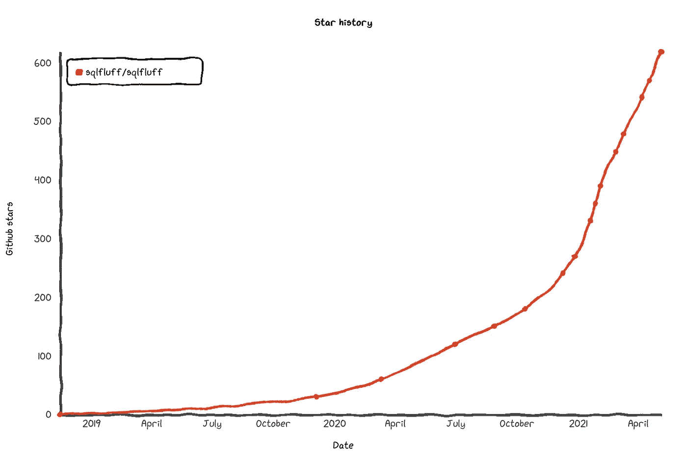
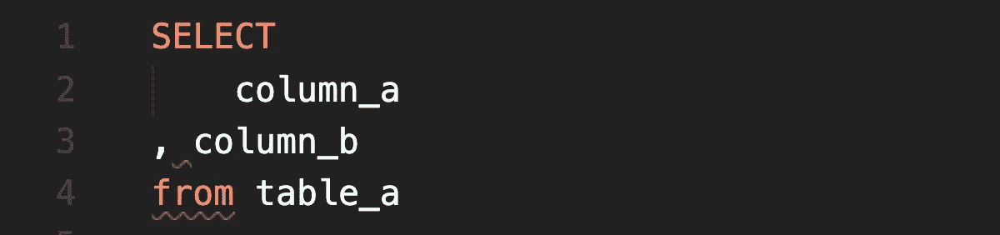
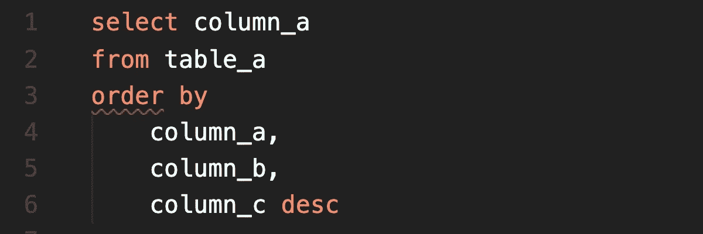
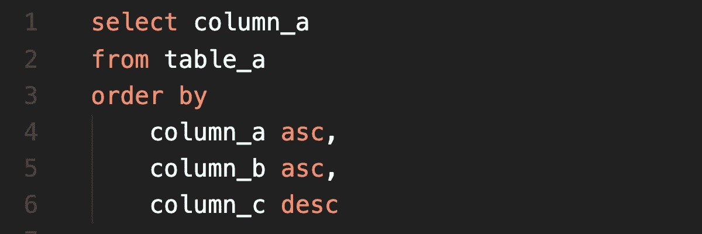
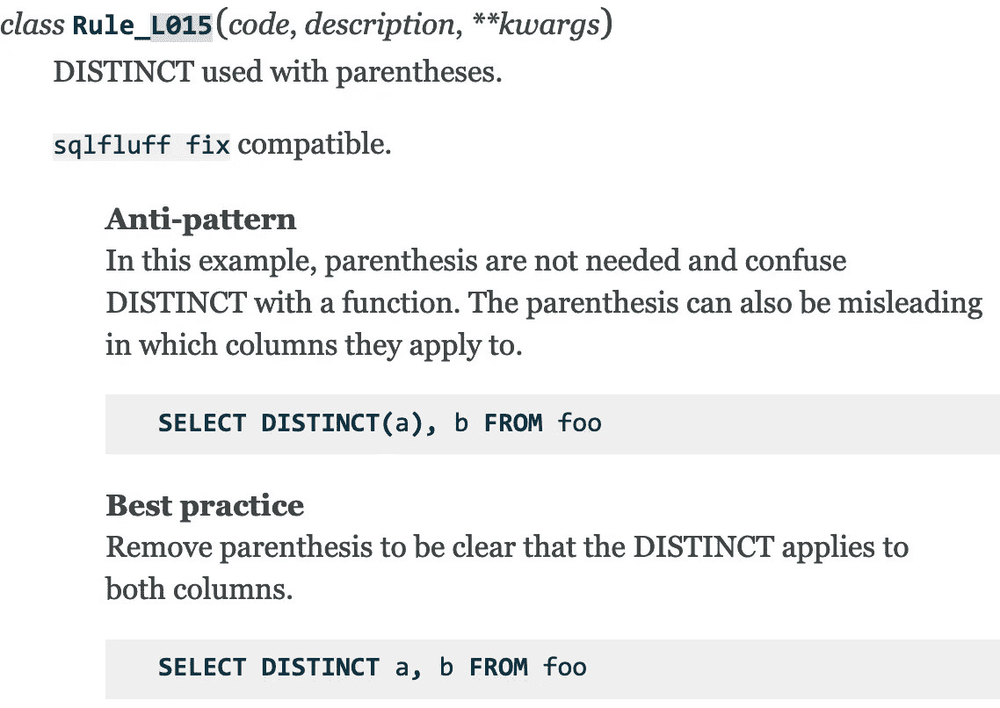
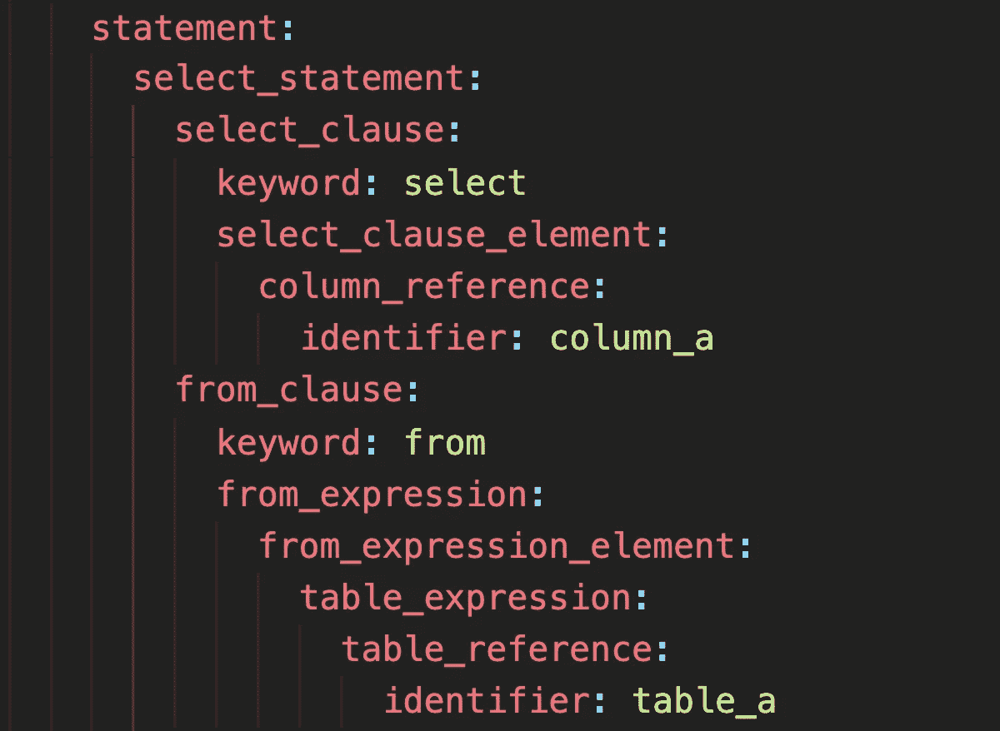
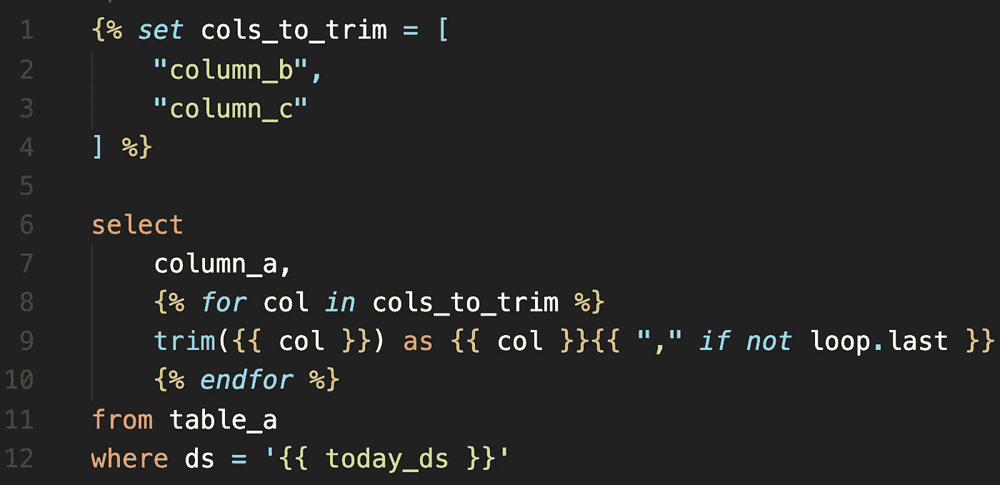

# SQL fluff——现代 SQL 的缩写

> 原文：<https://towardsdatascience.com/sqlfluff-the-linter-for-modern-sql-8f89bd2e9117?source=collection_archive---------2----------------------->

## SQL 也值得一提

## 为什么我相信 SQLFluff 有潜力为好🧹 ✨解决 SQL 林挺

布雷特·乔丹在 [Unsplash](https://unsplash.com/?utm_source=unsplash&utm_medium=referral&utm_content=creditCopyText) 上的照片

几个月前，我的团队开始大量使用 [dbt](https://www.getdbt.com/) ，因此我发现自己在编写了很长时间的 [Spark](https://spark.apache.org/) Scala 之后，大部分时间都在编写 SQL。每次当我从通用编程语言转换到 SQL 时，我都会怀念使用成熟的 linter。我害怕再次花时间在“风格”上，害怕在拉取请求上吹毛求疵。

当我偶然发现这个整洁的*小(当时)*工具叫做 [SQLFluff](https://www.sqlfluff.com/) 。我认为这个设计很有前途，(稍后我会谈到**为什么**)，所以我开始在这个项目上投入一些时间。其他人也开始定期投稿，SQLFluff 的势头越来越大。2020 年 10 月， [Alan Cruickshank](https://github.com/alanmcruickshank) (该项目的创建者)，成立了 GitHub 组织，并邀请我们中的一些人成为维护者。当时，这个项目有大约 180 颗星，现在已经超过三倍，成为 GitHub 上最受欢迎的 SQL linter🌟。

GitHub 星随时间推移，生成于[https://star-history.t9t.io/#sqlfluff/sqlfluff](https://star-history.t9t.io/#sqlfluff/sqlfluff)

在这篇文章中，我将带你了解:

*   棉绒的不同角色以及我们(维护者)如何看待它们。
*   林挺现代 SQL 面临的挑战以及 SQLFluff 如何应对这些挑战。
*   SQLFluff 的**未来**是什么样子。
*   如何让**为 SQLFluff 贡献**。

在此阅读关于标志[的信息](http://designingoverload.com/2020/04/19/a-logo-for-sqlfluff/)

# 林挺工具的作用

## 💅风格

linter 的作用之一是在你的代码上执行修饰性的规则。这些规则不会改变代码的行为方式，只会改变它的外观。

没有一致风格的代码库很难阅读和使用，因为它们的结构**不可预测**。读者没有机会习惯能让他们快速浏览逻辑的模式。

强制执行一个没有短打的**一致的**风格是很难的，因为“风格”规则可能非常**主观，**喜欢“前导”逗号而不是“尾随”逗号。没有短评，这种主观性导致了许多充满吹毛求疵的谈话和公关评论。

没有人喜欢在公关评论中挑剔风格，也没有人喜欢得到这些评论。这不仅对参与其中的每个人来说都是糟糕的体验，而且还会妨碍围绕业务逻辑、架构和测试的重要对话。

如果你习惯了像 [black](https://github.com/psf/black) (Python)或者 [scalafmt](https://scalameta.org/scalafmt/) (Scala)这样的 linters，你就习惯了不用担心风格的编写代码，因为它们都可以自动重新格式化你的代码。我们的目标是用 SQLFluff 提供相同的体验——我们认为提出样式问题是一个好的开始，但是自动执行它们是让开发人员真正忘记格式化的原因。

**SQL 改造示例:**

通过 VSCode SQLFluff 插件链接的样式错误的有效查询

“sqlfluff fix”之后的相同查询，使用默认配置

## 👃代码气味

除了“丑陋的”代码，还有另一类“有问题的”代码。据说不是*的代码是无效的*，但可能表明逻辑中有问题。例如，在通用语言中:我们可能会以定义了但从未使用过的变量、冗余导入和隐藏变量而告终。

在 SQLFluff 中，我最喜欢的例子是[规则 L037](https://docs.sqlfluff.com/en/stable/rules.html#sqlfluff.core.rules.Rule_L037) ，当“ORDER BY”显式地定义了一列的升序或降序，但却隐含了其他列的顺序时，它会发出警告。默认情况下，该行为被隐式设置为升序，但通常会对这种隐式行为感到惊讶。

通过升序进行隐式排序，通过 VSCode SQLFluff 插件进行链接

您可能会错误地认为所有三列的结果都是按降序排列的，而实际上 column_a 和 column_b 是按升序排列的，column_c 只有**是按降序排列的**

在这种情况下，fix *例程*通过重写查询在 column_a 和 column_b 上添加 ASC 关键字，使隐式行为显式化。

asc/desc 订购的明确订单

在 Scala 中，编译器将这些问题作为警告提出，而在 Python 中，通常使用 [flake8](https://flake8.pycqa.org/en/latest/) 。在 SQLFluff 中，这些问题与样式规则没有什么不同，它们也经常实现修复。

## 📖最佳实践库

对于试图**学习**一种新的编码语言及其最佳实践的人来说，记录良好的规则可以成为一个很好的伙伴。

在 SQLFluff 中，我们用一个“反模式”、“最佳实践”和一个简短的描述来记录我们的规则，该描述解释了*为什么*一个规则存在——灵感来自 [flake8rules](https://www.flake8rules.com/) 。

随着时间的推移，该项目成为 SQL 中最佳实践和反模式的知识库。它聚集并提炼了互联网上存在的所有信息:SQL 参考文档、StackOverflow、沮丧的 Tweets 以及经验丰富的 SQL 程序员的集体想法。

看一下 [Rule_L015](https://docs.sqlfluff.com/en/stable/rules.html#sqlfluff.core.rules.Rule_L015) :它强调“DISTINCT”不是一个函数，使用带有“function”语法的关键字可能会产生误导。您可以在这个 [StackOverflow 答案](https://stackoverflow.com/a/31679169)中找到相同信息，但是这个规则引起了您的注意。“*不知道自己不知道的东西*”是学习一门新语言的挑战之一，linter 可以帮助你注意到这些怪癖，这样你就可以很快发现它们。

[https://docs . SQL fluff . com/en/stable/rules . html # SQL fluff . core . rules . rule _ L015](https://docs.sqlfluff.com/en/stable/rules.html#sqlfluff.core.rules.Rule_L015)

# 林挺现代 SQL 的挑战

许多流行的通用语言中都有现成的 linters，但 SQL 没有。在我看来，这是由于许多方言的存在，以及模板化或动态 SQL 的使用。

## 🗣方言

SQL 有许多方言通常与特定的 SQL 引擎相关联:比如 Redshift、BigQuery 和 Snowflake。由于方言之间的差异，构建特定于一种方言的 linter 似乎是正确的事情。然而，在我看来，这些项目将很难建立一个足够大的社区来维持创建一个强大的 linter 所需要的工作。当用户或维护人员切换到不同的引擎时，他们会对项目失去兴趣，造成用户和贡献者的流失。

然而，我理解为什么迄今为止构建的大多数 linters 都是特定于方言的:SQL 引擎很少共享它们的解析逻辑，所以需要构建特定的解析器来理解每种方言。Spark SQL 有一个[ANTLR](https://www.antlr.org/)规范，可以用来生成一个解析器，但是这是规则的例外！

幸运的是，大多数方言都有一些**相似之处**，例如 Redshift / Postgres、Presto/Spark SQL——我们在 SQLFluff 中利用了这一点。

在 SQLFluff 中，我们定义了一个*基础*方言，它不依赖于任何特定的引擎，而是松散地基于 ANSI，我们从这个基础中派生出特定于数据库的方言。解析器的结构尽可能地被重用，但是可以添加或替换父方言的元素来处理方言之间的差异。

例如，MySQL 接受文字的双引号，所以我们[将它添加到解析器](https://github.com/sqlfluff/sqlfluff/blob/b410b4803c5fa4d1dfdb1df0be3e0c479dab8ca8/src/sqlfluff/dialects/dialect_mysql.py#L43)的“LiteralGrammar”部分。

另一个例子:BigQuery 方言接受通配符表达式中的 [EXCEPT 和 REPLACE 子句，因此我们](https://cloud.google.com/bigquery/docs/reference/standard-sql/query-syntax#modifiers_for_operator)[将这些情况添加到“WildcardExpressionSegment”](https://github.com/sqlfluff/sqlfluff/blob/b410b4803c5fa4d1dfdb1df0be3e0c479dab8ca8/src/sqlfluff/dialects/dialect_bigquery.py#L234)。

将方言抽象成可组合的解析器是 SQLFluff 最强的特性之一——它允许我们从相似的父方言中派生出一种方言。得到的解析结构**不依赖于任何特定的数据库引擎**，使我们能够拥有与方言*无关的规则*。

下面是`sqlfluff parse my_file.sql --code-only --format yaml`输出的部分结构:

SQLFluff 能够以 json、yaml 或“人类”格式输出它解析的结构

*在撰写本文时，SQLFluff 实现了以下方言:BigQuery、Exasol、MySQL、Postgres、Snowflake、Teradata。*

## ✨模板

像 [Apache Airflow](http://airflow.apache.org/) 和 [dbt](https://docs.getdbt.com/) 这样的大规模流行工具已经使模板化 SQL 成为标准。这两个工具都使用 Python 库 [Jinja](https://jinja.palletsprojects.com/en/2.11.x/) 作为它们的模板引擎，这使得:

*   将**变量**注入 SQL 代码。
*   定义生成 SQL(宏)的**函数**。
*   **对于循环和宏，通过使用变量避免重复**。

这些特性允许 SQL 开发人员编写更多**可维护的**代码，并且更有**生产力**，所以我们认为这是 linter 支持的一个重要特性。

用 Jinja 模板化的查询示例

SQLFluff 以模块化的方式支持模板化。今天，我们支持关闭模板，使用 Jinja，或者使用在内部重用 dbt 编译器的 dbt 模板。

支持模板也带来了挑战！例如，大多数用户不关心模板化部分中的样式**问题，所以我们必须找到一种方法来忽略它们(错误，而不是用户)😅).Alan 实现了“源代码映射”，报告用户看到的行号(模板化前)，而不是模板化后。我们有时也会看到修复规则*会将*泄漏到模板化部分的问题。**

我认为该项目正在快速解决所有这些特定于模板的困难，我非常兴奋地看到 SQLFluff 中模板支持的发展，如预模板代码上规则的实现，例如应用于 Jinja 标签的 [Rule_L046](https://docs.sqlfluff.com/en/stable/rules.html#sqlfluff.core.rules.Rule_L046) 。

# SQLFluff 的未来

## 🤔超越风格和代码气味的规则

我们最近在 SQLFluff 中添加了[插件](https://docs.sqlfluff.com/en/stable/developingplugins.html)，允许用户在自己的公司中开发自定义规则，而不必与社区共享。

我希望它将允许用户试验非常特定于他们用例的规则，这些规则不容易被共享。

例如，我们可能开始看到强制执行与 GDPR 相关的限制的规则，比如“不要使用这个列，使用这个新的匿名列”。我很高兴看到社区对这一功能所做的工作，以及我们将来会看到的规则。

## sqlfluff 的不同接口

如果你在 GitHub 上查看 [SQLFluff 组织](https://github.com/sqlfluff)，你会看到几个项目。其中包括:

*   [sqlfluff-online](https://github.com/sqlfluff/sqlfluff-online) 允许用户在网站上获得他们的 SQL 链接。
*   [vscode-sqlfluff](https://github.com/sqlfluff/vscode-sqlfluff) 实现一个 vscode 插件。
*   [sqlfluff-github-actions](https://github.com/sqlfluff/sqlfluff-github-actions) 有 github 动作。

还有[文档](https://docs.sqlfluff.com/en/stable/production.html)介绍如何在 CI 中使用 SQLFluff 和 [diff-quality](https://github.com/Bachmann1234/diff_cover) 或[预提交](https://pre-commit.com/)。

理想情况下，我们会看到更多的 ide 与 SQLFluff 集成，有更多的方式在 CI 上运行它，甚至有供应商在他们的 SQL 编辑器中使用 SQLFluff。

## 🤖类型检查

目前，SQLFluff 不使用来自 SQL 引擎的元数据。

如果是这样的话，我们可以用每一列的类型和表的模式来丰富解析后的 SQL。它将开启一整类的规则！例如，当对错误类型的列调用函数时，或者当选择了源表中不存在的列时，规则可能会失败。

在 SQL 中实现**类型安全**将是一个伟大的里程碑。

# 贡献给 SQLFluff

为项目做贡献的方式有很多，没有必要写代码做有意义的贡献！

*   使用项目和[报告你遇到的问题](https://github.com/sqlfluff/sqlfluff/issues/new/choose)。
*   帮助回答社区关于[我们的 Slack](https://join.slack.com/t/sqlfluff/shared_invite/zt-o1f4x0e8-pZzarAIlQmKj_6ZwD16w0g) 的问题，在 [GitHub issues](https://github.com/sqlfluff/sqlfluff/issues) 或者 [dbt Slack](https://community.getdbt.com/) 的#tools-sqlfluff 频道。
*   编写[文档](https://github.com/sqlfluff/sqlfluff/tree/master/docs)。
*   尝试在您的团队中推出 SQLFluff。
*   谈论/写 SQLFluff。

如果您决定编写代码，您可以参与项目的不同领域:

*   **方言**:多为解析逻辑。
*   **规则**:文档，添加新规则，添加规则的自动修复。
*   **模板**:支持新的模板引擎，改进现有的模板以及它们如何与代码的其余部分交互，比如当一个规则被应用了一个补丁时。
*   **性能**:速度，cpu，内存使用。

当然，对开发工作流程的改进，以及重现 GitHub 问题中出现的 bug 的测试总是受欢迎的！

# 结论

感谢您阅读并对该项目感兴趣！我希望你能很快成为这个社区的一员😀。

我要感谢 [Alan Cruickshank](https://github.com/alanmcruickshank) 创建了这个项目，投入了这么多时间，并邀请我们(维护者)更直接地为 SQLFluff 做出贡献。

当然，通过这个项目，我认识了很多不可思议的人，我从他们身上学到了东西，并喜欢和他们一起工作。

当你和人们的大部分互动都是通过拉式请求评审，而你最终还是喜欢他们的时候，你知道他们是好人😁。

社区非常友好和支持，Slack / GitHub 上的每一次互动都非常积极。🙇‍♂️

最后，下面是 Alan 在 Coalesce 2020 上关于 SQLFluff 的演讲:

Niall Woodward (维护者)写了一篇博客，讲述了他一年来为开源做贡献的经历:

<https://www.niallrees.com/posts/lessons-from-a-year-of-open-source> 