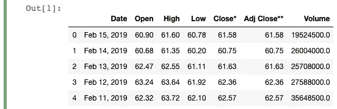
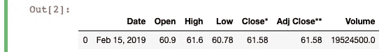
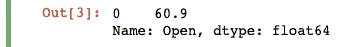
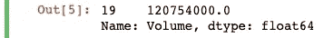

# 在你的熊猫节目中加入新的技巧

> 原文：<https://towardsdatascience.com/squeezing-a-new-trick-into-your-pandas-repertoire-d8ae3f338246?source=collection_archive---------52----------------------->

## 大蟒

## 看看如何将 Pandas 对象转换成标量来进行更多的计算


照片由[桑迪·克拉克](https://unsplash.com/@honeypoppet?utm_source=medium&utm_medium=referral)在 [Unsplash](https://unsplash.com?utm_source=medium&utm_medium=referral) 拍摄

Pandas 库允许您轻松地将数据切片和切块。通常，您将处理各种形式的数据帧和系列。您可以使用 groupby 聚合数据，甚至可以创建一个 MultiIndex 来增加表的层次结构。

然而，有时您会希望能够处理非熊猫对象形式的数据。在这些情况下，能够将您的熊猫对象转换成标量值就太好了。

为此，您可以只使用一行代码，其中包含一个内置的 Pandas 方法。让我们来看几个例子，看看如何做到这一点！

如果您想继续这篇文章，请运行下面的代码来导入我将在示例中使用的数据:

```
import pandas as pddf = pd.read_html("[https://finance.yahoo.com/quote/TSLA/history?period1=1546300800&period2=1550275200&interval=1d&filter=history&frequency=1d](https://finance.yahoo.com/quote/TSLA/history?period1=1546300800&period2=1550275200&interval=1d&filter=history&frequency=1d)")[0]
df = df.head(30)
df = df.astype({"Open":'float',
                "High":'float',
                "Low":'float',
                "Close*":'float',
                "Adj Close**":'float',
                "Volume":'float'})
df.head()
```



现在让我们开始吧！

# 使用挤压将熊猫对象转换为标量

假设我们想要获得特定日期的“开放”列值。为此，我们可以利用`loc`和一些条件选择从现有数据帧中获取一行:

```
feb_15_data = df.loc[df['Date']=='Feb 15, 2019']
```



*如果您不熟悉* `*loc*` *和条件选择，请查看链接在该块底部的第一块。*

现在我们已经返回了只包含 Febary 15 的值的所需行，让我们看看当我们试图只为这一行选择“Open”列值时会发生什么:

```
feb_15_open = feb_15_data['Open']
```



正如您所看到的，我们得到了我们需要的值“60.9”，但是我们也得到“0”左边的索引值以及下面 Panads 对象的描述(Name 和 dtype)。对于我们来说，要获得标量值，我们需要做的就是在当前的熊猫对象上使用`squeeze`方法:

```
feb_15_open_scalar = feb_15_open.squeeze()
```


现在我们已经将标量值赋给了一个新变量！现在，您可以像对待任何其他浮点值一样对待该变量(因为这是在读入数据时分配给它的 dtype)。

我们可以再次经历相同的过程，但是这次从一系列开始。首先，我们来看看“体积”系列。然后，我们将应用条件掩码并寻找一个真正高的值:

```
volume = df['Volume']
volume_highest = volume[volume > 100000000]
```



和前面的例子一样，我们确实得到了系列中最高“Volume”的期望值，但是我们也看到了相关的索引和 Pandas 对象描述符。如果我们再次对它使用`squeeze`方法，并将它赋给一个新变量，我们将再次得到一个标量值:

```
volume_highest_scalar = volume_highest.squeeze()
```


现在，您可以自由地使用这个变量在数据帧上或在未来的数据分析步骤中执行更多的操作。

仅此而已！

我希望你发现这个快速提示对你将来的熊猫工作有帮助。更多熊猫和我的数据分析相关的作品，请随时查看下面的链接！

```
**More by me:** - C[onditional Selection and Assignment With .loc in Pandas](/conditional-selection-and-assignment-with-loc-in-pandas-2a5d17c7765b?sk=e5672d859a3964c1453a1c09edca22cf)
- [2 Easy Ways to Get Tables From a Website With Pandas](/2-easy-ways-to-get-tables-from-a-website-with-pandas-b92fc835e741?sk=9981ddaf0785a79be893b5a1dd3e03dd)
- [5 (and a half) Lines of Code for Understanding Your Data with Pandas](/5-and-a-half-lines-of-code-for-understanding-your-data-with-pandas-aedd3bec4c89?sk=7007a1ae248cf7ea4ef5fcd4af7ae72b)
- [Top 4 Repositories on GitHub to Learn Pandas](/top-4-repositories-on-github-to-learn-pandas-1008cb769f77?source=friends_link&sk=d3acc38062490a86ecb46875342224e6)
- [Learning to Forecast With Tableau in 5 Minutes Or Less](/learning-to-forecast-effectively-with-tableau-in-6-minutes-or-less-3d77a55930a0?source=friends_link&sk=9abdfd7533ee9a31ab8a036413450059)
```