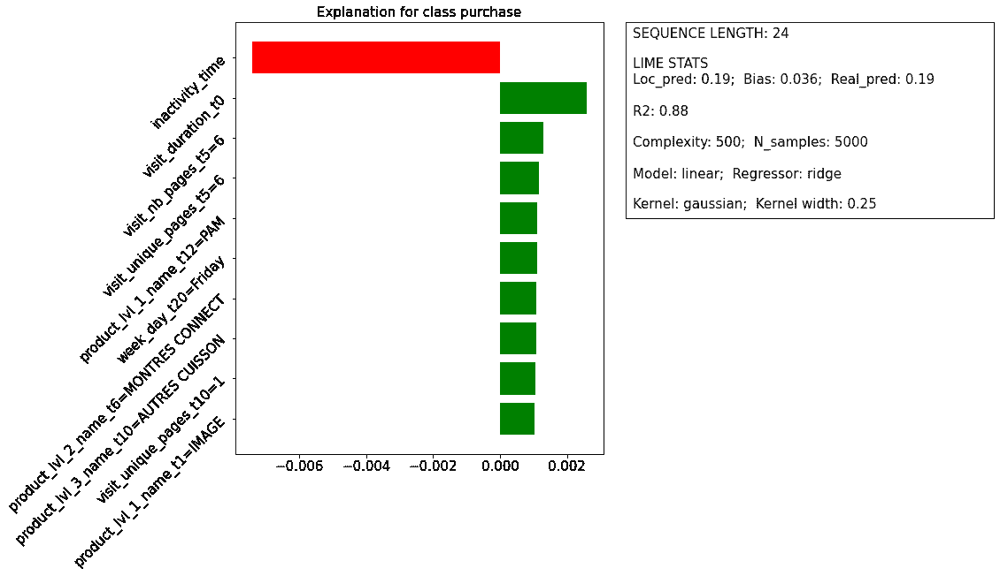
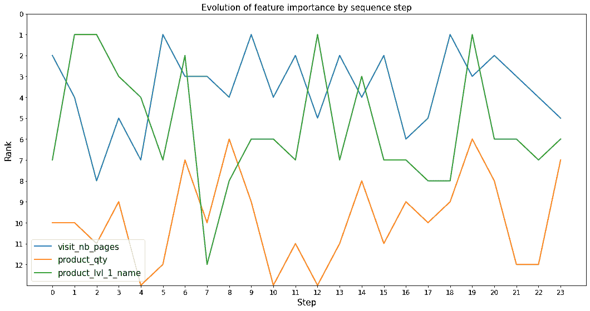

# 在定制网络中压榨石灰

> 原文：<https://towardsdatascience.com/squeezing-lime-in-a-custom-network-7aa30386d342?source=collection_archive---------27----------------------->

## [模型可解释性](https://towardsdatascience.com/tagged/model-interpretability)

## 怎么解读口译员？

[Rbm](https://medium.com/u/9b0392f1f17a?source=post_page-----7aa30386d342--------------------------------) ，[本杰明拉鲁斯](https://medium.com/u/a4938c085468?source=post_page-----7aa30386d342--------------------------------)，[托马斯 g](https://medium.com/u/3055c6b8c907?source=post_page-----7aa30386d342--------------------------------)

我们定制的 RNN-LSTM 网络架构。(图片由作者提供)

机器和深度学习模型应用于广泛的领域，从基础研究到工业和服务业。它们对各种各样问题的成功应用进一步促进了该领域的扩展:它正在经历一个“黄金时代”,这个时代的尽头仍然看不到。

虽然预测和分类算法的发展充满了成功的故事，但仍有几个必须妥善解决的重大挑战，这也是目前几项研究的主题。

模型可解释性(通常被称为“*可解释的人工智能* (XAI)”)就是这些问题之一。问题的核心是提供一种方式来理解和解释预测算法背后的基本原理，否则这些算法将像黑盒一样运行。

要求更好地理解机器学习模型的结果有各种各样的原因，但列出一些我们可以想到的原因:

*   更深入地了解模型再现的机制。我们可以想到机器学习应用于基础研究的情况，在这种情况下，仅仅有一个模拟观察到的行为的算法是不够的，但理解它背后的机制很重要；
*   增加最终用户对模型结果的信任。由于人工智能应用于不同的领域，算法的最终用户可能是应用领域的专家；然而，他或她不一定有机器学习的背景。通过使用可解释性算法来理解模型结果，他或她可以有意识地应用或拒绝从预测算法中获得的信息；
*   法律问题。随着机器学习应用的兴起，为保证正确使用算法运行所需的数据而发布的法规也在增加。尊重法律约束(例如 GDPR 中包含的*解释权*)需要正确理解算法的基本原理。这种理解可以通过可解释性的算法来获得。

此外，模型结果的解释可以作为在算法开发期间评估算法有效性的附加工具。

随着这种(相对)新趋势的出现，我们决定将一种不同的可解释性算法应用于预测客户购买概率的模型。选择的算法是 LIME(T2 本地可解释模型不可知解释的缩写)。

接下来的部分描述了预测算法的功能，并简要介绍了时间解释器。最后给出了它在我们的用例中的应用结果。

本文省略了可解释性理论和可用模型的细节，因为文献在这个主题上提供了足够的材料。那些有兴趣进一步探索这一主题的人可以从 Christoph Molnar 的著名著作开始。

<https://christophm.github.io/interpretable-ml-book/>  

## 我们感兴趣的算法

我们将尝试解释的模型是一种深度学习算法，它根据客户的导航历史预测客户在未来 *X* 天(其中 *X* 通常是 7 或 28)购买一件商品的概率:页面浏览量、购物篮、在线购买和实体店购买。它为我们提供了表征用户行为的事件序列。因此，可以训练一种算法，用于基于该数据来估计购买概率。

输入长度(即客户端历史中的事件数量)不是固定的，可以任意大。此外，每个事件都有许多特征，这使得数据集相当大。出于这些原因，我们选择使用深度学习算法，特别是长短期记忆(LSTM)，这是一种递归神经网络(RNN)。LSTM 网络非常适合任意大长度的输入，也可以将相对旧事件的信息保存到内存中。

为了有效地使用提出的 LSTM，我们从数据预处理开始，以便对原始数据进行整形..并非所有特征都是数字的；因此，必须考虑它们的特殊性(例如，值的类型和范围)。这一步非常重要，可以减少内存使用，提高预测质量。

LSTM 网络在 *Tensorflow 1.15* 中设计。它根本不是一个普通的网络:考虑到我们数据输入的特殊性，我们构建了一个自定义架构，使用独立的 LSTM 单元来表示数字特征和分类特征。下图显示了该架构的示意图。

*购买概率模型示意图。(图片由作者提供)*

架构的定制性质以及每个事件的大量功能(约 50 个)使得解释在许多方面变得复杂:必须考虑许多维度，并且由于我们的架构不是标准的，*现成的*可解释算法不能直接使用。尽管如此，这些算法是我们在这项研究中想要实现的目标的起点。

## (又一个)石灰底漆

LIME 是一个本地代理模型；因此，可解释的模型，通常是一个线性模型或一棵树，适合在实例的邻域中进行解释。由于是模型不可知的，LIME 可以应用于任何类型的期望算法，包括深度神经网络。

拟合局部解释器所需的训练数据集是由 LIME 通过扰动要解释的实例来生成的。通过将扰动的数据传递给模型进行解释，得到相应的标签。

*为石灰生成输入数据和标签的模式。(图片由作者提供)*

通过最小化损失函数(其是加权 RMSE)来训练可解释的模型。权重是根据扰动数据与要解释的实例的距离来定义的；数据越接近，权重越高。

*使用合成数据对权重的影响的例子。红点是要解释的实例，蓝点代表受干扰的数据。在右图中，点的大小根据权重进行缩放。(*图片由作者提供)

为了加强模型的可解释性，损失函数的最小化受到复杂性度量的约束，即在可解释模型中应用的特征的数量。该过程旨在确保局部保真度(即，可解释模型必须是原始模型的足够好的局部近似)和可解释性(即，可解释模型必须具有低复杂度)。

尽管 LIME 算法很简单，但它依赖于用户可以调整的几个参数和定义，这些参数和定义会影响最终结果。最重要的一个是损失函数中基于距离的权重的核心的核函数的定义。默认情况下，LIME 使用欧氏距离的指数内核，默认内核宽度为 0.75 √(nf ),其中 nf 是要素的数量。

在 LIME 中，每个特征对预测的影响由其在局部解释器中的权重来定义。通过这种方式，可以获得不同要素的相对重要性和影响“方向”的估计值:权重为正的要素将预测推向所选标注，权重为负的要素将预测推离所选类。

## 当模型和石灰结合时

尽管 LIME 是模型不可知的，但是将算法直接应用于我们的模型就像试图将两个不合适的拼图块匹配起来一样。如果不首先找到两者之间的缺失部分，这是不可能的，在我们的例子中，这对应于预处理和后处理步骤..为了使预测模型的约束与解释者的约束相匹配，这是必需的。

石灰要求:

*   二维数组形式的一组训练数据；这些数据应该与用于预测模型的训练数据相同。LIME 评估每个连续特征的平均值和方差，以及每个分类特征的对(值，频率)。作为替代，可以通过向 LIME 提供包含该信息的字典来避免这一步骤；当训练数据集非常大时，这是一个有用的解决方案；
*   要解释的实例必须是与定型数据具有相同数量特征的二维数组；
*   原始模型必须具有预测功能。

这最后两个要求不会对类似于 scikit-learn 包中可用的模型造成任何特殊的约束。在我们的情况下，这些要求可能很严格。

我们估计购买概率的模型不满足这些要求。模型的输入由每个 LSTM 单元的三维阵列和致密层所需的附加二维阵列组成。扰动数据的产生在我们的应用中提出了另一个问题。当扰动实例来解释时，LIME 没有约束，但具有从训练数据获得的特征的统计属性。此外，一些特征是相互关联的；当产生扰动数据时，必须处理这些关系。例如，在我们的模型中，一周中的第*天*变量就是这种情况，由一个热编码向量表示。LIME 中的默认扰动不考虑这种约束，从而最终生成包含不止一个不为零的元素的向量。

为了解决所有这些问题，我们设计了一系列预处理步骤，以便以适合于时间的形式映射原始模型的输入，从而确保扰动输入的一致性。显然，当由 LIME 产生的扰动数据作为输入输入到原始模型中时，变换必须是反向的。这种方法不仅与 LIME 相关，而且在应用模型不可知的解释器时，已经被视为一种通用方案。

预处理部分包括以下转换:

*   将一个热编码的数字特征映射到标签编码的分类特征上；
*   将 LSTM 细胞的三维输入整形为二维阵列；
*   将不同的输入连接成一个数组。

后处理部分包括以下变换:

*   对相互依赖的分类特征进行重采样(如有必要)；
*   将采样数据转换(当特征需要时)为正值；
*   在预处理阶段反转转换。

## 使用前检查您的仪器:石灰的参数分析

购买预测和 LIME 的算法应用于一组真实世界的数据，这些数据属于一家专门从事消费电子产品和家用电器的法国零售商。

举个例子，我们将 LIME 应用于一个实例，这个实例在我们的购买预测算法的上下文中由一个人表示，这个人有一个特定的导航历史，可以最终导致一次购买。

下图显示了 LIME 使用参数默认值提供的解释。

*用石灰解释单个实例的例子。(*图片由作者提供)

左侧面板显示了每个特征的权重，这些权重是通过拟合解释器来评估的。每个特征的重要性基于其权重的绝对值。由于问题的顺序性质，权重指的是一对(特征、步骤)。因此，相同的特征在序列中的不同位置可能具有不同的效果；例如，案例“产品 _ lvl _ 2 _ 名称=电视”在 t=2 时有正面影响，在 t=3 时有负面影响，在 t=4 时没有影响。

右侧面板列出了关于实例的序列长度和组成所解释实例的序列总数的信息；此外，还提供了一些关于解释者的信息。这些数字表明，尽管 LIME 提供的本地预测确实接近原始模型获得的真实值(使用 LIME 和原始算法的购买概率分别为 15%和 19%)，但决定系数(R 平方值)极低，这表明本地模型相当不可靠。

在把石灰扔进垃圾桶之前，我们可以花一分钟思考一下这种低保真度的原因…

第一个猜测是本地模型的复杂度太低。原始模型需要大约 50 个变量作为输入。当应用前一节中提到的预处理转换时，这个实例的特征数量增加到大约 400 个，这比用于训练局部解释器的 10 个特征要多得多。

为了验证这个假设，我们基于完全相同的解释器，但不同的复杂性，实现了对同一实例的几种解释。下图显示了要素数量对生成的 R 平方值的影响。

*作为解释器中特征数量的函数的 R 平方系数和调整的 R 平方的演变。垂直虚线表示在解释的实例的原始模型中应用的真实特征的数量。(*图片由作者提供)

变量数量的增加确实会导致 R 平方值的小幅增加；然而，对于大约 600 个特征，调整后的 R 平方值达到其最大值。这表明 R 平方的增加是由简单增加新特征引起的虚假增加。调整后的 R 平方值的最大值约为 0.16；这个相当小的值不能确保局部解释器的保真度。

有趣的是，对于大约 600 个特征获得了最大值，这高于对应于该实例的真实变量的预期的大约 400 个特征，并且由图中的垂直虚线表示。这个高数字可能是由 LIME 引起的，它为整个(特征、步骤)对集生成扰动数据，因此也包括大于实例的最大序列长度的序列步骤，并且应该被认为是伪值。*(我们需要一些背景知识。最初的 LSTM 模型涉及具有可变序列长度的输入，这种特殊性通过组合使用分桶和填充来解决。另一方面，当训练 LIME 解释器时，我们需要考虑所有训练数据中的最大序列长度，以便能够将解释器应用于任何期望的实例，而不管它们的序列长度；另一种方法是为数据集中每个可能的序列长度提供一个解释器。因此，当生成扰动时，解释器可以包含序列长度大于要解释的实例的序列长度的变量。)*

这个简单的分析表明所获得的解释对石灰参数是多么敏感。解释器的复杂度只是可以调整的参数之一。其他相关的是样本数量(代表解释器的训练数据数量)和核宽度(为了简单起见，我们没有考虑核函数本身和核函数内距离的定义，同时保持默认定义不变)。

为了恰当地应用 LIME，我们必须确定最佳的参数来提供一个可理解的解释(用低复杂度来表示),而不会严重影响解释者的忠实度。考虑到这一目标，我们对调整后的 R 平方得分进行了参数分析，作为模型复杂性、生成样本数和内核宽度的函数。目标是找到提供最佳分数的三个参数的组合。全尺寸参数分析在计算上是昂贵的。因此，我们选择了一小组可能接近最优值的值。

下图清楚地显示了核宽度是影响调整后的 R 平方系数的主要参数；内核宽度越短，得分越高。

*调整后的 R 平方系数对解释器参数的依赖性。(*图片由作者提供)

这种行为是合理的。当最小化损失函数时，减小核宽度强调更接近实例的扰动数据的重要性。与解释相关的实例的邻域越小，原始模型越有可能用线性函数来近似，因为非线性效应不太明显。通过只关注内核宽度为 0.25 的情况(即，具有最佳结果的情况)，可以更好地理解剩余两个参数、复杂度和样本数量的作用。

下图显示了分数作为两个变量的函数的近似演变。调整后的 R 平方值随着样本数量和复杂性的减少而增加(在本分析的测试范围内)。用 5000 个样本和 300 到 500 之间的复杂度获得最佳分数。

*调整后的 R 平方系数对解释器中特征数量和生成样本数量的依赖性。(*图片由作者提供)

这个小而重要的参数分析强调了调整 LIME 解释器以便正确使用的重要性；否则，会得出误导性的结论。

根据这些结果，我们模型的最佳解释器具有 0.25 的核宽度、500 的复杂度和 5000 个样本。

在下一节中，将展示解释器的应用程序，以提供对原始模型结果的深入了解。

# 🥁…的解释是送达

## **单解释**

找到了一组保证足够好的保真度的参数后，我们现在可以彻底看看对感兴趣的实例所得到的解释。

下图给出了与上一节类似的解释；这个是用新的解释器得到的。对于 500 个特征的复杂性，所呈现的 10 个特征是关于重要性(定义为权重的绝对值)的前 10 个特征。

*用优化的 LIME 解释器解释单个实例。(*图片由作者提供)

显然，新的解释与以前的解释大相径庭。最重要的特征(具有负面影响)是*不活动时间*；它被定义为从预测日到用户最后一次交互日之间的时间段。该特征在之前的解释中不存在。所有其他功能对购买都有积极的影响。相对于前一种情况的另一个不同是特征的小权重。这可能是因为解释中使用了大量的特征。

目前的解释确实可以提供一些原始模型的基本原理的见解。当考虑模型的范围时，*不活动时间*的重要性显得合理。长的*不活动时间*可以暗示该人对所观看的产品不感兴趣，这转化为微弱的购买可能性。相比之下，短的*不活动时间*可以指示仍然活跃的购买兴趣。因此，在对购买意向进行建模时，该变量可能是一个重要的驱动因素；解释证实了这个假设。

基于给出的解释，其他特征的影响更难提取和理解。包括变量和序列步骤的混合信息不能提供每个特征的总体影响的清晰图像。此外，从每一步更重要的变量中得出结论是不可能的。

为了获得对这些问题更透彻的了解，通过特别关注这些方面，产生了相同解释的表示。

## **按照顺序步骤**解释

**

**实例历史中两个不同步骤的解释示例。(*图片由作者提供)*

*上图提出了解释每个步骤中每个特性的影响的问题。该表示类似于上一节中的表示；但是，特征权重指的是特定的步长(在这种情况下，左边的 t = 7，右边的 t = 19)。在本说明中，不存在与步数无关的特征(如*不活动时间*)。*

*该描述提供了从前一个描述中难以获得的附加信息。更具体地说，可以更容易地确定哪些特征在特定步骤具有正面或负面影响。此外，当在不同的会话中移动时，可以观察到特征排序的演变。例如，在 t = 7 时，变量 *month* 排名第二，具有正面影响，而在 t = 19 时，它不在前十名之列。类似地， *product_lvl_1_name* 在 t = 7 时不存在，而它在 t = 19 时排名第一。当然，这些信息可以根据用户的目标进行不同的解释。应用该模型来增加销售的最终用户可以看到变量*月*在 t = 7 时的重要性，作为与观察到的产品的链接，如果该产品通常在夏季销售的话。模型的开发者可以假设变量在历史的最初步骤中是重要的，以建立模型的“环境”(例如，一年的时间或位置)。*

*因此，变量在整个序列中的相对位置的变化可能是重要的信息，应该提取这些信息，而这些信息是先前的表示所不能清楚提供的。*

**

**作为用户历史中的步骤的函数的特征重要性的演变。(*图片作者)*

*为了解决这个问题，我们准备了一个图表(见上图),展示了特征等级相对于序列步骤的演变。显然，等级信息比权重与这种类型的图更相关，因为后者是标准化的。然而，该图不包含特征影响预测的方式的信息。等级的演变为模型提供了额外的洞察力。例如，功能 *visit_nb_pages* 几乎总是在前五名，这强调了它的重要性。功能 *product_lvl_1_name* 仅在特定步骤中获得重要性，这可能表示新会话的开始或新产品的可视化。同样，可以从图中提取的洞察信息的类型也取决于最终用户。*

## *根据功能的**解释***

**尽管先前的图集中于从解释中提取与历史的单个步骤相关的信息，但是仍然缺乏对变量对于整个历史的全局重要性的整体理解。**

**下图解决了这个问题。两个结果都是通过合计整个序列的特征的权重而获得的。在左侧，变量根据绝对重要性进行排序，绝对重要性由路径上每个要素的权重绝对值的平均值定义。在右侧，通过评估路径上的实际平均权重来维护要素的影响方向。显然，在该图中，权重不再与拟合的线性模型相关(除了变量*不活动时间*)；相反，它们是对特性重要性的简单度量。**

****

***特征重要性(左)和特征影响(右)在所解释的实例的整个历史上平均。(*图片由作者提供)**

**第一个解释已经证明了变量*不活动时间*是最重要的一个，并且它对购买概率有负面影响。此外，这些图提供了关于特征的全球重要性的额外信息。平均而言，似乎所有功能(除了*inactive _ time*)都通过将预测推向购买产生了积极的影响。通过查看图的下部，可以注意到特性 *product_rating* 和*product _ number _ of _ ratings*的无用性。如果这种行为在不同的实例中重复出现，那么说明可以简单地从模型中省略这些特征，而不会影响最终的结果。(我们认为这些特征应该很重要——*宁愿购买五星商品，而不是零星商品*——暗示背后的数据可能是坏的或缺失的……)。对于其他变量，例如经度*或时间*可以得出类似的结论。****

**因此，试图改进模型性能的开发者可以为变量的权重设置阈值，并检查仅基于超过阈值的特征的更简单的模型是否提供具有更少变量的类似预测。最终用户可以通过改进由变量*product lvl 2–3 name*定义的产品的已访问页面的内容来增加*访问持续时间*并调整*访问 nb 页面*和*访问唯一页面*来从该信息中获益。**

**对模型结果的解释不再是产品的附加特征；这对于确保透明度、提高对产品的信任度以及满足有关数据利用的最新法规至关重要。**

**LIME 是一个相当灵活的工具，可以提供这些可能性。通过使用 LIME，我们可以深入了解预测背后的基本原理，并得出结论，这些结论可以反馈到模型中以进一步改进模型，或者由最终用户用来制定销售策略。**

**解释器的灵活性有其第一次使用的复杂性的缺点。如果预测模型相当复杂(如我们的情况)，必须进行密集的预处理和后处理，以使模型与解释者相匹配，而不会得到误导性的解释。此外，对参数的敏感性要求进行精确的分析，以确保对问题采用最佳的解释；这项任务计算量很大。**

**预测模型中递归网络的使用使得解释器的直接使用变得困难；需要更多的努力来获得对解释结果的更透彻的了解。**

> **总的来说，石灰是一种有用的工具，但在使用前需要仔细准备。**

**在未来的帖子中，我们将测试 **SHAP** 对同一模型的能力，以检查我们是否遇到了与 LIME 相同的问题，以及它是否提供了更好的适合循环网络的解释。**

****

**这项工作已经在 [easyence](https://www.easyence.com/) 数据实验室内完成。**