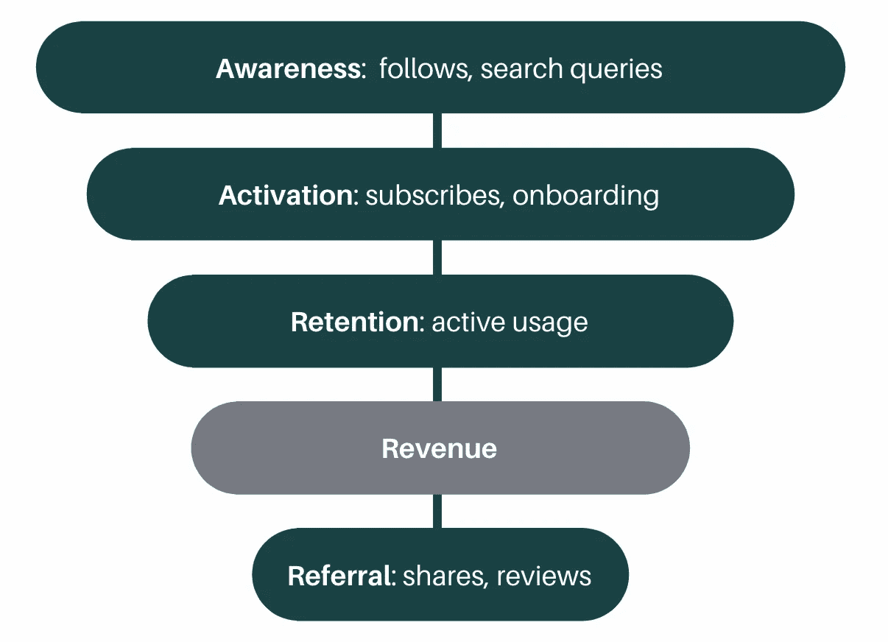

# 充分利用细分市场

> 原文：<https://towardsdatascience.com/squeezing-the-most-out-of-segmentation-466db9d08573?source=collection_archive---------42----------------------->

## 这种分析有意义吗——还是我们将继续分裂？

杰西卡·路易斯在 [Unsplash](https://unsplash.com?utm_source=medium&utm_medium=referral) 上的照片

*每当有人要求对我们的客户进行细分，然后提供预先确定的属性来对他们进行分组时，我会立即想到——你只是想让我过滤数据吗？这种细分是最好的，还是简单的受众创造？*

如果我们参考分段的定义——也就是说，根据组中的相似性*和*组之间的不同性*来整理个体——那么上述要求看起来完全合理。那么，为什么它们会留下如此令人失望的余味呢？*

事实上，我对这种类型的分割的不满源于分割所提供的丰富性。要提取的实在太多了(双浆！)将客户从他们的人口统计属性或描述性特征之外进行细分。以我自己为例——作为一名 30 多岁的女性，我对护发产品毫不关心(我认为一个好发型的一天就是我洗头的时候)。如果你把我分到一个完全基于人口统计的细分市场，你将很快告别你的空气动力学广告支出。

细分的美妙和丰富之处在于两个观点，这两个观点不仅证明了细分本身，还证明了细分分析。首先，我们如何看待漏斗——考虑个人在转化前后的*行为*倾向，以加强我们对他们的分组。第二，我们如何看待可扩展性——将细分分析作为营销和产品计划的持续措施进行整合。正是这种将个人分组的思维模式，提供了丰富的(有点讽刺意味的)个性化用户体验。

## **漏斗图:远离浅层……**

虽然你可以收集的用于细分分析的第一方行为数据的数量通常取决于个人的转化漏斗有多低，但肯定不仅限于他们成为客户之后。事实上，有行为数据可以在漏斗的两个方向上增强细分，转换前和转换后。

行为数据不仅限于转化的收入阶段(AARRR)漏斗[图片由作者提供]

如果你观察漏斗的上部，你可以从意识阶段开始使用行为属性。潜在客户的行为可以通过网站用户搜索信息、消费内容和进行比较的方式的差异来挖掘。这些行为表明用户倾向于通过漏斗进一步移动，从而采取比仅使用人口统计特征的细分市场更有效的策略。

通过漏斗进一步遍历，你会发现超越收入(或交易)阶段的有价值的行为属性。利用行为深入研究了过去顾客在购买点的行为——揭示了突出产品更符合市场、更能体现其价值的持续趋势。举个简单的例子，顾客 A 购买了价值 100 美元的产品，但只使用了其中的 50%,他可能不如顾客 B 有价值，顾客 B 购买了价值 60 美元的产品，但使用了 100%。这些行为，以及推介行为，如推广人评论，透露了优化客户终身价值的机会；不仅仅是他们的人口统计学甚至交易属性传播了顾客对产品的适应性。

## **可扩展视图:运行精益 v 扩展**

到目前为止，我已经通过采用全漏斗视图向您展示了细分的丰富性。那么，你如何利用这种方法呢？好消息是，好处既有眼前的，也有长远的——从获得快速洞察，到使用您的客户数据库将细分构建为可扩展的数据产品。此外，通过聚类分析对个体进行细分(不仅仅是任意决定如何对个体数据点进行分组)应用了既精简又可扩展的统计严谨性。

让我们从快速洞察开始——我最近已经能够修补 Tableau 相对精简但有洞察力的集群[解决方案](https://help.tableau.com/current/pro/desktop/en-us/clustering.htm)。它的功能非常适合您既想要简单又想要强大的方法，因为它支持:

*   自动缩放——简单明了，但对各种规模的输入变量进行标准化非常必要；
*   自动优化聚类数—使用 k-means 为给定的数据点描绘组。Tableau 采用了[卡林斯基-哈拉巴斯指数](/cluster-analysis-in-tableau-1f19acd0c647)来自动输出 *k* 个簇，而不是用[肘法](https://www.scikit-yb.org/en/latest/api/cluster/elbow.html)或类似的方法手动绘制出最优的簇数。或者，您可以定制您想要的集群数量(如果您由于预算限制而无法提供许多不同的细分市场，则不太可取，但也是可行的)；
*   探索性分析-能够快速可视化跨多个轴的基于统计的聚类(甚至是地理上的，如果在数据集中可用的话)。

当谈到作为数据产品的*缩放*分段时，这就是 Tableau 作为主要用于可视化的工具的局限性所在。尽管有更多的前期工作，但最好使用一种组合，在 [R](https://www.rdocumentation.org/packages/stats/versions/3.6.2/topics/kmeans) 或 [Python](https://realpython.com/k-means-clustering-python/#how-to-perform-k-means-clustering-in-python) 中实现统计分析(有各种各样的包可用于集群)，并在您的客户群中自动运行它。与 Tableau 等开箱即用的解决方案相比，这种方法通过定制和自动化来实现更高的可扩展性:

*   数据清理和转换——将代码分类变量编码为虚拟变量，并将空值重新编码为平均值或中值。Tableau 从其聚类中排除具有空值的数据点(简单地分配‘未聚类’)可能会扭曲您的分段，因此重新编码具有空值的数据点更理想；
*   变量选择—确定用于聚类分析的变量。尽管 Tableau 提供了一个直观的拖放功能来在用于聚类的变量之间进行交换，但这并没有告诉您应该使用哪些*变量。您可以在分割分析之前合并特征重要性分析来确定输入变量，而不是任意确定用于聚类的变量；*
*   聚类分配-根据离每个点最近的聚类中心将聚类分配给新的数据点。在 Tableau 中，对新数据的聚类分配是手动的——通过在 Dimensions 窗格中物理单击聚类(保存为组)上的“Refit”选项。如果您用您的集群分析构建了一个仪表板(像我一样)，您将不能自动进行这种改装——即使数据源计划进行刷新。聚类自动化还可以包括基于新的数据点和对其行为的更新来安排新的聚类分析。这可能是有用的，例如，当你向市场推出新产品时；但是要谨慎行事——因为在实施新计划时，您还希望能够对集群的趋势变化进行基准测试和比较。每天运行新的聚类分析无法让您进行有根据的历史比较(不要忘记 set.seed！).

让我们打消细分仅仅是根据人口统计学或描述性变量对客户进行分组的想法。事实上，如果与全漏斗和规模化思维一起使用，那么细分可以更深入地了解我们的客户，最终为可持续的个性化体验提供动力。