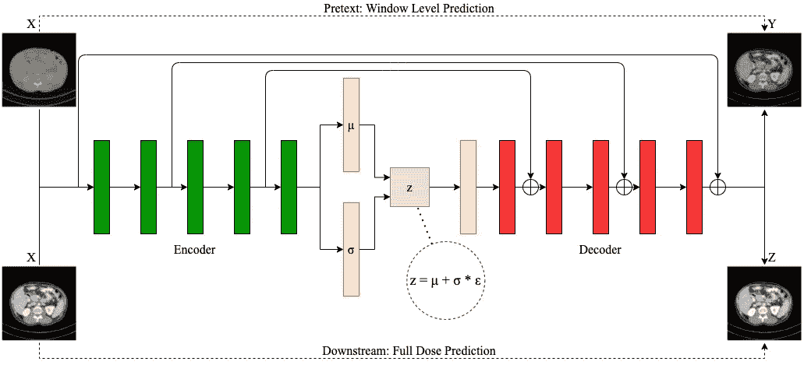
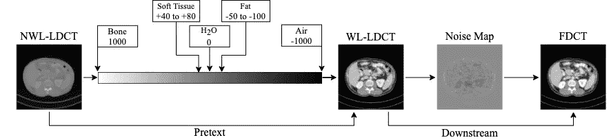
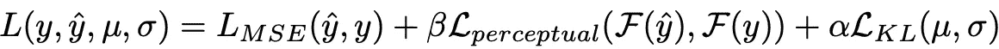
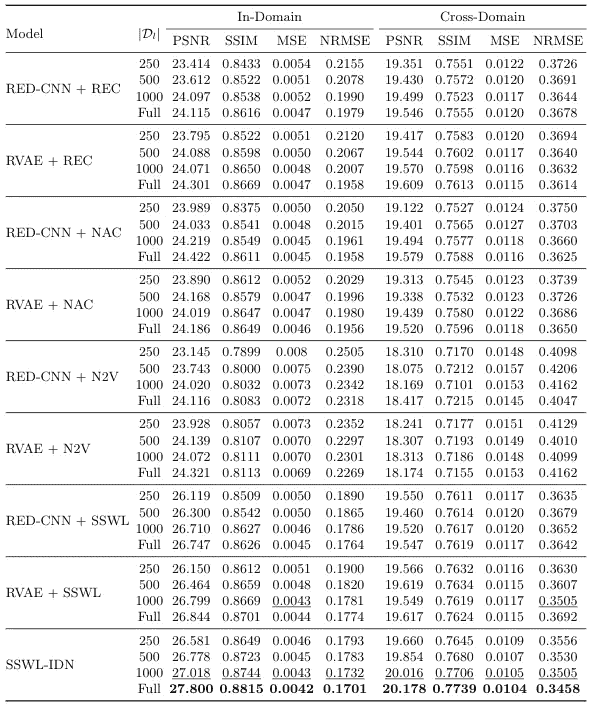
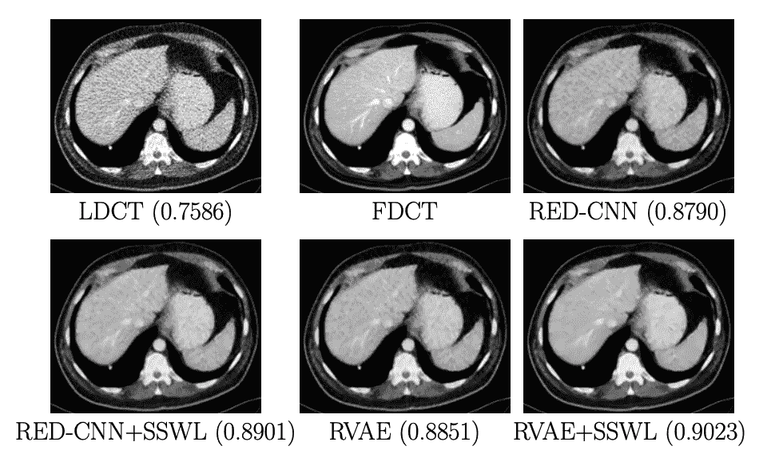
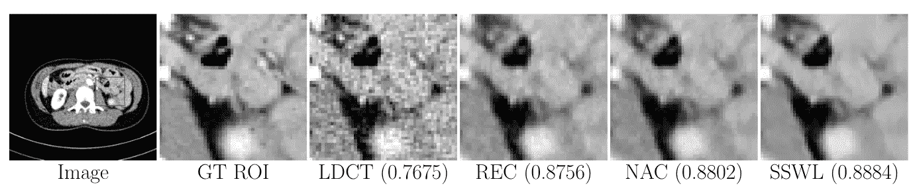

# SSWL-IDN:自监督 CT 去噪

> 原文：<https://towardsdatascience.com/sswl-idn-self-supervised-ct-denoising-208fde94583e?source=collection_archive---------28----------------------->

## [思想和理论](https://towardsdatascience.com/tagged/thoughts-and-theory)

## *回顾我们最近的 CT 去噪论文“窗位是强去噪代理”*



作者图片

在这篇文章中，我将讨论我们最近的工作，一种新的自我监督的 CT 去噪方法: [SSWL-IDN](https://arxiv.org/abs/2105.07153) ，由来自萨拉托加高中和斯坦福大学的 RSL 的 Ayaan Haque(我)、王一行和 Abdullah-Al-Zubaer Imran 完成。在本文中，我们介绍了 SSWL-IDN，一种新的自监督 CT 去噪窗口级预测代理任务。我们的方法是任务相关的，并且与下游任务相关，与最近的方法相比产生了改进的性能。我们的论文最近被 2021 年的 MLMI MICCAI 接受，并将在九月发表。这篇文章将涵盖我们解决的问题，我们的方法，以及(简要地)我们的结果。我们的论文在 [ArXiv](https://arxiv.org/abs/2105.07153) 上可用，[代码](https://github.com/ayaanzhaque/SSWL-IDN)在 Github 上可用，我们的项目页面[在这里](https://ayaanzhaque.github.io/SSWL-IDN/)可用。

# 概观

*什么是 CT 去噪，为什么重要？*

对于那些没有强大的医学成像背景，CT 成像是一个突出的成像方式。CT 成像依赖于辐射剂量，因此，在图像质量和辐射剂量之间存在权衡。辐射剂量越高，图像包含的噪声就越少。然而，高辐射剂量对患者有害，这意味着最好以较低的剂量扫描患者。然而，随着图像中噪声的增加，CT 图像的诊断性能降低，因为噪声可能阻碍某些结构的可见性。因此，对 CT 图像进行去噪处理以达到两全其美是一个非常关键的医学成像问题。

为了执行基于深度学习的 CT 图像去噪，模型将输入低剂量 CT 扫描(LDCT)并预测全剂量 CT 扫描(FDCT)。全剂量扫描按常规剂量采集，低剂量扫描一般按四分之一剂量采集。然而，这构成了一个明显的挑战。医疗数据通常很难获得，尤其是 CT 扫描，因为很难同时获得干净的参考和同一扫描的低剂量版本。但是，在标签数据有限的情况下，深度学习性能会下降。这意味着利用未标记数据的学习框架的使用至关重要。

什么是自我监督学习？

由于辐射的有害性质以及在不同辐射剂量下进行两次相同扫描的困难，获取参考图像是具有挑战性的。因此，期望用有限的参考数据来训练去噪模型。自我监督学习(SSL)已经成为完全监督学习的一种有前途的替代方法，以便利用大量的未标记训练样本。在 SSL 方案中，可以从数据本身为标记和未标记的数据生成合成标签。与迁移学习类似，SSL 在代理任务上预先训练模型，但在相同的数据集上而不是来自外部域的数据集上，然后在下游或主要评估任务上微调预先训练的模型。

自我监督学习是无监督学习的一种形式，因为它使用完全免费的标签对单独的任务进行训练。一些常见的例子包括随机旋转图像和让模型预测图像旋转的角度。

我们的自我监督学习形式使用两个独立的任务:一个代理任务和一个下游任务。这不要与完全无监督的方法相混淆，例如 Noise2Noise ( [Lehtinen 等人 2018](https://arxiv.org/abs/1803.04189) )和 Noise2Void ( [Krull 等人 2018](https://arxiv.org/abs/1811.10980) )。这些方法根本不使用任何参考扫描。这不是计算机视觉领域的传统 SSL 定义。由于这些方法不使用任何参考扫描，正如这些论文的作者所争论的那样，以任何方式与使用参考扫描的方法进行比较都是不公平的。为了证明这一说法，我们将我们的 SSL 算法与 Noise2Void 进行了比较。

在本文中，我们使用 SSL 来提高具有有限参考 FDCT 的深度去噪模型的性能。我们提出了一种新的去噪替代预测窗口水平的 ct 图像从非窗口水平的图像作为借口。与许多其他现有的自监督学习方法不同，我们提出的自监督窗口水平(SSWL)是一个任务相关的代理，因为它直接与下游任务相关，优先考虑相似的特征学习。此外，我们将所有实验限制在 5%的剂量水平，这可能是一种积极的剂量减少机制，并证明即使在如此低的剂量设置下也有效。我们的主要贡献如下:

*   一种新的与任务相关的自监督窗口级预测代理，它与下游任务相关
*   一种创新的基于残差的 VAE 架构，与混合损失函数相结合，同时对模型进行逐像素和感知惩罚
*   对域内和跨域数据上不同建议成分的不同数量的标记数据进行的大量实验证明，即使是极低剂量(5%)的 CT 图像，也能实现改进和有效的去噪

# SSWL-IDN

*窗口调平及 CT 去噪*



去噪和窗位的关系(图片由作者提供)

在 CT 去噪中，输入图像是 LDCT，参考图像是 FDCT。两者的关系表示为 LD = FD + Noise。去噪模型旨在从 LD 中去除噪声并重新获得 FD。

在 CT 成像中，窗位调整是使用 CT 数修改图像灰度的过程，以突出、增亮和对比重要的结构。窗位化(WL)和非窗位化(NWL)图像之间的关系表示为:WL = a * NWL + b，其中 a 和 b 是窗位化参数。如图所示，从图像变换的角度来看，窗位扫描和非窗位扫描之间的关系可以比作 FDCT 和 LDCT 之间的关系。因此，训练模型以从非窗位图像预测窗位图像是与去噪相关的任务。


提议的 SSWL-IDN 模型的示意图。对于 SSL 代理任务，该模型从非窗口级别图像预测窗口级别图像。对于下游任务，模型将输入 LDCT 去噪以匹配 FDCT。(图片由作者提供)

预测分级图像是一项自我监督的任务，因为窗口分级图像可以自由创建，因为这样做的信息在 DICOM 元数据中是自由可用的。具体而言，当获得全剂量参考图像极其困难时，将其作为下游去噪任务的借口更合适。特别是因为任务是特定领域的，它允许比外来或任意代理更重要和相关的特征学习。

因此，我们提出的自监督学习方法包括两个步骤:在窗口水平任务上的全监督预训练，然后在小标签去噪任务上的微调。对于预训练，我们为标记和未标记的数据准备了每次 LDCT 扫描的 NWL 和 WL 版本。Loss 针对从输入 NWL LDCT 预测 WL LDCT 进行了优化。我们的代理是端到端的，与许多其他不使用相关任务的方法相反，因为在任务之间不需要架构或损失的改变。

*模型架构和损失函数*

对于模型结构，我们提出了残差变分自动编码器(RVAE)。我们的模型使用 RED-CNN ( [Chen et al. 2017](https://arxiv.org/pdf/1702.00288.pdf) )作为主干架构，并加入了一个瓶颈。虽然已经提出了基于残差的 vae，但是它们在编码器和解码器中分别使用残差(ResNet 作为编码器，转置 ResNet 作为解码器)，而不是像以前的方法那样使用编码器和解码器之间的残差连接。在瓶颈中使用参数化技巧改善了 FD 预测，因为通过添加可调噪声，我们可以减少过拟合，改善泛化，并有助于正则化模型。

对于我们的损失，我们使用 MSE 和感知损失之间的混合损失。这鼓励了逐像素和感知学习，这将提高定量和定性去噪性能。我们的感知损失使用从预训练的 VGG-19 网络中提取的特征。我们的总损失函数表示为:



我们的总损失函数(图片作者)

其中，LMSE 是标准 MSE 损失，l 感知是感知损失，β是 l 感知权重。对于 VAE，LKL 代表 KL 发散损失，α是 LKL 重量。是均值项，σ是标准差项，都来自于潜在空间。KL 发散试图减少两个参数与目标分布参数的发散。

# 结果

我们使用了梅奥低剂量 CT 数据集。具体来说，我们的目标是在超低剂量下降噪，因此我们将四分之一剂量扫描缩小到 5%剂量。这允许进行彻底的去噪评估。虽然从临床角度来看，与质量较低的去噪 5%剂量相比，去噪良好的四分之一剂量更理想，但从计算角度来看，显示去除大量噪声的能力可以更恰当地评估模型准确去除噪声的全部潜力。

我们将我们的 RVAE 架构与各种基线和最先进的架构进行了比较，并将我们的 SSWL 方法与各种基线和最先进的 SSL 训练算法进行了比较。


我们的 RVAE 与各种架构进行了比较，并优于所有架构(图片由作者提供)

如上表所示，我们的 RVAE 优于所有具有统计学意义的模型。重要的是，我们优于两个架构，RED-CNN 和 DnCNN(【张等人 2016 )，证明了 RVAE 方法的有效性。此外，我们的跨域结果显示了我们的架构的改进的通用性。



我们的 SSWL-IDN 模型优于所有的基线 SSL 方法(图片由作者提供)

更重要的是，我们的自监督窗口水平代理任务优于基线和两种最先进的方法，Noise2Void (N2V)和 noise-As-Clean(NAC)([Xu et al . 2019](https://arxiv.org/abs/1906.06878))。这显示了任务相关性对于 CT 去噪的重要性，并且证实了我们的方法的强性能。混合损失也是有益的，与 RVAE + SSWL 相比，我们的最终模型具有更好的性能。



SSWL 和我们的 RVAE 优于其他架构和 SSL 方法

上图展示了我们的网络对 5%剂量 CT 扫描进行精确降噪的能力。虽然似乎有过度光滑和丢失的结构细节，这可以归因于低剂量的 CT 扫描。此外，我们的 SSWL 算法优于没有 SSL 和我们的 RVAE 优于红色 CNN 本身。



在基于 ROI 的定性去噪方面，SSWL 优于我们的 SSL 方法

最后，我们在上图中证实了我们的算法相对于其他 SSL 方法的定性优势。如图所示，当检查特定的 ROI 时，我们比其他方法获得了更清晰的去噪图像。

# 最后的想法

在这篇文章中，我们提出了 SSWL-IDN，一个自我监督的去噪模型，一个新颖的，任务相关的，有效的窗口级预测的替代任务。我们还提出了专门用于去噪的残差 VAE，以及利用感知和像素级学习优点的混合损失。我们证实，我们的方法的每个组成部分都优于域内和跨域评估的困难的 5%剂量去噪基线，并且当组合时，该模型显著优于最先进的方法。

这个框架的最终目的是帮助减少在临床环境中使用高 CT 辐射剂量。如果我们的方法能够在有限的标记数据上进行训练，并准确地对 CT 扫描进行去噪，那么可以以较低的剂量对患者进行扫描，并且可以在专家诊断或筛查之前对扫描进行去噪。

如果你觉得这篇文章或论文有趣，请告诉我！如果你觉得这项工作有用，下面是引文:

```
@article{haque2021window,
      title={Window-Level is a Strong Denoising Surrogate},
      author={Haque, Ayaan and Wang, Adam and Imran, Abdullah-Al-Zubaer},
      journal={arXiv preprint arXiv:2105.07153},
      year={2021}
}
```