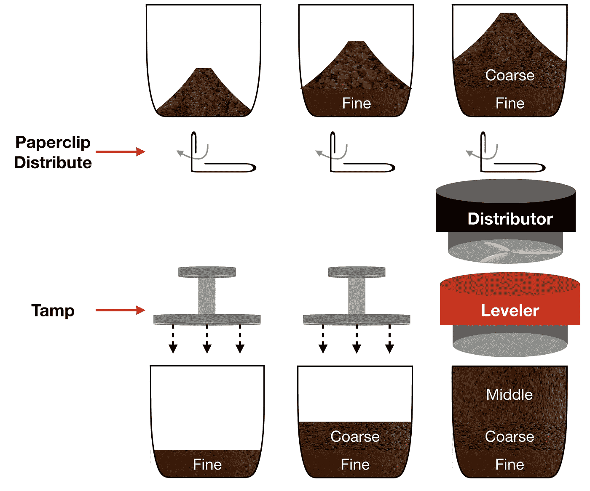
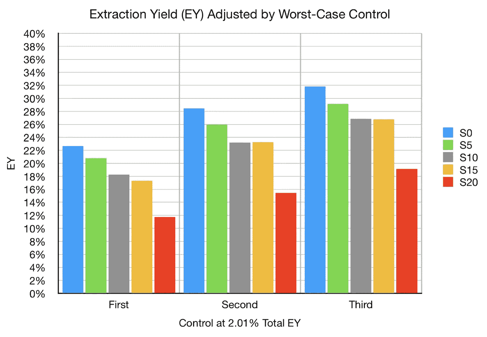
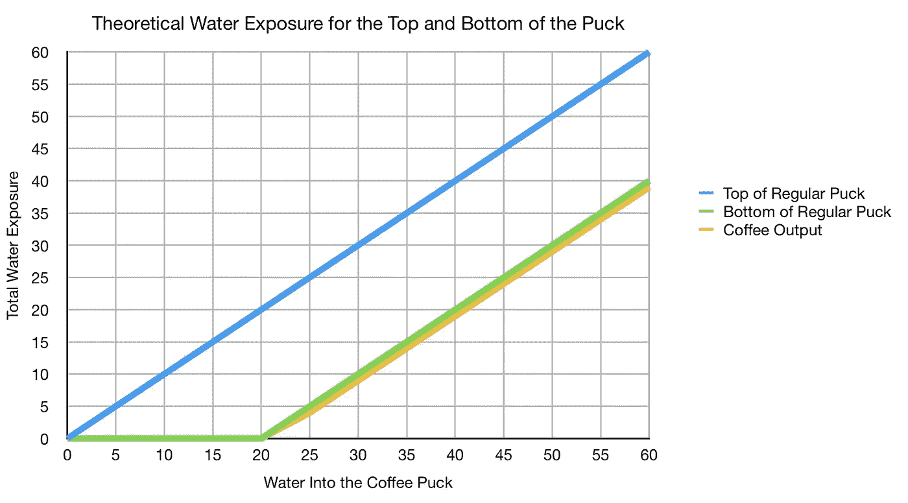
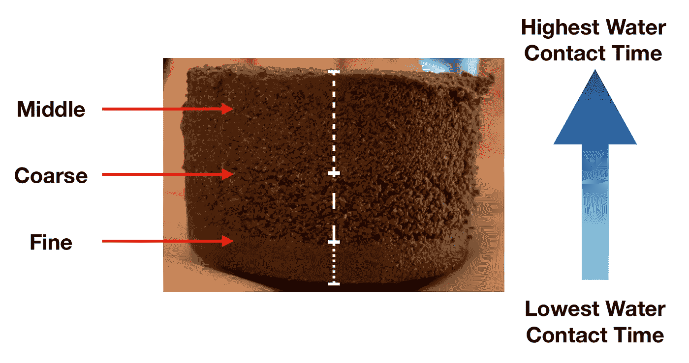
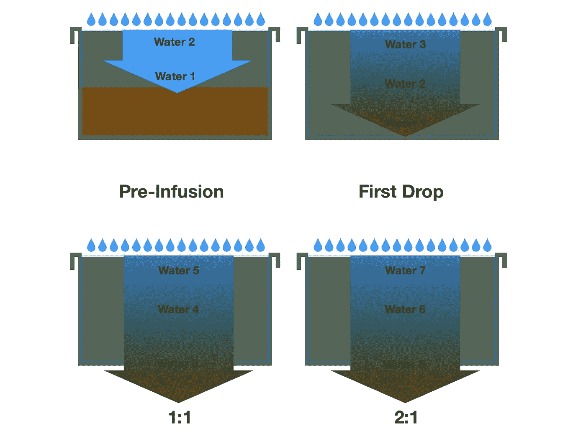
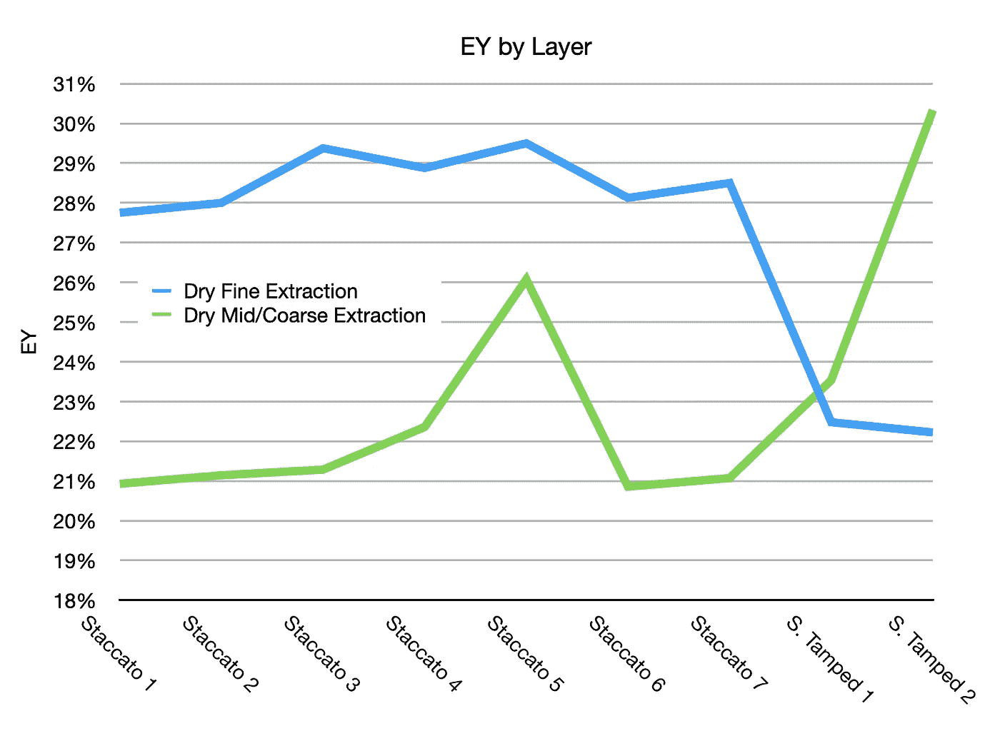
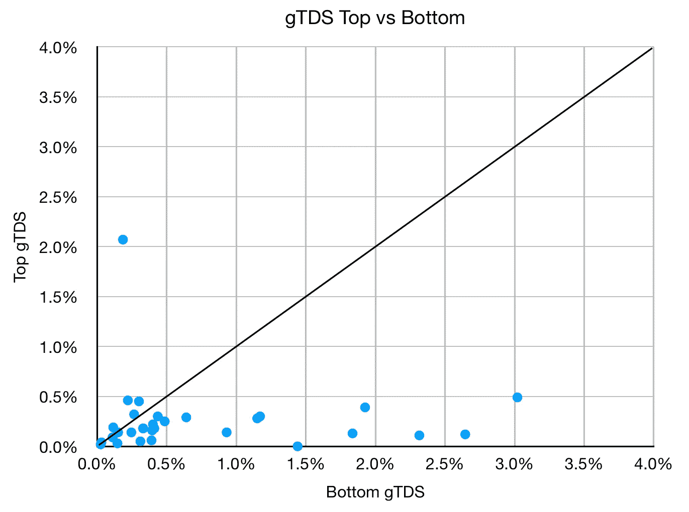
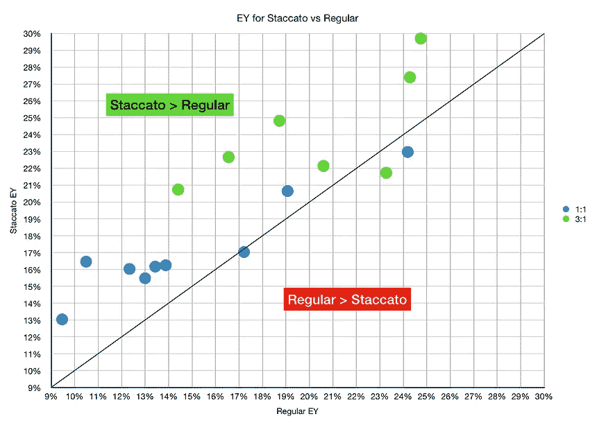
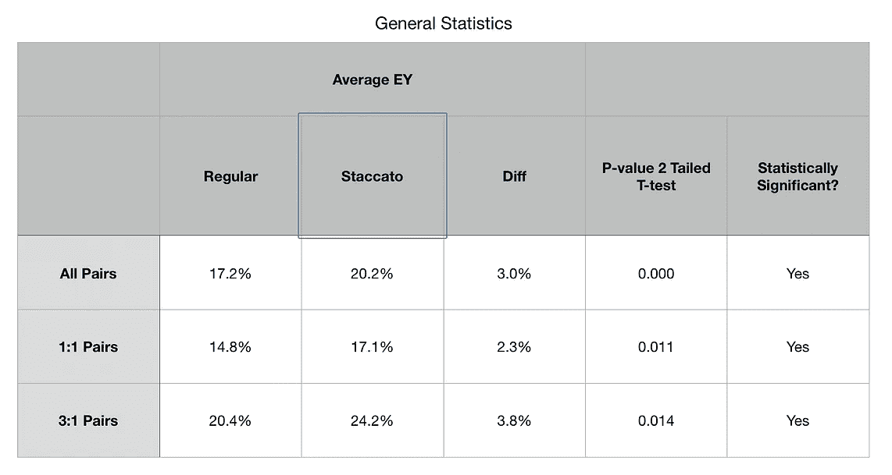
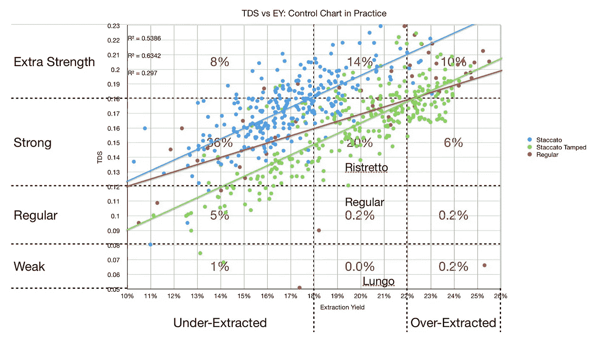

# 断续浓缩咖啡比普通浓缩咖啡更好

> 原文：<https://towardsdatascience.com/staccato-espresso-is-fundamentally-better-than-regular-espresso-e73e88337127?source=collection_archive---------5----------------------->

## 咖啡数据科学

## 水接触时间

断奏法的历史很有趣，因为证明它有效的证据最初只是在味觉上。后来在萃取过程中证明了这一点，但仍然有人持怀疑态度，部分原因是筛选咖啡需要大量的工作。然而，我相信我已经明白了为什么断奏击球在提取方面应该从根本上优于常规击球，答案是水接触时间。

断奏镜头是在使用至少两层筛选研磨后的分层镜头。我喜欢的变体在底部有一个精细层(<400 um), a coarse layer in the middle (>500 微米)，在顶部有一个中间层(在 400 微米和 500 微米之间)。

所有图片由作者提供

# 研磨尺寸和提取

一般来说，众所周知，当温度、压力和水流等所有参数保持不变时，较细的咖啡比较粗的咖啡在水中提取出更快的 T4。所以当你提取一杯浓缩咖啡时，到最后，较细的颗粒倾向于被过度提取，而较粗的颗粒倾向于被更少提取。我们的目标是拉一杆足够长的时间，使大部分咖啡被适当提取。

我做了一项研究，使用受控场景提取单个研磨粒度，这样就不会出现沟道效应。对于所有研磨尺寸，该实验也具有相同的水接触时间、水温和压力。在这种情况下，我将镜头分成三杯:第一杯、第二杯和第三杯。该图显示了每种情况的累积 EY，并且显示了更高提取的趋势，尤其是在较小研磨的第一部分。

# 常规射击接触时间

对于在整个击球过程中均匀分布的常规击球，在冰球的顶部会有细粒，杯子中的所有水都从这些细粒中穿过。

假设我们用 20 克咖啡渣和 40 克液体咖啡。为了简单起见，假设冰球中的水量是 20g，因为通常冰球会保留那么多。因此，底部的颗粒在第一次滴入杯中时几乎没有接触水的时间，而圆盘顶部的颗粒已经暴露在 20g 的水流中。

这意味着关于提取，圆盘顶部的细粒将比圆盘底部的细粒具有更高的提取，并且它们将是第一个过度提取的。

此外，对于粗颗粒，位于圆盘底部的粗颗粒将更有可能提取不足，而位于圆盘顶部的粗颗粒将更有可能被正确提取。

当观察温度时，让我们假设你进行低压预输注。在预注入过程中，圆盘底部的水的温度将低于圆盘顶部的温度。这一温度最终会达到平衡，但当存在温差时，在所有其他参数相同的情况下，较高的温度将导致顶部比底部提取得更快。如果你击球的时间足够长，这一点可能会静音，但话说回来，你击球的时间越长，你就越有可能从冰球顶部开始过度提取咖啡。

# 断续接触时间

对于断奏击球，罚金在底部。粉末是过度提取味道的最大原因，因为它们提取得最快。

当镜头结束时，精细层将比其他层具有更少的接触时间，因为它位于底部。细粒的过量或不足提取量将更加均匀。其他层也是如此。

此外，其他两层比细粒层更粗糙，与水的接触时间更长，导致它们提取更多，提取率更接近细粒层。每一层在整个层中具有相似的接触时间，因此这些颗粒尺寸的提取应该比常规拍摄更均匀。

# 按层数据提取

我收集了一些[以前的分层提取数据](/espresso-extraction-by-layer-fc2780335aee)。我拥有的主要数据是使用干燥的用过的冰球重量筛选断奏和断奏夯实的击球。对于筛选过的断续镜头，精细层提取的内容比中/粗层多得多。而对于断续夯实，中/粗层是顶层，其提取率高于底层。就粒子分布而言，断续夯实的镜头是规则的镜头。

此外，我已经[收集了一些其他数据](/post-shot-quality-metrics-for-espresso-78ca525f0215)，使用[地面总溶解固体(gTDS)](/grounds-tds-across-the-espresso-puck-1581825ddcac) 。我有多个断奏夯实的镜头，我测量了镜头上半部分和下半部分的 GTD。较高的数值意味着仍有更多的可提取固体。

在大部分数据中，顶部的 gTDS 比底部的 gTDS 低得多，这意味着顶部的一半比底部提取得多。这为圆盘的上半部分比下半部分提取得更多或者提取得比底部更快的想法提供了一些证据。

# 其他胜利

断奏击球不容易出现沟流，因为通过筛分，水可以更均匀地流过每一层。每个颗粒层在该尺寸下得到更均匀的提取。

典型的断奏镜头有较少的克莉玛。克莉玛是由提取过程中释放的二氧化碳引起的，我怀疑这与提取速率有关。因此，如果提取率较高的颗粒位于底部，释放气体在发射过程中对较大颗粒尺寸的干扰较小。

# 高端研磨机

最初反对断奏的一个论点是，我的研磨机并不好。我用的是韩国磨床，但结果是，韩国[比利基](/rok-beats-niche-zero-part-1-7957ec49840d)表现得更好。尽管如此，人们认为更高端的研磨机应该表现更好，但从根本上说，他们不能。

不管是什么研磨机，一个普通的球在冰球中都有接触水的时间问题。因此，如果你从任何研磨机中取出一杯咖啡的咖啡渣并过筛，过筛后的咖啡渣应该总是具有更大或相等的提取率，并且提取应该在颗粒研磨中更加均匀，因此，味道应该相同或更好。

# 查看以前的数据

我提取了一些数据，我必须把提取率(EY)的成对拍摄放在一起。对于这些镜头，我有 1:1 的输出与输入比率以及 3:1 的数据，因为我使用了杠杆机器，并在拍摄后在下面放了另一个杯子。在所有其他参数都相同的情况下，在 5 次烘烤和 2 台机器(Kim 和 Flair)上有 9 对镜头。

在大多数双人舞中，EY 的断奏得分胜出。这是我们用来比较咖啡萃取技术的最客观的标准。如果一个断奏的镜头使用拨入镜头中的理由进行适当筛选，它应该比使用未经筛选的相同理由具有更高的 EY。

此外，当查看数百个镜头的总溶解固体和 EY 的控制图时，TDS 与 EY 的断续镜头趋势非常高。

所有这些对断奏的理解都是基于正确的筛选。如果根据颗粒分布，预计 40%的粉末小于 400 微米，但只筛出 14%，那么这意味着筛出的颗粒味道可能完全不同。这需要对筛选过程进行改进，比如在筛子中放置一个[搅拌器](https://youtu.be/94MmY8VPNZ0)，这样几乎可以减少一半的筛选时间和精力。加重的纸张搅拌器甚至可以把时间缩短到 100 米

我坚信我们正处于第四波咖啡的边缘。虽然筛选需要时间，但我相信新机器会造得更快、更自动化。

断续击球有望获得更高的提取率。

如果你愿意，可以在推特、 [YouTube](https://m.youtube.com/channel/UClgcmAtBMTmVVGANjtntXTw?source=post_page---------------------------) 和 [Instagram](https://www.instagram.com/espressofun/) 上关注我，我会在那里发布不同机器上的浓缩咖啡照片和浓缩咖啡相关的视频。你也可以在 [LinkedIn](https://www.linkedin.com/in/robert-mckeon-aloe-01581595?source=post_page---------------------------) 上找到我。也可以关注我在[中](https://towardsdatascience.com/@rmckeon/follow)和[订阅](https://rmckeon.medium.com/subscribe)。

# [我的进一步阅读](https://rmckeon.medium.com/story-collection-splash-page-e15025710347):

[我未来的书](https://www.kickstarter.com/projects/espressofun/engineering-better-espresso-data-driven-coffee)

[浓缩咖啡系列文章](https://rmckeon.medium.com/a-collection-of-espresso-articles-de8a3abf9917?postPublishedType=repub)

[工作和学校故事集](https://rmckeon.medium.com/a-collection-of-work-and-school-stories-6b7ca5a58318?source=your_stories_page-------------------------------------)

个人故事和关注点

[乐高故事启动页面](https://rmckeon.medium.com/lego-story-splash-page-b91ba4f56bc7?source=your_stories_page-------------------------------------)

[摄影飞溅页面](https://rmckeon.medium.com/photography-splash-page-fe93297abc06?source=your_stories_page-------------------------------------)

[使用图像处理测量咖啡研磨颗粒分布](https://link.medium.com/9Az9gAfWXdb)

[改进浓缩咖啡](https://rmckeon.medium.com/improving-espresso-splash-page-576c70e64d0d?source=your_stories_page-------------------------------------)

[断奏生活方式概述](https://rmckeon.medium.com/a-summary-of-the-staccato-lifestyle-dd1dc6d4b861?source=your_stories_page-------------------------------------)

[测量咖啡磨粒分布](https://rmckeon.medium.com/measuring-coffee-grind-distribution-d37a39ffc215?source=your_stories_page-------------------------------------)

[咖啡萃取](https://rmckeon.medium.com/coffee-extraction-splash-page-3e568df003ac?source=your_stories_page-------------------------------------)

[咖啡烘焙](https://rmckeon.medium.com/coffee-roasting-splash-page-780b0c3242ea?source=your_stories_page-------------------------------------)

[咖啡豆](https://rmckeon.medium.com/coffee-beans-splash-page-e52e1993274f?source=your_stories_page-------------------------------------)

[浓缩咖啡用纸质过滤器](https://rmckeon.medium.com/paper-filters-for-espresso-splash-page-f55fc553e98?source=your_stories_page-------------------------------------)

[浓缩咖啡篮及相关主题](https://rmckeon.medium.com/espresso-baskets-and-related-topics-splash-page-ff10f690a738?source=your_stories_page-------------------------------------)

[意式咖啡观点](https://rmckeon.medium.com/espresso-opinions-splash-page-5a89856d74da?source=your_stories_page-------------------------------------)

[透明 Portafilter 实验](https://rmckeon.medium.com/transparent-portafilter-experiments-splash-page-8fd3ae3a286d?source=your_stories_page-------------------------------------)

[杠杆机维护](https://rmckeon.medium.com/lever-machine-maintenance-splash-page-72c1e3102ff?source=your_stories_page-------------------------------------)

[咖啡评论和想法](https://rmckeon.medium.com/coffee-reviews-and-thoughts-splash-page-ca6840eb04f7?source=your_stories_page-------------------------------------)

[咖啡实验](https://rmckeon.medium.com/coffee-experiments-splash-page-671a77ba4d42?source=your_stories_page-------------------------------------)