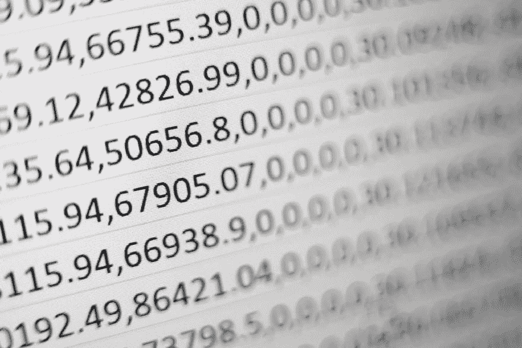
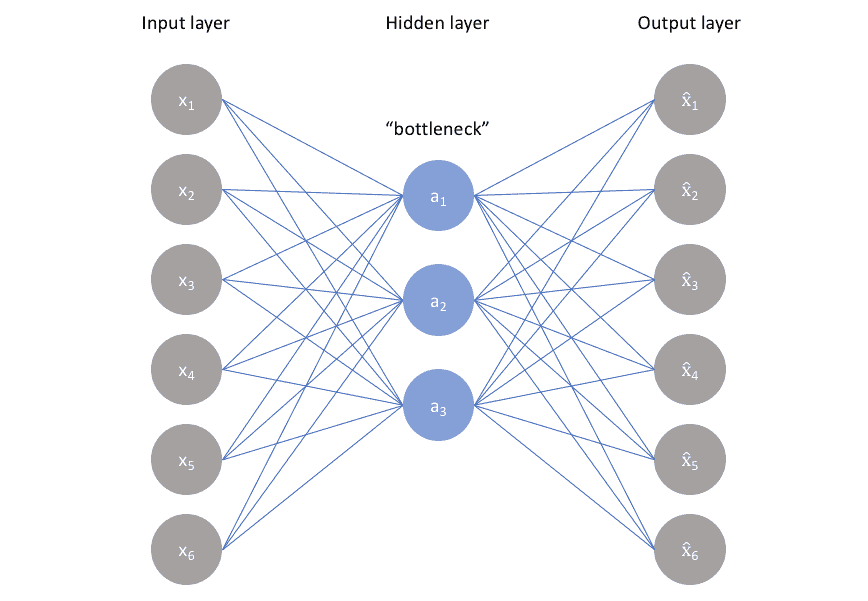
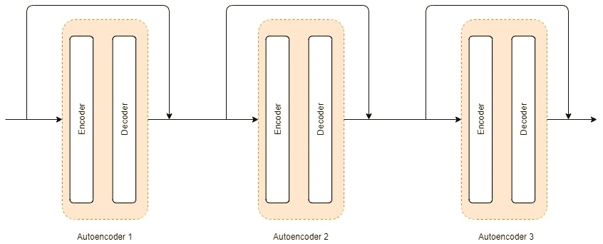
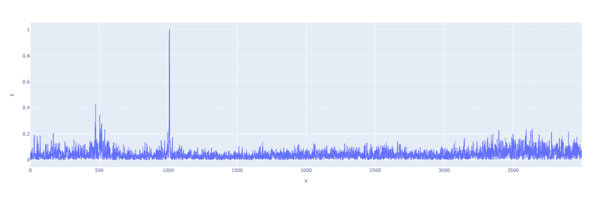
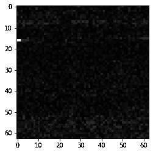
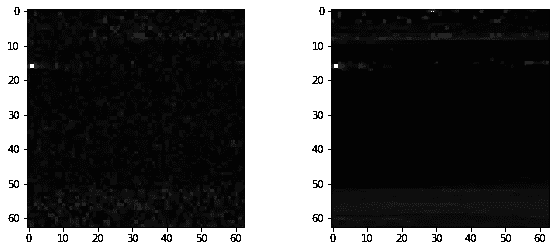

# 堆叠式自动编码器。

> 原文：<https://towardsdatascience.com/stacked-autoencoders-f0a4391ae282?source=collection_archive---------4----------------------->

## 使用深度学习从数据中提取重要特征。



米卡·鲍梅斯特在 [Unsplash](https://www.google.com/url?q=https://unsplash.com?utm_source%3Dmedium%26utm_medium%3Dreferral&sa=D&source=editors&ust=1624895991419000&usg=AOvVaw1j4VZKsVAgpSRfjdpWMGWx) 上的照片

## 降维

在解决数据科学问题时，您是否遇到过包含数百个要素的数据集？或者一千个特征？如果没有，那么你就不知道开发一个高效的模型会有多大的挑战性。对于那些不知道的人来说，降维是一种从数据中过滤出本质特征的方法。

数据中的输入要素越多，预测从属要素的任务就越困难。大量的元素有时会导致模型性能不佳。这背后的原因可能是模型可能试图找到特征向量和输出向量之间的关系，这种关系非常弱或不存在。有各种方法可以用来降低数据的维度，在下面的链接中可以找到关于这方面的综合指南。

[https://www . analyticsvidhya . com/blog/2018/08/dimensionally-reduction-techniques-python/](https://www.google.com/url?q=https://www.analyticsvidhya.com/blog/2018/08/dimensionality-reduction-techniques-python/&sa=D&source=editors&ust=1624895991421000&usg=AOvVaw0xNWIY2krKFIOEiNke7AgA)

## 主成分分析

主成分分析是一种常用的降维方法。主成分分析可以帮助你找到最相关的特征向量。这组新的特征称为主成分。提取第一个主成分，以便它解释数据集中的最大变化。第二个中心成分与第一个无关，试图解释数据集中的其余变化。第三个主成分试图解释前两个主成分解释不了的解释，以此类推。尽管这种方法有助于我们降低维数，但是 PCA 仅在从属特征和独立特征之间的关系是线性时才有效。要更深入地了解 PCA，请访问下面的链接。

[https://towards data science . com/a-一站式主成分分析-5582fb7e0a9c](https://www.google.com/url?q=https://towardsdatascience.com/a-one-stop-shop-for-principal-component-analysis-5582fb7e0a9c&sa=D&source=editors&ust=1624895991422000&usg=AOvVaw2cKybkuO17TV0RofbdLpY9)

## 自动编码器

当非线性函数描述从属和独立特征之间的关系时，自动编码器用于减少数据的维数。自动编码器是一种无监督的人工神经网络。自动编码器用于从数据中自动提取特征。它是最有前途的特征提取工具之一，用于各种应用，如语音识别、自动驾驶汽车、人脸对齐/人体手势检测。下图显示了自动编码器的架构



自动编码器来源:[自动编码器介绍。](https://www.google.com/url?q=https://www.jeremyjordan.me/autoencoders/&sa=D&source=editors&ust=1624895991423000&usg=AOvVaw3KPd8tI-FjSSVK90ZJiRrW)

如上图所示，自动编码器架构分为三个部分:编码器、瓶颈和解码器。编码器从数据中挑选关键特征，而解码器试图使用关键成分来重建原始数据。通过仅保留重建数据所需的特征，自动编码器降低了数据维度。自动编码器是一种前馈网络，可以使用与前馈网络相同的过程来训练。自动编码器的输出与输入相同，但有一些损耗。因此，自动编码器也被称为有损压缩技术。此外，如果我们在每个编码器和解码器中有一个具有线性激活函数的密集层，则自动编码器可以像 PCA 一样执行。

## 堆叠自动编码器

一些数据集的要素之间存在复杂的关系。因此，仅使用一个自动编码器是不够的。单个自动编码器可能无法降低输入特征的维数。因此，对于这样的用例，我们使用堆栈式自动编码器。顾名思义，堆叠式自动编码器是多个编码器堆叠在一起。下图显示了一个堆叠式自动编码器，其中三个编码器堆叠在一起。



作者图片

根据上图所示的架构，输入数据首先提供给自动编码器 1。然后，自动编码器 1 的输出和自动编码器 1 的输入作为自动编码器 2 的输入。类似地，自动编码器 2 的输出和自动编码器 2 的输入作为自动编码器 3 的输入给出。因此，自动编码器 3 的输入向量的长度是自动编码器 2 的输入的两倍。这种技术在一定程度上也有助于解决数据不足的问题。

## 使用 python 实现堆栈式自动编码器

为了演示堆叠式自动编码器，我们使用振动信号的快速傅立叶变换(FFT)。FFT 振动信号用于故障诊断和许多其他应用。数据具有非常复杂的模式，因此单个自动编码器无法降低数据的维数。下图是 FFT 波形图。FFT 的幅度被变换到 0 和 1 之间。



作者图片

为了更好的直观理解，我们将信号重塑成 63*63 的矩阵，并绘制出来(由于是振动信号转换成图像，所以要半信半疑)。下图是振动信号的图像表示。



作者图片

我知道在这幅图像中很难看到很多东西。不过，我们还是能在图中看到几个特征。大约在(0，15)处拍摄的亮白色是振动信号 FFT 中的峰值。

现在我们开始创建我们的自动编码器。

```
batch_size = 32
input_dim = x_train[0].shape[0] #num of predictor variables learning_rate = 1e-5
input_layer = Input(shape=(input_dim, ), name=”input”)#Input Layer
encoder = Dense (2000, activation=”relu”, activity_regularizer=regularizers.l1(learning_rate))(input_layer)#Encoder’s first dense layer
encoder = Dense (1000, activation=”relu”,
activity_regularizer=regularizers.l1(learning_rate))(encoder)#Encoder’s second dense layer
encoder = Dense (500, activation=”relu”, activity_regularizer=regularizers.l1(learning_rate))(encoder)# Code layer
encoder = Dense (200, activation=”relu”, activity_regularizer=regularizers.l1(learning_rate))(encoder)# Decoder’s first dense layer
decoder = Dense(500, activation=”relu”, activity_regularizer=regularizers.l1(learning_rate))(encoder)# Decoder’s second dense layer
decoder = Dense(1000, activation=”relu”, activity_regularizer=regularizers.l1(learning_rate))(decoder)# Decoder’s Third dense layer
decoder = Dense(2000, activation=”relu”, activity_regularizer=regularizers.l1(learning_rate))(decoder)# Output Layer
decoder = Dense(input_dim, activation=”sigmoid”, activity_regularizer=regularizers.l1(learning_rate))(decoder)
```

上面设计的自动编码器在两侧有两个密集层:编码器和解码器。请注意，每个解码器和编码器中的神经元数量是相同的。此外，解码器是编码器的镜像。

正如我们所见，FFT 信号有 4000 个数据点；因此，我们的输入和输出层有 4000 个神经元。当我们深入网络时，神经元的数量随之减少。最后，在代码层，我们只有 200 个神经元。因此，这个自动编码器试图将特征的数量从 4000 减少到 200。

现在，我们构建模型，编译它，并根据我们的训练数据进行拟合。由于自动编码器的目标输出与输入相同，我们将 x_train 作为输入和输出传递。

```
autoencoder_1 = Model(inputs=input_layer, outputs=decoder)autoencoder_1.compile(metrics=[‘accuracy’],loss=’mean_squared_error’,optimizer=’adam’)satck_1 = autoencoder_1.fit(x_train, x_train,epochs=200,batch_size=batch_size)
```

一旦我们训练了我们的第一个自动编码器，我们连接第一个自动编码器的输出和输入。

```
autoencoder_2_input = autoencoder_1.predict(x_train)autoencoder_2_input = np.concatenate((autoencoder_2_input , x_train))
```

现在，自动编码器 2 的输入准备就绪。因此，我们在新的数据集上构建、编译和训练 autoencoder 2。

```
autoencoder_2 = Model(inputs=input_layer, outputs=decoder)autoencoder_2.compile(metrics=[‘accuracy’],loss=’mean_squared_error’,optimizer=’adam’)satck_2 = autoencoder_2.fit(autoencoder_2_input, autoencoder_2_input,epochs=100,batch_size=batch_size)
```

一旦我们训练了我们的自动编码器 2，我们就开始训练我们的第三个自动编码器。正如我们对第二个自动编码器所做的那样，第三个自动编码器的输入是第二个自动编码器的输出和输入的串联。

```
autoencoder_3_input = autoencoder_2.predict(autoencoder_2_input)autoencoder_3_input = np.concatenate((autoencoder_3_input, autoencoder_2_input))
```

现在，最后，我们训练第三个自动编码器。正如我们对上两个编码器所做的那样，我们对新数据进行构建、编译和训练。

```
autoencoder_2 = Model(inputs=input_layer, outputs=decoder)autoencoder_3.compile(metrics=[‘accuracy’], loss=’mean_squared_error’, optimizer=’adam’)satck_3 = autoencoder_3.fit(autoencoder_3_input, autoencoder_3_input, epochs=50, batch_size=16)
```

在训练我们的堆叠式自动编码器之后，我们达到了大约 90%的准确率。这意味着我们的堆叠式自动编码器可以以大约 90%的准确度重建我们的原始输入信号。

原始信号和重建信号的图像如下所示。



作者图片