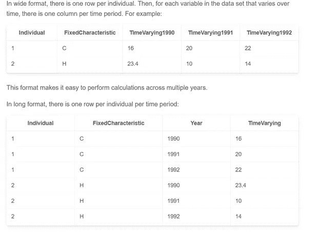
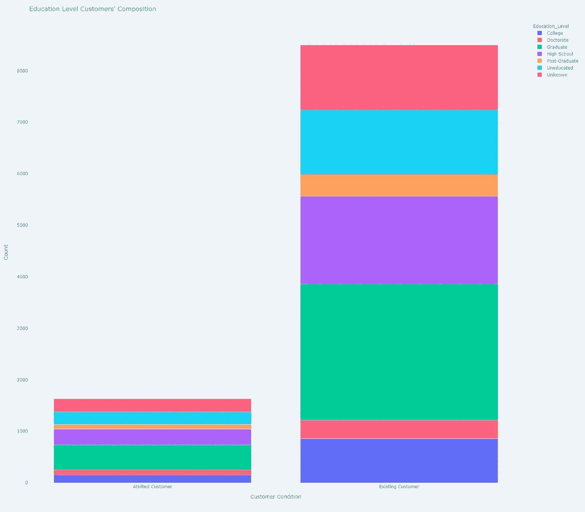
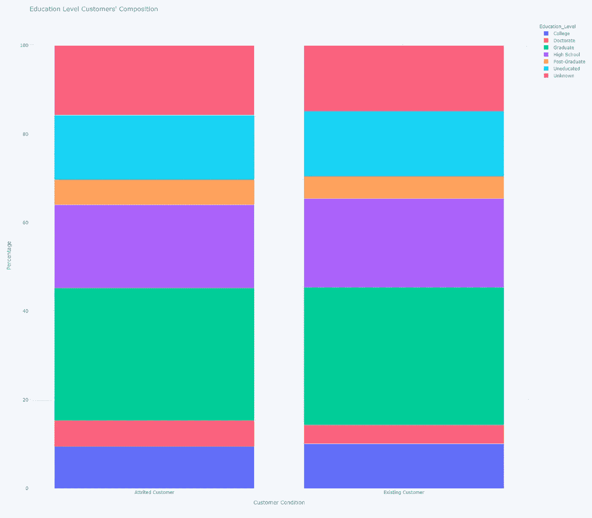
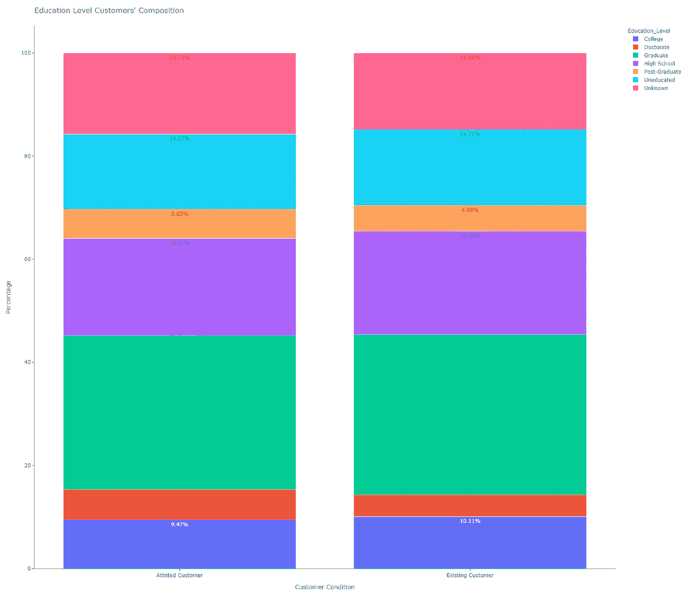
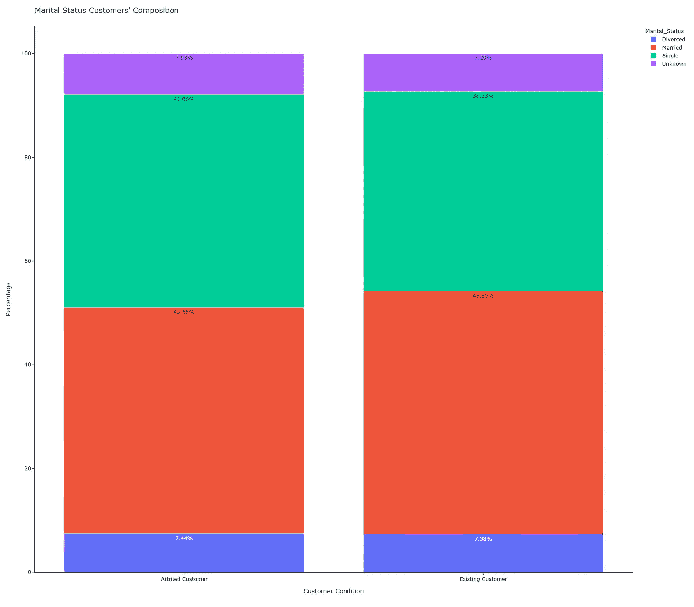

# Plotly Express 的堆积条形图

> 原文：<https://towardsdatascience.com/stacked-bar-charts-with-plotly-express-85885e91874f?source=collection_archive---------6----------------------->

## 长格式与宽格式数据


图片来自 Unsplash 的 Bekir Donmez

# **阴谋地表达**

总部位于加拿大蒙特利尔的计算公司 Plotly 开发了 plotly.py，这是一个用于 Python 的交互式开源可视化工具。2019 年，该公司发布了 Plotly 4.0，其中包括 Plotly Express，这是一个高级**包装器**，与 Plotly 生态系统的其余部分**完全兼容。**

Plotly Express (PE)是免费的，它提供了一个面向对象的图形创建接口。该工具不仅可以生成标准的 2D 图(条形图、折线图、散点图、饼图等)。)，还包括复杂的 3D 散点图和曲面图。PE 可以将数据帧、列表和字典作为输入数据，用于快速绘图生成。特别是，“大多数情节都是由一个函数调用完成的，该函数调用接受一个 [**整齐的熊猫数据帧**](http://www.jeannicholashould.com/tidy-data-in-python.html)”(1)。

# **长格式数据，宽格式数据**

数据有许多不同的格式。关于表格数据(以具有行和列的表格的形式呈现的信息)，数据可以是**长格式**(整齐、窄或**堆叠**形式)或者可以是**宽格式** ( **未堆叠**或杂乱形式)。

宽格式数据的每个变量都有一个单独的列，而在长格式中，每一行都是一个单独的变量标识组合。长格式对于筛选和执行某些类型的聚合最方便，而宽格式通常用于随时间收集的数据。



来源:[https://lost-stats . github . io/Data _ Manipulation/shape/shape _ panel _ Data _ from _ long _ to _ wide . html](https://lost-stats.github.io/Data_Manipulation/Reshaping/reshape_panel_data_from_long_to_wide.html)

Python 中的 Pandas 库有几种将长格式数据转换成宽格式的方法:`df.pivot().reset_index();df.pivot_table();df.groupby();pd.crosstab.`

从长型转换到宽型的过程通常被描述为**枢转**。

要从宽格式转换为长格式，您可以使用: `df.melt()or df.wide_to_long().`

我们可能更熟悉宽格式，因为这是我们习惯于在 Excel 电子表格中工作的格式。所以，这种格式很直观，也更容易理解。宽格式的表格适用于汇总信息。尽管长格式数据不太常见，但它易于存储，允许快速转换为其他类型，并且对于某些可视化工具(如 Seaborn)来说很方便。长格式的表格适用于连续的数据记录。

该公司于 2020 年 5 月 26 日发布了 Plotly.py 版本。**以前的版本只支持长格式熊猫数据帧。**从现在开始，PE 也用宽格式的表格数据进行操作。他们还声称致力于混合格式数据，即长格式和宽格式数据的混合体。以下 2D-笛卡尔函数可以对宽格式和混合格式的数据进行操作:`px.scatter, px.line, px.area, px.bar, px.histogram, px.violin, px.box, px.strip, px.funnel, px.density_heatmap and px.density_contour.`

# **堆积条形图**

堆积条形图(SBC)显示了主要分类变量及其子类之间的数量关系。每个条形代表一个主要类别，它被分成代表第二分类变量的**子类别的段。该图表不仅显示了不同子类别之间的数量关系，而且还显示了与整个主要类别之间的数量关系。它们还用于显示子类别的组成如何随时间变化。**

堆积条形图应用于比较和比例，但重点是**成分。**这种**成分分析**可以是静态的-对于某一时刻-或者是动态的-对于确定的时间段。

SBC 通过矩形条表示，可以像标准条形图一样**水平或垂直**定向。它们是二维的，有两个轴:一个轴显示类别，另一个轴显示数值。每个主要类别被分成代表第二分类变量的子类别的段。每个子类别的数量由水平或垂直首尾相连堆叠的矩形段的长度或高度表示。每个条形的最终高度或长度代表每个主要类别的总量(100%堆积条形图除外)。

同等子类别在每个条中必须有相同的颜色，以免混淆观众。主线条之间通常留有一些空间，以清楚地表明它们指的是离散的组。

有两种不同类型的 SBC:

1.- **简单堆叠条形图**将每个子类别的**绝对值**放置在前一个子类别之后或之上。数轴具有数值的刻度。该图显示了每个子类别的绝对值，这些值的总和表示该类别的总数。通常，主杆具有不同的最终高度或长度。

2.- **100%堆积条形图**将每个子类别的**百分比**放置在前一个子类别之后或之上。数轴具有百分比数字的刻度。该图显示了每个细分市场占整个类别的百分比。所有的主杆都有相同的高度。

# **带 Plotly Express 的堆积条形图**

我们使用了从 Kaggle [2]下载的数据集。该数据集包括 10，000 名银行客户，其中提到了他们的年龄、工资、教育水平、婚姻状况、信用卡限额、信用卡类别和附加功能。银行经理对客户离开他们的信用卡服务感到不安(流失客户与现有客户)。因此，**我们将确定一些分类变量(教育水平、婚姻状况)与流失情况**之间是否存在任何关系。

首先，我们导入 Plotly Express 为 *px，*Pandas 库为 *pd* ，并将我们的 *csv 文件*转换成 dataframe:

```
import pandas as pdimport plotly.express as pxpath = 'your path'df = pd.read_csv(path + 'CreditCardCustomersCols.csv', index_col = 
     False, header = 0, sep = ';', engine='python')
```

然后，我们选择*客户条件*作为我们的主要分类变量，选择*教育水平*作为第二分类变量。在 Kaggle 数据集中，客户条件由*attachment _ Flag*列[2]描述。由于数据集中的记录是长格式，我们使用 *df.groupby()* 将它们转换成宽格式。我们使用函数 *size(* )以绝对值(*计数*)或百分比值*(百分比)*来计算要绘制的元素的数量。

```
df_stack=df.groupby(['Attrition_Flag','Education_Level']).
       size().reset_index()df_stack['Percentage']=df.groupby(['Attrition_Flag',
       'Education_Level']).size().groupby(level=0).apply(lambda 
        x:100 * x/float(x.sum())).valuesdf_stack.columns= ['Attrition_Flag', 'Education_Level', 'Counts', 
       'Percentage']df_stack['Percentage'] =  
       df_stack['Percentage'].map('{:,.2f}%'.format) 
```

对于本文中的堆叠条形图，Plotly Express 函数为 *px.bar* ，对应的参数为:*data _ frame*； *x* =表示主分类变量的*数据帧*中的列名； *y* =表示每个子类别的绝对值或百分比值的 *data_frame* 中的列名；*颜色*数据帧*中的列名*代表第二分类变量的子类； *barmode* 决定相同位置坐标的条如何在图形上显示。通过*堆叠*、**将棒材堆叠在另一个**的顶部。我们可以选择 *barmode = 'overlay'* 来绘制重叠条形图，或者选择 *barmode = 'group'* 来将条形图并排放置在簇状条形图中([https://towards data science . com/clustered-overlapped-bar-charts-94 f1 db 93778 e](/clustered-overlapped-bar-charts-94f1db93778e))。

我们用 *update.layout* 更新了图表:设置标题、x 轴名称、y 轴名称，用*宽度*和*高度*设置图形尺寸。最后，我们使用默认的模板( *plotly* 、【带 Plotly Express 的直方图、主题&模板】、[https://towardsdatascience . com/Histograms-with-Plotly-Express-e 9e 134 AE 37 ad](/histograms-with-plotly-express-e9e134ae37ad))绘制图表。

```
fig = px.bar(df_stack, x = 'Attrition_Flag', y = 'Counts', color = 
    'Education_Level', barmode = 'stack')fig.update_layout(title = "Education Level Customers' Composition",
     xaxis_title = 'Customer Condition', yaxis_title = 'Counts', 
     width = 1600, height = 1400)fig.show()
```



图 1:简单的堆叠条形图。作者用 Plotly Express 制作的图表。

图 1 显示了银行客户教育水平构成的简单堆积条形图。这种图形表示不允许我们进行很好的比较，所以我们决定用 100%堆积条形图( *y='Percentage* ')绘制相同的数据:

```
fig2=px.bar(df_stack, x='Attrition_Flag', y='Percentage',
     color='Education_Level', barmode   ='stack')fig2.update_layout(title = "Education Level Customers' Composition", 
      xaxis_title = 'Customer Condition', yaxis_title =  
      'Percentage', width = 1600, height = 1400)fig2.show()
```



图 2:百分比堆积条形图。作者用 Plotly Express 制作的图表。

现在我们可以做一个直观的比较，但如果能包括数值就更好了:

```
fig3=px.bar(df_stack,x='Attrition_Flag',y='Percentage',color=  
    'Education_Level', barmode = 'stack',  
     text=df_stack['Percentage'])fig3.update_layout(title = "Education Level Customers' Composition", 
     template = 'simple_white', xaxis_title = 'Customer Condition', 
     yaxis_title = 'Percentage', width = 1600, height = 1400)fig3.show()
```



图 3:带批注的百分比堆积条形图。作者用 Plotly Express 制作的图表。

我们使用*text = df _ stack[' Percentage ']*作为注释。我们还把模板改成了*‘simple _ white’*，一个清晰图表的极简模板。现在，我们可以做一个适当的比较，结果我们可以说流失客户和现有客户的教育水平没有显著差异。

最后，我们想知道婚姻状况是否与减员情况有任何关系(*color = ' marriage _ Status*'):

```
fig4= px.bar(df_stack2, x = 'Attrition_Flag', y = 'Percentage', 
      color = 'Marital_Status', barmode = 'stack', 
      text=df_stack2['Percentage'])fig4.update_layout(title = "Marital Status Customers' Composition ",
      template = 'simple_white', xaxis_title = 'Customer Condition', 
      yaxis_title = 'Percentage', width = 1600, height = 1400)fig4.show()
```



图 4:婚姻状况为第二分类变量的百分比堆积条形图。作者用 Plotly Express 制作的图表。

同样，我们可以肯定流失客户和现有客户的婚姻状况没有显著差异。

# **总结一下:**

您可以用几行代码绘制简单的堆积条形图或百分比堆积条形图；

通常会先将数据集记录从长格式转换为宽格式；

请注意，虽然长格式也称为堆叠式，但使用宽数据或未堆叠数据的堆叠条形图可以更好地讲述故事。

如果你对这篇文章感兴趣，请阅读我以前的(【https://medium.com/@dar.wtz】T2):

带有 Plotly Express、趋势线和分面的散点图

[](/scatter-plots-with-plotly-express-1b7f5579919b) [## 用 Plotly Express 散点图

### 趋势线和刻面

towardsdatascience.com](/scatter-plots-with-plotly-express-1b7f5579919b) 

带有 Plotly Express、主题和模板的直方图

[](/histograms-with-plotly-express-e9e134ae37ad) [## 用 Plotly 表示的直方图

### 主题和模板

towardsdatascience.com](/histograms-with-plotly-express-e9e134ae37ad) 

# *参考文献*

[1]:[https://medium . com/plotly/introducing-plotly-express-808 df 010143d](https://medium.com/plotly/introducing-plotly-express-808df010143d)

【2】:[https://www.kaggle.com/sakshigoyal7/credit-card-customers](https://www.kaggle.com/sakshigoyal7/credit-card-customers)