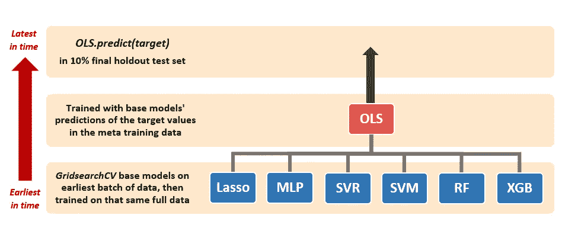

# 多元时间序列的堆积机器学习模型

> 原文：<https://towardsdatascience.com/stacking-machine-learning-models-for-multivariate-time-series-28a082f881?source=collection_archive---------1----------------------->

## [实践教程](https://towardsdatascience.com/tagged/hands-on-tutorials)，通过 Dataland 进行讨论

## 使用堆栈集合预报 PM 2.5 空气污染

**北京雾霾**来自[北京](https://pixabay.com/)

ime 序列分析经常被视为数据科学的一个深奥的子领域。它不是。其他数据科学子领域有它们的特质(例如 NLP、推荐系统、图论等。)，时间序列也是如此。**时间序列是有特质的，不是截然不同的**。

如果你的**目标是预测**，你可能不需要经典的计量经济学模型——ARIMA、ARDL、VAR——以及它们的假设，包括平稳性，这取决于你的需求、方法和数据。事实上，一些著名的计量经济学家长期以来一直认为，平稳生成的多元时间序列数据剥夺了有用的动态趋势和关系，因此你这样做可能会丢弃有价值的信息。

> 存在 VAR(向量自回归)中的变量是否需要是静态的问题。Sims (1980 年)和 Sims，Stock 和 Watson (1990 年)建议反对差分，即使变量包含单位根。他们认为，风险值分析的目标是确定变量之间的相互关系，而不是确定参数估计值。反对差异的主要论点是，它“丢弃”了关于数据中共同运动的信息(例如协整关系的可能性)。同样，有人认为数据不需要去趋势化。— *沃尔特·恩德斯，*应用计量经济学时间序列，第三版

让我来演示一下机器学习模型是如何很好地适用于时间序列预测的，我将通过**堆叠一个机器学习模型**来让它变得更有趣。您确实需要调整交叉验证过程，以尊重时间序列的时间顺序，但是一般的方法是相同的。同样，这是如果你的目标是预测，而你对假设检验和统计推断毫无兴趣的话。

从截面数据分析类比是显而易见的。如果你希望进行统计推断，那么你可能需要一个线性回归模型，并且(很大程度上)遵守高斯-马尔可夫假设。但是，如果你不需要假设检验，那么你可以使用随机森林或支持向量机或神经网络，完全不理会残差图和 *p 值*。

正在讨论的数据集是与污染和天气相关的，目标是预测空气中每小时 2.5 微米颗粒物(“PM 2.5”)的浓度。它是一个**连续变量**。“PM 2.5”是微粒物质中最细的一类**空气污染**，并对健康构成重大威胁，因为这些微粒如此之细，以至于它们可以绕过人体的大部分自然防御，当被吸入时会进入肺部深处。这些数据可以在 UCI 资料库[这里](https://archive.ics.uci.edu/ml/datasets/Beijing+Multi-Site+Air-Quality+Data)免费获取。[1]

[1]宋·(2016)。UCI 机器学习知识库[http://archive . ics . UCI . edu/ml]；加州欧文:加州大学信息与计算机科学学院。

# **栈集合建模**

我将用一些最成功的机器学习算法填充**栈集合**，但不会包括任何计量经济学时间序列模型。堆栈的**第一阶段将包括以下**基本模型**:**

*   **套索回归**(套索)
*   **多层感知器** (MLP)，一种人工神经网络
*   **线性支持向量回归** (SVR)
*   **支持向量机** (SVM) —限于 *rbf* 、 *sigmoid* 或 *poly* 内核
*   **随机森林回归器** (RF)
*   **XG 升压回归器** (XGB)

堆栈的**第二个(也是最后一个)阶段**是一个单一的**元模型**，由最受欢迎的**线性回归**(“OLS”)模型表示。下面是代表我的方法的简单图表。

**根据时间序列的时间流程的三层堆栈模型(图片由作者提供)**

没有“正确的”方法来做系综叠加建模。这主要是实践经验加上大量的尝试和测试。一种相当典型的方法是在**第一阶段**中使用每种机器学习算法中的几个设置为不同的超参数，然后将它们的预测馈送给**元模型**，该元模型根据这些预测和目标变量进行训练。

更复杂的设置可能涉及元模型之前的模型的附加层。数据分析公司 SAS 的一篇博客文章在这里解释了堆叠[的总体思路。](https://blogs.sas.com/content/subconsciousmusings/2017/05/18/stacked-ensemble-models-win-data-science-competitions/)

如果堆栈整体建模有什么原则的话，我会想到三个原则:

1.  组合各种算法，可以对感兴趣的特定数据提供**像样的预测**，但使用**不同的方法**。例如，我在这个集合中混合使用了线性模型、基于树的模型、支持向量模型和神经网络。
2.  **过度拟合**通常是一个问题，因此在评估堆栈模型时严格的交叉验证非常重要。
3.  小心地**分离各种培训、验证和测试数据层**以防止它们“渗透”到下一层。

# 目标变量

该数据集包含从 2010 年 1 月 1 日到 2014 年 12 月 31 日的五年内**每小时**的数据，包括**北京的 PM 2.5** 颗粒读数以及**选定的天气变量**，如温度、风向和降雨量等。原始 csv 文件中有**43824 行**。这项工作的目标变量将是**提前一个周期(即提前一小时)的 PM 2.5 读数**。

目标变量的折线图表明**数据中有很强的季节性**，但没有明显的多年趋势。PM 2.5 读数按年分布的箱线图也表明**缺乏趋势**，尽管数据被限制在零，并且在较高值时似乎受到**大量“异常值”**的困扰。我想空气中的微粒含量不可能是负数。

然而，这些“异常值”中的一些可能根本不是异常值，因为空气污染的某些高发生率可能有某种模式。这就是领域知识和/或普通的求知欲变得重要的地方。让我们先仔细看看这些数据。

**前 15 名 PM 2.5 读数**

左边的表格列出了数据集中**前十五个小时 PM 2.5 读数**。这可能不会立即显而易见，但**前三名的读数**来自 2010 年和 2012 年**农历新年** (LNY)的第一个小时。阴历不同于阳历，因为 LNY 可能落在一年中不同的公历日。传统上，新年是通过燃放鞭炮来迎接的。鞭炮产生大量烟雾和空气中的碎片，通常会造成空气污染。因此，我们需要在模型中考虑 LNY 午夜前后的时间。我想知道汽车是否能够识别这个？

早春时节，北京也很容易出现偶尔的沙尘暴，2010 年 3 月 22 日就出现了一次大沙尘暴，这也导致了上述 15 个榜单中的两个榜单。因此，该模型还需要考虑重大沙尘暴的发生率。沙尘暴可能会提前预报，尽管可能不会提前太久，因此肯定可以作为提前一小时 PM 2.5 预报的解释变量**。**

在解释性分析的过程中，我还发现，作为一个整体，周末时段的 PM 2.5 读数高于工作日时段的 PM 2.5 读数。均值差异的 **t 检验**返回一个 **4.6551** 的 *t 统计量*，意味着差异在 99%水平上显著。

# 复杂的季节性

此外，数据中还有复杂的季节性。每年 PM 2.5 读数的图表显示，在一年的开始和接近结束时出现明显的峰值，基本上是较冷的月份。这是因为北京的大部分污染是由室内供暖产生的，而且天冷时显然会有更多的供暖。这也可以解释为什么 PM 2.5 读数在周末往往更高。

**2010-2014 年 PM 2.5 小时读数**

当我们查看每月平均 PM 2.5 读数及其置信区间**时，季节性变得更加明显。月度数据证实了上述假设的季节性，在温暖的月份记录的水平较低，在寒冷的月份记录的水平较高，在 2 月和 10 月达到高峰。顺便说一下，农历新年也往往是在 1 月下旬到 2 月下旬之间。**

深入研究数据，还会发现明显的**日内季节性**。事实上，在这种情况下，每日的季节性几乎与每月的季节性一样重要。****PM 2.5 平均每小时读数**在午夜左右开始达到一天中的最高水平，然后在下午 15:00 逐渐下降到底部，然后迅速上升到夜晚。这可能是**加热**效应，因为白天太阳升起时对加热的需求减少了。**

****

**所有这些数据分析表明了什么？我需要**虚拟变量**用于以下内容:**

*   **每年 LNY 从晚上 9 点到凌晨 3 点的 7 个小时；**
*   **大沙尘暴的日子；**
*   **周末；**
*   **月；和**
*   **几个小时。**

**我对“大沙尘暴”的判断非常简单。只需在数据集中搜索每年的*“北京沙尘暴 201x”，无论搜索结果的**首页**出现的房源日期如何，都将被记录为“重大沙尘暴”。***

***但是在进行必要的数据工程之前，我首先需要处理**缺失值**的紧迫问题。***

# ***缺少目标值***

***数据的一个主要问题是**缺失值完全在目标变量**中。**几乎 5%的**目标观测值是 *NaNs* ，而**三分之二的**缺失数据是在前两年，即 2010 年和 2011 年。这是一个问题，因为训练数据将来自早期，而训练集中扭曲的目标变量值可能会导致模型在后期测试期间表现不佳。***

***上面描述的季节性表明，简单地用**估算总体平均值、中位数或众数**来代替 *NaN* 值不是一个好主意。现有数据中的**随机赋值**或**结转上一次观测值**也不会。一些(每小时)丢失的数据也连续几天流动，因此从一天流动到第二天的**线性插值**也会引入失真(记住当天的季节性)。面对目标变量复杂的季节性，这些典型的易缺失数据插补方法肯定会导致数据失真。***

***最后，缺失值完全在目标变量中的事实表明，任何从其他变量(即后续解释变量)中估算这些值的尝试都意味着，人们正在设置制造的目标值，这些目标值将很容易通过那些相同的解释变量**预测**，无论人们选择使用哪种算法。***

***这个练习不应该是对目标变量的插补方法的全面覆盖，所以我决定采用一个不太复杂的解决方案来解决这个问题，并考虑到每小时和每月的季节性。执行了一个三阶段流程:***

1.  *****删除遗漏的第一天的观测值**(2010 年 1 月 1 日每小时 PM 2.5 读数全部为*南*秒)。***
2.  *****在当天 0:00-14:00(含)之间的观测值内插“内”缺失值**，然后在 15:00-23:00(含)之间的观测值内插。这一两步程序考虑了上述数据中的**两部分日内季节性**。***
3.  *****通过可用值**的**中值**估算**剩余缺失值，可用值**按各年**的月份和小时分组。如前所述，鉴于 PM 2.5 读数中极值的显著出现，我决定使用中值而不是平均值。*****

**

***各日每小时 PM 2.5 的两步插值代码***

# *相关矩阵*

*在缺失数据插补之后，我接着研究了目标变量相对于数据集中其他连续变量的**相关矩阵**。许多与天气相关的变量似乎与目标变量的相关性很弱。*

**

*同时，几个天气变量之间也有很高的相关性，例如“dewp”、“temp”和“pres”。这些是露点、温度和压力读数。如果要丢弃这三个变量中的一个，“pres”似乎是最明显的，因为它与其他两个变量(“temp”和“dewp”)成对相关，而这三个变量与目标变量的相关性最低。所以我**从分析中去掉了**的“pres”、“cr”和“cs”变量。*

***之前关于世界各地 PM 2.5 污染的研究**将**风力**确定为主要解释因素。基本上，持续的大风条件能有效地驱散空气传播的污染。数据集中的“cws”变量是一个累积风力强度变量，从上面我们可以看出，它与目标变量的相关性为+0.25。*

*在这个特例中，风速和风向之间有一个有趣的**相互作用** **。**偏北风使“cws”与 PM 2.5 之间产生更强的相关性，同时也降低了温度与 PM 2.5 之间的相关性。您可以在下面的两个相关矩阵中观察到这种现象，第一个是当风向混合/不确定时，第二个是当有东北风吹时。*

****

*研究结果表明，我应该在北风方向和“cws”之间设计一个相互作用变量。*

# *自相关和平稳性*

*由于这是一个每小时的时间序列，并且是关于空气污染的，因此因变量中的自相关将会很高是合乎逻辑的。空气中的 PM 2.5 颗粒物不太可能从一个小时到下一个小时突然出现或消失。相反，它们会随着时间的推移逐渐积累或消散。因此，在目标变量的滞后中有**显著的自相关**，正如我们在下面的左图中看到的。*

**

*然而，**部分自相关**在两个滞后之后迅速消失。时间序列爱好者会立即意识到这是至少一个 **AR(2)** 序列的迹象。例如，如果我要运行一个 ARIMA 模型，我会在模型中包含目标变量的至少两个滞后。虽然我在分析中没有使用任何计量经济学时间序列模型，但它确实表明 PM 2.5 读数的**滞后**应该作为特征纳入模型中。*

*此外，PM 2.5 颗粒读数缺乏趋势表明**目标变量自然是稳定的**。事实上，数据集中所有的连续变量都是平稳的。*增强的 Dickey-Fuller* 测试证实**非平稳零假设对于所有变量都被拒绝**。*

**

*Statsmodels 的 **BIC** 结果*自动 arma* 工具仅推荐目标变量的**两个滞后**，而 **AIC** 结果建议**十九个滞后**。在这种情况下，我宁愿更节俭。有趣的是，AIC 得分在三次滞后时达到了最初的低点，随后随着更大的滞后进一步下降。最终，我决定采用目标变量的三个滞后值**。***

# *解释变量*

*这需要经历很多，但却是完全必要的。**特征工程**往往比运行花哨的算法或超参数调优更重要，我也会这么做！最终，我得到了下面的**变量列表**:*

***目标**:*

*   *PM 2.5 读数提前一个周期*

***特点**:*

*   *“PM 2.5”的当前和两个滞后*
*   *“温度”-温度(电流)*
*   *“露点”-露点(电流)*
*   *“CWS”-累积风速(海流)*
*   *三个“cbwd”模型——风向(海流)*
*   *北风方向的交互变量&“CWS”(海流)*
*   *农历新年假人*
*   *大沙暴假人*
*   *周末假人*
*   *小时假人*
*   *月假人*

*最后五个虚拟变量都与目标变量提前一个周期或同时**设置。这是因为 LNY 日期、主要沙尘暴、周末、时间和月份都可以至少提前一小时正确预测。我们可能不知道未来一两个小时的风向，但我们肯定会同意晚上 8 点之后是晚上 9 点，或者 9 月之后是 10 月，或者下一个农历新年将在 2022 年 2 月 1 日。***

*作为一个题外话，我意识到通过时间和日历变量的三角变换伪造的循环时间变量通常可以成为一个有用的替代品。但是循环时间变量不能在基于树的模型中使用，所以我决定在这里不使用它们，因为我对在栈集合中使用这样的模型感兴趣。*

*或者另一方面，在一个栈集合中，将**不同定制的**特性提供给不同的算法是完全可能的。我设计了这样的堆栈。然而，让我们在这个练习中让事情变得更简单。*

# *堆叠过程和网格搜索*

*现在我们终于到达建模。我首先**用三种方式**对数据进行子集化:gridsearch 交叉验证训练数据、元模型训练数据和维持测试数据。在这种情况下，当我处理时间序列时，有必要一丝不苟地尊重分割中向前的**时间流。***

**

***数据按照时间的向前流动分成三种方式(图片由作者提供)***

*数据的**最新 10%** (根据时间流程)被用作**保持测试集**，包括 4380 个观察值。其余 90%的数据中，**最早的三分之二观测值**被分配给 **gridsearch 训练数据**(第一批训练数据)，而**后来的三分之一**被分配给**元模型训练数据**(第二批)。*

*对于使用 *StandardScaler()* 的**数据缩放程序**，只有 gridsearch(第一批)训练数据被**拟合*和*转换**。另外两个子样本是仅经过**变换的**。我复制了下面的建模方法的早期图表。*

**

***根据时间序列的时间流程的三层堆栈模型(图片由作者提供)***

***通过 ***GridsearchCV*** (使用 *TimeSeriesSplit==3* )调整每个基础模型**，以在 gridsearch(第一批)训练数据上找到它们的最佳超参数设置。**每个后网格搜索模型然后在完整的第一批训练数据上进行训练**。为了避免任何混淆，在这种情况下我说“完整”,因为 *GridsearchCV* 过程仅使模型适合每次迭代的一部分 gridsearch 训练数据。*

*对于我上面的陈述，以及 Sklearn 的 *GridsearchCV* 函数是如何操作的，这里可能会有一些读者的进一步误解。在**实际实现**中，只要将 *GridsearchCV* 中的*改装*选项留在**默认** *真*设置，就不需要手动重新训练 gridsearch-tuned 模型。 *GridsearchCV* 随后将根据 gridsearch 中使用的全部训练数据自动训练最佳估计器([链接](https://scikit-learn.org/stable/modules/generated/sklearn.model_selection.GridSearchCV.html))。所以请把我的说法作为一个概念点。*

*元模型训练集(第二批数据)然后被馈送到每个训练的基础模型，以产生目标变量的**预测**。这些预测随后被用作元模型中的**解释变量。在本练习中，元模型仅使用基础模型的预测作为其特征。换句话说，**元 OLS 模型是通过基于基础模型的预测回归元训练集中的目标值来训练的**。请注意，一些堆栈模型在训练元模型时包含了原始的解释变量，这很好，但是我在这里没有使用它们。***

*最后一步是让六个基本模型(仍然只对第一批数据进行训练)生成它们各自对维持测试集中的目标变量的预测。这些预测然后被馈送到元 OLS 模型(如上训练的)，以产生测试集中目标值的**堆栈模型的预测**。*

*该过程的摘要如下:*

1.  ***子集数据三路**，持有最新的 10%的数据作为维持测试集，将剩余的 90%拆分为较早的 gridsearch 训练集(2/3)和较晚的元模型训练集(1/3)；*
2.  ****GridsearchCV*****六个基础模型**找到各自的最优超参数，然后在全 gridsearch 训练数据上训练调好的模型；*
3.  ***基模型对元训练集的预测**形成解释变量**对目标变量训练元模型**；和*
4.  *基础模型最终对维持测试集做出预测，这些预测再次被反馈到元模型，并且元模型对**维持测试集**中的目标变量的预测最终被评分(与基础模型的预测一起用于比较)。*

***所有型号仅安装/训练一次**。基础模型只在 gridsearch(第一批)训练数据上训练，元模型在元训练集上的基础模型预测上训练。无论如何，完整的代码可以在我的 GitHub 页面上找到，文章底部的链接是给那些对细节感兴趣的读者的。*

*下面列出了 *GridsearchCV* 之后的**调谐基础型号**。没有对 OLS 元模型进行网格研究，也没有太大的必要，因为单个超参数只是一个常数项(在某种程度上，是否标准化解释变量的数据)，我总是在这个练习中保留它。*

**

***基础模型的网格搜索后列表***

# *正向链交叉验证*

*在对维持测试集进行评分之前，我使用基础模型的网格搜索后超参数设置对堆栈集合进行了一次 **5 重交叉验证**练习。对于交叉验证练习，我将训练集的两个批次(base+meta)组合起来，以将完整的 90%训练数据重新组成为 CV 集，并为迭代设置 *CV==5* 。*

*交叉验证通过**正向链接或扩展窗口**方法执行。在下面的 *StackExchange* [讨论](https://stats.stackexchange.com/questions/14099/using-k-fold-cross-validation-for-time-series-model-selection)中可以很好地解释这种时间序列 CV 方法。我复制了讨论中发布的图表来说明下面的方法，但应该强调的是，图表中的“数据”不包括**维持测试集**。*

**

*[https://stats . stack exchange . com/questions/14099/using-k-fold-cross-validation-for-time-series-model-selection](https://stats.stackexchange.com/questions/14099/using-k-fold-cross-validation-for-time-series-model-selection)*

*遗憾的是，Sklearn 的 *TimeSeriesSplit* 函数不能用于交叉验证过程。这是因为基础模型的预测形成了每个 CV 折叠中元模型的输入。我们需要在每个折叠中的交叉验证过程中提取每个基础模型的预测，然后将这些预测提供给元模型进行交叉验证。所以需要一个定制的代码。*

*为了确保在稍后对维持测试集进行评分之前，堆栈层之间没有任何数据污染的可能性，这里描述的交叉验证程序是在一个**单独的 *Jupyter 笔记本*** 上实现的，感兴趣的读者可以在我的 GitHub 页面上查看。*

*来自 5 重交叉验证程序的 **MAE 和 RMSE 评分**如下所示。我们看到“堆栈模型”，即 OLS 元模型，具有最低的平均值**和第二低的中值 MAE 得分**。然而，在 **RMSE 得分**中，“堆栈模式”的中值得分**最低**，但平均得分**第二低**。XGBoost 的平均 MAE 得分最低，而 Lasso 的平均 RMSE 得分最低。*

**

***交叉验证 MAE 分数&统计***

**

***交叉验证 RMSE 分数&统计***

*堆栈集成方法似乎在很大程度上如人们所愿地工作，即产生比集成中任何基础模型更精确的结果。它并不完全在那里，但是当我们走向坚持测试集时，它看起来很有希望。*

# *保持测试结果*

*最好有一个**基线模型**进行比较，典型的时间序列基线是**“持续性模型】**。这只是通过目标变量的**滞后值**预测的目标变量的模型。在这种情况下，它将是由当前读数预测的提前一小时的 PM 2.5 读数。*

*如前所述，基本模型只在 gridsearch 训练集上训练一次，然后它们在维持测试集中对目标变量的值进行预测。这些预测形成了在元训练集上训练的 OLS 元模型的特征，然后在测试集上做出堆栈的最终**预测。***

*下面列出了测试集中烟囱模型预测值与实际目标值的一些图表。我将图表的覆盖范围缩短到 400 次(每小时)观察，以使它们更容易理解。下面我们看到的是**前 400 次观察**。*

**

***在测试集**的前 400 次观测中，预测与实际 PM 2.5 读数的对比*

*然后**中间 400** 观察值如下所示。*

**

***在测试集**的中间 400 次观测中，预测与实际 PM 2.5 读数的对比*

*我们看到**栈模型在维持测试集上获得了最低的 MAE 和 RMSE 分数**。此外，与基线持久性模型相比，stack ensemble 在 RMSE (18.66 比 19.76)和 MAE (10.53 比 11.12)得分方面分别实现了 5.5%的**改进。***

**

***维持测试集的测试分数***

****

*还可以观察到，测试集上的堆栈的 RMSE 分数在上述 5 重交叉验证过程中观察到的范围内，但是 MAE 分数低于该范围。一般来说，维持测试集的错误分数往往比所有模型的交叉验证过程中观察到的错误分数**低，这意味着测试集通常更容易预测(因此错误更低)。这突出了在以更全面的方式评估模型性能时进行多重交叉验证的重要性。***

# *结论*

*机器学习算法非常适合时间序列预测。我利用一个**机器学习堆栈**来预测未来一个时期的 **PM 2.5 空气污染**水平。stack ensemble 包括线性模型、基于树的模型、支持向量模型和神经网络的多样化组合，作为基础模型**。最终的超级模特是一直以来最受欢迎的 OLS。***

***这些数据表现出显著的异常值和复杂的季节性，并受到缺少目标值的困扰。花哨的算法和方法永远无法替代精心的预建模数据分析和工程。在此之后，根据时间顺序，数据被分成三部分，最新的 10%的数据作为**维持测试集**。剩下的 90%的数据又被分成用于基础模型的早期 **gridsearch 训练集** (2/3)，以及用于元模型的后期**元训练集** (1/3)。***

***训练数据(90%以上)还用于运行 5 重**正向链交叉验证**程序，以评估所有使用模型的模型性能。交叉验证发现**堆栈模型在 MAE 和 RMSE 分数上大多优于单个基础模型**。***

***维持测试集的后续结果显示了具有**最佳 MAE 和 RMSE 分数**的堆栈模型。栈的分数也证明了比基线持久性模型有**5–6%的改进**。总之，该练习展示了**机器学习集成堆栈方法对多变量时间序列分析的有效性**。***

***(本练习的完整 Python 代码和数据可在我的 *GitHub* [资源库](https://github.com/at-tan/Forecasting_Air_Pollution)中获得。如果直接渲染 GitHub 笔记本文件有问题，使用 [nbviewer](https://nbviewer.org/) 。)***

****如果你看到了阅读这样的文章的价值，你可以在这里订阅 Medium*<https://at-tan.medium.com/membership>**来阅读我和无数其他作家的其他文章。谢谢你。*****

****</time-seasonality-features-in-time-series-7e8236f7b04a>  <https://medium.datadriveninvestor.com/bitcoins-shifting-relationship-to-macro-factors-5465d542078f>  </tackling-imbalanced-data-with-predicted-probabilities-3293602f0f2>  </a-hierarchical-clustering-of-currencies-80b8ba6c9ff3> ****