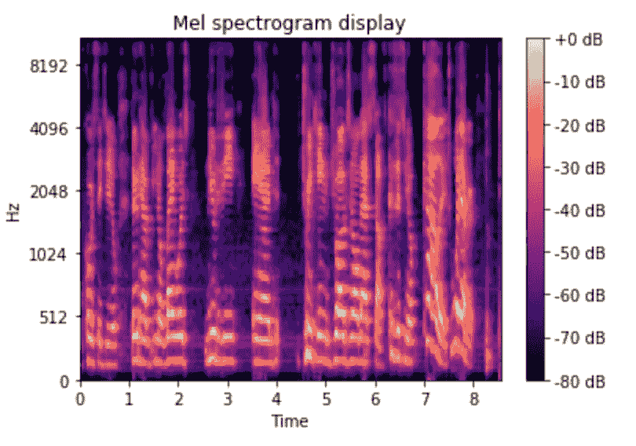

# 用于语音情感分析的堆叠机器学习模型

> 原文：<https://towardsdatascience.com/stacking-machine-learning-models-for-speech-sentiment-analysis-adf433488845?source=collection_archive---------15----------------------->

如何建立一个从音频和文本记录中识别人类情感的模型？合著者:[关](https://medium.com/u/c84d51f06925?source=post_page-----adf433488845--------------------------------)，[亚历山大洛朗](https://medium.com/u/422736fe9020?source=post_page-----adf433488845--------------------------------)。

照片由[你好我是 Nik](https://unsplash.com/@helloimnik?utm_source=medium&utm_medium=referral) 上 [Unsplash](https://unsplash.com?utm_source=medium&utm_medium=referral)

在 Le Wagon 的 bootcamp 的最终项目的背景下，我和我的团队决定承担一项令人着迷的任务:语音情感识别。

这是一个巨大的挑战，因为情感在文化、性别、语言甚至个人层面上都是主观的，因此很难对人类情感进行普遍分类。

## 我们的数据

我们从卡耐基甜瓜大学找到了一个名为[*CMU-莫塞*](https://github.com/A2Zadeh/CMU-MultimodalSDK) 的数据集，这是在线视频中句子级情感分析和情感识别的最大数据集。它包含超过 65 小时的注释视频，来自 1000 多名演讲者和 250 个主题。

数据被分成不同长度的片段，每个片段代表一个完整的口语句子(特征)和情感，我们的目标，它在值-3 到 3 之间变化(从负到正，0 是中性的)。

我们决定分析录音和文字记录来预测一个人的句子背后的情绪。我们的直觉是，结合两个不同来源的两个模型，使用多模态学习，可以提高我们的性能。

## 数据预处理

我们工作的第一步是清理文本和音频数据。

虽然已经从视频中提取了文本，但编辑主要是对文本文件进行基本格式化(删除标点、数字和大写字母)。然而，在自然语言处理(NLP)中，很难选择去除文本的哪些部分以及保留哪些部分(单个单词、句子、整个会话)。我试图对单词进行词汇化和词干化，但是没有发现性能上的改进。

音频格式稍微复杂一些，我们尝试了两种方法:

1.首先是使用 Python 的库 [*librosa*](https://librosa.org/doc/latest/index.html) 进行音频特征提取。它能够从每个记录中提取 5 个主要特征(平均值):MFCC、色度、梅尔谱图、光谱质心& Tonnetz。从中，我获得了大约 190 个特征，这些特征可以作为表格数据用于建模。

2.第二个是音频到 Mel 声谱图，它允许我们将音频解释为图像，并从视觉角度对其进行建模。请看下图，x 轴代表时间(s)，y 轴代表频率(Hz)，颜色强度代表信号幅度(dB)。在这种情况下，图像允许在深度学习设置(卷积网络)中进行特征提取。

作者图片

# 堆叠机器学习模型

## ML 文本模型

我首先尝试看看我们可以用一个简单的单词袋 NLP 模型实现什么结果。

单词袋表示包括对文本中每个单词的出现次数进行计数。每个单词的计数变成一列。我决定使用 [*scikit-learn*](https://scikit-learn.org/stable/) 的 CountVectorizer，并执行网格搜索来寻找最佳的超参数。

这些超参数包括:

*   忽略数据集中出现频率高于指定阈值(`**max_df**`)的单词
*   指定矢量化时要保留的顶部特征的数量(`**max_features**`)
*   指定要考虑的序列长度(`**ngram_range**`)。

令人惊讶的是，给出最好结果的`**ngram_range**`是在训练中只保持一个单词长度的那个(`**(1,1)**`)。因此，我们的模型可能无法检测出“不开心”是一种负面情绪。我们的解释是，大多数时候，我们的模型会关注关键词(“好”、“灾难”)来检测正确的情绪。

矢量化之后，我使用了一个具有岭正则化的回归模型:其想法是通过在基于回归系数(betas)的损失函数中添加一个惩罚项来避免我们的模型过度拟合。我们决定使用 L2 罚函数，因为我们假设所有系数对预测都有相似的影响。

为了评估模型的性能，我使用了平均绝对误差(MAE ),一种预测值和“真实”观察值之间的误差度量。在这里，这个基本的 NLP 模型给了我们 0.87 MAE，这意味着情绪的预测值和真实值之间的差异平均为 0.87，其中情绪等级为[-3，3]。

作为比较，我使用来自均匀分布的随机样本创建了一个基线模型，它给出了 1.77 MAE。

## ML 音频模型

如上所述，音频的输入变量(X)是从音频文件中提取的声学特征。

为了预测情绪，我们使用 scikit-learn 构建了一个随机森林(RF)模型。RF 是一种集成方法，它在数据集的子样本上打包一组决策树。这种方法的优点是 RF 使用平均来提高预测精度和控制过拟合。

然后，我们进行了网格搜索，以优化 RF 的超参数，包括:

*   森林中的树木数量(`**n_estimators**`)
*   分割内部节点所需的最小样本数(`**min_samples_split**`
*   树的最大深度(`**max_depth**`)。

在这里，这个安装在音频功能上的 RF 模型给了我们 0.91 MAE。

## 堆叠最大似然模型以改进我们的预测

一旦这两个模型建立起来，我们打算把它们的预测结合起来，看看是否能改进我们的结果。

首先，我创建了一个定制的特性选择器，使我们的管道能够在堆叠它们之前为每个模型选择正确的特性:

然后，我使用 scikit-learn 的堆叠回归和 MLP 回归来创建我们的堆叠模型的结构。想法是增加神经元层，在管道执行中结合两种模型。迭代之后，我们选择了一个有五个神经元的单层。

该模型作为一个深度学习神经网络工作:我实现了 500 个纪元(`**max_iter**`)，这是一个在每个神经元中校正的线性激活函数(`**activation='relu'**` ) &，一个限制过度拟合的早期停止工具。

堆叠 ML 模型的过程能够显著改善我们的预测:我们的最终模型达到了 0.78 的 MAE。

# 堆叠深度学习模型

## NLP CNN 模型

为了用神经网络分析文本，我选择了一个带有自定义嵌入的卷积网络模型。

嵌入包括将我们的训练集的每个单词放置在我们创建的多维空间中。我们决定创造自己的词汇，潜在地更加强调每个单词的情感‘价值&因此比例如 [*Word2Vec*](https://www.tensorflow.org/tutorials/text/word2vec) 更加精确。为此，我们创建了一个“词汇”类来训练&保存这个词汇以备将来预测。

至于模型，我们实现了一个卷积神经网络(CNN):这些类型的深度学习模型广泛用于图像，也执行某些 NLP 任务，这是情感预测的情况。

下面的代码展示了我们用 [*Tensorflow*](https://www.tensorflow.org/) 的[*keras*](https://keras.io/)*库构建的神经网络。在集成嵌入之后，训练数据通过一个卷积层。然后将它压平，得到一个由 32 个神经元组成的致密层。所有神经元都具有校正的线性激活函数(`**activation='relu'**`)。*

*这个 CNN 模型在我们的测试数据中给了我们 0.75 MAE，成为我们最好的模型。*

## *音频 CNN 模型*

*我们的下一个方法是使用音频 Mel 声谱图，这在深度学习中被广泛采用。我们将频率转换为 Mel 标度，结果成为 Mel 频谱图，它将成为 CNN 模型的输入(作为图像)。*

*因为人类不能在线性标度上感知频率，Mel 标度接近人类对音高的感知。因此，在我们的研究中，所有的频率都被映射到 128 个 Mel 波段。*

*由于 CNN 的所有输入应该具有相同的输入形状，因此我们为较短的音频填充静音，为较长的音频进行剪辑，以便获得唯一的输入形状(128，850，1)，其中 128 表示 128 个 Mel 带，850 表示长度，1 表示 1 通道(灰度图像)。*

*这是我们使用 Mel 声谱图为情绪预测建立的最终 CNN 模型。*

*这种对 Mel 光谱图的图像分析给出了 0.89 MAE。*

## *堆叠 DL 模型*

**

*两个原始模型后具有两层神经元的 DL 堆叠的视觉表示—图片由作者提供*

*从 ML 结果中，我们了解到堆叠 NLP 和音频模型可以改进我们的预测。因此，由于使用了*keras*‘Concatenate’方法，我们在输出层之前堆叠了两个 DL 模型输出和一个密集层。*

*使用与 ML 桩中相同的方法，模型本质上基于两个模型输出进行回归。不幸的是，它并没有改善我们对测试数据的预测，因为这个叠加模型也给出了 0.75 MAE。*

# *结果和展望*

**

*作者图片*

*总的来说，我们任务的最佳模型是我们的 NLP 深度学习模型。我们发现最终的 0.75 MAE 是可以接受的，反映了项目所花费的时间、数据集的大小及其质量:*

*首先，它是由人类注释的:由于情绪和情感是高度主观的(文化、意义的不同解释、讽刺等等)，模型的质量受到了损害。其次，大多数时候情绪是中性的，这意味着数据可能会被扭曲。这导致我们的模型不成比例地预测情绪为中性(尽管它是积极的或消极的)。在不牺牲数据集大小(数据平衡)的情况下，解决这个问题的方法是收集更多的负面和正面数据，以便提取预测更广泛情感的特征。*

*此外，我们认为我们的结果可以在几个方面得到改进:*

*   *在模型调整上花费更多时间，关注超参数、文本清理步骤或内核大小。*
*   *尝试堆叠其他深度学习模型，看看它们是否可以改善我们的预测。Mel spectrogram 似乎没有找到可以与我们的 NLP CNN 上分析的文本互补的模式。我们的结论是，这个问题值得深入挖掘，我们绝对欢迎来自社区的评论和建议！*
*   *用不同的方法建立一个情绪分类器，能够预测快乐、愤怒、惊喜等，而不是情绪评级。*

*源代码可以在 [GitHub](https://github.com/Celine-Guan/backinthessr) 上找到。我们期待听到任何反馈或问题。*

*作为结论，我们相信从音频和文本中进行情感识别有一个非常令人兴奋的未来，因为它允许从人们那里收集很好的见解。如果进一步推进，并与情感分类相结合，这类项目的一些用例可以为社会增加巨大的价值。例如:*

*   *改善电话客户服务。根据客户的情绪/观点重新引导客户。满意的客户可以被引导到销售部门，不满意的客户可以被引导到保留部门，困惑的客户可以被引导到技术支持部门，等等。*
*   *这也是一种评估服务质量和品牌监控的好方法。我们绝对欢迎来自社区的评论和建议，并期待看到这一领域的改进。*

*[1]A，梁 PP，茯苓 S，Vij P，Cambria E，Morency L-P (2018)，面向人类交流理解的多注意递归网络，*第三十二届 AAAI 人工智能大会。**

*[2]:塔哈·宾胡拉依布。(2020 年 10 月 13 日)。美国有线电视新闻网[https://towardsdatascience.com/nlp-with-cnns-a6aa743bdc1e](/nlp-with-cnns-a6aa743bdc1e)NLP*