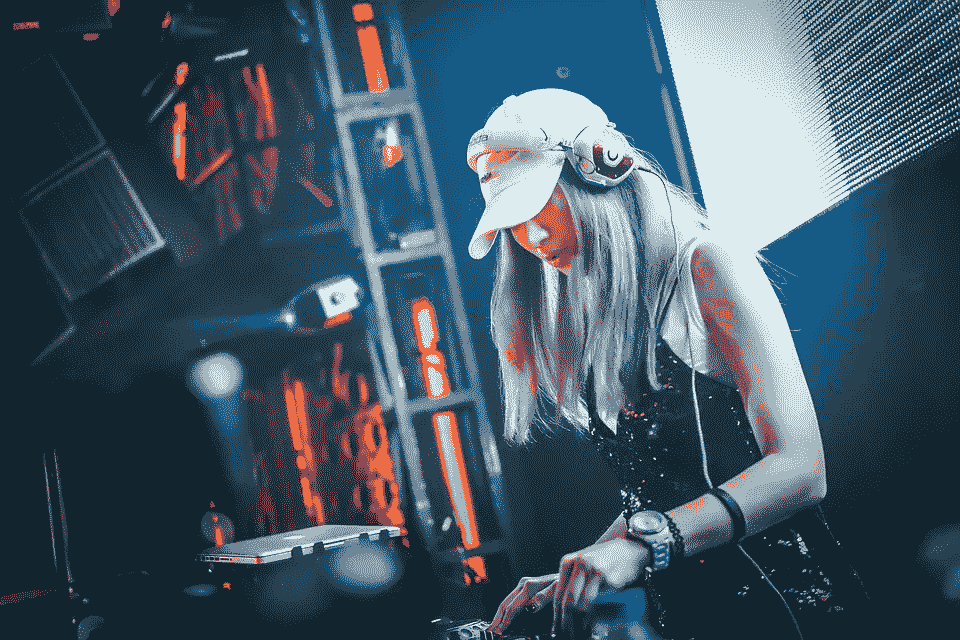
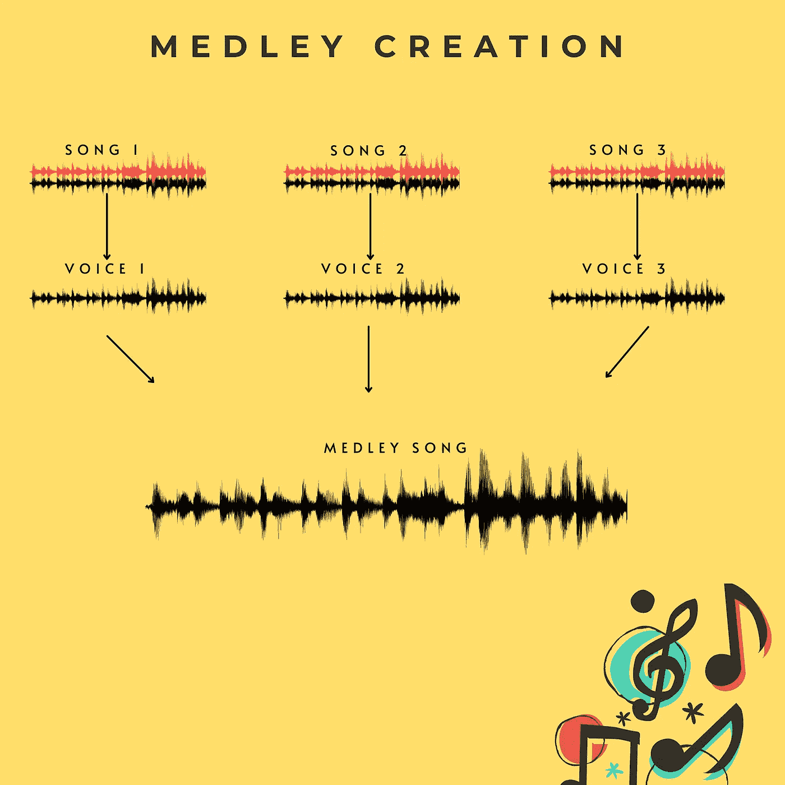

# 用这个有趣的 Python 项目脱颖而出

> 原文：<https://towardsdatascience.com/stand-out-from-the-crowd-with-this-interesting-python-project-6f24c7ad0777?source=collection_archive---------23----------------------->

## 自动混合歌曲创作



由 [StockSnap](https://pixabay.com/users/stocksnap-894430/) 在 [Pixabay](https://pixabay.com/) 上拍摄的照片

典型的数据科学家的目标是使用分析和机器学习为现实世界的问题提供解决方案，但不一定总是这样。你也可以是艺术家。

如果你把数据科学生命中的每一口气都花在解决业务问题上，那么到了某一点后，你就会筋疲力尽，有失去对数据的热爱的危险。如果你厌倦了详尽的数据科学项目，是时候做些有趣的事情来填充你头脑中的燃料，让火花继续燃烧。

除了成为一名数据科学家，我还一直希望成为一名音乐艺术家。这就是为什么作为一个有趣的项目，我决定做一些歌曲/音乐。

> 这是数据科学家成为艺术家的方式。

我这么做的灵感主要来自于[洋红色](https://magenta.tensorflow.org/)。如果你在数据科学领域工作，处理音频文件，几乎不可能不碰到 Librosa 和 Magenta 库。这是我在这个项目中使用的两个主要的库。

# 我打算怎么做？

有了洋红色，你可以做很多艺术作品。不要相信我的话，看看 Magenta 博客就可以自己决定了。你可以找到各种聪明人的艺术作品，他们使用了品红色，创造了新的音乐，创造了钢琴曲，音调转换等等。

我将使用三首歌曲来创建一个自动使用 Python 的混合。使用的古典歌曲是从 cal500 数据集[1]下载的。

## 资料组

我从 [Cal500 数据集](http://slam.iis.sinica.edu.tw/demo/CAL500exp/)【1】中选择了 3 首歌曲，这些歌曲被下载并上传到 Google Colab 运行时文件夹。

请随意尝试你喜欢的歌曲。我选择的歌曲如下(选择纯粹基于个人兴趣)

*   披头士[草莓地](https://youtu.be/HtUH9z_Oey8)
*   约翰·列侬的《想象》
*   鲍勃·迪伦《今夜我将是你的宝贝》

如果你听过任何一首混合歌曲，你会发现一首好的歌曲会有一段共同的背景音乐，而且通常所有的歌曲都是由同一个人演唱的。

这意味着尽管有多首歌曲，但混合曲将有相同的声音和共同的音乐。

现在，你如何用 python 来做呢？我在这个项目中实现的解决方案是首先识别背景音乐，并将其与语音分开。

这意味着我们将有一些只有原声的文件，然后我们可以把所有的声音片段组合在一起，做成一个混音。你可以看下面的视频来清楚地了解这个计划。



Medley 创建计划[图片由作者创建]

从技术上讲，我们在这里要做的是

*   移除背景音乐
*   从裸音剪辑中找到最佳片段
*   把最好的剪辑分开，然后组合成一首混合泳

你可以用 [colab 笔记本](https://colab.research.google.com/drive/1PmqjkSMsWpFU9wMG5lNaR9PqnKWo2mWL?usp=sharing)或者 [Github](https://github.com/tejeshb/Medley-generator) 直接跳转看代码自己跑。我在下面概述了我实施这个项目的思考过程。

# 从想法到行动——用 Python 实现

对于这个项目，您可以使用任何支持 python 的平台。我的建议是使用 **Google Colab Notebook** 或者你可以检查一下 block [Deepnote](https://medium.com/datadriveninvestor/3-reasons-why-deepnote-is-powerful-than-famous-jupyter-notebooks-43aee38419f5) 中的新成员。

开始之前，请确保您已经安装了必要的库。这个项目需要的主要库如下。

*   分离人声和歌曲
*   librosa——加载和拆分歌曲
*   pydub —加入所有的声音

你可以使用`pip install xxxx`来安装上面的库

```
pip install spleeter
pip install librosa
pip install pydub
```

## 步骤 1 —分离声音

现在，作为第一步，我们需要从歌曲中分离出声音。这意味着程序应该能够识别背景音乐，并删除它。

为此，最简单有效的方法就是使用 spleeter 库。Spleeter 库是基于 Tensorflow 的。如果感兴趣的话，你也可以尝试使用 librosa 的声音分离。

> 当我尝试用 spleeter 和 librosa 搜索相同的歌曲时，与 librosa 相比，spleeter 给出了更有效的结果。Librosa 的输出不清晰，也更嘈杂。

要分离歌曲的声音，使用如下的 **spleeter** 功能。

```
!spleeter separate song1.mp3 -d 60 -o output/
```

这里-d 指的是要处理的歌曲的持续时间。我处理了前 60 秒，-o 表示输出路径。

要了解更多关于 spleeter 用法的信息，您可以运行`!spleeter separate --help`

对另外两首歌重复同样的操作，并将声音路径保存在`songs_path`中

```
songs_path = ["/content/output/song1/vocals.wav",
"/content/output/song2/vocals.wav",
"/content/output/song3/vocals.wav"]
```

点击下面的播放按钮可以听到声音输出。

今夜我将是你的宝贝之歌

想象之声

草莓之声之歌

如果你观察到这些音频文件中有很多静音，因为背景音乐被移除了，只有音乐的部分会是静音的。

## 识别沉默

为了识别声音之间的寂静，我使用了 librosa 的*特效。分割*，为此我们需要将声音音频文件转换成波形 *y* ，采样率为 *sr.*

可以使用`librosa.load()`来完成。你可以在所有的语音音频文件中看到 for 循环的实现。

```
for song in songs_path:
  y, sr = librosa.load(song, duration=60)
  y_all.append(y)
  sr_all.append(sr)
```

现在，要知道文件中的静音并只分离有声音的音频，使用`librosa.effects.split()`并将 **top_db 设置为 40** ，这样它将只考虑 40db 以上的声音。

```
for x in y_all:
 tr_all.append(
 librosa.effects.split(y=x, frame_length=8000,top_db=40))
```

## 选择最佳分割

在前面的步骤中，所有 3 首歌曲的声音文件被分割成更小的部分。因为想法是找到歌曲的最佳可能片段，所以我所做的是获得歌曲每个片段的开始时间、结束时间和持续时间，以获得**最大持续时间**片段的细节。

获得最大持续时间的想法背后的思想是选择最佳片段，这样任何人听到片段都应该能够识别歌曲。

您可以在下面看到安装代码

下一步是计算每首歌曲的选定片段的开始和结束时间的准确时间。它可以按如下方式实现。

```
for d in duration:
 song_snip_duration_index.append(d.index(max(d)))
 song_snip_duration.append(max(d))for i,s in enumerate(start_time):
song_offset.append(s[song_snip_duration_index[i]])
```

下一步是使用开始和结束时间，生成只有声音的原始歌曲的最终片段。

```
for n,new_song in enumerate(songs_path):
 new_y, new_sr = 
 librosa.load( new_song,
 offset=float(song_offset[n]),duration=song_snip_duration[n])
 sf.write("new_song" + str(n) + ".wav", new_y, new_sr)
```

最后，所有的片段可以按如下方式连接在一起

```
from pydub import AudioSegment
 sound1 = AudioSegment.from_wav("/content/new_song0.wav")
 sound2 = AudioSegment.from_wav("/content/new_song1.wav")
 sound3 = AudioSegment.from_wav("/content/new_song2.wav")
 combined_sounds = sound1 + sound2 + sound3
 combined_sounds.export("all_voices.wav", format="wav")
```

通过点击下面的播放按钮，可以听到带有裸露声音的混合泳的最终神奇输出

3 首歌曲的混合曲—只有声音

## 你现在已经做了什么，你还能做什么？

最终结果出来后，我非常兴奋，因为我可以用 python 做一些有趣而非正统的事情。我希望你也有同样的感觉。没有什么比学习新东西更甜蜜的了。拿起一个你自己的想法，自己去做。相信我，你不仅让自己感到自豪，还学到了很多东西。

你可以在 Colab 笔记本上看到完整的代码—

包含整个实现的笔记本

# 参考

[1]s-y Wang，j-c Wang，y-h Yang，h-m Wang，“基于 CAL500 扩展的时变音乐自动标记方法”，IEEE 国际多媒体会议论文集*和博览会*，西班牙巴塞罗那，2014。