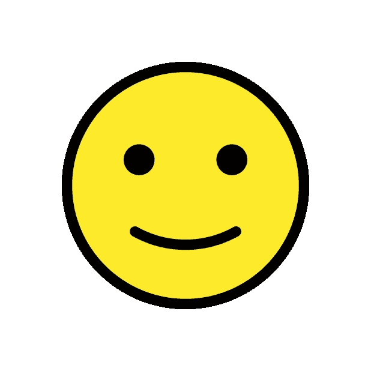
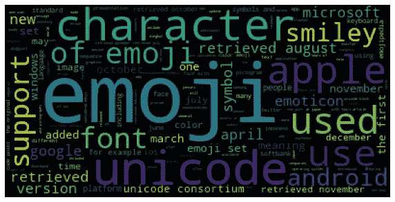
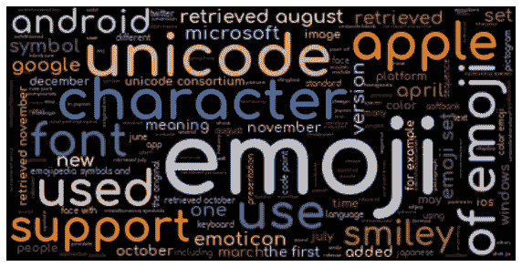
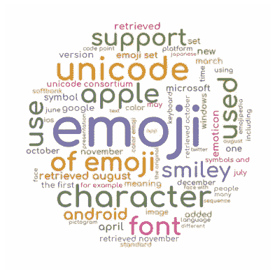
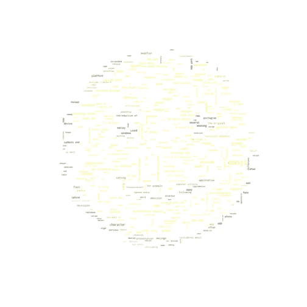
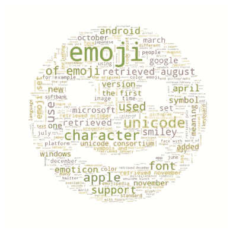
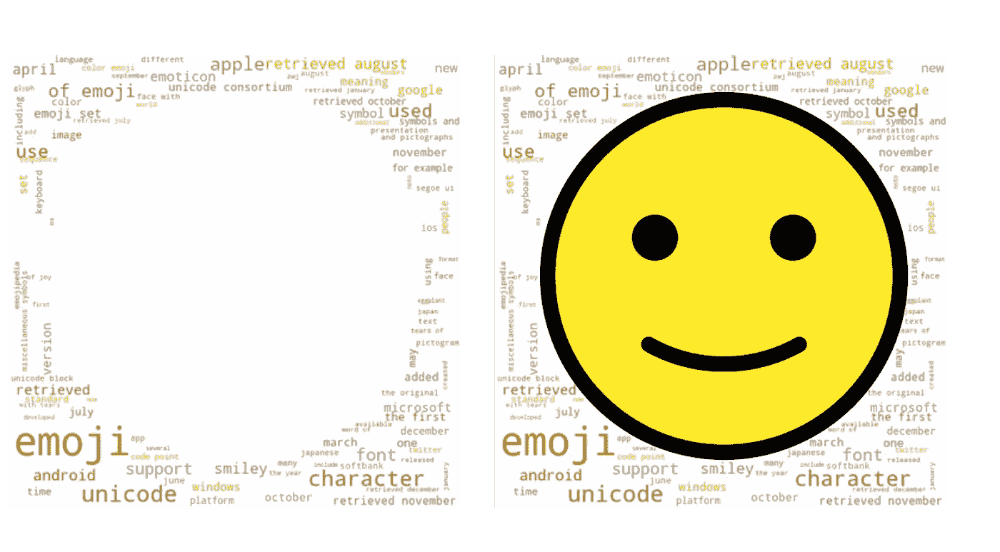

# 从云中脱颖而出:如何塑造和格式化单词云

> 原文：<https://towardsdatascience.com/standing-out-from-the-cloud-how-to-shape-and-format-a-word-cloud-bf54beab3389?source=collection_archive---------27----------------------->

## 在 Python 中使用和设计单词云的技巧

这个博客将涵盖单词云，它们的局限性，然后是一些格式化的例子。

# **好人**

词云是一种简单的方法来总结文本，并使最流行的词引起你的注意。它们引人注目，易于理解，不需要任何额外的解释。

# **坏了**

但是，词云确实有局限性。它们对深入分析没有帮助。它们可能比简单的条形图更吸引人——但是它们提供的信息要少得多。以下是词云的一些问题。

*   字体大小并不是显示差异的有效方式。我们可以区分大、中、小字体；除此之外，事情就变得棘手了。
*   我们不知道单词是如何加权的——大字体实际上意味着什么？大字体的单词是出现 10 次还是 1000 次？
*   可视化中的定位通常非常重要。然而，在词云中，词序是随机的。
*   较长的单词比较短的单词受到更多的强调，因为它们的长度占据了更多的空间。
*   我们对单词的上下文一无所知。在某些情况下，相反的意思会被突出显示，例如，在“not”的停用词被删除后，短语“not good”会在词云上表示为“good”。

尽管有这些限制，单词云已经变得非常流行，主要是因为它们很容易创建。词云的流行和缺点意味着它们有许多诽谤者——我最喜欢的词云(或“标签云”)侮辱是它们是“新的[鲻鱼](http://www.zeldman.com/daily/0405d.shtml)”……哎哟。

# **何时使用文字云**

你看这个博客不是为了了解字云有多可怕。有很多其他的博客都是关于这个的。文字云是吸引注意力的绝佳工具。它们作为介绍和打破沉重的文本段落是很方便的。那么，如何让你的字云从云端跳出来呢？

# **入门**

对于这些例子，我将使用来自 [**OpenMoji**](https://openmoji.org/library/#group=smileys-emotion%2Fface-smiling&emoji=1F642) 的表情符号和来自 [**Wikipedia**](https://en.wikipedia.org/wiki/Emoji) 的关于表情符号的文本来形成云。

## **微微笑着的脸**

> 一张黄色的脸，睁着简单的眼睛，带着淡淡的微笑。传达广泛的积极、快乐和友好的情感。它的语气也可以是居高临下、被动攻击或讽刺，就好像在说*这很好*，但实际上并不好

[https://emojipedia.org/slightly-smiling-face/](https://emojipedia.org/slightly-smiling-face/)



来源[埃米莉·耶格尔的 OpenMoji](https://openmoji.org/) 。Unicode 1F642。牌照: [CC BY-SA 4.0](https://creativecommons.org/licenses/by-sa/4.0/)

# **库**

以下是可以使用的库

```
from PIL import Image
from wordcloud import WordCloud, STOPWORDS, ImageColorGenerator
import matplotlib.pyplot as plt
%matplotlib inline
import numpy as np
```

# **默认字云**

```
# Default WordCloud
wordcloud = WordCloud().generate(emoji_text)  
plt.figure(figsize=(10,6))
plt.imshow(wordcloud)
plt.axis(“off”)
plt.show()
```



默认单词云—按作者分类的图像

# **格式化**

```
wordcloud = WordCloud(max_font_size=80, max_words=1000, background_color=”black”, colormap=’Paired’).generate(emoji_text)
# Use the lasst four lines from above (plt) to plot the Word Cloud
plt...
```

这里我们改变了一些默认参数——使用 background_color、max_font_size 和 colormap——任何 Matplotlib 调色板都可以工作并设置字体。

在这个例子中，我还使用 font_path 来选择自定义字体。您将此设置为所选字体的文件位置。例如:

```
font_path = “/Users/You/Fonts/Comfortaa-Bold.ttf”
```

WordCloud 还有一个内置的停用词列表，您可以忽略、调整或使用，如下所示:

```
stopwords = set(STOPWORDS)
```



格式化单词云—按作者分类的图片

# **形状**

您可以使用遮罩为您的单词云创建一个形状。首先，上传一个 png 图像，并将其转换为数组。Wordcloud 会在图片非白色的位置画出文字。在数组中，255 是白色的，1 是黑色的。

```
mask2 = np.array(Image.open("paint1a.png"))
emo2 = WordCloud(font_path = font_path, background_color="white", max_words=100, mask=mask2, stopwords=stopwords,
               min_font_size=10, colormap='Dark2')# Generate a wordcloud
emo2.generate(emoji_text)# plt ...
```



单词云形状—作者图片

## **不良透明遮罩错误**

如果你的图像有一个透明的背景，它将抛出一个错误。

```
ValueError: bad transparency mask
```

遮罩需要白色值为 255，而不是 0。您可以通过查看阵列来检查您的图像。

```
emoji_mask = np.array(Image.open(“1F642_color.png”))
emoji_maskarray([[0, 0, 0, …, 0, 0, 0],
…,
[0, 0, 0, …, 0, 0, 0]], dtype=uint8)# replace 0 with 255
emoji_mask[emoji_mask == 0] = 255
emoji_maskarray([[255, 255, 255, …, 255, 255, 255],
…,
[255, 255, 255, …, 255, 255, 255]], dtype=uint8)
```

# **颜色**

您还可以使用 ImageColorGenerator 函数来设置色彩映射表以匹配图像。(深色斑块是我们表情符号的眼睛和嘴巴。您可能需要减小 max_font_size 以改善图像细节的外观)

```
# note — need to set max font size, or font extends over the colors
mask = np.array(Image.open(“paint1.png”))
emo_clr = WordCloud(background_color=”white”, mode=”RGBA”, max_words=3000, max_font_size=18, mask=mask).generate(emoji_text)# create coloring from image
image_colors = ImageColorGenerator(mask)plt.figure(figsize=[7,7])
plt.imshow(emo_clr.recolor(color_func=image_colors), interpolation=”bilinear”)
plt.axis(“off”)
plt.show()
```



文字云颜色示例—作者图片

表情符号确实展示了颜色效果是如何工作的，但这并不是一个很好的例子。黄色勉强显示在白色背景上，无法看清上面的字。为了显示眼睛和嘴巴的清晰度，这个词云使用了海量的最大字数和小的最大字体。我建议您尝试使用颜色，在保持每种颜色的边框的同时，尽可能将字体变大。有些图像比其他图像效果更好，直线颜色比曲线颜色效果更好。

## **灰度图像 TODO 错误**

使用颜色时，有些图像会产生错误。

```
NotImplementedError: Gray-scale images TODO
```

color 函数寻找一个三通道数组，代表红色、绿色和蓝色(RGB)的值。有些图像只有一个通道。你可以通过在数组中增加两个额外的通道来解决这个问题——参见马修·亚瑟的博客中关于如何做的一个很好的例子。

或者，我发现通过在画板或画笔中打开图像并重新保存图像，它会转换成预期的格式。

通过检查形状来检查图像，如下所示:

```
test = np.array(Image.open(“1F642_color.png”))
test.shape(618, 618) # -> error example(618, 618, 3) # -> RGB example
```

# **逆**

这里有一个类似的例子，我调整了 NumPy 数组，使表情符号的眼睛和嘴巴保持空白。

```
mask2 = np.array(Image.open(“paint1.png”))
mask3 = np.where(mask2==0, 255, mask2)emo = WordCloud(background_color=”white”, max_words=500, mask=mask3, stopwords=stopwords, colormap=’Dark2')emo.generate(emoji_text)
```



字云反形—图片作者

# **反转**

最后，你也可以用反转图像来做实验。这里，我们将单词 cloud 绘制在阴影周围，而不是形状内部。我在 MS Paint 中调整了这张图片，反转了颜色，这样我就有了一个围绕着白色圆圈的黑色轮廓。最后，我用 Python 打开它，把它作为一个词云加载——代码是一样的。

一旦你有了文字云轮廓，你可以把原始图像放在上面，就像这样。



左侧为反向文字云|右侧为反向文字云，图片由作者提供

# 摘要

文字云是吸引人们关注你作品的绝佳方式。它们可以成为更深入分析的良好开端。有许多不同的方法可以调整你的词云，使之适合你的项目，而不是局限于默认设置。我希望这篇博客的例子能给你一个创建你自己的单词云的起点。

快乐云！

# **附加资源**

## 表情符号

[https://open moji . org/library/# group = smileys-emotion % 2f face-smiling&e moji = 1f 642](https://openmoji.org/library/#group=smileys-emotion%2Fface-smiling&emoji=1F642)

## Word 云文档

[https://amueller.github.io/word_cloud/index.html](https://amueller.github.io/word_cloud/index.html)

## 数据营 Word 云教程

[https://www . data camp . com/community/tutorials/word cloud-python](https://www.datacamp.com/community/tutorials/wordcloud-python)

## 将图像转换为 RGB

[https://towards data science . com/transform-gray-images-to-RGB-using-python-matplotlib-6a 0625d 992 DD](/transform-grayscale-images-to-rgb-using-pythons-matplotlib-6a0625d992dd)