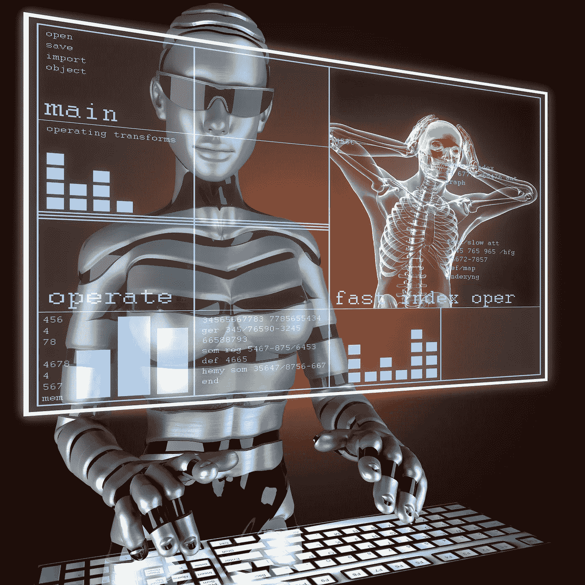
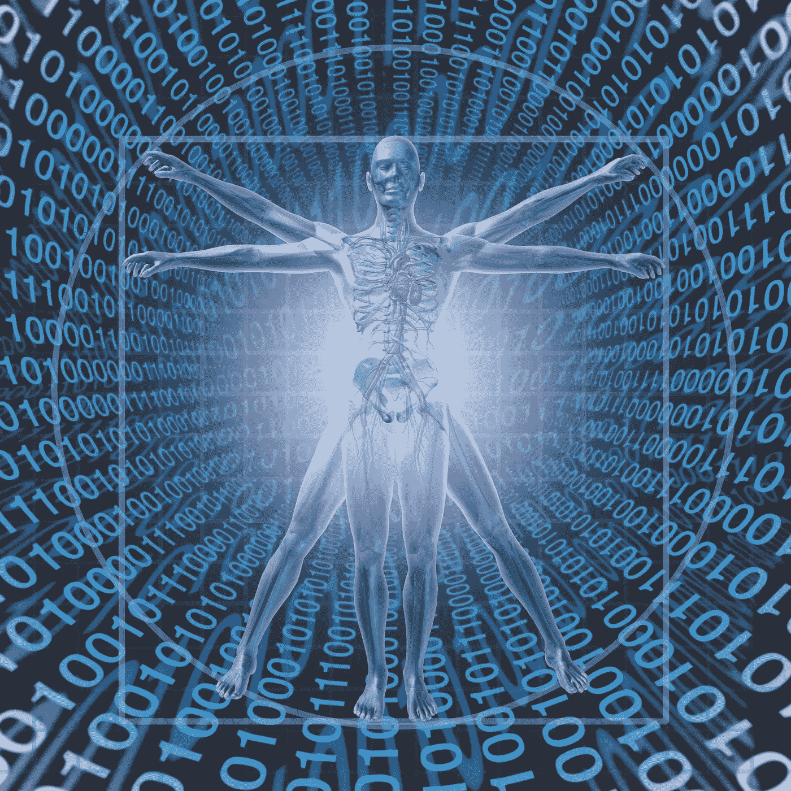

# 斯坦福大学的 AIMI 通过向研究人员提供免费的大数据，正在彻底改变医疗保健人工智能

> 原文：<https://towardsdatascience.com/stanfords-aimi-is-revolutionizing-healthcare-ai-by-providing-free-big-data-to-researchers-836b6284419f?source=collection_archive---------27----------------------->

## 斯坦福大学的 AIMI 图书馆是人工智能模型训练中使用的数据的一个令人难以置信的强大资源

来源:[埃尔努尔 _](https://depositphotos.com/portfolio-1000975.html)/【depositphotos.com 

# 人工智能系统的好坏取决于它的数据

人工智能正在医疗保健领域开辟新天地，创造一个一切都将自动化和一体化的可能性世界。事实上，人工智能、物联网和机器人正在联合起来，实现我们世界中几乎所有东西的自动化。查看我们关于[物联网和机器人技术的结合如何改善世界医疗保健系统的许多方面的文章](https://www.aimblog.io/2021/08/13/iot-aided-robotics-and-healthcares-new-revolution/)，了解关于这一现象的更多信息。

正如旅顺江和他的研究团队所指出的，影响人工智能在几乎所有行业的实施的最大挑战是获得良好的培训数据。

来源:[video doctor](https://depositphotos.com/portfolio-1063927.html?content=photo)/[Depositphotos.com](https://depositphotos.com/)

任何给定的人工智能系统都只和它的训练数据一样好，这就是为什么人工智能和大数据是不可分割的一对。斯坦福大学医学和成像人工智能中心(AIMI)正在努力解决人工智能在医疗保健中的这一障碍。

人工智能的早期受到人工智能偏见带来的几个陷阱的困扰。在其他问题中，算法偏见造成了不公平的结果，使一组任意的用户优先于其他用户。这种不足导致许多人工智能算法被贴上性别歧视和/或种族歧视的标签。今天，随着像斯坦福大学的 AIMI 这样的程序为机器学习提供了几个数据集，这个古老的挑战得到了适当的关注。

# 关于斯坦福的 AIMI

斯坦福大学和微软创建了 [AIMI](https://aimi.stanford.edu/) 作为带注释数据集的一站式目的地，这些数据集可用作医疗保健模型的训练数据。它已经获得了超过 100 万张图像，并在不断增加，使其成为世界上最大的带注释的去识别医学图像数据库。这些图像免费提供给研究人员。

通过与微软的 AI for Health 项目合作，新的[平台](https://hai.stanford.edu/news/open-source-movement-comes-medical-datasets)将具有高度的注释性、可访问性和可见性。它托管和组织来自全球医疗保健机构的大量额外图像，以创建一个开放的全球存储库。该平台将成为共享研究、完善模型和识别人群共同差异的中心。

来源:Depositphotos.com[一切皆有可能](https://depositphotos.com/portfolio-1907633.html?content=photo)/<https://depositphotos.com/>

# 这对人工智能和医疗保健意味着什么？

随着人工智能作为我们社会众多领域的解决方案不断扩大其作用，对更多高质量训练数据的需求也在增长。学习算法和模型只受到它们被馈送的数据的限制；这就是斯坦福大学的 AIMI 发挥作用的地方。

大人工智能、物联网、AIoT、机器人和支持 5G 的智能系统需要尽可能多的信息，以便创建实时解决方案。AIMI 图书馆预计将在 2022 年达到 200 万张图片。它是最强大的精选、患者身份识别和人工智能就绪数据资源，其对人工智能在医疗保健中的影响是不可想象的。

AIMI 的数字财富金矿将是开源的，这是人工智能世界一直在等待的，以便开辟更多新的领域。有了开源数据库，来自世界任何地方的研究人员都可以为他们的下一个人工智能项目访问数据。

所有的人工智能医学研究都将受到积极影响，而不仅仅是医学成像。它将允许人们探索人工智能的重要临床用途，而不仅仅是像素数据，包括伴随的多模态数据。

来源:[光源](https://depositphotos.com/portfolio-1229718.html?content=photo)/[Depositphotos.com](https://depositphotos.com/)

由于大多数数据将免费提供给研究人员，他们将有机会探索几个利基领域，如大公司可能忽视的社区特有的医疗问题。

斯坦福大学的人工智能医疗数据集是去识别的，这一事实使它们变得更好，更有用。该平台还旨在创建一系列标准化的机器学习工具和预训练模型，这些工具和模型将利用开源数据及其通用架构。

# 关键的三点

1)更多的开源数据意味着更好的训练模型，这意味着更好的基于人工智能的模型。

2)斯坦福大学的 AIMI 通过开放世界上最大的训练数据库，解决了人工智能的长期挑战。它还在增长——到 2022 年底，它将拥有超过 200 万张图片。

3)所有这些有价值的数据都将免费提供，这意味着其影响潜力是无限的。

*在* [AIM 博客](https://www.aimblog.io/) *阅读更多健康、科学和领导力相关文章，别忘了* [订阅我们的简讯](https://www.aimblog.io/get-subscribed/) *！！*