# 星球大战数据科学

> 原文：<https://towardsdatascience.com/star-wars-data-science-d32acde3432d?source=collection_archive---------13----------------------->

## 网络分析、主题建模和一个词云

星球大战🌌是有史以来最史诗的奇幻太空冒险(强烈偏颇)。当你可以拯救整个星系的时候，为什么只拯救一个世界！每年，数百万影迷会在 5 月 4 日庆祝星球大战日。去年，我找了点乐子，创建了一个[博客帖子](/a-neural-network-from-scratch-c09fd2dea45d)，可以使用神经网络(从头开始构建)破译来自穆斯塔法的秘密信息。

图 1:本文中创建的词云和网络图。

为了开创一个传统，今年，我再次将《星球大战》与数据科学结合起来。一个臭名昭著的《星球大战》信息来源收集于[wookiepedia](https://starwars.fandom.com/wiki/Main_Page)，一个拥有数千页的粉丝网站。使用主题建模和网络分析等数据科学工具进行调查的惊人来源。

由于这是一篇相当长的文章，我把它分成了几个主题。这样你就可以很容易地浏览到你最感兴趣的话题。

**主题概述:**

1.  抓取和构建数据集
2.  伍基人媒体数据探索
3.  我们需要一个词云！
4.  主题建模
5.  Wookieepedia 网络分析

包含所有笔记本和数据集的 github 存储库可以在[这里](https://github.com/dennisbakhuis/wookieepediascience)找到。

> 👉[阿纳金天行者的互动网络图！](https://dennisbakhuis.github.io/wookieepediascience/)

其他有用的链接是我的[每天 10 分钟的 Python 课程](https://python-10-minutes-a-day.rocks/)和一个使用 [Python 环境的教程](/environments-conda-pip-aaaaah-d2503877884c)。

# 1.抓取和构建数据集

《星球大战》在线上有大量的信息。我最喜欢的来源之一是所谓的[wookiepedia](https://starwars.fandom.com/wiki/Main_Page)，这是一个由粉丝们建立的拥有大量星球大战知识的维基。

> 所有的数据都可以在 Github 和 Kaggle 中找到，所以没有必要自己去收集，为 Wookieepedia 创造大量的流量。

本节描述了收集所有使用的数据的过程。wiki 是页面的集合，每个主题都有自己的页面。为了收集这些信息，我们需要访问每个页面并下载其内容。有一个聪明的方法来抓取这样的网站，那就是使用网站地图。这是一个特殊的文件，网站管理员可以提供这将有助于网络爬虫索引网站。我们可以利用站点地图来获取所有可用页面的列表。

目前(2021 年 4 月)有 219，900 页可以被抓取。然而，这有点过了。因此，我决定只刮那些被认为是经典的页面。幸运的是，[wookiepedia](https://starwars.fandom.com/wiki/Category:Canon_articles)给了佳能文章自己的类别。当我们点击类别时，我们会得到所有被认为是经典的页面的分页索引。这需要一些额外的工作来收集所有的话题。

好了，我们现在有一个 29k 页的清单，被认为是佳能仍然需要刮。这些页面具有典型的格式，由标题、通常包含子部分的描述和包含属性的侧边栏组成。为了减少信息量，我将只抓取第一段，完整的侧边栏，以及所有指向其他佳能页面的链接。典型的 Wookieepedia 页面如图 2 所示:

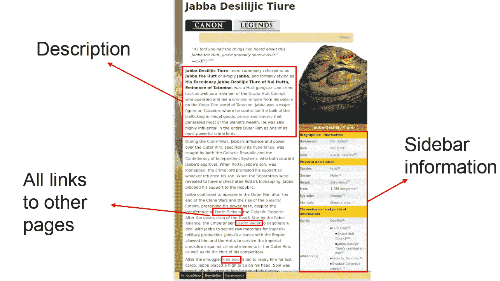

图 2:从每个页面中抓取描述、侧边栏信息和所有链接([页面](https://starwars.fandom.com/wiki/Jabba_Desilijic_Tiure))。

接下来，我们抓取每个页面并将分区保存到磁盘:

收集所有信息花了一个多小时，所有信息都存储在 pickle 文件中，这些文件被分割成最多 5000 页的部分。这是原始数据集，我们可以随时使用它。

接下来，我们将把原始数据分成两部分:字符和原始文本句子。这些角色由边栏中的一个名为“物种”的属性来标识。我们将在一个强结构的熊猫数据框架中收集所有的角色，这意味着我们需要事先选择属性。我们总共有 5334 个字符被标记为佳能。关于所选属性的更多细节可以在 [Github](https://github.com/dennisbakhuis/wookieepediascience) 库的 scrape 笔记本中找到。

原始文本句子是从描述中提取的。每个描述都被拆分成句子，并收集在一个列表中。这种分裂的细节也可以在 [Github](https://github.com/dennisbakhuis/wookieepediascience) 上的 scrape notebook 中找到。

# 2.伍基人媒体数据探索

使用新数据集的第一步总是数据探索。这是熟悉数据集的一种方式，也是了解其中包含哪些信息的第一步。分析的细节可以在 [Github](https://github.com/dennisbakhuis/wookieepediascience) 上的数据探索笔记本中找到。

## 种类

如果你问一个不喜欢《星球大战》的人，你经常会听到的回答是，这部电影充满了怪异的生物。尤其是著名的“T2”酒吧场景，充满了银河系中存在的不同物种。因此，先看看物种的数量以及它们在佳能数据集中出现的频率是很有趣的。

总共有 530 个物种被提及，太多了以至于不能很好的可视化，因此，我们只选择在数据集中至少有 40 个被提及的物种。所有其他被归类为其他。

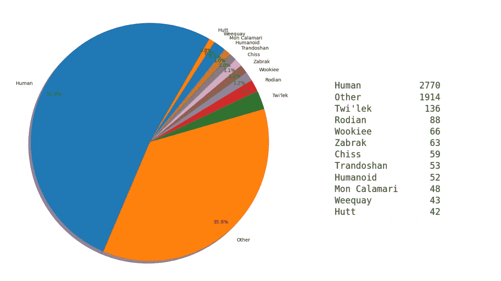

图 3:人类是目前占优势的物种。

到目前为止，人类是占主导地位的物种，拥有超过一半的字符或 2770 次提及。下一个物种是提列克人，只占数据集的 2.5%。其他字符只有十分之几，因为数量正在迅速下降。我们将 519 个其他物种归为“其他”类，每个物种的平均特征不到 4 个。如果我们随机遇到一个星球大战人物，他/她有 50%的几率是人类。如果它不是人类，它可能是许多不同物种中的一个。

## 家园世界

由于物种非常多样，看看每个角色的家园也可能会很有趣。查看唯一计数，数据集中提到了 463 个世界。同样，由于高度的多样性，我们将这些限制在至少 8 个必须提到地球是家园的宪章中。

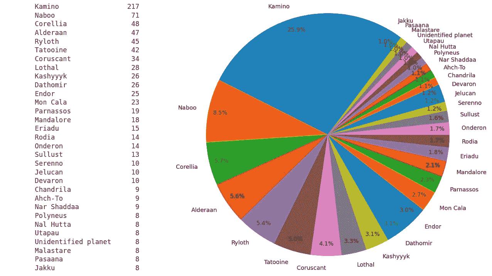

图 4:卡米诺是被提及最多的 planed。

有趣的是，卡米诺是被提及最多的以克隆技术闻名的世界。它在第二集《克隆人的进攻》中首次被提及，主角们在那里发现了一支隐藏的克隆人军队。但这个星球如此突出的主要原因是因为名为《克隆人战争》的星球大战动画系列。它有七季，总共 133 集，以卡米诺星球上创造的许多角色为中心。第二颗行星是纳布，由阿米达拉女王统治，在整个系列中非常有名。也许令人惊讶的是曼达洛的高提及率，但这可能是因为曼达洛，这是流媒体服务迪士尼+上的一个伟大的衍生系列。

## 性别

虽然有许多物种，但它们中的大多数似乎都被划分为我们在地球上所知道的相同性别。让我们快速浏览一下分布情况:

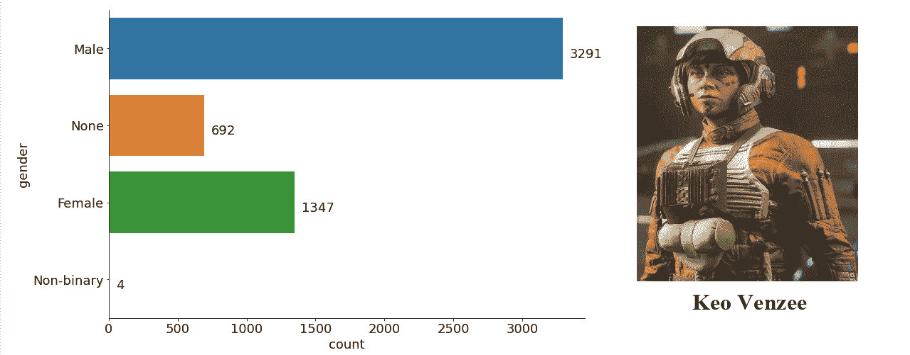

图 5:自 2016 年以来,《星球大战》有了非二进制或性别酷儿角色(插图:[wookiepedia](https://starwars.fandom.com/wiki/Keo_Venzee))。

因为《星球大战》开始于 70 年代末，我预计会有很多男性角色。事实上，三分之二的角色是男性，但不知何故我期望更多。也许迪斯尼开始增加女性的数量来最终平衡原力。

另一件很酷的事情是，在官方的星球大战传说中有一些非二进制字符。作者查克·温迪格证实，他书中的一个名为 Eleodie Maracavanya 的人形角色确实不是二进制的，因此是第一个正式的非二进制佳能角色。现在一共四个，包括 Keo Venzee。

对于一些物种来说，不太清楚它们是雄性还是雌性，大约 8%的角色没有性别。

## 最高最小的一束

正如魁刚·金曾经评论的那样:“总有更大的鱼”，因此，观察数据集中记录的鱼的大小是很有趣的。不幸的是，只有大约 12%的人物知道身高。让我们看看分布情况:

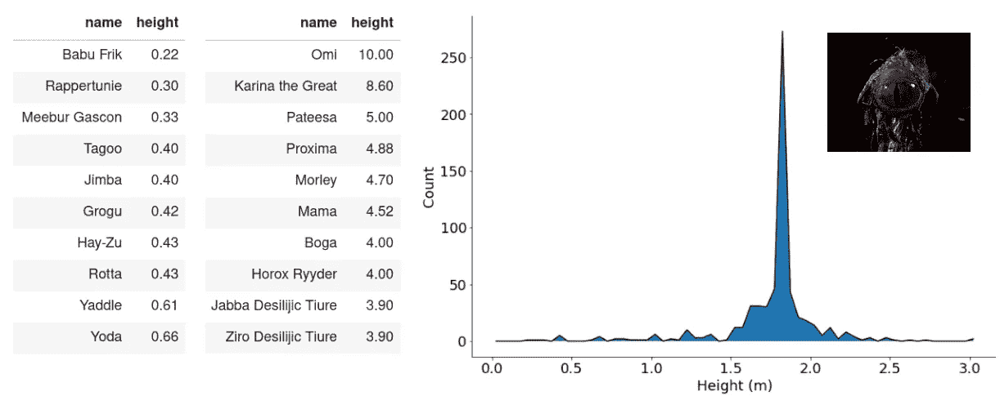

图 6:《星球大战》中的人物身高达到 1.83 米，接近荷兰的平均水平。(插图:[伍基人百科](https://starwars.fandom.com/wiki/Omi))

大多数角色的身高都是人形种族的典型身高，有一个 1.83 米的大高峰，大约是荷兰男性的平均身高。看看这两个极端，我们发现巴布·弗里克(出现在第九集)是迄今为止最小的智慧生物，只有 22 厘米。同样令人高兴的是，格罗古还得再长 20 厘米才能和尤达一样大。

最大的生物是 Omi，一只生活在死星垃圾压缩机里的独眼野兽，显然有 10 米高。赫特人贾巴也很大，有 3.90 米，但我猜他们是从鼻子到尾巴的末端测量他的。

## 眼睛颜色

我们还记录了他们眼睛的颜色，数据集中有 97 种颜色。我猜有一些错别字，也有一些描述性的颜色，如“蓝绿色”。仍然有将近一半的眼睛颜色被记录。

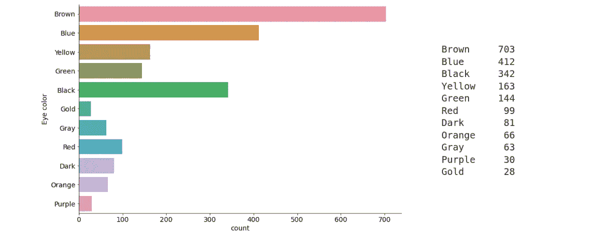

图 7:第三种最常见的眼睛颜色是黑色。

棕色眼睛在《星球大战》宇宙中是最常见的，这与现实世界中世界上绝大多数人也有棕色眼睛非常相似。更令人不安的是，黑色显然是第三种最常见的眼睛颜色。

肤色、发色等其他属性也有。请随意在笔记本上查看它们。

# 3.我们需要一个词云！

在对一个 fandom 话题做数据分析的时候，我们要做一个 wordcloud。为此，我们将使用来自 Andreas Mueller 的描述数据集和 [Wordcloud Python 包](https://github.com/amueller/word_cloud)。更酷的是，文档中甚至有一个[使用冲锋队](https://amueller.github.io/word_cloud/)的例子！

Wordcloud 包让它变得再简单不过了。所有的频率计算都是在引擎盖下完成的，并且生成了一幅美丽的图像:

图 8:佳能文章所有描述的文字云(使用所有数据)。

单词云是使用所有佳能文章的文本生成的，所以不仅仅是字符。与所有的词云一样，首先所有的停用词都被移除，经过频率分析后，我们看到最常见的词在《星球大战》中肯定有意义。

# 4.主题建模

到目前为止，我们已经介绍了一些数据探索的基础知识，并且创建了强制性的 wordcloud。因此，我们现在准备进入更高级的分析，这也是我想尝试的第一个主题建模。这里描述的方法是基于 [BerTopic](https://pypi.org/project/bertopic/) 的创作者马尔滕·格罗滕赫斯特的[作品。](/topic-modeling-with-bert-779f7db187e6)

主题建模是一种无监督的学习技术，可以回答以下问题:我有一堆文本，这些文本谈论的最常见的主题是什么。

对于主题建模，我们将使用一个名为 Sentence-Transformers 的 Python 包，顾名思义，它基于 Transformers 架构，能够将完整的句子转换为向量。为了找到相似的主题，我们需要找到分组在一起的向量。让我们首先创建句子嵌入:

句子向量的长度为 768，这对于聚类分析来说是非常大的，因此，我们将应用降维。有许多选择，如 LDA 或 NMF，但这里我们将使用一种叫做 [Umap](https://pypi.org/project/umap-learn/) 的方法，它的好处是保持局部结构完整。

降维后，我们可以尝试使用 [Hdbscan](https://pypi.org/project/hdbscan/) 来识别集群。这将找到在缩减的参数空间中被分组在一起的聚类。

我们已经将 768 个特征减少到只有 6 个特征，但是如果我们想将它绘制到屏幕上，这种减少是不够的。为此，我们需要将它减少到至少 3 维，为了更好的可视性，我们甚至会减少到 2 维。为此，我们再次使用 Umap，将原始数据集从 768 一直减少到 2，并将之前定义的标签与坐标相结合。

现在我们可以画出结果:

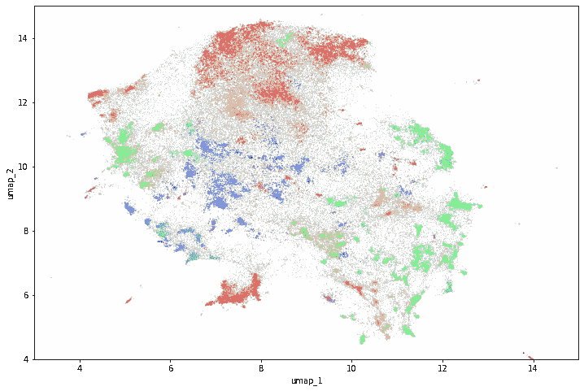

图 9:所有主题的彩色概览。

结果是非常漂亮的，但如果这些集群有任何意义，我们需要将集群与它们的原始句子结合起来。此外，我们希望找到每个聚类最常见的关键字，因此，我们需要分别分析每个聚类。为了解决这个问题，Maarten Grootendorst 想出了一个基于[类的 TF_IDF](/topic-modeling-with-bert-779f7db187e6) ，它工作起来非常简洁！

我们需要为每个集群应用 c_tf_idf，并将文档集合视为单个文档。结果是最常见术语的列表，希望它们在我们的 Wookieepedia 数据集上有意义。

当查看结果时，实际上有一些是有意义的，但不是很酷。有一个完整的集群有许多颜色，这仍然很酷，知道它是从一个无人监管的方式获得的。然而，有几个集群确实有基于故事的主题。例如，包含帕尔帕庭皇帝的集群包含许多政治术语，如参议院、最高议长和宪法。帕拉丁也与克隆人有联系，克隆人是他创造的消灭绝地的总计划。

然而，我最喜欢的集群结合了几乎所有的明星人物以及任务和雅文战役这两个术语。当然，雅文战役是《星球大战》中最重要的事件之一，经常被提及是有道理的。尽管如此，使用主题建模发现这一点还是很棒的。

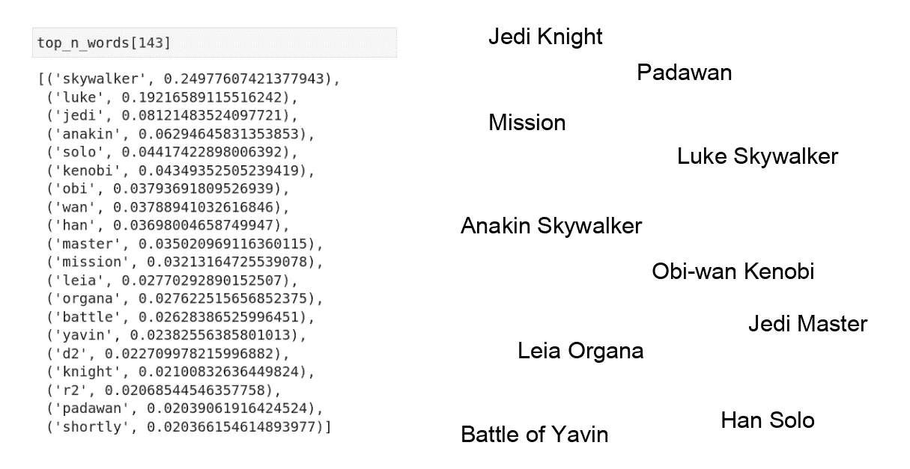

图 10:我最喜欢的集群，其中包含了在集群中出现频率最高的术语。

# 5.Wookieepedia 网络分析

我们总共收集了 5334 个角色，分析每个角色之间的关系不是很好吗？作为使用图形网络的第一次尝试，我想将角色周围的网络可视化。为此，我们需要节点，也就是字符，以及它们之间的关系，在图中称为边。例如，阿纳金·天行者与卢克·天行者有一个“父亲”的关系。提取各种关系将意味着广泛的自然语言处理，以将语料库缩减为节点-边缘-节点的形式，这远非微不足道。

为了简单一点，我们将所有关系归结为一种我们称之为“连接到”的关系。为了找出一个角色是否与另一个角色有关联，我们将查看页面上是否有链接。我们预计在阿纳金·天行者的页面上会有一个到卢克·天行者页面的链接。所有这些链接在抓取过程中被收集成一个列表，我们称之为交叉链接。

在 [Github 库](https://github.com/dennisbakhuis/wookieepediascience)中找到完整的笔记本。让我们从准备原始数据开始:

现在我们可以建立一个图形网络，我们将使用优秀的[网络 x](https://pypi.org/project/networkx/) 包。网络是将数据组织成节点和边的几何结构。在我们的例子中，节点是字符，节点之间的关系是边。通常你也给一个边赋予一个权重。这可以看做是纽带有多强，也可以看做是距离。这些权重支持多种分析方法，例如最短路径。因为我们不能给我们的关系添加一个度量(至少从这个数据中我不知道)，所有的权重将被设置为 1。

在构建网络时，我们将扫描每个字符的交联。这些可以指向其他字符，也可以指向任何其他页面。因此，我们需要检查交叉链接是否是字符，并忽略非字符:

创建完成后，我们得到了 4794 个节点。显然，大约 500 个角色与另一个角色没有任何关系。从有关系(边)的字符来看，平均总共有将近 20k 或 4 个关系。

让我们首先看一下度分布，它显示了到其他节点的连接数量。度为 1 的节点只有一个连接，而度为 10 的节点与其他节点有 10 个连接。代码在笔记本里。

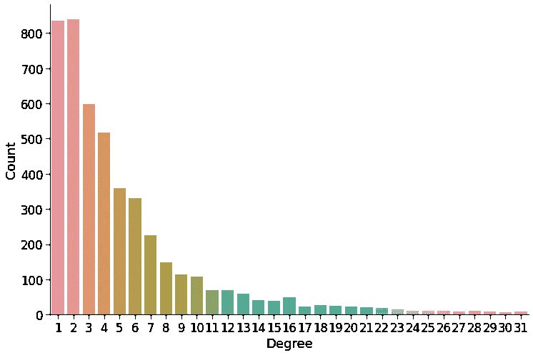

图 Wookieepedia 数据集的度分布。

大多数节点只有几个连接，对于包含 5334 个字符的数据集来说，这也不足为奇。很多角色只有单一的外貌。像阿纳金·天行者这样的角色与 100 多个其他角色有联系，这可能也是《星球大战》中其他明星的情况。

为了缩小网络的规模并删除不太重要的字符，我们将过滤掉所有度为 2 或更小的节点。我们必须迭代地这样做，因为当我们删除节点时，也会删除边，这可能会将节点设置为较低的程度。

这使得字符数下降到略低于 3000。边的数量几乎没有减少，我们仍然有 17k。这当然是有意义的，因为我们只移除了低度节点。

图表的强大之处在于，您可以使用一套工具来调查节点的重要性。其中一个工具叫做[中间中心性](https://en.wikipedia.org/wiki/Betweenness_centrality)。它是一种寻找充当其他节点之间的桥梁的节点的方法，即作为一种信息中继站。在我们的例子中，我们使用介数中心性来找到哪些节点是与各种其他人的链接，并有希望找到一些关键人物。结果如图 12 所示。

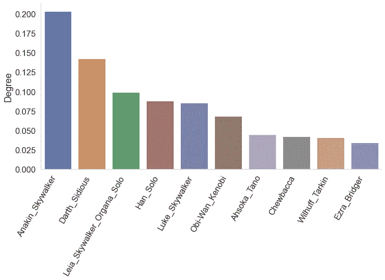

图 12:根据中间中心性，图中最重要的节点。

这里没有惊喜。我不得不寻找埃兹拉·布里杰，但他在《克隆人战争》系列中非常突出。还有许多其他算法，如接近中心或网页排名，但这些导致了类似的结果。

为了更好地玩图形网络，我们将使用 [PyVis](https://pypi.org/project/pyvis/) 来可视化它。PyVis 是围绕 VisJS 构建的，它使得绘制这些图形和处理结果变得非常容易。然而，有一件事我们需要注意:我们有太多的节点和边。虽然 PyVis 似乎对大数量没有问题，但由于所有边缘的重叠，它并不那么有趣。因此，我们需要制定一个算法，从我们的网络中选择一个子群。

下一段代码需要三个参数:起始节点、最大水平渗透和最大交叉链接。顾名思义，该算法将从起始节点开始，选择最大数量的相邻节点。如果有比最大集合交叉链接更多的可用节点，它将选择具有最大度的节点。接下来，算法将跳转到选定的节点(这是一个级别增加)，并重复该过程，直到达到最大渗透率。所选节点的数量将随着最大渗透率的增加而呈指数级增加，所以要小心这个参数。

结果是一个交互式网站，直接显示在 Jupyter 笔记本或任何其他网络浏览器中。

> 👉[阿纳金·天行者的互动网络图！](https://dennisbakhuis.github.io/wookieepediascience/)

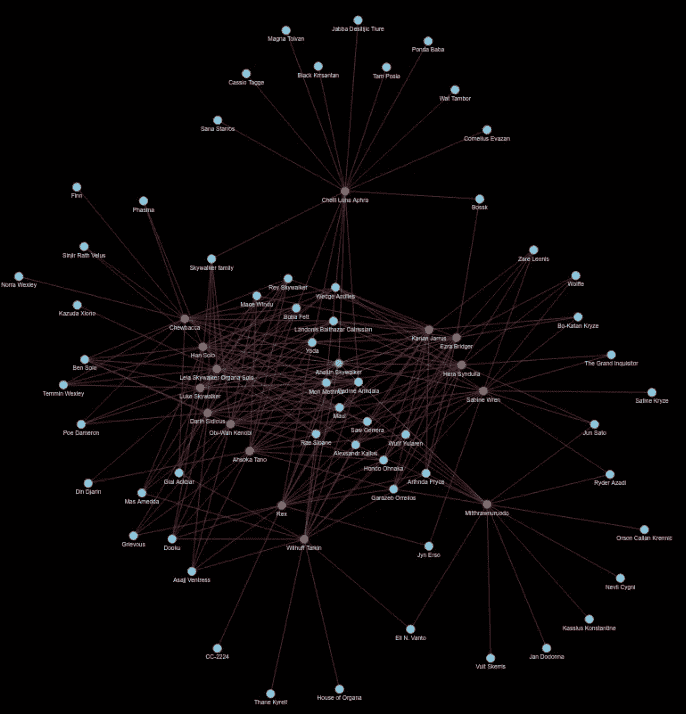

图 13:交互图网络截图。

可以用鼠标拖动每个节点，并随之拖动其连接。当鼠标悬停在一个节点上时，Wookieepedia 页面的第一段就会显示出来，这样就很容易看出这个角色是谁。节点的颜色表示级别。边缘的颜色是其来源的颜色。也可以随意调查其他角色！

# 围捕

我在这个数据集上玩得很开心。仍然有很多可能性，因为我几乎没有触及表面。但是即使用一些简单的方法，我们还是发现了一些很酷的东西。

> *‘就是这条路’*—丁·贾林

如果您有任何意见，请告诉我！在 [LinkedIn](https://linkedin.com/in/dennisbakhuis) 上随意联系。