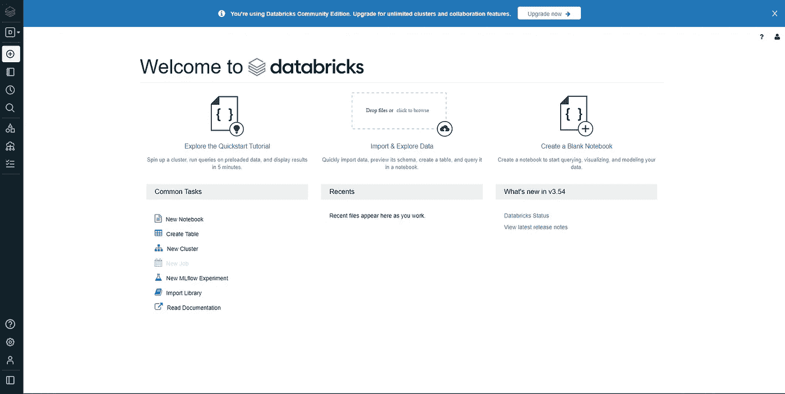
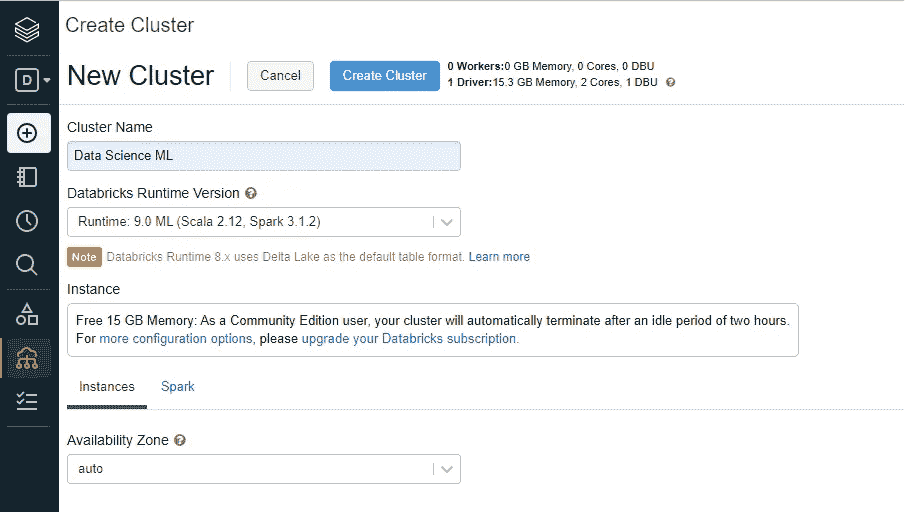
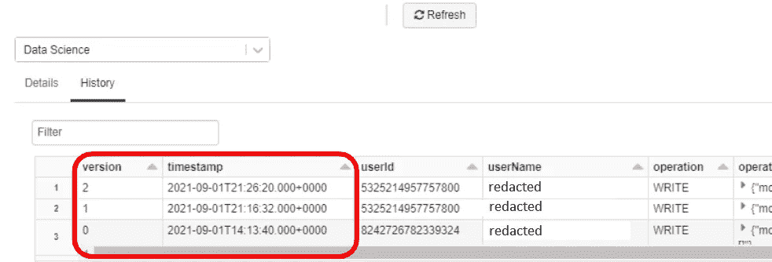
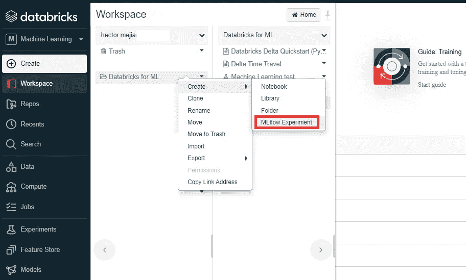
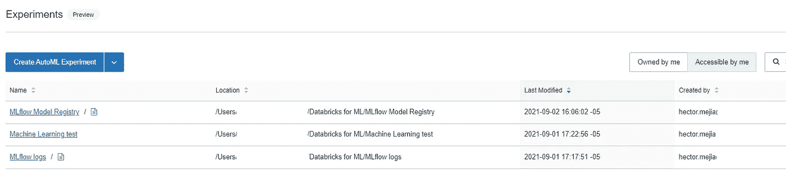
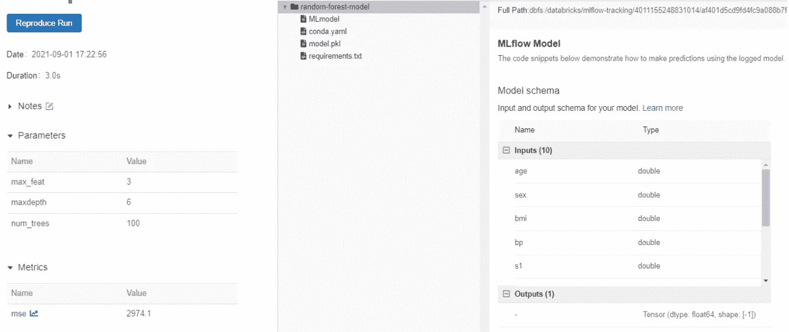
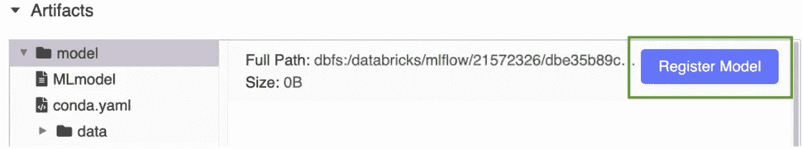
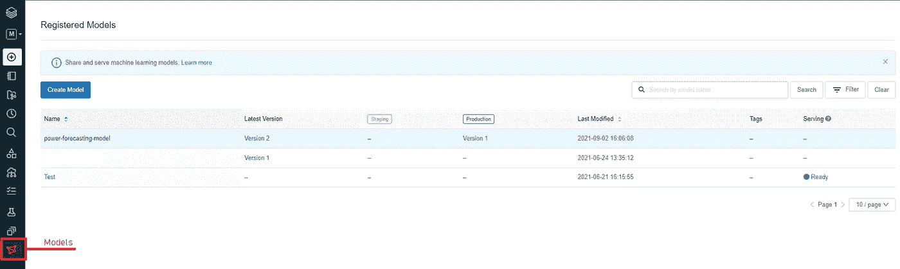
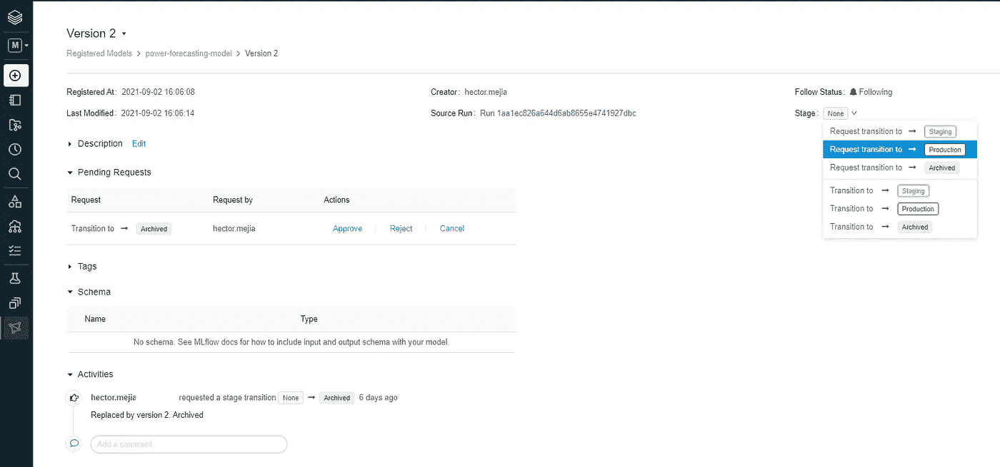
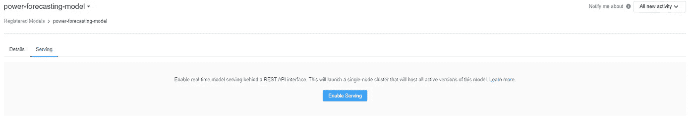

# 开始更好地管理模型的生命周期

> 原文：<https://towardsdatascience.com/start-managing-your-models-lifecycles-better-307729fe6fe5?source=collection_archive---------14----------------------->

## 与 MLflow 和 Delta Lake 一起对 Databricks 进行的 MLOps 审查

美丽的人们，你们好！在过去的几个月里，我和我的同事一起为一个出版物进行数据科学项目，在这个项目中，我们必须不断更新我们的训练数据集、功能和机器学习模型。但是，在写这篇文章的时候，没有关于模型生命周期的内部政策，这导致了我们的集体失败。不，我太激动了，但是时间和任务管理得不够理想，这自然让我感到有点沮丧。

这个行业的一大优点是总有一些工具可以帮助我们。所以我不得不介入，希望为未来的项目解决这些问题。今天，我向大家介绍我使用 MLflow 和 Delta lake 处理 MLOps 的经验。为什么是这些框架？这是因为它们是我日常使用的数据块的一部分。

我们走吧！

穆罕默德·阿里扎德在 [Unsplash](https://unsplash.com?utm_source=medium&utm_medium=referral) 上的照片

# 本次审查概述

我没有计划它，它只是押韵。在本条目中，我们将了解:

1.  数据存储和版本控制用 [**增量表**](https://docs.databricks.com/delta/index.html) 。
2.  使用 [**MLflow Tracker**](https://docs.databricks.com/applications/mlflow/tracking.html) 在每次训练迭代后执行和注册实验并保存模型的结构化标准方式。
3.  使用 [**MLflow 模型注册中心**](https://docs.databricks.com/applications/mlflow/model-registry.html) 注册模型并管理生命周期阶段。
4.  使用 [**MLflow 模型服务**](https://docs.databricks.com/applications/mlflow/model-serving.html) **将模型部署到生产中。**

请记住，本文不会涵盖这些工具必须提供的所有特性。我只是给出一个介绍，这样你可以在这里涉及的每个工具的文档中探索更多。我会在每个部分的末尾和上面列表中的每个项目中留下一个链接。

# 0.设置数据块环境

这一步是可选的。我们将创建一个 Databricks community edition 工作区，因为默认情况下，它包含了将要涉及的所有工具。

首先，前往这个[链接](https://databricks.com/try-databricks)。您需要填写必要的信息来创建 Databricks 帐户并使用 community edition 工作区。之后，您将登录到 Databricks，这将引导您进入以下屏幕:

数据砖之家。捕捉来自我自己的作者。

接下来，您将创建您计算实例。为此，前往左侧栏，选择*计算*T4。点击*创建集群*，然后选择规格，如下图所示。

集群规格。被我自己的作者捕获。

点击*创建集群 a* 增益，并等待集群启动。就这样，我们都为有趣的部分做好了准备。

顺便提一下，您也可以在自己的环境中安装它们，但是需要更多的工作。阅读关于安装的信息

*   [MLflow](https://github.com/mlflow/mlflow/tree/v1.20.2)
*   [三角洲湖泊](https://docs.delta.io/latest/quick-start.html)

# 1.使用**增量表**进行数据存储和版本控制。停止使用 CSV 文件。

我不能笼统地说，因为我还是一名大三学生，但据我所见，人们对使用 CSV 文件非常满意，包括我自己。它们便于携带，易于使用，并且易于创建。然而，作为在云中工作的数据科学家，由于受到空间和计算的影响，这不是您想要使用的文件格式。

由于 CSV 是面向行的，所以使用起来计算量很大，这意味着即使您不想使用所有的列，也需要加载整个文件。它们不像拼花地板那样是高度压缩的格式，因此存储起来很贵。它们很容易被腐蚀，还有许多其他原因。

也就是说，最好实现一个数据湖，在我们的例子中是 Delta。增量表建立在拼花文件格式之上。它们经过全面指定、高度压缩，并针对大量数据进行了优化。此外，我们有现成的表版本控制、事务日志和时间旅行，从而使工作空间更有条理。

增量表历史。被我自己的作者捕获

你可以在下面的[文档](https://docs.databricks.com/delta/index.html)中了解更多关于三角洲湖的信息。

# 2.使用 **MLFlow Tracker** 执行并记录实验。

MLFlow 是 ML 实验的一个很好的工具。它允许我们注册超参数、性能度量、特定 ML 模型的输入模式，以及 ROC 曲线等工件，只需最少的代码更改。这为我们设计和实现自己的 ML 实验日志策略节省了大量时间和精力。此外，模型被保存为 pickle 文件并可用于加载。

首先你要去侧边栏，选择 W *工作空间*，右击，选择 C *创建，*，然后选择 *MLflow 实验*。

实验创作。被我自己的作者捕获。

每个实验都将有一个 id，您可以在执行培训和测试之前将它传递给笔记本中的 MLflow 上下文。如果您使用的是 scikit-learn 模型，代码将与此非常相似:

您创建的所有实验都显示在以下界面中:

ML 实验。再次被我的作者捕获。

在每个实验中，你会发现所有被执行的运行，并且每个运行会显示所有注册的度量、参数、工件和模型。如果您访问某个跑步记录，它会显示如下内容:

实验中的一次特殊运行。我做的捕捉。

嗯，不完全是这样，参数会显示在工件上方，但捕获不适合我的屏幕。

此外，MLflow tracker 还有许多其他好处，不仅仅是记录信息，您可以比较实验的多次运行，在相同条件下重现特定的运行，等等。阅读[这篇](https://docs.databricks.com/applications/mlflow/tracking.html)文章了解更多信息。

# 3.使用 **MLflow 模型注册表**注册模型和管理阶段。

现在我们可以更好地管理我们的数据和实验，但是我们的模型的各个开发阶段呢？MLflow 模型注册是一个很好的工具。根据[文档](https://docs.databricks.com/applications/mlflow/model-registry.html)，它是一个集中式的模型存储库、一个 UI 和一组 API，使您能够管理 MLflow 模型的整个生命周期。它提供了按时间顺序排列的沿袭、版本控制和阶段转换:无、转移、生产或存档。

注册模型有两个选项。首先是使用用户界面。选择一个实验。然后，在所需的运行下，在工件部分，点击按钮*注册模型。*

注册模型。被我自己的作者捕获。

第二种选择是使用 API。首先，您需要声明运行 id 和保存模型的路径。然后，您键入以下内容:

在您注册您的模型后，它们将出现在 UI 中，在左侧边栏的*模型*部分。

模型阶段。我做的捕捉。

正如我前面所说的，您还可以从 UI 转换您的模型阶段:

模型细节和阶段转换。被我的作者捕获。

和 API:

使用 API 应该允许您自动执行更复杂的验证，比如确保您的模型在测试集上满足特定的性能标准。你可以用 model registry 做更多的事情，查看[文档](https://docs.databricks.com/applications/machine-learning/manage-model-lifecycle/index.html)。

# 4.使用 **MLflow 模型服务将模型部署到生产中。**

因此，有了模型注册，我们现在确切地知道我们的模型处于什么阶段，它们何时被训练，何时使用超参数，何时报告指标，而不仅仅是在一个目录中有一堆 pickle 文件。这太棒了！但是，当一个模型最终到达生产阶段时，我们希望有一个工具来进行推理服务。然后再次，MLflow 来救援。我们可以基于特定模型的版本和阶段，使用 MLflow 模型作为 REST APIs 来托管我们注册的模型。根据[文档](https://docs.databricks.com/applications/mlflow/model-serving.html)，Databricks 自动为模型创建一个唯一的集群，并在该集群上部署模型的所有非归档版本。

现在，要准备我们的模型进行服务，我们只需在 UI 上的 model registry 中，单击所需的模型，然后选择 *Serving* 选项卡，最后单击 *Enable Serving。*

模特服务。我做的捕捉。

现在我们可以使用 python 发出请求，进行推理:

您可以在[文档](https://docs.databricks.com/applications/mlflow/model-serving.html)中了解更多关于此功能的信息。

这就是本文的全部内容。回顾所有这些便利的特性对我来说非常有用，我希望对你也是如此。注意这只是一个介绍。要掌握所有这些工具，您需要查看本文每一节末尾提供的文档。感谢您的阅读，感谢您的关注和支持。

再见！

 [## 赫克托安德烈斯梅希亚的

### 数据科学家@ Nodel。

hihello.me](https://hihello.me/p/951c78ee-719f-4c8b-98b5-d47af565d6b0)