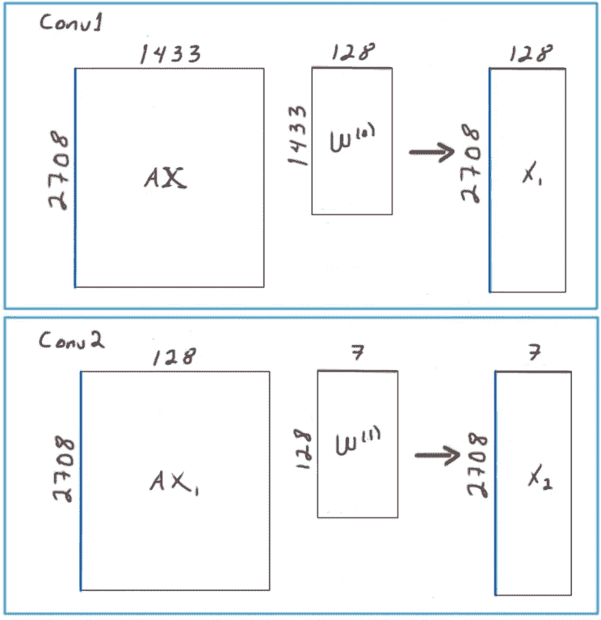

# 从使用 DGL 的图形卷积神经网络开始

> 原文：<https://towardsdatascience.com/start-with-graph-convolutional-neural-networks-using-dgl-cf9becc570e1?source=collection_archive---------15----------------------->

## 轻松的介绍

我查阅了一些现有的库来做图卷积神经网络(GCNN 的),虽然总的来说它们很好，但我总是回到 DGL，因为它有很好的文档和许多例子，以及其他东西[1]。在这里，我想分享我对 GCNN 氏症研究中一个经典例子的回顾，当然是使用 DGL 的 CORA 数据集。CORA 数据集是一个引用网络，其中节点是文章，边是它们之间的引用。下面的 gif 有助于直观地了解这些联系。

用 Pyvis 可视化 CORA 图。作者 GIF。

有 7 类 2708 个节点，每个节点与 1433 个特征相关联[2]。在这里，我们将使用该数据集来执行半监督分类任务，以预测已知少量节点的节点类(七个之一)。在这种情况下，已知的节点的数量是 140，如在 DGL 实现的那样，但是当全部信息可用时，可以使用不同的数量。在开始之前，我们必须安装 DGL 库，目前是 V0.7。然后我们继续以通常的方式导入一些模块，

接下来，我们必须以下面的形式加载 CORA 数据集，

在第 4 行中，我们将 *g* 设置为图形对象，然后我们检索一些张量。*特征*张量具有 2708 个节点的 1433 个特征，*标签*张量具有为每个节点分配从 0 到 6 的数字作为标签的条目。另外两个张量， *train_mask* 和 *test_mask* 只是得到*真*或*假*如果节点分别为训练或测试。在下表中，我们可以看到该图在 DGL 的值:

现在我们必须定义图的卷积，但在此之前，简单回顾一下公式是很重要的。我们回想一下，原则上需要图的邻接矩阵 ***A*** ，但它是根据这些方程进行变换的，其中 ***I*** 是单位矩阵[3]:

我们将根据以下等式在 python 类中定义图形卷积:

这里 *x1* 和 *x2* 分别是第一和第二卷积。在 DGL，这可以通过调用 *GraphConv* 模块来轻松完成，在这种情况下，该模块执行 parentesis ( *AXW +b* )之间的操作，因为默认激活函数被设置为 *None:*

注意，在正向方法中，我们按照上面的等式定义了 *x1* 和 *x2* 。下图显示了矩阵的大小是如何影响的。首先，在 Conv1 中， *AX* 是邻接矩阵( *A* )与特征矩阵( *X* )的矩阵乘法，给出 2708x1433 的矩阵。权重矩阵 *W* 因此具有 1433 行和 8*16=128 列(这个数字是任意的，但是工作良好)。我们以 2708x128 的矩阵 *x1* 结束。其次，我们按照相同的过程对 x1 进行第二次卷积，但这一次我们只以 7 个特征(与总类别数相同)结束，从而得到 2708x7 的矩阵 *x2* :

两个回旋的示意图。图片作者。

最后，我们必须使火车的一部分。在这里，我们使用 Adam optimizer 和 log_softmax 进行了多达 200 个历元，这对于分类任务来说是很好的。为了检索损失、准确性和特征预测的值，我们在第 4 到第 6 行中引入了*损失列表*、 *acc 列表*和*所有日志*。

运行这段代码，经过 200 个周期后，我们得到大约 0.78 的精度，如下图所示:

200 个历元后的精确度。图片作者。

最后，如果希望查看预测的要素和标注，我们可以执行以下代码，其中最后一个时期(此处为 199)的结果存储在数据帧中，并对要素应用 *argmax* 运算，我们获得给出类的较高值的索引(0 到 6 之间的数字):

下面是数据帧前 5 行的输出，其中 7 列是学习的特征值，最后一列是该类的结果:

仅此而已。现在你可以尝试一些其他的例子或者其他的 GCN 变体，比如 SAGEConv，门控图卷积层或者图注意力层，这些都包含在大 DGL 库中。

试试这个 COLAB 笔记本中的代码:

 [## 位于主那不勒斯的 medium post/corad GL . ipynb-uach/medium post

### 中型笔记本。在 GitHub 上创建一个帐户，为 napoles-uach/MediumPost 开发做出贡献。

github.com](https://github.com/napoles-uach/MediumPost/blob/main/CoraDGL.ipynb) 

我希望你喜欢这个讲座，如果是的话，请鼓掌 50 次！！

在推特上关注我→ [@napoles3d](https://twitter.com/napoles3D)

参考资料:

[1][https://www.dgl.ai/](https://www.dgl.ai/)

[2][https://ojs . aaai . org//index . PHP/aimagazine/article/view/2157](https://ojs.aaai.org//index.php/aimagazine/article/view/2157)

[https://arxiv.org/abs/1609.02907](https://arxiv.org/abs/1609.02907)