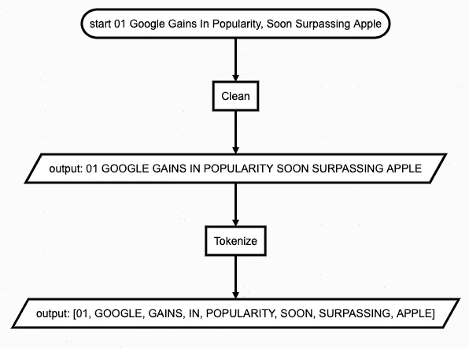

# 开始自然语言处理

> 原文：<https://towardsdatascience.com/starting-natural-language-processing-8b37d189b406?source=collection_archive---------51----------------------->

## 探索自然语言处理的基础:清洗，NER，词性，模糊字符串匹配



由作者使用流程图([http://flowchart.js.org/](http://flowchart.js.org/))拍摄

每当人们谈论自然语言处理(NLP)时，花哨的机器学习模型和强大人工智能的前景的图像就会弹出。但是没有什么是从无到有的，在最基本的层面上，NLP 只是一个处理文本数据的工具的集合，以使它们更加干净和统一。我们开始吧！

## 文本清理

> 清理句子

首先，让我们从 a 句开始:

```
test001 = "01 Google Gains In Popularity, Soon Surpassing Apple"
```

这是一个标题行，所以所有的单词都是大写的，并且有标点符号，我们需要清理它们:

```
# remove punctuations
import string
translator = str.maketrans('', '', string.punctuation)
test002 = test001.translate(translator)
# Output:
# 01 Google Gains In Popularity Soon Surpassing Apple
```

我们可以将它们转换为全部大写或全部小写，让我们使用大写:

```
# convert to upper case
test003 = test002.upper()
# Output:
# 01 GOOGLE GAINS IN POPULARITY SOON SURPASSING APPLE
```

看起来不错！现在我们可以把它们分解成单独的单词:

```
# convert to list of words
from nltk.tokenize import word_tokenize
test004 = word_tokenize(test003)
# Output:
# ['01', 'GOOGLE', 'GAINS', 'IN', 'POPULARITY',
   'SOON', 'SURPASSING', 'APPLE']
```

## 令牌清理

> 清理单词

有了单词列表，我们可以用它们做很多事情，首先，让我们去掉数字:

```
def clean_digits(words):
    return [w for w in words if not w.isdigit()]
test005 = clean_digits(test004)
# Output:
# ['GOOGLE', 'GAINS', 'IN', 'POPULARITY',
   'SOON', 'SURPASSING', 'APPLE']
```

然后，我们可以对单词进行词干处理或将其词条化:

```
# stem words
from nltk.stem import PorterStemmer
PorterStemmer()
def stem(words):
    stemmer = PorterStemmer()
    res = []
    for w in words:
        rw = stemmer.stem(w)
        res.append(rw)
    return res
test006 = stem(test005)
# Output:
# ['googl', 'gain', 'IN', 'popular',
   'soon', 'surpass', 'appl']
```

词干化将单词简化为它们的根，所以“GAINS”变成了“gain”，但是正如你所看到的，它非常粗糙，“GOOGLE”，实际上是一个名字，变成了“googl”…然而，词干化非常快，所以如果你有太多的数据要处理，并且准确性不是太大的问题，就继续使用词干化。

查找词根的另一种选择是 lemmatize:

```
# lemmatize words
from nltk.stem import WordNetLemmatizer
def lemmatize(words):
    lemmatizer = WordNetLemmatizer()

    res = []
    for w in words:
        word = lemmatizer.lemmatize(w)
        res.append(word)

    return res
test006 = lemmatize(test005)# Output:
# ['GOOGLE', 'GAINS', 'IN', 'POPULARITY',
   'SOON', 'SURPASSING', 'APPLE']
```

等等，发生什么事了？似乎什么都没有改变。

这是因为 lemmatizer 搜索语料库(用于训练 lemmatizer 的文本正文)来确定词根，所以大小写很重要:

```
# lemmatize words, version 2
from nltk.stem import WordNetLemmatizer
def lemmatize(words):
    lemmatizer = WordNetLemmatizer()

    res = []
    for w in words:
        word = lemmatizer.lemmatize(w.lower())
        res.append(word)

    return res
test006 = lemmatize(test005)
# Output:
# ['google', 'gain', 'in', 'popularity',
   'soon', 'surpassing', 'apple']
```

看起来不错！但是我们必须重新大写一遍:

```
# convert words to upper case
test007 = [w.upper() for w in test006]
# Output:
# ['GOOGLE', 'GAIN', 'IN', 'POPULARITY',
   'SOON', 'SURPASSING', 'APPLE']
```

## 命名实体识别

> NER:找出每个单词的意思

随着文本的清理，我们可以开始分析这句话的实际意思，即什么是“谷歌”，什么是“苹果”。

在此之前，我们或许可以去掉像“IN”这样的词，因为它们不会给句子增加太多意义(反正对机器来说不会)，所以让我们去掉**停用词**:

```
# remove stop words
from nltk.corpus import stopwords
def clean_stop_words(words):
    stop_words = set(stopwords.words('english'))

    res = []
    for w in words:
        w_test = w[0] if isinstance(w, tuple) else w
        if w_test.lower() not in stop_words:
            res.append(w)

    return res
test008 = clean_stop_words(test007)
# Output:
# ['GOOGLE', 'GAIN', 'POPULARITY',
   'SOON', 'SURPASSING', 'APPLE']
```

现在我们准备给这些词贴上标签:

```
# NER tagging
from nltk.tag.stanford import StanfordNERTagger
jar = 'stanford-ner.jar'
model = 'english.all.3class.distsim.crf.ser.gz'
ner_tagger = StanfordNERTagger(model, jar, encoding='utf8')
test009 = ner_tagger.tag(test008)
# Output:
# [('GOOGLE', 'ORGANIZATION'),
#  ('GAIN', 'O'),
#  ('POPULARITY', 'O'),
#  ('SOON', 'O'),
#  ('SURPASSING', 'O'),
#  ('APPLE', 'O')]
```

让我们来看看。因此，NER 过程试图用一个类别来标记每个单词，在这种情况下，我们使用斯坦福的 3 类 NER 标记器[1]，它可以识别位置，人和组织。还有其他 NER 标记者，如 spaCy，一个标记者更适合某些项目，而另一个可能更适合其他项目。

请注意,“苹果”没有被标记为“组织”,这凸显了这种方法的一些缺陷。

## 词性标注者

> 词性标注

如果我没有提到 POS tagger，那将是我的疏忽，因为在许多应用中它是非常重要的(只是在这个故事中对我来说不是)。

POS tagger 正是你所猜测的，它根据词类标记每个单词:名词、动词、代词等:

```
# POS tagging
from nltk.tag.stanford import StanfordPOSTagger
jar = 'stanford-postagger.jar'
model = 'english-caseless-left3words-distsim.tagger'
pos_tagger = StanfordPOSTagger(model, path_to_jar=jar)
test010 = pos_tagger.tag(test008)
# Output:
# [('GOOGLE', 'NNP'),
#  ('GAIN', 'NN'),
#  ('POPULARITY', 'NN'),
#  ('SOON', 'RB'),
#  ('SURPASSING', 'VBG'),
#  ('APPLE', 'NN')]
```

在这里，我们再次使用斯坦福的 POS 标记器[2]，在这种情况下，标记器能够识别“谷歌”是一个专有名词(NNP)，而“超越”是一个动词(VBG)，但“增益”标记错误。

## 串匹配

> 将单词与单词配对

嗯，所有的文本处理和标记都很好，但是你能用它们做什么呢？

从模型训练、预测到数据分析，都有无限可能。天空是极限。

让我们把我们所做的应用到一个不起眼的例子中。

假设我想为一家公司收集新闻标题，比如说谷歌。我已经收集了我们一直在谈论的一个标题，我想要一种方法来映射这个标题到谷歌的股票。我如何开发一个自动化的过程来做这件事？

首先，我将使用我们开发的技术从标题中提取第一个组织，假设是主题:

```
# get subject organization
def first_org(words):
    for w in words:
        if w[1] == "ORGANIZATION":
            return w[0]
    return None
org = first_org(test009)
# Output:
# GOOGLE
```

一旦我们有了组织，我们将需要公司的股票代码和与之匹配的描述。为此，我从维基百科[3]中检索信息:

```
ticker = "GOOGL GOOGLE ALPHABET INC CLASS A"
```

由于股票代码描述通常与从文本中提取的公司名称不完全匹配，我们需要应用模糊匹配:

```
# try match organization
from fuzzywuzzy import fuzz
ticker = "GOOGL GOOGLE ALPHABET INC CLASS A"
fuzz.ratio(ticker, org)
# 31
fuzz.partial_ratio(ticker, org)
# 100
```

因此，这里的“ratio”返回 31%的匹配，因为它是匹配与总字数的比率:

```
l1 = len(ticker)
# 33
l2 = len(org)
# 6
res = 2*6/(l1+l2) # 6matches
# 0.31
```

而“部分比率”实际上是在较长的字符串中循环，对较短的字符串进行每个子字符串的比率匹配，并返回最高分。由于“GOOGLE”实际上是 ticker 描述的一部分，所以最高分是 100%。

## 结论

在所有的文本清理之后，我们才刚刚开始探索 NLP。有了可用的输入数据，我们可以应用单词矢量化、单词聚类和许多技术来建立复杂的预测模型。更多即将推出！

这个故事的灵感来自于:[明周](https://papers.ssrn.com/sol3/cf_dev/AbsByAuth.cfm?per_id=2669593)、[萨希尔普里](https://papers.ssrn.com/sol3/cf_dev/AbsByAuth.cfm?per_id=2592786)、[阿尔什苏德](https://papers.ssrn.com/sol3/cf_dev/AbsByAuth.cfm?per_id=2669595)和[亚当韦恩](https://papers.ssrn.com/sol3/cf_dev/AbsByAuth.cfm?per_id=2669596)【4】发表的论文

参考:

[1][https://nlp.stanford.edu/software/CRF-NER.shtml](https://nlp.stanford.edu/software/CRF-NER.shtml)

[https://nlp.stanford.edu/software/tagger.shtml](https://nlp.stanford.edu/software/tagger.shtml)

[3][https://en.wikipedia.org/wiki/List_of_S%26P_500_companies](https://en.wikipedia.org/wiki/List_of_S%26P_500_companies)

[https://papers.ssrn.com/sol3/papers.cfm?abstract_id=2940564](https://papers.ssrn.com/sol3/papers.cfm?abstract_id=2940564)