# 2021 年 5 月底语音合成的技术水平

> 原文：<https://towardsdatascience.com/state-of-the-art-of-speech-synthesis-at-the-end-of-may-2021-6ace4fd512f2?source=collection_archive---------4----------------------->

## [思想和理论](https://towardsdatascience.com/tagged/thoughts-and-theory)

## 在 2021 年 5 月底展示语音合成研究(也称为文本到语音)的最新发展水平，重点是深度学习技术。我提供了 71 个出版物的综合，并给你理解基本概念的钥匙。

[瓦伦丁·米勒](https://unsplash.com/@wackeltin_meem?utm_source=medium&utm_medium=referral)在 [Unsplash](https://unsplash.com?utm_source=medium&utm_medium=referral) 上的照片

# 介绍

声音是我们最自然的交流方式。因此，会话助手的发展自然会朝着这种通信方式发展。这些虚拟语音助手可以部署到呼叫中心，通过预先确定呼叫者的请求，考虑最简单的请求(例如预约)。对于视障者，提供屏幕上文本的描述或描述他们面前的场景。操作员可以在语音的帮助下对机器进行干预以对其进行修复，并且他可以不用手来与机器进行交互，即不必使用键盘或鼠标。几年来，GPS 导航一直通过语音为你导航。

在这篇论文中，我将讨论语音合成研究的现状。我将介绍用于从句子中自动生成信号的技术。在对该主题进行简短介绍后，我将介绍与自动合成相关的问题，然后我将介绍处理管道，我将快速解释什么是 mel-spectrogram，然后是深度生成模型、端到端系统、当今研究的参与者，我将继续讨论允许实现学习的可用数据集。我将解释质量是如何衡量的，以及哪些会议展示了这项工作。我会完成剩下的挑战。

# TL；速度三角形定位法(dead reckoning)

在语音识别和“简单”(单调)语音生成方面，对话式语音助手已经达到了与人类几乎相同的水平。语音生成是一个复杂的过程，包括从一个简单的句子中生成几千个代表声音信号的值。神经网络通过提供更好的信号质量、更容易的训练数据准备以及生成时间已经减少到能够比人快几百倍地生成句子的程度，已经取代了传统的串联生成技术。

信号的生成通常在两个主要步骤中完成:第一步生成句子的频率表示(mel 频谱图),第二步从该表示生成波形。第一步，将文本转换成字符或音素。这些被矢量化，然后编码器-解码器型架构将这些输入元素转换成压缩的潜在表示(编码器)，并通过解码器将该数据逆转换成频率表示。这一步最常用的技术是与注意机制相关的卷积网络，以改善输入和输出之间的一致性。这种对齐通常通过持续时间、电平和音调预测机制来加强。在第二阶段，由所谓的声码器处理，三维时间频率表示(时间、频率和功率)被转换成声音信号。最有效的架构是 GAN(生成对抗网络)架构，其中发生器将生成信号，该信号将被鉴别器挑战。

当这些架构由人评估时，质量水平几乎达到训练数据的质量。由于很难比输入数据做得更好，因此研究现在转向元素的贡献，通过添加韵律、节奏和个性元素，使生成的信号更接近现实，并能够更精细地参数化生成。

# 虚拟语音助手

三年前的今天(2018 年 5 月)，谷歌首席执行官桑德尔·皮帅在谷歌 I/O 的主题演讲上展示了一段虚拟助理(谷歌双工)与一家发廊的员工交谈的电话录音。这位助理负责为第三方预约。当时最例外的元素是通话近乎完美，完美的模仿了一个真实的人进行预约，并在谈话过程中加上了“嗯嗯”的声音。对话的流程是如此完美，我仍然怀疑这是不是一个骗局。这个演示预示着一场即将到来的语音人际关系自动化领域的革命。

无论是梦想还是现实，这种将餐馆或理发店的预订委托给虚拟助理的功能，3 年后，只在美国可用。这项服务在其他国家也可以使用，但只是通过自动呼叫商家进行验证来提高谷歌搜索引擎和地图时间表的可靠性。这家创新的公司在这里向我们展示了它制造工具的能力，这些工具可以以优异的质量水平陪伴人类进行某些活动。至少有足够的质量让他们决定提供这种服务。

为了实现对话式语音助手，必须有一个处理链，其中第一个组件将用户的语音转换成文本(语音到文本)。第二个组件(机器人)分析呼叫者的文本并生成响应。第三个也是最后一个组件将机器人的回答转换成语音(文本到语音)。通过扬声器或电话线向用户播放结果。

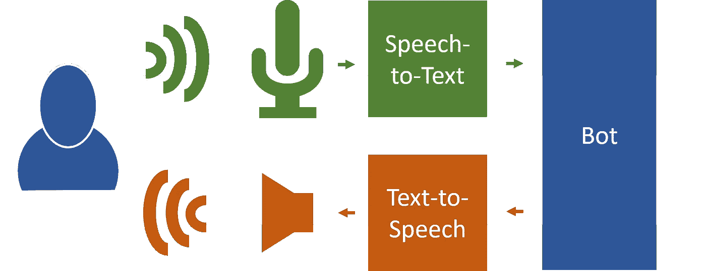

语音助手的符号表示(作者的图表)

语音合成，也称为文本到语音或 TTS，在很长一段时间内是通过组合一系列或多或少由一组编程规则规定的转换和或多或少令人满意的输出结果来实现的。近年来，深度学习的贡献使得更多自主系统的出现，这些系统现在能够生成数千种不同的声音，其质量接近人类。今天的系统已经变得如此高效，以至于他们可以从几秒钟的声音样本中克隆出一个人的声音。

# 一对多问题

为了生成音频信号，合成系统将遵循一组或多或少复杂的步骤。语音合成必须解决的一个主要问题是一对多建模问题，这包括将一条信息(要发声的句子)转换成需要几千个值的数据(波形)的能力。此外，这种信号可以有许多不同的特征:音量、特定单词的重音、发音速度、句子结尾的管理、感情的添加、音调……因此，系统架构师的问题是通过将这一代分成可以全局或单独训练的步骤来解决这种复杂的处理。

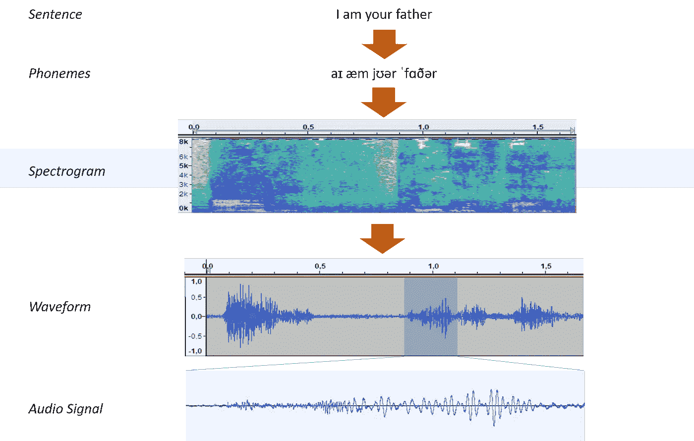

信号产生的不同阶段(作者的图表)

# 加工管道

第一个语音生成系统直接使用空气来产生声音，然后计算机科学带来了可以通过参数使用生成规则的系统，以通过从或多或少的结果声音数据库(英语中有超过 1，700 个双音素，法语中有 1，200 个双音素，可以通过说话者、句子开始/结束、韵律等复制)连接双音素来快速生成句子

传统的语音合成系统通常分为两类:拼接系统和生成参数系统。双音素的组合属于拼接语音合成的范畴。级联合成有两种不同的方案:一种是基于线性预测系数(LPC)，另一种是基于基音同步重叠相加(PSOLA)。结果通常是平的、单调的和机械的，即缺乏真正的韵律，尽管可以调整结果。对于韵律，我们指的是超音段特征，如语调、旋律、停顿、节奏、流、重音……随着基于隐马尔可夫模型(HMM)的生成声学模型的创建和上下文决策树的实现，该方法得到了改进。深度生成系统现在已经成为标准，淘汰了已经过时的旧系统。

遵循一对多原则，要构建的系统包括将文本转换成中间状态，然后将该中间状态转换成音频信号。大多数统计参数语音合成系统(SPSS)不直接生成信号，而是生成其频率表示。第二个组件称为声码器，它根据这种表示完成生成。近年来，随着卷积网络、递归网络、(2013)、注意机制(2014)、甘(2014)和其他网络的出现，生成网络的原理已经成为规范。

下图描述了用于生成语音的基于机器学习的流水线架构的不同组件。

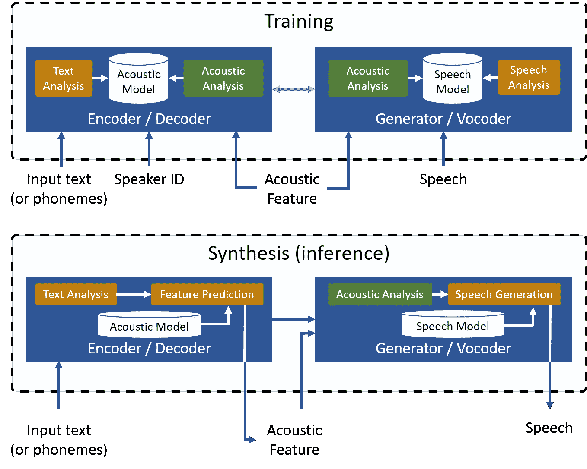

语音合成系统标准操作图(作者图)

像任何基于学习的系统一样，生成主要由两个阶段组成:学习阶段和生成阶段(或推理阶段)。有时，插入一个“中间”阶段，用其他数据对声学模型进行微调。

管线的外观因阶段而异:

*   在学习阶段，管道允许生成模型。句子是编码器/解码器的输入和与句子相关的语音文件。有时还会加上说话人的 ID。在许多系统中，产生 mel 频谱图，并且声码器将该表示转换成波形。声码器的输入是声学参数(通常是 mel 声谱图)和与参数相关的语音。从两个综合分析模块中提取的信息集被称为“语言特征”(声学特征)。
*   在生成阶段，管道负责执行推理(或合成或生成)。输入是要转换的句子，有时是说话人 ID，用于选择与生成的语音相匹配的语音特征。输出是 mel 光谱图。声码器的作用是从要产生的音频的紧凑表示中产生最终波形。

具体来说，用于学习(培训)的渠道包括:

*   一个文本分析模块，执行文本规范化操作，将数字转换为文本，将句子拆分为多个部分(词性)，将字素(书面音节)转换为音素(G2P)，添加韵律元素等。有些系统直接处理文本的字符，有些系统只使用音素。在培训和综合过程中，此模块通常“按原样”使用。
*   声学分析模块接收与文本相关联的声学特征作为输入。该模块还可以在多说话者训练期间接收说话者 ID。本模块将分析理论特征和培训阶段产生的数据之间的差异。声学特征可以使用诸如快速傅立叶变换的“经典”信号处理算法从语音样本中生成。该模块还可以生成模型来预测信号的持续时间(音素和 mel 声谱图的样本数量之间的联系)及其与文本的对齐。最新的系统倾向于改进预测网络并增加音调预测。2020 年底，斯德哥尔摩 EECS 学校的 va Szé kely 在学习阶段增加了呼吸处理，这缩短了人与机器之间的距离。
*   来自训练阶段的声学模型表示从句子嵌入向量、说话者向量和声学特征中提取的潜在状态。此外，还有对齐和其他功能的预测模型。
*   语音分析模块用于从原始语音文件(地面实况)中提取各种参数。在某些系统中，尤其是端到端系统，前面和后面的静默被去除。提取因系统而异，可以包括提取音调、能量、重音、音素持续时间、基频(第一谐波频率或 F0)等。从输入语音信号中。这些输入语音文件可以是单个或多个扬声器。在多扬声器系统的情况下，扬声器矢量被添加到输入中。

用于合成(推理)的管道包括:

*   基于文本分析模块的输出并通过声学模型，特征预测模块生成完成生成所必需的紧凑语音表示。这些输出可以是以下表示中的一个或多个:信号的梅尔频谱图(MelS)、巴克标度倒谱系数(Cep)、线性标度对数幅度频谱图(MagS)、基频(F0)、频谱包络、非周期性参数、音素的持续时间、音调高度…
*   声码器的输入可以是一个或多个上述表示。这个模块有许多版本，它倾向于作为一个独立的单元使用，以牺牲端到端系统为代价。最受欢迎的声码器有 Griffin-Lim、WORLD、WaveNet、SampleRNN、GAN-TTS、MelGAN、WaveGlow 和 HiFi-GAN，它们提供的信号接近人类的信号(参见如何测量质量)。

早期基于神经网络的架构依赖于使用传统的参数 TTS 管道，例如:DeepVoice 1 和 DeepVoice 2。DeepVoice 3、Tacotron、Tacotron 2、Char2wav 和 ParaNet 使用基于注意力的 seq2seq 架构(Vaswani 等人，2017)。基于深度神经元网络(DNNs)的语音合成系统现在优于所谓的经典语音合成系统，例如(几乎)不再在研究中看到的串联单元选择合成和 hmm。

下图显示了按年份分类的研究论文出版的不同架构。它还显示了系统使用以前系统的功能时的链接。

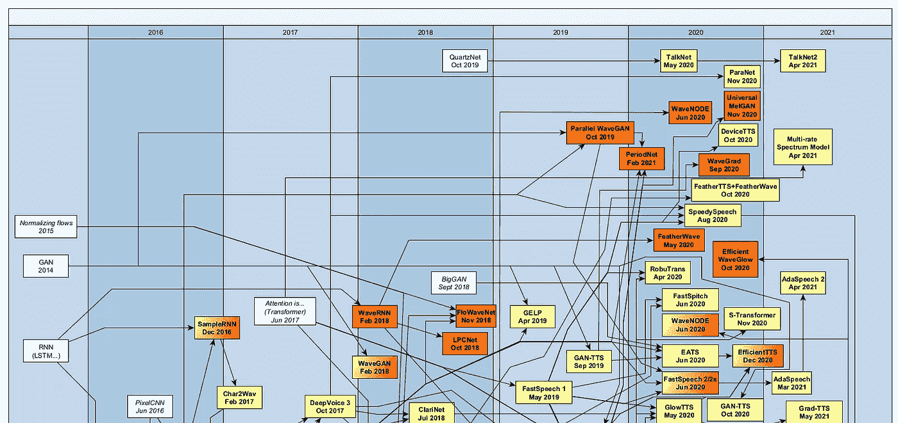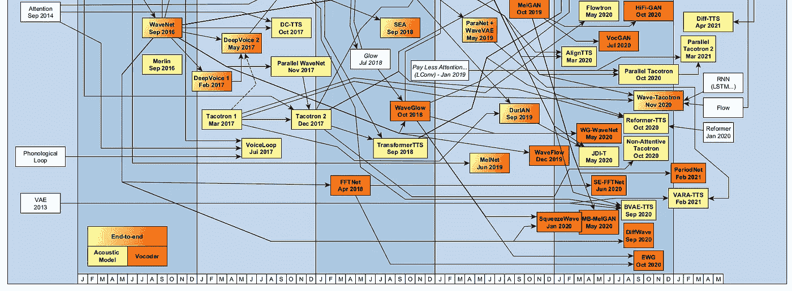

按年份和关系划分的建筑之间的不同网络和链接(作者图)

# 梅尔谱图简介

声码器的输入通常由 mel 声谱图构成，Mel 声谱图是声音信号的特定表示。这个声谱图是通过对音频信号(时间/幅度)应用若干变换来实现的。

第一种变换包括使用短期快速傅立叶变换(STFFT)提取信号的频谱。STFFT 将通过捕捉组成音频信号的不同频率以及每个频率的幅度来分解音频信号。由于信号随时间的可变性，信号被分成部分重叠的窗口段(通常在 20 毫秒和 50 毫秒之间)。

由 aqu egg——自己的作品，公共领域，[https://commons.wikimedia.org/w/index.php?curid=5544473](https://commons.wikimedia.org/w/index.php?curid=5544473)

横轴对应时标，纵轴对应频率，像素颜色对应信号功率，单位为分贝(dB)。颜色越浅，频率越强。频率标度然后被转换成对数标度。

由于人耳感知频率差异的方式是不同的，无论频率是低还是高，Stevens、Volkmann 和 Newmann 在 1937 年提出了一种称为 mel 音阶的音阶，它给出了一个音高单位，使得距离听者相同距离的音高声音相同。因此，声谱图的频率通过该标度被转换成 mel 声谱图。

# 深度生成模型

语音生成系统面临的挑战是从少量信息中，甚至从无信息中产生大量数据。一个 30 个单词的句子，以 22KHz 在 10 秒内发音，需要产生 440.000 字节(16 位)的序列，也就是说，比率为 1 比 14.666。

自动生成建模领域是一个广阔的领域，几乎有无限的用途。直接的应用多种多样，如图像生成，以及由 GPT-2 和最近的 GPT-3 普及的文本生成。在我们的情况下，我们期望他们实现声音的产生。一开始的所谓“经典”网络(CNN 代表卷积神经网络)已经被更复杂的递归网络(RNN 代表递归神经网络)所取代，因为它们引入了先前上下文的概念，这在语音连续性的上下文中是重要的。今天，这一代主要是通过深度模型架构实现的，如 DCCN(扩张因果卷积网络)、师生、VAE(变分自动编码器)和 GAN(生成对抗网络)、精确似然模型(如 PixelRNN/CNN)、图像转换器、生成流等。

最常见的架构有:

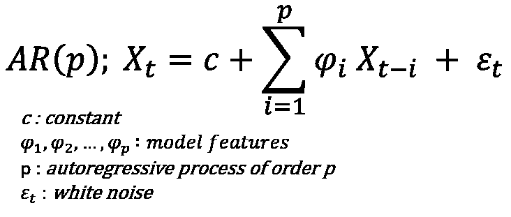

自回归方程

*   *自回归模型*是一种基于回归的时间序列模型，其中序列由其过去的值而不是其他变量来解释。在语音生成的情况下，大多数早期的基于神经网络的模型是自回归的，这意味着未来的语音样本取决于过去的样本，以便保持长期的依赖性。这些模型很容易定义和训练，但有传播和放大误差的缺点。并且生成时间与生成句子的长度成正比。首先，它们具有串行的缺点，因此无法受益于 GPU(图形处理器单元)和 TPU(张量处理单元)处理器的最新并行化能力。这使得创建需要在合理的时间内响应用户的实时系统变得困难。随着 WaveNet 和 ClariNet 的推出，非自回归系统允许在不依赖于前代产品的情况下生成语音样本，这允许仅受处理器存储器限制的强大并行化。这些系统的实现和训练更加复杂，精确度较低(内部依赖性被消除)，但可以在数毫秒内生成所有样本。

扩张因果卷积网络(DCCN)

*   由谷歌及其流行的 WaveNet 于 2016 年推出的*扩张因果卷积网络*(或 DCCN)是一种扩张因果卷积，通过跳过某个步长的输入值，将滤波器应用于大于其长度的区域。这种扩张使得网络只有几层就有非常大的感受野。随后，许多架构已经将这种模型集成到它们的生成链中。

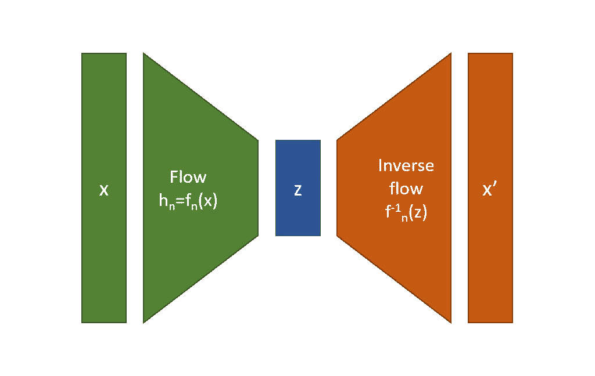

流动

*   *流程*架构由一系列可逆转换组成(Dinh 等人，2014 — Rezende 和 Mohammed，2015)。术语“流程”意味着简单的可逆转换可以相互组合，以创建更复杂的可逆转换。非线性独立分量估计(NICE)模型和实非保体积(RealNVP)模型构成了两种常见的可逆变换。2018 年，NVIDIA 通过将 Glow(用于生成流)技术集成到 WaveGlow 中来使用这项技术，以便从 mel 频谱图表示中生成语音文件。

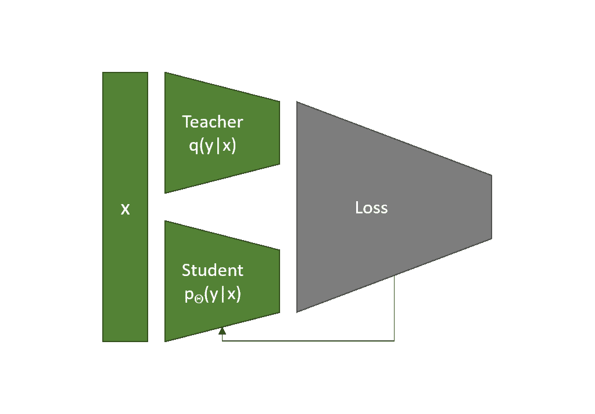

师生模式

*   *师生*模型涉及两个模型:一个预训练的自回归模型(老师)，用于指导非自回归网络(学生)学习正确的注意力对齐。教师将记录学生的并行前馈模型的输出。这种机制也被称为知识蒸馏。该学生的学习标准与反向自回归流相关，其他基于流的模型已通过 WaveGlow 引入。这些并行合成模型的主要问题是它们对可逆变换的限制，这限制了模型的容量。

可变自动编码器

*   变型自动编码器 (VAE)是自动编码器的一种改编。自动编码器由两个相互协作的神经网络组成。第一个网络负责将输入编码成连续的潜在简化表示，其可以被内插(压缩形式= z)。第二个网络负责通过减少输出损失来从编码中重建输入。为了限制过度学习的影响，学习在均值和协方差方面被正则化。在语音生成的情况下，编码器将文本转换成对应于声学特征的潜在状态，解码器将该状态转换成声音信号。编码器/解码器模型从图像生成中借鉴了很多，因为基本思想是生成图像，即频谱图。因此 PixelCNN、Glow 和 BigGAN 一直是 TTS 网络的灵感来源。

生成对抗网络

*   *生成对抗网络*(GANs-good fellow 等人)于 2014 年出现，以协助图像生成。它们是基于反对生成器和鉴别器的原理。生成器被训练成从数据生成图像，鉴别器被训练成确定所生成的图像是真的还是假的。圣地亚哥的一个团队(Donahue et al .，2018)有使用这种技术产生音频信号的想法(WaveGAN 和 SpecGAN)。许多声码器使用这种技术作为产生原理。gan 是生成语音文件的最佳单元之一。

其他系统也存在，但不太常见，如扩散概率模型，包括通过马尔可夫转移链修改信号，如添加高斯噪声，IAF…

注意机制的贡献通过消除递归的需要极大地改善了 seq2seq 网络，但是仍然很难预测输入和输出之间的正确对齐。早期的网络使用基于内容的注意机制，但是导致了对齐错误。为了纠正这个问题，测试了其他几种注意机制:高斯混合模型(GMM)注意机制、混合位置敏感注意机制、动态卷积注意(DCA)和单调注意(MA)对齐方法。

下表显示了近年来建设的主要网络的不同架构。

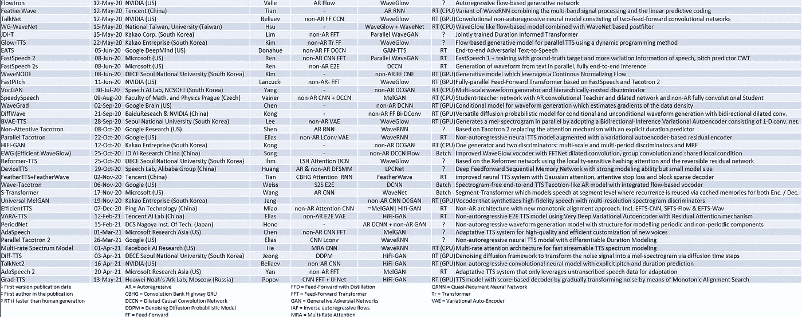

不同网络体系结构的描述(作者列表)

# 端到端系统

2017 年 2 月，蒙特利尔大学提出了 Char2Wav，对应于 SampleRNN 的双向递归神经网络、注意力递归神经网络和神经声码器的组合。这种端到端网络允许直接从文本中学习波形样本，而无需经过中间步骤，如 mel 频谱图。它直接是网络的输出，用作输出网络的输入。

char 2 wav(【https://openreview.net/forum?id=B1VWyySKx】T2)的建筑

Char2Wav 由播放器和神经声码器组成。读者是一个专注的编码解码器。编码器接受文本或音素作为输入，而解码器从中间表示开始工作。如该大学所述:

> "与传统的文本到语音模型不同，Char2Wav 学习直接从文本产生音频."

同月，百度还开发了名为 DeepVoice 的全自主端到端系统。它是从一个小音频剪辑及其转录的数据集来训练的。最近，微软在 2020 年推出了一个名为 FastSpeech 2s 的网络，该网络避免了 mel 频谱图的生成，但质量低于其姐妹网络生成的频谱。

这种端到端网络架构在语音生成领域并不占优势。大多数体系结构将字形-音素模型、持续时间预测模型和用于生成 Mel-频谱图的声学特征模型以及声码器分开。

最新的出版物和去年由中国科学技术大学(USTC)在爱丁堡大学的帮助下组织的暴雪 2020 挑战赛证实了这种情况，因为上次挑战赛见证了经典系统的消失和基于 2 代阶段的 SPSS(统计参数语音合成)系统的统治。超过一半的参赛团队使用神经序列对序列系统(例如 Tacotron ),并使用 WaveRNN 或 WaveNet 声码器。另一半研究基于 DNNs 和同样的声码器的方法。

# 谁是研究参与者？

在研究的 71 篇论文中，公司或大学家族的出版物分布显示，网络公司占主导地位，紧随其后的是技术公司。大学只是第三。

出版商家族发行的出版物

论文的来源国首先是美国，然后是中国。排在第三位的是韩国。出版商的国家与公司总部所在地相对应。

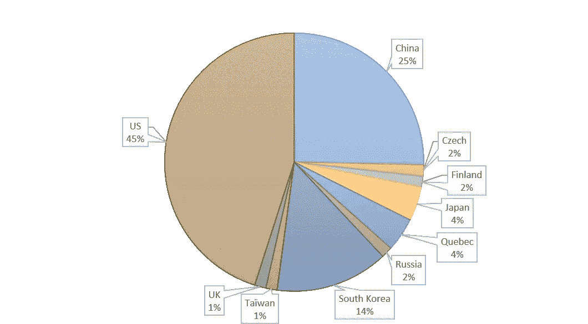

按出版商国家分列的出版物发行情况

就出版物数量而言，亚洲仅领先于北美(32 对 30)。

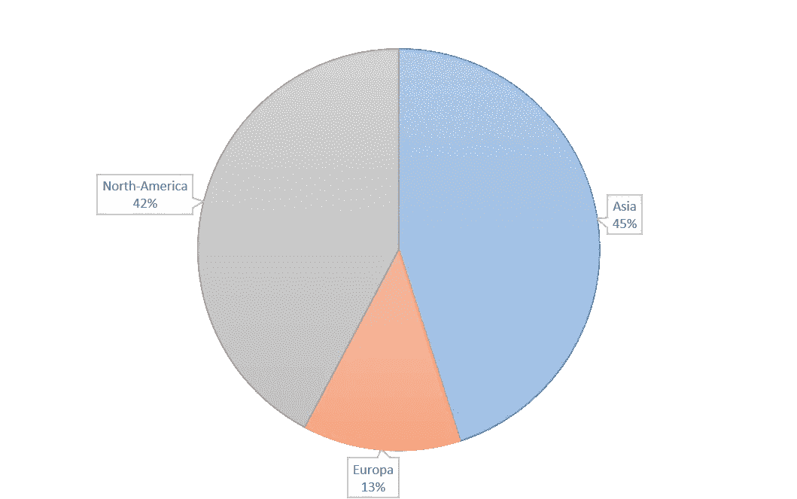

按洲分布

谷歌及其子公司 DeepMind(英国)是近年来发表论文最多的公司(13 篇)。我们欠他们关于 WaveNet，Tacotron，WaveRNN，GAN-TTS 和 EATS 的论文。其次是百度(7 篇出版物)，有关于 DeepVoice 和单簧管的论文，微软有关于 TransformerTTS 和 FastSpeech 的论文。

按公司/大学分配

# 哪里可以找到数据集？

不再需要对语音序列的每个元素进行强制注释。今天，有一个包含相关句子和声音的语料库就足够了，这是生成模型所必需的唯一元素。因此，有可能比以前有更多的样本，特别是通过(按字母顺序):

*   暴雪语音数据库——多语言——可变大小——暴雪挑战赛为每个参赛者提供了几个语音样本，供他们在挑战过程中进行训练。这些数据库在每次比赛中都可以免费下载。
*   CMU-北极-美国 1.08 GB 该数据库由大约 1150 个从古腾堡计划文本中精心选择的短语组成，没有版权。
*   共同的声音 6.1-多语言-可变大小 Mozilla 已经启动了一项计划，建立一个数据库，使语音识别对每个人开放和可用。为此，他们发起了一个社区项目，允许任何人背诵句子并检查其他人的背诵情况。法语版 6.1 数据库代表 18 GB 或 682 个有效小时。
*   [欧洲语言资源协会](http://www.elra.info/en/) —多语言—可变大小—许多商业用途的付费语料库。
*   [LDC 语料库数据库](https://www.ldc.upenn.edu/) —多语言—可变大小—语言数据联盟(LDC)是一个由大学、图书馆、企业和政府研究实验室组成的开放联盟，成立于 1992 年，旨在解决语言技术研发面临的严重数据短缺问题。LDC 由宾夕法尼亚大学主办。
*   [LibriSpeech](http://www.openslr.org/12) —美国— 57.14 GB — LibriSpeech 是由 Vassil Panayotov 在 Daniel Povey 的帮助下准备的，以 16 kHz 的采样率朗读的约 1000 小时的英语语音语料库。数据来源于阅读 LibriVox 项目的有声读物，并经过仔细的分割和排列。
*   [LibriTTS](https://research.google/tools/datasets/libri-tts/) —美国— 78.42 GB — LibriTTS 是一个 585 小时英语阅读的多说话人英语语料库，采样率为 24 kHz，由 Heiga Zen 在 Google Speech 和 Google Brain 团队成员的帮助下编写。
*   [LibriVox](https://librivox.org/) —多语言—可变大小— LibriVox 是一群来自世界各地的志愿者，他们阅读并录制公共领域的文本，以创建免费的有声读物供下载。
*   [LJ Speech](https://keithito.com/LJ-Speech-Dataset/) —美国— 2.6 GB —无疑是模型评估中最知名和最常用的数据集之一。这是一个公共领域的语音数据集，由 13，100 个单个说话者阅读 7 本非小说书籍的简短音频剪辑组成。为每个剪辑提供一份抄本。这些剪辑的长度从 1 秒到 10 秒不等，总时长约为 24 小时。这些文本出版于 1884 年至 1964 年之间，属于公共领域。该音频由 LibriVox 项目在 2016-2017 年录制，也在公共领域。
*   [VCTK](https://datashare.ed.ac.uk/handle/10283/3443) —美国— 10.94 GB — CSTR VCTK(语音克隆工具包)包括 109 个操各种口音的英语者所说的语音数据。每个演讲者阅读大约 400 个句子，这些句子选自《先驱报》、《彩虹通道》和一段启发性段落。这些句子对所有参与者都一样。

存在许多数据集，给它们命名会很复杂: [OpenSLR](https://openslr.org/) ，META-SHARE，audio books……尽管有大量的语音数据，但总是很难找到允许在韵律和情感方面训练模型的数据集。

# 如何衡量质量？

为了确定生成信号的质量，没有琐碎的或计算机化的测试可用于评估分类器的[性能。质量是根据许多因素评估的，包括自然度、鲁棒性(系统不会忘记单词或重复的能力)和准确性。](/in-conversational-ai-precision-and-recall-are-well-not-your-best-friends-c42e2feb9aee)

因为必须检查质量以确定模型的性能，所以这必须由人类来完成。讲被评估语言的被选择的人被要求评价声音信号的音频质量。平均意见得分(MOS)是从通过对声音再现的质量判断(非标准化的，因此是主观的)进行投票而获得的得分中计算出来的。分数从 1 分差到 5 分优不等。

MOS 评定量表

被选中的听众被邀请收听生成的音频文件，有时与源文件进行比较(地面实况)。听完后，他们给出一个分数，分数的平均值就是 MOS 分数。自 2011 年以来，研究人员可以受益于一种描述良好的工作方式，这种方式基于众包方法。最著名的是一个被称为 CrowdMOS 框架，主要使用众包网站 Amazon Mechanical Turk(f . Ribeiro et al .—Microsoft—2011)。

大多数实验室使用这一原则对其算法进行评估，从而对算法之间的性能进行总体评价。应当注意，评估结果高度依赖于说话者和录音的声学特性。另一方面，这些值不是直接可比的，因为它们通常是用不同的数据集训练的。尽管如此，它允许我们了解彼此相关的架构的质量。当研究人员对他们的模型和他们同事的模型进行对比测试时，情况就更是如此了。

该图提供了所研究的每个模型的 MOS 值。只有用英语实现的 MOS 分数被保留。

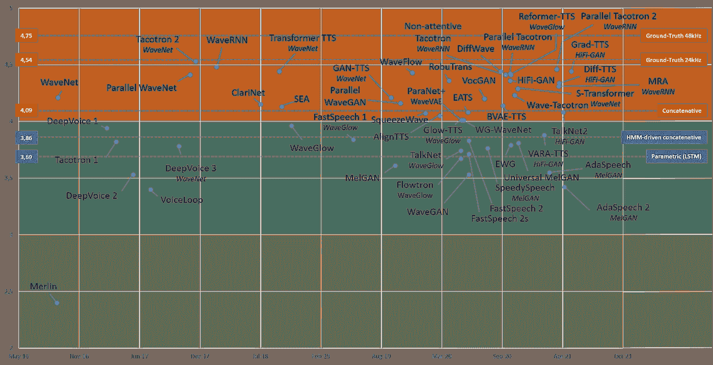

生成模型和声码器的美-英 MOS(作者图)

MUSHRA 方法(针对具有隐藏参考和锚的多个刺激)也是一种常用的听力测试。听众被要求比较自然语音和生成信号之间的混合信号，他们在 0 到 100 的范围内指定一个分数。

2019 年，Binkowski 等人引入了一种称为弗雷歇深度语音距离(FDSD)的定量自动测试，这是对应用于计算 2 个语音文件之间距离的弗雷歇距离的改编。该测试允许产生的信号和原始文件之间的距离得分。这个分数特别用于生成性对抗系统。

还计算其他指标，如 RMSE(均方根误差)、NLL(负对数似然)、CER(字符错误率)、WER(单词错误率)、UER(发音错误率)、MCD(梅尔倒谱失真)…

# 语音会议

一些会议涉及语音合成，我们注意到，科学出版物的日期往往针对这些会议之一。特别是，我们将提到(按字母顺序):

*   国际声学、语音和信号处理会议(ICASSP)是由 IEEE 组织的年度会议。它发生在六月。主题包括声学、语音和信号处理。
*   ICLR-成立于 2013 年的国际学习代表会议(ICLR)于 5 月举行，主要讨论机器学习。
*   ICML——国际机器学习大会(ICML)创立于 1980 年，每年 7 月举行。研究论文的提交时间为 12 月底至 2 月初。
*   inter seech——inter seech 会议成立于 1988 年，于 8 月底/9 月初举行。国际语音通信协会(ISCA)的目标是促进与语音通信科学技术相关的所有领域的活动和交流。
*   NeurIPS——创建于 1987 年，人工智能和计算神经科学的科学会议称为 neur IPS(用于神经信息处理系统),每年 12 月举行。它涉及机器学习网络和人工智能使用的所有方面。

# 接下来的挑战

在会话系统中，尽可能自然地进行会话是很重要的，即不要有过多的停顿。因此，声音的产生必须几乎是即时的。人类能够非常迅速地对一个问题做出反应，而生成系统通常必须等到生成结束时才能将信号返回给用户(特别是因为它接收到一个完整的句子进行转换)。随着并行性的使用，最近出现的非自回归系统明显超过了旧模型，因为它们能够将输出信号的产生分成几个并行的活动，从而能够在几毫秒内产生语音信号，而不管句子的长度(这被称为实时因子或 RTF)。在电话呼叫中心，对话式虚拟助理(也称为 callbot)必须能够在几秒钟内对请求做出反应，否则会被认为效率低下或功能失调。

语音生成系统仍然经常受到单个字母、拼写、重复数字、长句、数字到语音等的限制。，这导致取决于输入的质量不一致。此外，模型中仍会产生一些不寻常的峰值，并导致产生的信号不一致。由于人耳对这种变化极其敏感，自动生成的低质量会被立即检测到并降低欣赏分数。即使已经取得了巨大的进步，消除这些错误仍然是一个挑战。

模型的大小和它们在存储器中占用的空间也是未来网络的一个问题，未来网络将不得不匹配具有许多参数(数千万个参数)但资源少得多的网络。在低资源设备(如手机或机顶盒)上，CPU 和内存是有限的。DeviceTTS (Huand 等人-阿里巴巴集团语音实验室-2020 年 10 月)能够生成“仅”150 万个参数和 0.099 GFLOPS 的语音，质量接近 Tacotron 及其 1350 万个参数。基于 FastSpeech 2 的 LightSpeech (Luo 等人-中国科技大学和微软-2021 年 2 月)设法在不损失 MOS 的情况下，将其与 FastSpeech 2 的 1.8M 参数相匹配。

大多数生成的声音通常是单调的，平的，除非有包括各种情感表达和多个说话者的数据集。为了向系统指示要应用于输出信号(韵律)的持续时间和节奏的变化，有一种被称为语音合成标记语言(或 SSML)的标记语言。通过围绕要变化的单词的标签系统，可以应用一定数量的特征，例如音高及其范围(较低或较高)、轮廓、速率、持续时间和音量。它还允许你定义停顿，说一个词，等等。最新的出版物倾向于用其他机制取代这种标记，如预期韵律发音(使用风格标记的表达性 TTS-Kim 等人，2021)。研究人员正在修改现有的网络，增加额外的网络来调制产生的信号，从而模拟情感、强调等。(重点-李等 2018，CHiVE-Wan 等 2019，加味 Tacotron- Elyasi 等 2021)。还使用了声音转换技术:信号在生成后被修改，以便根据目的地对其进行调制。

大多数系统被设计成产生与用于训练的声音相对应的单一声音。人们对在训练期间不被看到的情况下生成新语音有一些兴趣(特别是根据最近的出版物:Arik 等人 2018 年、贾等人 2018 年、Cooper 等人、Attentron Choi 等人 2020 年和 SC-GlowTTS Casanova 等人 2021 年)。零触发 TTS (ZS-TTS)方法包括依靠几秒钟的语音来使网络适应新的声音。这种方法类似于语音克隆。名为[多说话人多风格语音克隆挑战赛](https://arxiv.org/abs/2104.01818)的比赛是一项挑战，参赛队必须提供一个解决方案，以相同或其他语言克隆目标说话人的语音。在大规模听力测试中也对结果进行了评估。另一个类似的比赛更普遍地关注声音转换:T2 声音转换挑战赛。

世界上有 7100 多种不同的语言。如果我们把所有使用的方言加起来，这个数字就上升到 41，000(例如，中国境内有 540 多种语言，印度有 860 多种语言)。工业语音合成系统通常只提供这个极其多样化的生态系统的一小部分。例如，谷歌云语音到文本提供 41 种语言，如果您添加国家变化(例如，法国加拿大和法国法国)，则提供 49 种语言。

当前的网络能够通过从被克隆的人的声音的几秒钟的学习转移来再现声音。它让一个失去声音的人有可能产生声音，现在可以通过录制他的声音几分钟来模仿别人。因此，有可能让一个人说出你想要什么，或者试图模仿一家公司的经理的声音。在综合的同时，下一个挑战将是提供能够检测这些欺诈的系统。由于人类无法在不改变两种发音的情况下将同一个句子发音两次，因此有可能通过简单地要求他重复他的句子来检测我们是在与一个机器人还是一个人打交道。然而，你需要有一个好的耳朵和一个好的听觉记忆来做出改变！

# 结论

语音合成是一个令人兴奋的领域，因为它触及了我们人类地位的核心，并且它今天达到了非常接近自然声音的质量水平。

大学和公司研究实验室已经超越了简单的语音再现阶段，并且已经接受了其他挑战，例如在不降低质量的情况下提高生成速度、纠正上一代错误、从单个说话者生成几种不同的语音、向信号添加韵律等。

迄今为止所产生的语音的质量水平足够高，可以应用于所有可能的领域，尤其是基于语音的对话助手的环境中。

> 你会用语音合成做什么商业用途？

# 参考

[CrowdMOS:一种众包平均意见得分研究方法](https://www.microsoft.com/en-us/research/wp-content/uploads/2011/05/0002416.pdf)

[暴雪挑战](https://www.synsig.org/index.php/Blizzard_Challenge) et [暴雪挑战 2020](https://www.isca-speech.org/archive/VCC_BC_2020/)

[基于双向 LSTM 递归神经网络的语音合成(2014)，范等【pdf】](https://pdfs.semanticscholar.org/c217/905bc98f00af747e8e9d5f6b79fb89a90886.pdf)

[SampleRNN:无条件端到端神经音频生成模型(2016)，Soroush Mehri 等人【pdf】](https://arxiv.org/pdf/1612.07837.pdf)

[wave net:Raw Audio 的生成模型(2016)，Aä ron van den Oord 等人【pdf】](https://arxiv.org/pdf/1609.03499.pdf)

[Char2Wav:端到端语音合成(2017)，J Sotelo 等人【pdf】](https://openreview.net/forum?id=B1VWyySKx)[深度语音:实时神经文本到语音(2017)，塞尔詹 o .阿里克等人【pdf】](https://arxiv.org/pdf/1702.07825.pdf)

[深度语音:实时神经语音转文本(2017)，Arik 等人【pdf】](https://arxiv.org/pdf/1702.07825.pdf)

[深度语音 2:多说话人神经文本到语音(2017)，塞尔詹·阿里克等人【pdf】](https://arxiv.org/pdf/1705.08947)

[深度语音 3:2000-说话人神经文本转语音(2017)，魏平等[pdf]](https://arxiv.org/pdf/1710.07654)

[通过调节 Mel 光谱图预测的 WaveNet 进行自然 TTS 合成(2017)，沈健等人【pdf】](https://arxiv.org/pdf/1712.05884)

[并行 WaveNet:快速高保真语音合成(2017)，Aaron van den Oord 等人【pdf】](https://arxiv.org/pdf/1711.10433)

[多任务学习框架下基于生成对抗网络的统计参数语音合成(2017)，S . Yang 等【pdf】](https://arxiv.org/pdf/1707.01670)

[Tacotron:走向端到端的语音合成(2017)，王雨轩等[pdf]](https://pdfs.semanticscholar.org/a072/c2a400f62f720b68dc54a662fb1ae115bf06.pdf?_ga=2.133718478.1725061846.1494658711-1308334183.1494658711)

[VoiceLoop:通过音韵循环进行语音拟合和合成(2017)，Yaniv Taigman 等人【pdf】](https://arxiv.org/pdf/1707.06588)

[单簧管:端到端文语转换中的并行波生成(2018)，魏平等【pdf】](https://arxiv.org/pdf/1807.07281.pdf)

[LPCNet:通过线性预测改善神经语音合成(2018)，让-马克·吕林燕等人【pdf】](https://arxiv.org/pdf/1810.11846)

[FastSpeech:快速、鲁棒和可控的文本到语音转换(2019)，任意等人【pdf】](https://arxiv.org/pdf/1905.09263.pdf)

[梅尔内特:频域音频生成模型(2019)，肖恩·瓦斯奎兹等人【pdf】](https://arxiv.org/pdf/1906.01083)

[多说话人端到端语音合成(2019)，Jihyun Park 等[pdf]](https://arxiv.org/pdf/1907.04462)

[梅尔根:条件波形合成的生成对抗网络(2019)，昆丹·库马尔等人【pdf】](https://arxiv.org/pdf/1910.06711.pdf)

【Transformer TTS】[用 Transformer 网络进行神经语音合成(2019)，李乃汉等【pdf】](https://arxiv.org/pdf/1809.08895)

【ParaNet】[并行神经文本转语音(2019)，彭等【pdf】](https://arxiv.org/pdf/1905.08459.pdf)

[WaveFlow:一个基于压缩流的 Raw 音频模型(2019)，魏平等人【pdf】](https://arxiv.org/pdf/1912.01219)

[Waveglow:基于流的语音合成生成网络(2019)，R Prenger 等人【pdf】](https://arxiv.org/pdf/1811.00002.pdf)

[alignts:无需明确对齐的高效前馈文本到语音系统(2020)，甄曾等[pdf]](https://arxiv.org/pdf/2003.01950)

[EfficientTTS:一个高效高质量的文语转换架构(2020)，苗晨峰等[pdf]](https://arxiv.org/pdf/2012.03500)

[EATS] [端到端对抗性文本转语音(2020)，杰夫·多纳休等[pdf]](https://arxiv.org/pdf/2006.03575)

[FastSpeech 2:快速高质量的端到端文本转语音(2020)，任意等人【pdf】](https://arxiv.org/pdf/2006.04558)

[Flowtron:一个用于文本到语音合成的基于自回归流的生成网络(2020)，Rafael Valle 等人【pdf】](https://arxiv.org/pdf/2005.05957)

[Flow-TTS:基于 Flow 的非自回归文语转换网络(2020)，苗晨峰等【pdf】](https://ieeexplore.ieee.org/stamp/stamp.jsp?tp=&arnumber=9054484)

[Glow-TTS:通过单调对齐搜索的文本到语音的生成流程(2020)，Jaehyeon Kim 等人【pdf】](https://arxiv.org/pdf/2005.11129)

[HiFi-GAN:高效高保真语音合成的生成对抗网络(2020)，Jungil Kong 等人【pdf】](https://arxiv.org/pdf/2010.05646)[鲁棒长格式语音合成的位置相关注意机制(2020)，Eric Battenberg 等人【pdf】](https://arxiv.org/pdf/1910.10288)

【Merlin:一个开源的神经网络语音合成系统(2016)吴等

[【DC-TTS】基于深度卷积网络的高效可训练文本到语音转换系统，具有引导注意力(2017) Tachibana 等人【pdf】](https://arxiv.org/pdf/1710.08969.pdf)

[WaveGAN / SpecGAN 对抗性音频合成(2018) Donahue 等人【pdf】](https://arxiv.org/pdf/1802.04208.pdf)

[WaveRNN 高效神经音频合成(2018) Kalchbrenner 等人【pdf】](https://arxiv.org/pdf/1802.08435)

[实时说话人相关的神经声码器(2018)金等【pdf】](https://gfx.cs.princeton.edu/pubs/Jin_2018_FAR/fftnet-jin2018.pdf)

[【SEA】样本高效自适应文语转换(2018)陈等【pdf】](https://arxiv.org/pdf/1809.10460.pdf)

[FloWaveNet:Raw Audio 的生成流程(2018) Kim 等人【pdf】](https://arxiv.org/pdf/1811.02155)

[GELP:用于从 Mel-spectrogram 合成语音的 GAN 激励线性预测(2019)朱韦拉等人【pdf】](https://arxiv.org/pdf/1904.03976)

[榴莲:用于多模态合成的持续时间通知注意网络(2019)于等【pdf】](https://arxiv.org/pdf/1909.01700)

[具有对抗网络的 GAN-TTS 高保真语音合成(2019) Binkowski 等人【pdf】](https://arxiv.org/pdf/1909.11646.pdf)

[梅尔根:条件波形合成的生成对抗网络(2019)库马尔等人【pdf】](https://arxiv.org/pdf/1910.06711)

[并行 WaveGAN:基于生成式对抗网络的多分辨率声谱图快速波形生成模型(2019) Yamamoto 等人【pdf】](https://arxiv.org/pdf/1910.11480)

[SqueezeWave:用于设备上语音合成的超轻型声码器(2020)翟等[pdf]](https://arxiv.org/pdf/2001.05685)

【RobuTrans:一种基于鲁棒变换的文本语音转换模型(2020)李等【pdf】

【多频带 MelGAN:高质量文本到语音的快速波形生成(2020)】杨等【pdf】

[FeatherWave:一种高效的高保真多带线性预测神经声码器(2020)田等【pdf】](https://arxiv.org/pdf/2005.05551)

[TalkNet:全卷积非自回归语音合成模型(2020)贝利耶夫等【pdf】](https://arxiv.org/pdf/2005.05514)

[WG-WaveNet:无需 GPU 的实时高保真语音合成(2020) Hsu 等人【pdf】](https://arxiv.org/pdf/2005.07412)

[JDI-T:用于无显式对齐的文本到语音的联合训练持续时间通知转换器(2020) Lim 等人【pdf】](https://arxiv.org/pdf/2005.07799)

[WaveNODE:语音合成的连续归一化流程(2020) Kim 等人【pdf】](https://arxiv.org/pdf/2006.04598)

[FastPitch:带基音预测的并行文本到语音(2020) Lancucki 等人【pdf】](https://arxiv.org/pdf/2006.06873)

[VocGAN:一种具有分层嵌套对抗网络的高保真实时声码器(2020)杨等【pdf】](https://arxiv.org/pdf/2007.15256)

[SpeedySpeech:高效的神经语音合成(2020) Vainer 等人【pdf】](https://arxiv.org/pdf/2008.03802)

[WaveGrad:波形生成的梯度估计(2020)陈等【pdf】](https://arxiv.org/pdf/2009.00713)

[DiffWave:音频合成的通用扩散模型(2020)孔等【pdf】](https://arxiv.org/pdf/2009.09761)

[【BVAE-TTS】非自回归文语转换的双向变分推断(2020) Lee 等【pdf】](https://openreview.net/pdf?id=o3iritJHLfO)

[非注意 Tacotron:鲁棒可控的神经 TTS 合成包括无监督持续时间建模(2020)沈等【pdf】](https://arxiv.org/pdf/2010.04301)

[平行 Tacotron:非自回归可控 TTS (2020) Elias 等【pdf】](https://arxiv.org/pdf/2010.11439)

【高效 WaveGlow:一种改进的 WaveGlow 声码器，速度更快 (2020)宋等[【pdf】](http://www.interspeech2020.org/uploadfile/2020/1023/20201023081102675.pdf)

[Reformer-TTS:使用 Reformer 网络的神经语音合成(2020) Ihm 等人【pdf】](https://www.isca-speech.org/archive/Interspeech_2020/pdfs/2189.pdf)

[DeviceTTS:一个小尺寸、快速、稳定的设备上文本到语音转换网络(2020)黄等[pdf]](https://arxiv.org/pdf/2010.15311)

[Wave-Tacotron:无声谱图的端到端文本语音合成(2020) Weiss 等人【pdf】](https://arxiv.org/pdf/2011.03568)

[s-Transformer:鲁棒神经语音合成的段-Transformer(2020)王等【pdf】](https://arxiv.org/pdf/2011.08480)

[通用 MelGAN:用于多域高保真波形生成的鲁棒神经声码器(2020) Jang 等人【pdf】](https://arxiv.org/pdf/2011.09631)

[VARA-TTS:基于具有残留注意的深度 VAE 的非自回归文本到语音合成(2021) Elias 等人【pdf】](https://arxiv.org/pdf/2102.06431)

[PeriodNet:具有分离周期和非周期分量的结构的非自回归波形生成模型(2021) Hono 等人【pdf】](https://arxiv.org/pdf/2102.07786)

[AdaSpeech:自定义语音的自适应文语转换(2021)陈等【pdf】](https://arxiv.org/pdf/2103.00993)

[并行 Tacotron 2:具有可微分持续时间建模的非自回归神经 TTS 模型(2021) Elias 等人【pdf】](https://arxiv.org/pdf/2103.14574)

[用于快速流式文本到语音频谱建模的多速率注意力架构(2021)何等【pdf】](https://arxiv.org/pdf/2104.00705)

[Diff-TTS:文本到语音的去噪扩散模型(2021) Jeong 等人【pdf】](https://arxiv.org/pdf/2104.01409)

[TalkNet 2:具有显式基音和持续时间预测的语音合成的非自回归深度可分离卷积模型(2021) Beliaev 等人【pdf】](https://arxiv.org/pdf/2104.08189)

[AdaSpeech 2:非转录数据的自适应文语转换(2021)严等【pdf】](https://arxiv.org/pdf/2104.09715)

[Grad-TTS:文本到语音的扩散概率模型(2021) Popov 等人【pdf】](https://arxiv.org/pdf/2105.06337)

塞凯丽，é。，Henter，G . e .，Beskow，j .，Gustafson，J. (2020)
自发语音合成中的呼吸和语音规划