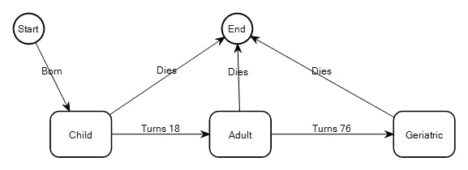
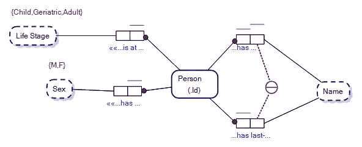
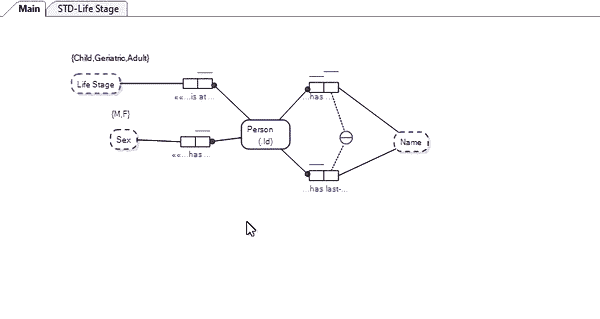
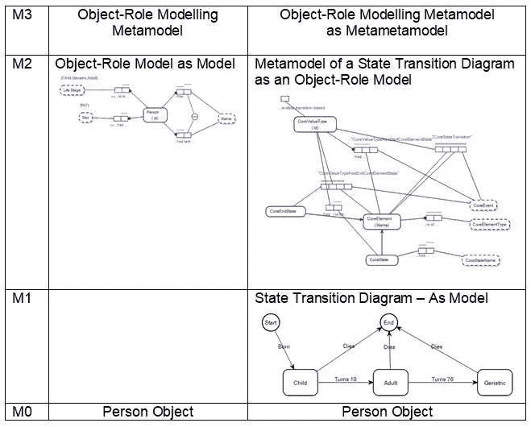
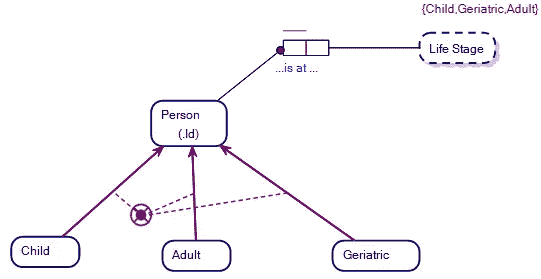

# 状态转换图和对象-角色建模

> 原文：<https://towardsdatascience.com/state-transition-diagrams-object-role-modeling-36808e3fc0c2?source=collection_archive---------35----------------------->

## 四层元模型体系结构的实现

状态转换图。图片作者。

状态转换图捕获值类型的*状态*以及导致值类型的值从一种状态变为另一种状态的事件(如*转换*)。

如果你已经关注我的文章有一段时间了，现在你会看到[对象-角色模型](/why-learn-object-role-modelling-4eebd93dcda2#:~:text=The%20reasons%20for%20that%20are,to%20go%20the%20other%20way.)逐渐演变成实体关系图(erd)和属性图模式(pgs)(如下)。这非常有趣，再次证明了如果你有一个对象-角色模型(ORM ),你会自动有一个 ER 图或 PGS。

ORM 和 ER 图与属性图模式之间的态射。图片作者。

然而，在这个演示中没有明确的是，所有的图可能被存储在一个[元模型](https://en.wikipedia.org/wiki/Metamodeling)中，或者视情况而定的元元模型中。例如，所有的图都可以存储在对象-角色建模本身的元模型中。

对于门外汉来说，这可能会令人困惑。这意味着，如果你有一个足够表达的模型来建模，那么你就有了元模型。如果你有一个元模型，你就有一个元模型。对象管理小组已经在其元对象设施(MOF)中定义了一个这样的模型排列，关于这个的更多信息可以在维基百科条目[这里](https://en.wikipedia.org/wiki/Meta-Object_Facility)中找到。我们感兴趣的是捕捉对象、模型、元模型和元元模型的概念的架构；这就是所谓的四层架构。

## 状态转换图和四层架构

对象-角色模型、实体关系图和属性图模式都是彼此的变形，这意味着它们有共同的结构点。ORM 是所有三种语言中表达能力最强的一种，它可以在功能上被翻译成 ER 图和属性图模式，而不需要将 ER 图和 PGS 图与它们的通用 ORM 图分开存储……所以它们不需要存储在元模型/元元模型中。这意味着您可以动态地生成实体关系图和 PGS 图*，可以这么说，如果您愿意的话。但是选择权在你……如果你愿意，你可以将它们存储在建模软件的元模型中。*

但是，如果您想在与 ORM 图相同的元模型中创建和存储状态转换图，您需要一个四层架构。

**你为什么会？为什么要使用四层架构？**

本文顶部的状态转换图描述了一个人的生命阶段，以及一个人如何从一个阶段转换到另一个阶段。

但是理想情况下，你会把这个概念和它所涉及的价值类型联系起来，针对一个人。

值类型带有值类型约束的对象-角色模型。图片作者。

上面的对象-角色模型表明，在我们的话语世界中，我们储存了关于人及其生活阶段的信息。生命阶段，*儿童*、*成人*和*老年*，被捕获为*生命阶段*值类型的值约束。请注意，在 ORM 图中，没有指示生命阶段的开始和结束状态，也没有指示触发从一个值约束/状态到另一个值约束/状态的转换事件。

如果您想在您的对象-角色模型和相关的状态转换图之间转换，将模型存储在一个模型中(作为元模型/元元模型)有很大的好处…这样图就统一了…

状态转换图和对象-角色模型之间的变形。图片作者。

## 关于四层架构的更多信息

一个四层的元模型架构可能会让外行人感到困惑，最好从最终的对象向后看。

想象一下，你有一个人对象，我们在 M0 层有这个。如果我们有一个人对象的模型作为对象-角色模型…那么这是上一层(在这个例子中是我们的 M2 层)，如果我们有一个对象-角色建模的元模型，那么这又是上一层(在我们的例子中是 M3)。

但是，如果我们考虑 Person 对象的状态转换图，该模型位于 M1 层，其元模型(作为 ORM 图)位于 M2 层，M3 层是对象-角色建模的元模型，现在作为元元模型，如下所示:

在元模型和元模型层使用对象角色建模的四层架构。作者图片

为什么在我们的例子中对象角色建模不需要四层？

在这种情况下，这是因为它不需要它，因为您可以直接从 ORM 的元模型中提取对象-角色模型。

但是如果您将状态转换图作为元模型存储在 ORM 模型中，那么您需要四个层来将该元模型作为元模型存储在 ORM 元模型中。

这是令人头晕的东西，但如果你慢慢地通过它，它是有意义的。如果你只有三层，你能从 ORM 的元模型中提取出来的只有 ORM 模型…你想要的是从 ORM 元模型中提取状态转换图、实体关系图、属性图模式或任何其他语言，就像从 ORM 的元模型中提取出来的模型一样，从元模型中提取出来…四层。

状态转换图很好地补充了对象-角色模型，因为 ORM 中值类型的值约束可能与状态转换中的一组互补状态有一种形态。

在以后的文章中，我将详述某些值类型约束之间的关系，以及它们如何在我们的模型中限制对象的子类型。

对象角色建模和值类型约束中的子类型。图片作者。

这里可以说，影响对象构成的状态转换也可能影响与该对象相关的子类型，如超类型。

感谢阅读；如果时间允许，我会写更多关于对象-角色建模、状态转换图、erd 和 pgs 的内容。

==============================