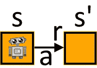
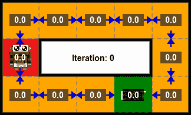

# 国家价值观和政策评估

> 原文：<https://towardsdatascience.com/state-values-and-policy-evaluation-ceefdd8c2369?source=collection_archive---------18----------------------->

## [入门](https://towardsdatascience.com/tagged/getting-started)

## 强化学习简介:第 1 部分

所有图片由作者提供。

很久以前，有一个机器人宝宝在商场里迷路了。使用来自 [*的策略，多股武装的强盗*](/multi-armed-bandits-part-1-b8d33ab80697) 他能够在最短的时间内充电，并且现在准备开始寻找他的妈妈。

不幸的是，他不太记得回到她身边的路，所以需要我们的帮助来指引他。我们将使用强化学习来帮助他找到路，并确保他安全返回。

# 介绍

简单来说，强化学习可以被认为是从试错中学习。与它的 ***环境*** 交互的 ***代理***，接收反映它完成某个预定目标的能力的 ***奖励*** 。通过评估智能体的行为对其性能的影响，然后修改这些行为以提高性能，强化学习可以逐步转向一个能给出最大回报并解决手头任务的智能体。

因此，强化学习可以被认为由两个不同的部分组成:

*   ***预测题*** ，其中对智能体的表现进行评估。
*   ***控制问题*** ，代理用来选择其动作的策略被修改以提高性能。

在这一部分，我们将主要考虑预测问题。然后，一旦我们能够衡量行动与获得的奖励金额之间的关系，我们就可以将注意力转向改进政策，以最大化这些奖励。

> 标准的强化学习书籍或教学大纲将从完整的强化学习系统的描述和用于描述该系统的方程的推导开始。只有这样，一旦他们掌握了所有的理论，他们才能展示如何将理论应用到实际应用中。
> 
> 在本文中，我们将采取相反的方法。我们将从实际解决非常简单的问题的非常简单的方法开始，并逐步建立在这些基础上，根据需要添加一些理论，直到我们能够解决完整的强化学习问题。
> 
> 因此，我们将在与传统课程相同的地方结束，但使用的是一种 [*自上而下*](#4669) 的方法，而不是标准的*自下而上*的方法。我们想让机器人宝宝尽快回到妈妈身边，所以没有时间提前学习所有的理论，我们会边学边补充。

# 内容

在本帖中，我们将讨论以下强化学习主题:

*   [强化学习(RL)的术语](#2ca0)
*   [基础 RL 数学](#e996)
*   [策略评估](#eb41)
    - [迭代策略评估](#9ecd)
*   [政策完善](#bf35)
*   [折扣奖励](#de56)

本文的 Jupyter 笔记本版本可以在 github 上找到。
这包含了用于创建本文中描述的网格级别和 RL 算法的所有代码。

<https://github.com/WhatIThinkAbout/BabyRobot/blob/master/Reinforcement_Learning/Part%201%20-%20State%20Values%20and%20Policy%20Evaluation.ipynb>  

# 强化学习的术语

考虑婴儿机器人最初发现自己的这个水平:

在进入关卡时，他有两个可能的选择:他可以向北或向南走。哪一个能让他最快到达出口？

## 奖励

强化学习( *RL* )的基本概念是 ***奖励*** 的概念:一个单一的数值，用来衡量手头的任务完成得有多好。正是奖励推动了学习，使得解决问题的策略得到优化，从而获得最大的奖励。

在像这样的问题中，机器人宝宝必须找到走出关卡的路，只要到达出口就可以得到奖励，然而这并不能完全描述我们想要达到的目标。我们实际上想尽快到达出口。仅仅因为到达出口而给予奖励不会鼓励这种行为。在找到出口之前，机器人宝宝可以花几天时间在关卡中走来走去，并且会得到和他直接到达那里一样多的奖励。

因此，一个更好的奖励制度应该是鼓励走最短的路线，不鼓励漫无目的地闲逛。实际上，我们想把奖励表达成惩罚，惩罚随着到达出口的步数而增加。

然而，我们仍然希望坚持 RL 的核心理念，即奖励最大化，因此我们引入了负奖励的理念。每走一步，我们给-1 的奖励。这样，花费很长时间找到出口的路线将积累大量的负奖励，而直接到达那里的路线将有少量的负奖励。就获得最大回报而言，直接路线会更好，因为负面影响会更少。

## 州

有了我们的奖励系统，每次机器人宝宝从一个方格移动到下一个方格，他将得到-1 的奖励。在 RL 术语中，这些方块中的每一个都代表一个 ***状态*** ，其中状态被定义为我们正在工作的 ***环境*** 中的一个独特的、独立的阶段。

因此，在这种情况下，每个状态描述了构成该级别的网格中的一个位置。在一个游戏中，比如国际象棋，状态将描述当前的棋盘位置。在无人驾驶汽车的情况下，状态可以描述诸如道路上的位置、汽车的方向和速度以及其他交通细节等属性。在每一种情况下，国家定义当前的情况。

国家是自足的，因为它独立于任何先前的国家。例如，在国际象棋中，当前棋盘位置给出的状态独立于到该点为止已经进行的所有其他移动。要选择下一步，你不需要知道过去采取了哪些行动。类似地，对于机器人宝宝来说，从网格中的一个方格移动到下一个方格，他不需要知道他之前处于哪个状态。当一个状态独立于先前的状态时，据说它满足 ***马尔可夫性质*** 。

## 价值

因为我们知道，每次机器人宝宝从一个状态移动到下一个状态时，都会招致-1 的惩罚(*奖励*),并且我们还可以看到关卡的地图，所以我们可以通过计算每个状态的 ***值*** 来帮助机器人宝宝做出选择，其中该值定义了处于特定状态有多好。

显然，对于这个网格级别，处于靠近出口的状态比处于远离出口的状态要好。在 RL 中，一个状态的价值被定义为当从该状态开始，然后在所有未来状态中选择由计划或 ***政策*** 定义的行动时可以获得的预期回报。

让我们将这些信息添加到关卡中。从出口开始(在 R1 中被称为 ***终端状态*** ，在此情节结束，根据定义，奖励值为 0)，并绕过关卡，每次移动到一个新的方块都会招致-1 的惩罚，为每个状态给出以下值:

这里有几点需要注意:

*   任何状态的值都等于从该状态开始时可以累积的预期奖励量。在 RL 语言中期望的报酬总额被称为*。
    因此，给定机器人宝宝的起始位置，如果他每次从一个状态移动到下一个状态时得到-1 的回报，那么他可以期望得到-4 的回报，如果他沿着最短的路径到达出口的话。*
*   *此外，状态的值由在该状态中采取的动作和下一个状态的值的总和给出。例如，从初始状态向南移动，采取行动的奖励为-1，新状态的值为-3，因此初始状态的值等于-4。*
*   *通过展望一个状态，我们可以选择朝着一个方向前进，这个方向会把我们带到一个负值较小的状态。所以，从初始位置开始，我们会选择向南到值为-3 的州，而不是向北到值为-5 的州。用于选择下一个动作的策略被称为 ***策略*** 。
    在这种情况下，如果我们选择朝着价值增加的方向前进，我们实际上是在遵循最佳或 ***最优*** 政策，正如我们在 [*多臂强盗*](/multi-armed-bandits-part-1-b8d33ab80697) 中看到的那样，当我们选择采取能给我们带来最高即时回报的行动时，我们被说成是贪婪地选择了*。在这种情况下，贪婪策略会产生最优策略。**

**我们可以在我们的级别图上显示策略，其中箭头现在指向每个状态中应该采取的操作的方向。请注意，对于这个贪婪的政策，箭头总是指向从当前状态获得最大回报的方向。**

****

**所以，从机器人宝宝的起始位置，如果他遵循这个最优策略，他将会以-4 的累计总回报到达出口。**

**由于我们在从一个状态转移到下一个状态时给予固定的回报，在这种最优策略下，预期回报，因此每个状态的价值，就是退出的步骤数，乘以每一步给予的回报-1。**

# **基础数学**

**在对初级水平的描述中，婴儿机器人找到了自己，我们已经涵盖了强化学习的大部分基本概念。我们现在可以添加与这些概念相关的简单数学术语，然后在此基础上继续学习。**

**首先我们说过，当机器人宝宝在*状态*下采取*动作*时，他会得到*奖励*。不出所料，我们使用这些术语的第一个字母来指代其相应的值，小写字母用于指代这些量中每一个的特定值，这就给出了:**

*   *****r*** *=奖励***
*   *****a*** *=动作***
*   *****s*** *=状态***

**此外，当机器人宝宝采取行动时，他很可能会从当前状态移动到另一个状态。下一个或*继承国*由*的*表示(读作“s 质数”):**

*   *****s′****=下一状态***

****

**当机器人宝宝对 **a** 动作时，他从当前状态 **s** 进入新状态**s**并获得奖励 **r。****

**奖励、状态和行为实际上是随机变量:有获得某种奖励、采取某种特定行动或处于某种状态的概率，这些概率用大写字母表示。**

**将所有这些术语联系在一起，我们可以得到对状态-动作对的预期回报:**

****

**等式 1:状态-动作对的预期报酬**

**因此，在时间“T36”t-1 处，从某一特定状态“T38”s 开始并采取行动“T40”a 时，下一时间步收到的预期报酬是当前状态和行动的函数。之所以称之为预期报酬，是因为当在特定状态下重复采取特定行动时，所获得的报酬金额并不总是返回恒定值，因此这有效地定义了将获得的平均值。**

**使用这些术语，我们可以为我们定义的基本属性创建方程:**

*****返回'Gₜ':*** *奖励累计超过一集的总金额，起始于时间‘t’。* 在我们的情况下*发作*指进入和离开一个级别之间发生的所有时间步长。(在长时间运行或连续的任务中，事情显然会变得有点复杂，但我们稍后会回到这个问题上来)。**

****

**等式 2:以回报总和表示的回报。**

**所以，从时间' *t* '开始，回报只是未来回报的总和。**

****

**从状态 ***开始，'Sₜ'、*** *返回***'gₜ'一世** *年代从那个状态得到的总报酬，直到插曲终止。***

*****价值:*** *一个状态的价值只是衡量那个状态有多好*。这可以用未来回报的数量来表示，或者换句话说，如果你以那种状态开始，你可能得到的回报。显然，无论你从哪个状态开始，你将获得的奖励将取决于你选择的行动，而这些行动由 ***策略*** 决定，通常用符号“***【π】***”表示。**

**所以在策略π下状态' *s* '的值就是预期收益:**

****

**等式 3:策略“ ***”下状态“s”的值π*** ”。**

**因为，在我们的简单例子中，我们总是因为采取行动而得到相同的-1 的回报，所以一个状态的值就是直接的回报加上下一个状态的值:**

****

**等式 4:在确定性策略'***【π】***'下的状态值。**

**例如，级别的开始状态的值是-4。如果从这种状态开始遵循最优策略，当机器人宝宝到达出口时，他将已经累积了-4 的总奖励。类似地，如果他选择从初始状态向南走一步，他会得到-1 的奖励，下一个状态的值是-3，所以初始状态的值也是-4。**

**注意状态值的计算是如何分成两部分的；采取行动所获得的直接回报，以及该行动带给你的状态的价值。这种将问题分解为子问题的技术被称为*。利用这一点，已经计算出的状态值可以被重用来计算其动作导致的其他状态的值。***

***这大大简化了问题，因为在计算从一个状态开始到一集结束之间获得的总回报时，你不需要计算出在每个状态下将给出的奖励。相反，你只需要向前看一步。***

# ***政策评价***

***机器人宝宝的妈妈告诉他永远不要相信陌生人，所以他对遵守我们的政策有点紧张。如果我们对他撒谎并且这不是最优策略会怎么样？***

***所以，他没有使用我们的政策，而是决定抛硬币来决定走哪条路。每次他进入一个新的状态，他都会抛硬币。如果是正面，他会往前走，反面，他会往后走。因此，现在每个动作都有 50%的机会被选中。***

***在这种新政策下，每个州的价值会发生什么变化？我们该如何计算它？***

*   ***首先，一个国家的价值仍然是衡量这个国家有多好的标准。然而，由于机器人宝宝不再直接走向出口，他将积累的总奖励将减少。换句话说，因为他可能会访问更多的州，或者多次访问同一个州，并且从一个州移动到另一个州的奖励仍然是-1，总奖励将变得更负。***
*   ***此外，一个状态的值仍然表示从该状态的预期回报。但由于宝贝机器人现在遵循的是随机策略(RL 中称为 a ***随机策略*** )，基于抛硬币，从任意状态到退出的步数可能会有所不同。因此，一个州的价值现在代表了在该州开始时可以获得的平均回报，或*预期*。***
*   **因为状态的值是从该状态可获得的预期回报，所以它的值可用于帮助计算前一状态的值。这避免了需要知道在该集期间将累积的所有奖励。**
*   **因此，任何行为的价值仅仅是采取这一行为的回报加上下一个状态的价值。该动作对当前状态值的贡献是通过将该动作的值乘以采取该动作的概率来获得的。**

**这可以用下面的等式来概括:**

****

**等式 5:随机策略'*'下的状态值。***

***与等式 4 一样，对于确定性策略，任何动作的值由采取该动作' *a* '获得的奖励' *r* '加上该动作导致的下一状态'*s′'*的值给出。然而，由于在随机策略下可以有一个以上的行动，行动的回报乘以采取行动的概率: *π(a|s)表示从状态“在策略下”****【π】采取行动“a”的概率。******

***然后对状态的所有动作将这些值相加，这给出了状态' *s* '的 ***预期*** 奖励值。实际上，总和与采取行动的概率的组合给出了行动回报的平均值。***

***在婴儿机器人的新政策下，2 个动作(向前或向后)中的每一个都有 0.5 的概率被采取，采取任何动作的奖励仍然是-1。因此，任何状态的值都将是:***

******

***等式 6:有两个同样可能的行动，回报都是-1 的状态值。***

***其中 *sᶠ* 是选择向前动作时移动到的状态，而 *sᵇ* 是采取向后动作时的下一个状态。***

# ***迭代策略评估***

***对于这个简单的层次，计算最优策略是很容易的。我们简单地从出口处开始，然后往回走，每移动到下一个州就增加一个-1 的奖励。但是，当移动到下一个状态的机会是随机的时，我们如何着手计算状态值呢？
(在 RL 的语言中，移动到下一个状态的机会被称为 ***状态转移概率*** )。***

***我们可以通过采用类似的方法来计算最优策略值来做到这一点，只是现在，我们不能通过一次扫描所有州来找到每个州的值，而是需要进行多次扫描。这些都会给我们一个国家真实价值的更好的估计。***

***最初，由于我们不知道任何状态的值，让我们假设它们都不返回奖励，所以我们将所有初始值设置为零。根据定义，退出的回报，即最终状态，也是零，因为这是一集结束的地方。***

******

***迭代政策评估:初始状态值。***

***为了开始迭代过程，我们可以从任何状态开始，但是，为了简单起见，让我们从机器人宝宝的当前位置开始，关卡的入口。***

***机器人宝宝扔硬币。正面他去北方，反面他去南方。所以每个行动的概率是 0.5，每个行动的回报是-1，两个行动的下一个状态的值都是 0。因此，使用上面的等式 6，当前状态的电流值是:***

******

***为了简单起见，我们将在扫描开始时取每个状态的初始值，而不是它的更新值，以避免一些状态已经更新而一些状态没有更新的情况(尽管这样做是完全合理的，并且通常可以导致状态值更快地收敛；使用更新的值被称为'*就地*更新)。***

***因此，在这次扫描中，保持每个下一状态的值为零，我们可以对其余状态重复上述过程。这导致在第一遍结束时所有状态的值为-1。***

***在第一遍结束时，每个状态的值如下所示:***

******

***迭代策略评估:在第一次扫描结束时陈述值。***

***一旦计算了每个状态的值，就可以重复该过程，使用新计算的状态值来计算下一次迭代的状态值。在最初的 10 次迭代中，计算状态值的过程如下所示(暂时忽略蓝色箭头，我们很快就会看到)。***

******

***迭代策略评估:迭代 0 到 9。***

***如果这个过程重复足够长的时间，状态值最终停止增加，并且被认为已经达到*收敛。*理论上，收敛只有在极限时才真正达到*，或者换句话说，当时间步数等于无穷大时。显然这是相当不切实际的，因此我们将收敛定义为在一次迭代和下一次迭代的状态值之间的最大差值小于某个阈值时发生。在我们的实验中，我们使用阈值 1e-3 (=0.001)，因此，对于该策略，状态值收敛需要 206 次迭代。****

******

***迭代策略评估:经过 206 次迭代后达到的收敛状态值。***

***现在可以看到，在这个通过抛硬币来选择下一个状态的策略下，每个状态的值都比直接退出的最优策略下的值负很多。然而，这些值仍然表示从任何状态到退出的预期步数，除了现在机器人宝宝遵循随机轨迹，这将导致更多的状态被访问。这是他从起点到终点的一次短途旅行，如下所示:***

******

***随机政策下的样本轨迹。***

# ***迭代策略评估代码***

***用于评估策略的代码如下所示。这重复计算每个状态的状态值，直到达到收敛。***

***(这段代码摘自本文的完整笔记本，可以在 [github](https://github.com/WhatIThinkAbout/BabyRobot/blob/master/Reinforcement_Learning/Part%201%20-%20State%20Values%20and%20Policy%20Evaluation.ipynb) 上找到)***

***该代码由实现迭代策略评估例程的三个主要部分组成:***

*   *****在等式 6 中，我们通过将每个动作获得的值乘以 0.5 来对动作进行平均，因为对于这个级别，我们只有 2 个可能的动作。在代码中，这变得更加一般化，在可能的操作数上乘以 1。*****
*   ******进行一次扫描，计算所有状态的值***(*standard _ sweep*函数)
    对所有状态进行迭代，计算每个状态的值。***
*   ******执行多次状态扫描直到收敛*** 最初每个状态的值都被设置为零。然后，在每次迭代中，使用当前值计算所有状态的新值。
    这一直持续到状态值的最大变化低于预定义的阈值。***

# ***政策改进***

***不出所料，根据抛硬币来决定下一步该怎么走并不是一个很好的策略。如上所示，在这种策略下，到达出口需要更长的时间。此外，每个状态的值比最优策略下的值低得多。然而，尽管状态值要差得多，但就可以获得的回报而言，它们仍然提供了一个重要的信息:每个状态的相对良好度。***

***回头看看最终的、收敛的状态值，可以看到从起始方块可以获得的期望回报是-32。所以，从这一点到出口平均要走 32 步。类似地，对于紧挨着起始位置北面的方块，预期回报是-35，南面是-27。因此，显而易见，要以最短的步数到达出口，最好从起点广场向南走。***

***通过重复这种一步前瞻，并贪婪地考虑下一个状态的值，我们可以修改随机抛硬币策略，以创建一个朝着最大回报方向移动的策略。通过这种方式，我们可以改进政策，产生一个给予更多奖励的政策。***

***事实上，在这一级别的政策评估的单次迭代之后，对状态值的贪婪行为给了我们最优的政策。这是由蓝色箭头显示的，可以看到它指向最大奖励的方向，并直接从入口到出口的水平。***

***另一个有趣的观察是，当贪婪地对计算的状态值采取行动时，在策略可以被改进之前，可能没有必要等待这些值收敛。再次查看这个级别的前几次迭代(方便地复制到这里，以避免您必须滚动！):***

******

***迭代策略评估:迭代 0 到 9。***

***尽管在策略评估期间，状态值完全收敛需要 206 次迭代，但是可以看出，到第 5 次迭代时，贪婪选择已经找到了最优策略。事实上，对于我们真正感兴趣的开始方块，最优策略已经在第四次迭代中找到了。因此，就改进策略而言，所有未来的迭代都是多余的。当我们寻找更有效的方法来寻找最佳策略时，我们将利用这一观察结果。***

# ***折扣奖励***

***到目前为止，我们已经评估了最优策略的状态值，我们能够很容易地确定这个非常简单的水平，以及随机策略，其中所有的行动都是以随机概率选择的。在这两种情况下，都存在一系列的行动，最终导致从开始的水平到退出。但是，如果情况不是这样，如果策略的任何操作都不会导致最终状态，会发生什么呢？***

***例如，考虑下面显示的确定性策略:***

******

***初始确定性策略***

***在该策略中，为每个状态定义一个动作，以指定应该从该状态移动的方向。关于这个策略需要注意的重要一点是，没有一个动作会导致退出，因此，这一集将永远不会结束。显然，这将在评估政策时造成问题。***

***状态值表示从一个状态可以获得的总奖励。正如我们已经看到的，这是作为将获得的所有奖励的总和来计算的，从该州开始，然后遵循该政策。因为我们的初始策略永远不会到达终止状态，所以在策略评估的每次迭代中，这个和只会继续增长。***

***为了防止这种情况发生，我们引入了 ***折扣奖励的概念。*** 现在，回报不再是从一个状态到一集结束累积的所有奖励的简单总和，我们逐渐减少奖励的贡献。一项奖励越往后，在计算国家的回报价值时，它所占的权重就越小。***

***计算回报的公式现在变为:***

******

***等式 7:贴现回报***

***在这个新的返回值贴现公式中，'*γ*'(γ)是*贴现因子*，其中 0 ≤ *γ* ≤ 1。因此，每个时间步长的回报都乘以一个递增的幂' *γ* '。当折扣因子的值小于 1 时，这将逐渐减少未来时间步长的奖励值，直到最终它们对整体回报的贡献实际上为零。***

***例如，值 0.9 通常用作折扣系数。这样我们就可以计算初始状态的返回值，如下所示:***

******

***显然，应用贴现因子会逐渐降低未来的回报值，用不了多久，它们就会下降到接近于零。***

***然而，正如我们已经看到的，通过考虑所有未来状态的回报来计算一个状态的价值是不切实际的。相反，我们使用动态规划将问题简化为一个只使用下一个状态的直接回报和价值的问题。下一个状态的值表示将从下一个状态获得的回报，因此我们可以修改等式 7，将贴现因子应用于下一个状态的值:***

******

***等式 8:状态“在政策下”的值***π***‘具有贴现的未来奖励。***

***换句话说:*当遵循“π”政策时，一个州的价值等于该州所有行动的总和，即采取每个行动的概率，乘以该行动的直接回报，再加上采取行动后下一个州的贴现值。****

***使用贴现状态值函数，将贴现因子设置为 0.9，我们现在可以计算确定性策略的值:***

******

***政策迭代:贴现状态值。***

***有了折扣奖励，每个状态的值不再持续下降，而是在 67 次迭代中收敛到我们的阈值。在这种情况下，所有状态(除了退出)的值都是-10。没有一个状态比另一个状态更好的原因是，在这种政策下，永远不可能达到最终状态，因此所有的状态都一样糟糕。在未来的一部分，我们将看看如何使用这些状态值来改善政策，给一个确实允许婴儿机器人逃离这一关。***

***关于新的贴现状态值，需要注意的一个要点如下:***

*   ***状态值不再代表预期的退出步骤数。取而代之的是，它们现在显示了在这一政策下，每个州的预期贴现未来回报。***

# ***摘要***

***毕竟在迷宫里跑来跑去，机器人宝宝很累了(我相信你也是！)，所以我们就在这里休息一下。我们已经成功地让机器人宝宝通过了非常简单的初始阶段。在这个过程中，我们几乎涵盖了强化学习的所有主要基础:***

*   ***强化学习使用奖励的概念来推动学习。对于构成问题环境的状态，可以从奖励中计算出一个值来表示每个状态有多好。然后，通过选择最大化回报的行动，就有可能找到可以用来解决手头问题的最佳策略。***
*   ***每个州的值代表如果你从该州开始，然后遵循当前政策直到该集结束时可以获得的回报。折扣奖励可以将状态值集中在不久的将来获得的奖励上。此外，它们可以防止如果不能保证情节结束时可能发生的问题。***
*   ***使用动态规划可以大大简化状态值的计算。该问题被分解为即时奖励和下一个状态的值，而不是必须知道来自特定状态的所有未来奖励。***
*   ***使用动态编程，我们能够执行策略评估，其中我们计算当前策略下所有状态的值。***
*   ***一旦策略评估完成，状态值就可以用于通过贪婪地选择这些值来改进策略。***

# ***下一步是什么？***

***尽管我们已经覆盖了很多领域，但我们仍然缺少强化学习的一些核心概念。特别是 ***马尔科夫决策过程*** 和 ***贝尔曼方程*** 。简而言之，它们分别是用于模拟强化学习问题的数学框架和用于计算状态和动作值的方程组。如您所见，我们已经使用了一些等式来计算状态和动作值。这些实际上是完整的贝尔曼方程的部分形式。我们将在下一篇 的 [***中全面描述这两个主题。***](/markov-decision-processes-and-bellman-equations-45234cce9d25)***

***此外，我们只真正研究了 ***预测问题*** ，其中我们评估了给定策略的价值函数。虽然我们能够根据这些计算值贪婪地行动，从而帮助机器人宝宝在简单的网格级别中找到自己的路，但我们需要对更复杂的问题进行扩展。因此，我们需要检查 ***控制问题*** ，其中我们基于策略评估找到最优策略。***

***此外，机器人宝宝还没有真正探索他发现自己的任何水平。所有关于等级的信息，比如奖励和状态转移概率，都已经给定了，这被用来推导每个等级的最优策略。当前面所有的信息都被给出时，它被称为基于 ***模型的*** 系统。更现实的情况是当这些值不可用时，需要进行一些探索来解决问题。不出所料，这种性质的问题被称为 ***无模型*** 问题，我们将在未来的帖子中探讨这些问题。***

***</markov-decision-processes-and-bellman-equations-45234cce9d25> *** ******

# ***脚注:***

******自顶向下学习*** :这种学习方法可能是杰瑞米·霍华德在他出色的 [Fast.ai](https://www.fast.ai/2019/01/24/course-v3/) 课程中最著名的一次使用(至少在机器学习领域)。在学术研究中，它被证明有助于更好地理解一门学科的整体概念。***

# ***参考***

***关于本文涵盖的所有内容的完整理论分析，请查看强化学习的圣经:“ [*强化学习:简介*](http://www.incompleteideas.net/book/RLbook2020.pdf) ”，萨顿&巴尔托(2018)***

***对于婴儿机器人的多臂土匪指南，从这里开始:***

***</multi-armed-bandits-part-1-b8d33ab80697> ***