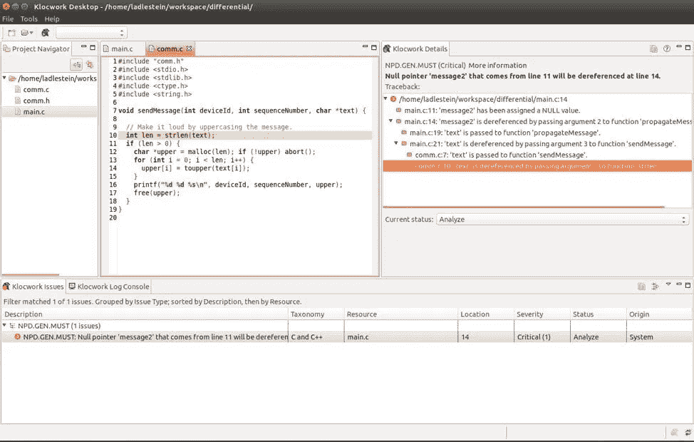
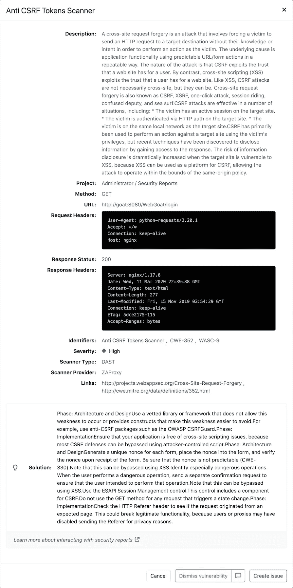

# 应用程序安全测试中的静态与动态

> 原文：<https://towardsdatascience.com/static-vs-dynamic-in-application-security-testing-36687a0c55c5?source=collection_archive---------39----------------------->

## 探索 SAST 和 DAST 的主要区别

[Alex](https://unsplash.com/@worthyofelegance?utm_source=unsplash&utm_medium=referral&utm_content=creditCopyText) 在 [Unsplash](https://unsplash.com/s/photos/yin-yang?utm_source=unsplash&utm_medium=referral&utm_content=creditCopyText) 上的原始照片。它后来被修改，以包括文本 SAST 和 DAST。

我以前写过一篇文章，讨论静态应用程序安全性测试的利弊。我之前的一篇文章根据 OWASP(一个旨在教育人们了解安全漏洞的非营利组织)的报告，介绍了全球开发者面临的[十大最关键的 web 应用和 API 安全风险](https://owasp.org/www-project-top-ten/2017/)。

在本教程中，我们将探索和比较静态应用程序安全测试(SAST)和动态应用程序安全测试(DAST)之间的差异。

静态应用程序安全测试(SAST)是减少应用程序安全漏洞的方法之一。另一种方法是动态应用程序安全测试(DAST)，它可以保护您的应用程序。让我们来看看这两种方法的区别。

# 静态应用程序安全性测试

## 白盒测试

SAST 是一种白盒安全测试，可以完全访问底层源代码和二进制代码。它将通过由内向外的方法测试你的程序。专门的 SAST 软件，如 [GitLab](https://docs.gitlab.com/ee/user/application_security/sast/) 、 [Klockwork](https://www.perforce.com/products/klocwork) 或 [AppThreat](https://github.com/AppThreat/sast-scan) 将在编码过程中或在您将代码提交到管道后自动扫描您的源代码。

例如，对于 Klockwork 的用户来说，一旦您在项目和 Klockwork 桌面之间建立了链接，它就允许您使用您选择的任何 IDE 正常编写程序，只要它在后台是打开的。每次保存文件时，Klockwork Destop 都会自动更新代码，并当场执行扫描。如果检测到任何安全问题，它会在用户界面上显示出来。

作者图片

## 早期发现

SAST 通常在系统开发生命周期的早期进行，通常是在开发阶段期间或之后。这允许您在进入测试或质量保证阶段之前识别任何形式的安全漏洞。

当问题在早期被发现时，解决问题要容易得多。此外，大多数 SAST 执行会标记有漏洞的代码行。这非常有用，可以作为开发人员修复漏洞时的参考。维护和开发项目的成本也更低。

## 假阳性

与 DAST 相比，SAST 方法容易出现大量的假阳性。因此，可能会出现这样一种情况，开发人员浪费了宝贵的时间和资源来修复他们系统中想象的问题。如果出现成百上千的误报，从长远来看，这样的失败代价会很高。

## 语言相关的

在分析底层源代码和二进制代码方面，SAST 是语言相关的。大多数 SAST 工具只专注于几种计算机语言。您将无法为项目中使用的每种编程语言找到一种通用的 SAST 工具。因此，用不同的计算机语言来扩展和维护一个项目将是一项巨大的任务。

## 不包括运行时漏洞

SAST 无法检测任何形式的运行时漏洞，因为它只扫描静态代码和二进制文件。如果您错误地配置了系统，SAST 工具将无法识别运行时问题，从而导致开发人员产生错误的安全感。

# 动态应用安全测试

## 黑盒测试

另一方面，DAST 被称为动态的，因为它不能访问底层的静态代码或二进制代码。测试由外向内进行。你可以把它想象成一个黑客试图测试你系统的安全漏洞。

与 SAST 不同，它分析正在运行的应用程序，而不需要任何用于开发系统的技术知识。一旦它检测到任何潜在的漏洞和风险，它就会为开发人员记录这些问题。

下面的例子说明了 Gitlab 如何对源分支和目标分支之间的漏洞进行比较。该信息将显示在每个合并请求上。

图片来自 [Gitlab 关于 DAST 的文档](https://docs.gitlab.com/ee/user/application_security/dast/)

## 后期检测

DAST 通常在系统开发生命周期的末尾进行。它通常发生在测试阶段，就在用户验收测试之前。在将应用程序部署给用户之前，它是保护应用程序的最后一道关口。

大多数时候，在 DAST 下检测到的问题不会被立即修复，除非它们被认为是关键的。这主要是由于在 UAT 或部署阶段之前缺少时间。因此，大多数问题都被推到下一个开发周期。

## 独立于语言

由于测试是直接在运行的应用程序上进行的，DAST 不依赖于任何计算机语言。因为测试独立于系统开发中使用的编程语言，所以扩展和维护测试要容易得多。

然而，大多数 DAST 工具只支持特定类型的应用程序，如 web 应用程序或 web 服务。如果你的项目由 web 应用程序、桌面应用程序和移动应用程序组成，你可能需要一些不同的 DAST 工具。

例如，让我们看看 Gitlab 制作的 DAST 报告。它强调了在 web 应用程序上执行的反 CSRF 令牌分析。

图片来自 [Gitlab 关于 DAST 的文档](https://docs.gitlab.com/ee/user/application_security/dast/)

在幕后，它使用一个名为 [OWASP ZAP (Zap 攻击代理)](https://www.zaproxy.org/)的开源 web 应用程序扫描器来扫描您正在运行的应用程序。

## 覆盖运行时漏洞

DAST 相对于 SAST 的一个主要优势是它能够发现运行时漏洞。这包括配置问题、认证问题和系统内存问题。您将能够从用户的角度识别更多的问题。

# 结论

让我们回顾一下今天所学的内容。

我们首先简要解释了 OWASP 报告的 10 大安全漏洞。

然后，我们继续探索静态应用程序安全测试(SAST)和动态应用程序安全测试(DAST)之间的主要区别。我们了解到 SAST 是一种白盒测试，而 DAST 是一种黑盒测试方法。

虽然 SAST 通常在系统开发生命周期的早期完成，并且依赖于语言，但是 DAST 不依赖于任何计算机语言，并且通常在周期的末尾进行。

感谢你阅读这篇文章。希望在下一篇文章中再见到你！

# 参考

1.  [维基百科—静态应用安全测试](https://en.wikipedia.org/wiki/Static_application_security_testing)
2.  [维基百科—动态应用安全测试](https://en.wikipedia.org/wiki/Dynamic_application_security_testing)
3.  [什么是 SAST？概述+ SAST 工具](https://www.perforce.com/blog/kw/what-is-sast)