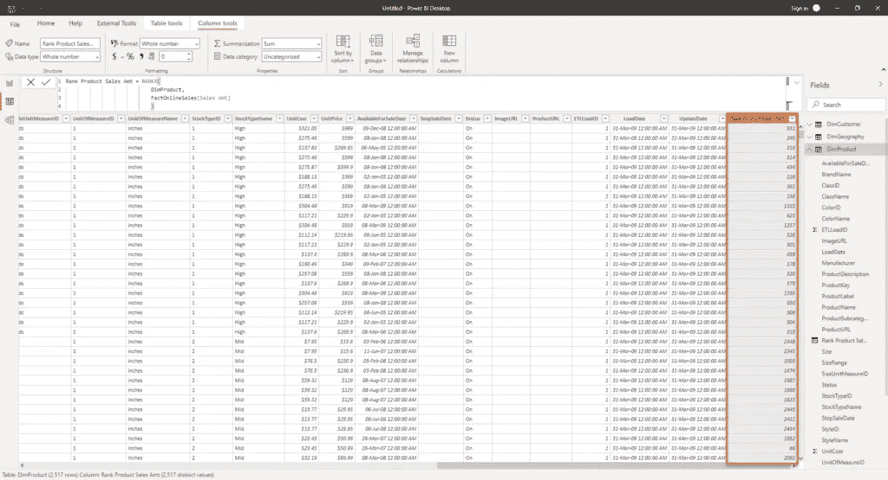
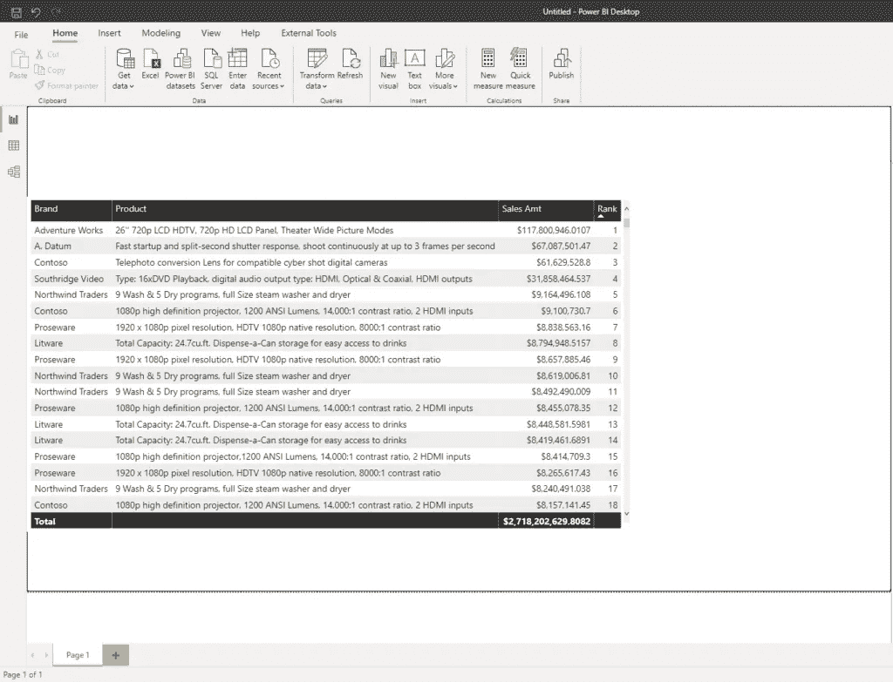
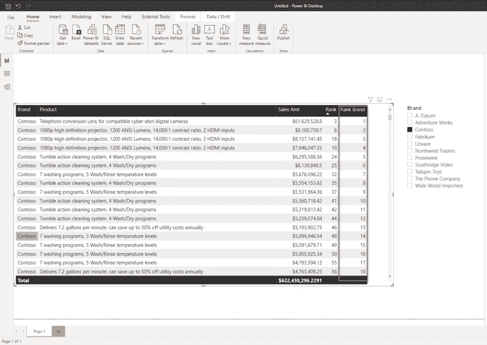
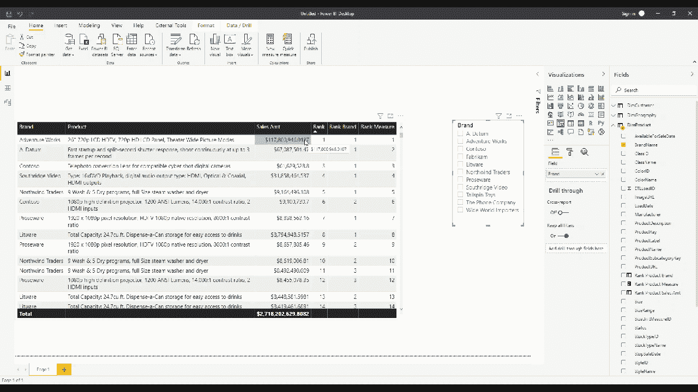
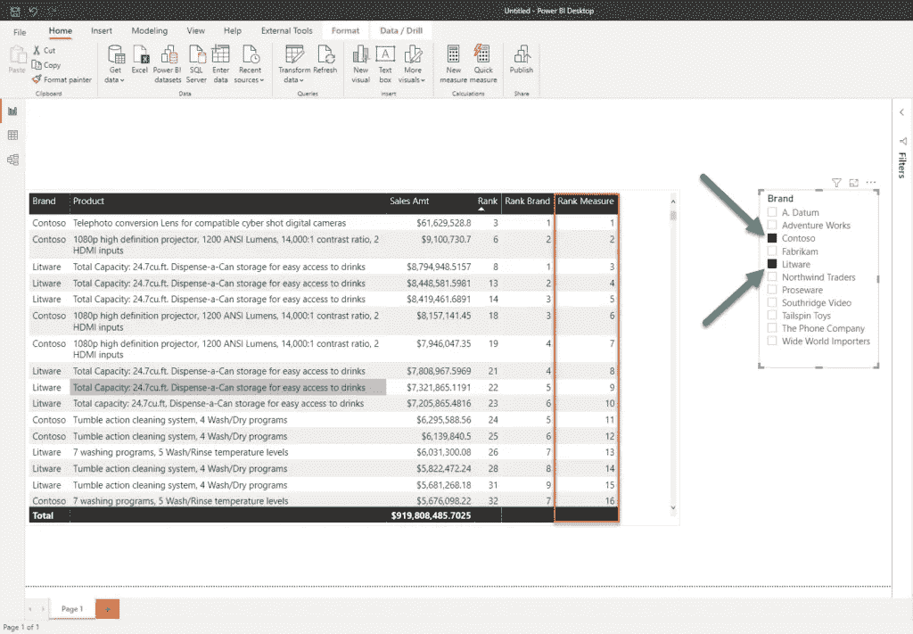

# 功率 BI 中的静态与动态排序

> 原文：<https://towardsdatascience.com/static-vs-dynamic-ranking-in-power-bi-ef318fbb61d7?source=collection_archive---------7----------------------->

## 了解如何以多种不同的方式处理最常见的业务请求之一！


[图像来源](https://unsplash.com/photos/qIu77BsFdds)

我最畅销的产品是什么？哪些客户在我的服务上花费最多？哪些商店销售了我们奢侈品牌的最多产品？回答这些问题以及许多类似的问题是创建 Power BI 报告时最常见的要求之一。

为了能够根据上述问题的答案做出正确的业务决策，我们需要确定各自的价值，并相应地对它们进行排序。

DAX 为处理排序提供了两个不同的函数——*RANKX*和 *TOPN* 。您可以直观地得出结论， *TOPN* 函数可以帮助您识别，比方说，去年最畅销的前 5 个产品，或者购买最多商品的前 10 个客户。然而， *TOPN* 不在本文讨论范围之内，因为我们将重点讨论 *RANKX* 函数…

## 了解静态排名

静态排名给一个特定的值分配一个排名，这个排名不会改变——不管你是否过滤结果！让我们看看这在一个真实的例子中是怎样的，使用(通常)一个样本 Contoso 数据库。

首先，让我们在 FactOnlineSales 表中创建一个显式度量值[来计算销售额:](/understanding-explicit-vs-implicit-measures-in-power-bi-e35b578808ca)

```
Sales Amt = SUM(FactOnlineSales[SalesAmount])
```

现在，为了查看哪些产品给我们带来了最多的利润，我们需要在 DimProduct 表中创建一个新列。该列将用于根据销售额为特定产品分配等级:

```
Rank Product Sales Amt = RANKX(
                            DimProduct,
                            [Sales Amt]
                            )
```



作者图片

正如您所注意到的，Power BI 根据销售额对我们的行进行了排名。

让我们利用这一计算方法，检查哪些产品的销售额最高:



作者图片

哦，我喜欢那些液晶显示器，它们真的带来了很多钱！这看起来真的很好，因为我可以很快发现哪些产品表现最好。

但是，如果我很好奇想知道具体品牌的表现呢？让我们添加一个切片器，只查看 Contoso 品牌的数据:


作者图片

哎呀，我的数字 1、2、4、5……在哪里？我觉得这有点奇怪，不是吗？如果你在问自己:到底发生了什么？回到文章开头，我明确地说过:*排名不会改变——不管你是否过滤结果！*所以，长焦转换镜头永远是 3 号(除非底层数据改变)，滤镜应用与否！

因此，让我们调整我们的计算，在特定品牌中设置一个适当的计算:

```
Rank Product Brand = RANKX(
                           ALLEXCEPT(DimProduct,DimProduct[BrandName]),
                           [Sales Amt]
                    )
```

这里， *ALLEXCEPT* 函数将删除 DimProduct 表上的过滤器，只保留 BrandName 列的过滤器，现在我们将得到不同的结果:



作者图片

这很好，但是这个解决方案远非完美。想象一下，为每一个切片器创建一个单独的计算列——这将是一项非常麻烦和乏味的工作！更不用说它会扩大您的数据模型，因为每次数据刷新都会对所有计算列进行计算和具体化，并且它们会占用一定的内存！

## 了解动态排名

每当你在 Power BI 中听到术语 ***动态*** 时，你应该假设你将不得不处理[措施，而不是列](https://data-mozart.com/calculated-columns-vs-measures-in-power-bi/)。也就是说，如果您希望在 Power BI 报告中应用动态排名，这意味着排名值将根据当前过滤器上下文动态计算和分配。

因此，让我们创建我们的度量，它将准确地执行我们动态计算排名所需的操作:

```
Rank Product Measure = IF(
                            ISINSCOPE(DimProduct[ProductDescription]),
                                IF(
                                    NOT ISBLANK([Sales Amt]),
                                    RANKX(
                                        ALLSELECTED(DimProduct),
                                        [Sales Amt]
                                    )
                                )
                        )
```

现在，如果我们看一下我们的表格，您会看到将根据用户与报告的交互来分配等级:



作者图片

您可以在这个短视频中看到，我的度量将根据用户的选择进行动态调整:如果在切片器中没有选择任何值，它将与我们的第一个计算列完全一样。另一方面，一旦我在切片器中选择了一个特定的品牌，该度量将显示与我们的第二个计算列相同的结果！

最后，让我们看看如果我们在切片器中选择多个品牌会发生什么:



作者图片

由于我已经选择了 Contoso 和 Litware，我们的度量将在当前的过滤器上下文中进行评估，并根据它分配等级——Contoso 和 Litware 现在代表我们要应用我们的度量的子集！

## 结论

处理与排名相关的请求在大多数业务场景中非常常见，为了应用正确的计算，理解静态和动态排名之间的差异是绝对必要的。

这个要求没有唯一正确的解决方案——你应该和你的用户谈谈，看看他们认为分配排名的标准是什么。在任何情况下，如果可能的话，您应该倾向于应用动态排名，因为这不仅会确保更大的灵活性，而且还会减少数据模型的大小和维护的麻烦。

感谢阅读！

[成为会员，阅读 Medium 上的每一个故事！](https://datamozart.medium.com/membership)

订阅[此处](http://eepurl.com/gOH8iP)获取更多有见地的数据文章！