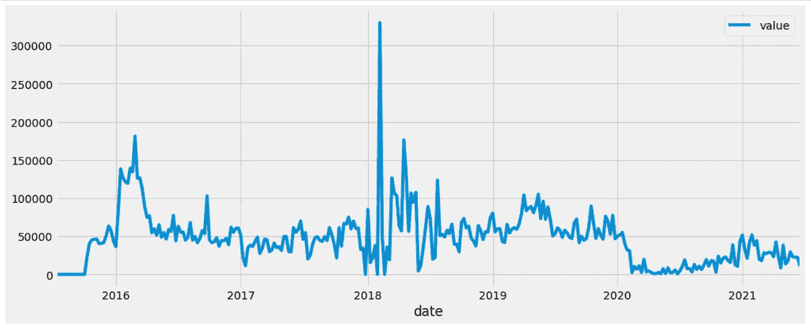
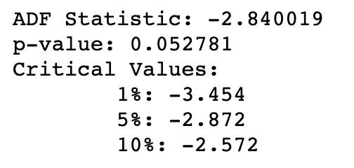
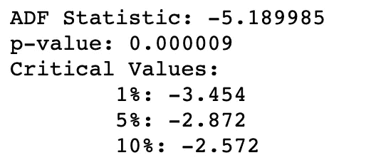

# 时间序列数据的平稳性假设

> 原文：<https://towardsdatascience.com/stationarity-assumption-in-time-series-data-67ec93d0f2f?source=collection_archive---------10----------------------->

## 平稳性假设重要吗，我们该怎么做？


萨曼莎·加德斯在 [Unsplash](https://unsplash.com/s/photos/time?utm_source=unsplash&utm_medium=referral&utm_content=creditCopyText) 上的照片

当我进行时间序列分析时，平稳性总是我遇到的术语。当我遇到这个学期时，我脑子里有许多问题。什么被认为是平稳数据？我们需要关心平稳性假设吗？如果我们需要，我们应该做什么？

# 什么是平稳数据？

平稳数据是指均值和方差不随时间变化的**时间序列数据**。如果从数据中观察到**强趋势或季节性**，则数据被认为是非平稳的。


图片来自[预测:原理与实践](https://otexts.com/fpp2/)

如上图所示从[这里](https://otexts.com/fpp2/stationarity.html)，只有(b)和(g)被认为是静止的。

**观察到的明确趋势** : a、c、e、f、I

**观察到明显的季节性** : d、h、I

(g)乍一看显示了一些周期性运动，但实际上它具有不同的循环时间周期，因此仍然被认为是静止的。如何检测时间序列数据中的平稳性的更详细的方法将在后面的文章中介绍。

# 平稳性对时间序列分析重要吗？

在大多数情况下，这很重要。这是因为许多统计分析或模型**是建立在均值和方差随时间保持一致的假设上**。

当我们用平稳模型来拟合我们想要分析的时间序列数据时，我们应该检测数据的平稳性，并从数据中去除趋势/季节性效应。

许多当前的时间序列模型，如 ARIMA，可以选择包括将原始数据转换成平稳数据的步骤，或者使我们的生活更加方便。然而，如果我们能够理解数据的平稳性，以便我们能够**为模型**提供更好的输入，这仍然是有益的。

# 我们使用的数据:

正如我在我的另一篇文章[这里](/how-to-predict-your-step-count-for-next-week-a16b7800b408)中介绍的，我使用的是来自苹果健康的我自己的计步数据。可以参考这个[链接](http://www.markwk.com/data-analysis-for-apple-health.html)下载自己的苹果健康数据，开始一些很酷的分析。

# 我们如何知道数据是否是平稳的？

## 方法一:看图表

最简单方便的方法就是直接看图表，看是否有明显的趋势或者观察到的季节性。



我自己的步数可视化

正如你从我自己的步数图表中看到的，从 2020 年开始有一个明显的向下移动的趋势，这使得数据不是那么稳定。有时很难区分，你可以选择使用[季节性分解](https://www.statsmodels.org/stable/generated/statsmodels.tsa.seasonal.seasonal_decompose.html)包**将主图表分解成趋势和季节性**。

```
import statsmodels.api as sm
extract=train.set_index('date')
from pylab import rcParams
rcParams['figure.figsize'] = 18, 8
decomposition = sm.tsa.seasonal_decompose(extract, model='additive')
fig = decomposition.plot()
plt.show()
```


季节性分解图

这将原始时间序列图分解为趋势图、季节图和残差图。从这张图上你可以看到更清晰的趋势变化模式。

## 方法 2:统计方法——扩展的 Dickey-Fuller 检验

如果您仍然不能从直接图或分解图中确定平稳性。扩展的 Dickey-Fuller 检验或 ADF 检验是确定时间序列数据是否平稳的最流行的统计方法之一。

增强的迪基-富勒测试是迪基-富勒测试的增强版本。它测试预测 Y 值与时间滞后项和滞后差分项之间的**相关性，如下所示。**


AFD 测试公式

在 Python 中，我们可以直接使用 statsmodels 的 [adfuller 包](https://www.statsmodels.org/stable/generated/statsmodels.tsa.stattools.adfuller.html)来查看数据在不同的显著性水平上是否平稳。让我们对步数数据进行 ADF 测试，看看它是否是稳定的。

```
from statsmodels.tsa.stattools import adfuller
result = adfuller(weekly.value)
print('ADF Statistic: %f' % result[0])
print('p-value: %f' % result[1])
print('Critical Values:')
for key, value in result[4].items():
 print('\t%s: %.3f' % (key, value))
```



ADF 结果

从上面的结果可以看出，p 值略高于 0.05，这意味着我的步数数据在 1%或 5%的显著性水平上是非平稳的。您还可以将 ADF 统计数据与不同显著性水平的临界值进行比较。与临界值相比，**ADF 统计值越负，数据就越稳定**。

# 如果我的数据不稳定，我该怎么办？

最常见的解决方案是差分。这意味着您**对后续时间序列值之间的差异建模，而不是对值本身建模**。这是因为差异通常可以消除趋势或季节性的影响。另外，如果一阶差分(扣一次)不行，可以试试二阶差分(扣两次)。

**原始数据:** Y0，Y1，Y2

**一阶差分:** (Y1-Y0)，(Y2-Y1)

**二阶差分:** ((Y2-Y1)-(Y1-Y0))

让我们将差分方法应用于我们的步数数据，看看会发生什么。

```
#calculate first order differencing value
first_order_diff=weekly.value.diff()#remove na value due to differencing
first_order_diff=first_order_diff.dropna()#ADF test
result = adfuller(first_order_diff)
print('ADF Statistic: %f' % result[0])
print('p-value: %f' % result[1])
print('Critical Values:')
for key, value in result[4].items():
 print('\t%s: %.3f' % (key, value))
```



差异后的 ADF 测试结果

正如我们从上面的结果中看到的，在一阶差分后，p 值已经下降到 0.01 以下，数据已经转换为严格平稳。

# 我们如何在 ARIMA 模型中应用平稳性？

“I”在 ARIMA 的意思是“集成的”,它指的是获得稳定数据所需的差分数。当我们在 Python 中使用 ARIMA 模型包时，它**也与参数 d(差分顺序)**相关。

在我的步数预测示例中，我们已经分析并知道原始数据不是严格静态的，一阶差分可以将数据转换为静态时间序列数据集。我们可以调整 [auto_arima](https://alkaline-ml.com/pmdarima/modules/generated/pmdarima.arima.auto_arima.html) 包的启动参数如下:


# 最后

建议每次开始时间序列分析时检查平稳性假设。它可以帮助您更好地理解数据，并为模型选择更好的参数值范围。

如果您有兴趣了解使用时间序列方法进行端到端步骤计数预测的更多信息，请参考以下链接:

</how-to-predict-your-step-count-for-next-week-a16b7800b408>  

# 参考:

[https://otexts.com/fpp2/stationarity.html](https://otexts.com/fpp2/stationarity.html)(平稳性检查和差分)

[https://www . stats models . org/stable/generated/stats models . TSA . stat tools . ad fuller . html](https://www.statsmodels.org/stable/generated/statsmodels.tsa.stattools.adfuller.html)。(Python 中的 ADF 测试包)

感谢阅读！如果您有任何反馈或任何其他您想了解的话题，请在评论框中填写！