# 矩阵形式的主成分分析和 OLS

> 原文：<https://towardsdatascience.com/statistical-analysis-1a291f4bff3a?source=collection_archive---------19----------------------->

## 使用 R 的线性代数运算:主成分分析和普通最小二乘法


弗拉多·帕诺维奇在 [Unsplash](https://unsplash.com?utm_source=medium&utm_medium=referral) 上拍摄的照片

# 介绍

主成分分析(PCA)和普通最小二乘法(OLS)是两种重要的统计方法。他们在一起表演时甚至更好。我们将使用 R 中的矩阵运算来探索这些方法，并介绍一种基本的主成分回归(PCR)技术。

# 数据生成

我们将从高斯分布中生成一个简单的数据集，该数据集包含四个高度相关的探索性变量，以及一个响应变量，该响应变量将是它们与添加的随机噪声的线性组合。

```
> library(‘MASS’)

> mu=rep(3,4)
> sigma=matrix(.9, nrow=4, ncol=4) + diag(4)*0.1> set.seed(2021)
> data <- as.data.frame(mvrnorm(20, mu = mu, Sigma = sigma), 
+ empirical = T)> y <- apply(data, 1, sum)+rnorm(20, 1, 1)
```

我们可以观察相关矩阵，并确认探索变量是高度相关的。在这种情况下，回归系数可能会有偏差。

```
> cor(data)
```

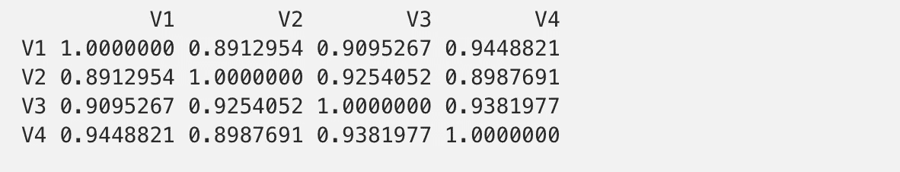

# 主成分分析

这种统计方法有助于我们处理多重共线性和高维度。使用 R，我们可能只需要 4 个步骤就可以获得 PC。

**首先**，我们需要对数据进行缩放。在我们的例子中，我们知道数据具有相同的数量级；因此，我们只将其居中。

```
data.scaled <-  scale(data, scale=F)
```

**第二个**，我们需要计算协方差矩阵:

```
data.cov <- cov(data.scaled)
```

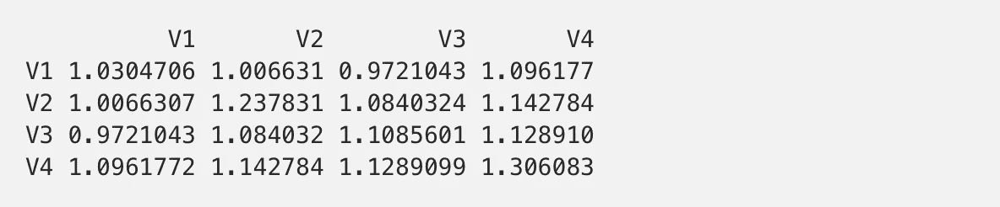

**第三个**，我们需要计算特征值来获得特征向量。在 R 中，函数 eigen()返回两个结果。特征值是标度参数；特征向量是旋转参数。

```
data.eigen <- eigen(data.cov)
```

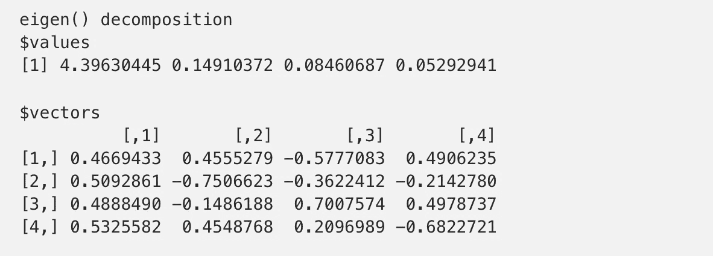

**最后**，我们需要执行数据和特征向量的矩阵乘法。结果将产生主成分:这些是新轴上原始数据的坐标。

```
> data.custom.pca <- data.scaled%*%(data.eigen$vectors)
```

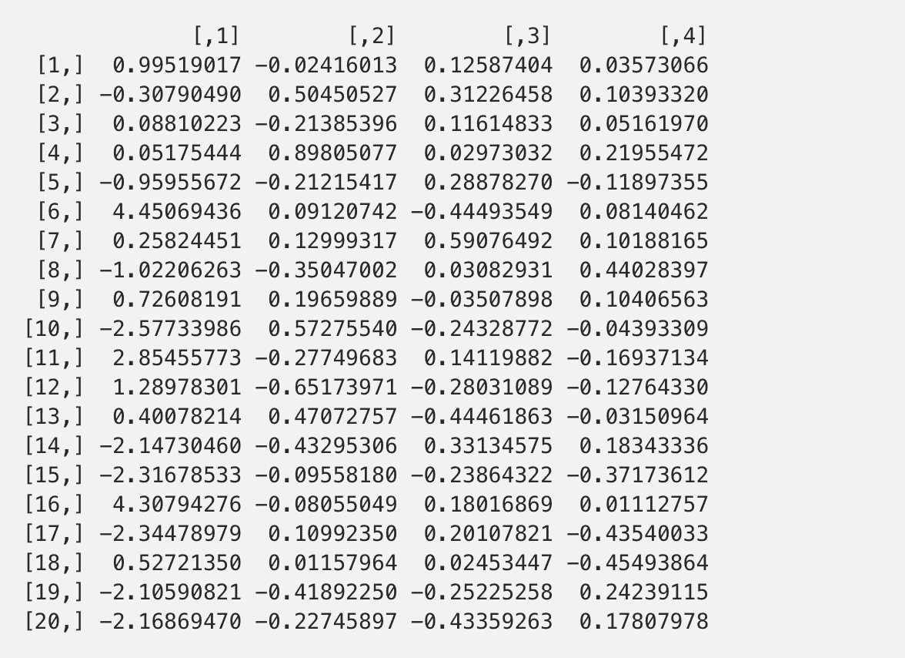

这些分量是正交的，我们可以通过观察相关矩阵来证实这一点:

```
> round(cor(data.custom.pca),5)
```

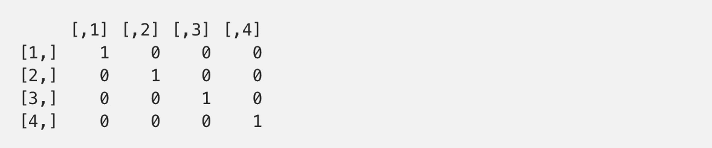

我们还可以计算出每个成分所占的解释变量的比例。第一个成分获得了 93.88%的变异；第一+第二分量捕获 97.06%，以此类推。

```
> cumsum(data.eigen$values)/sum(data.eigen$values)
```

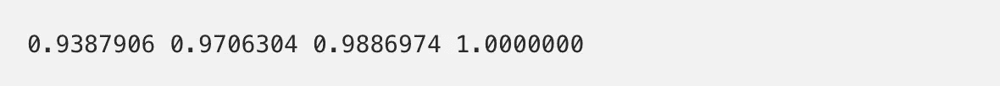

## 现在，让我们检查内置函数 prcomp()。

该功能自动化了我们之前执行的四步方法。从下面的结果中，我们可以看到，这些组件与我们刚刚获得的组件是等效的:

```
> data.pca <- prcomp(data)
```

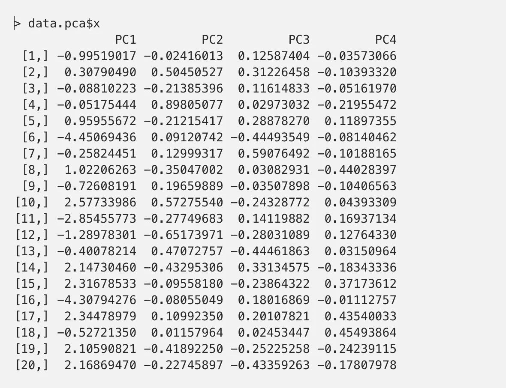

一些组件具有相反的符号，但是如果我们检查相应的特征向量(在这个包中称为旋转)，我们会注意到它们的符号也是相反的，当我们将它们相乘以获得原始数据时，一切都会很好。

```
> data.pca$rotation
```

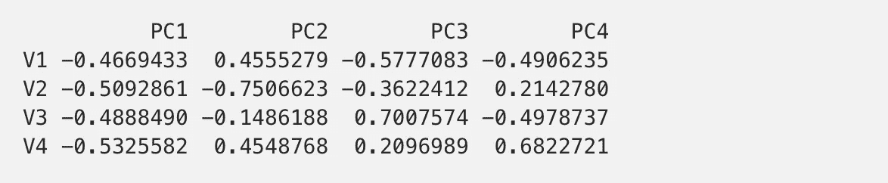

特征值可以通过平方该包的标准偏差来获得。

```
> data.pca$sdev^2
```

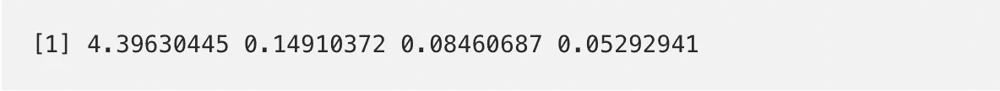

最后，summary 函数将返回组件的重要性和每个组件捕获的方差的比例。我们可以观察到结果与我们以前的估计是一致的。

```
> summary(data.pca)
```

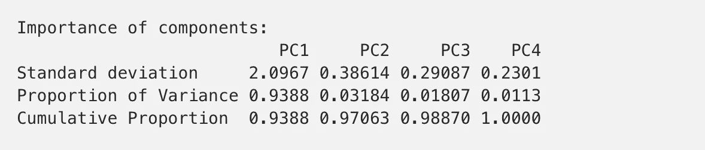

# 普通最小二乘法

在没有进一步细节的情况下，回归方程的系数可以使用以下公式获得:

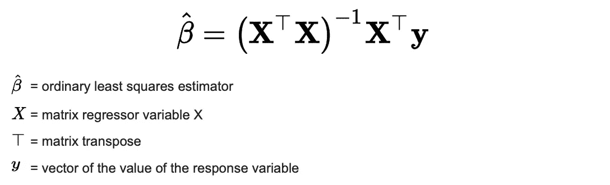

[https://en.wikipedia.org/wiki/Ordinary_least_squares](https://en.wikipedia.org/wiki/Ordinary_least_squares)

要计算它，我们需要知道 R 中的三个运算:如何求逆矩阵，如何转置矩阵，如何乘矩阵:

```
# Matrix multiplication:  %*% 
# Transpose matrix:       t(x)
# Invert matrix:          solve(x)
```

但在我们最终确定我们的方程之前，我们需要记住，这个公式假设 x0 = 1，因此我们要在数据中添加一个单位列。然后，我们以矩阵形式运行该方程，并获得系数:

```
> x <- as.matrix(cbind(1,data))> solve(t(x)%*%x) %*% t(x) %*% y
```

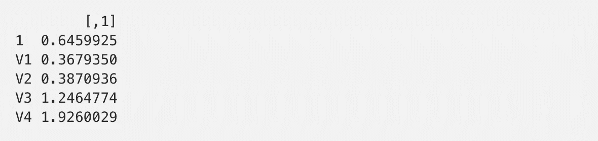

我们可以看到，R 中的这个方程直接重复了我们在题目开始时提到的方程。让我们将它与 R 中的内置函数进行比较:

```
> model <- lm(y~x[,2:5])
```

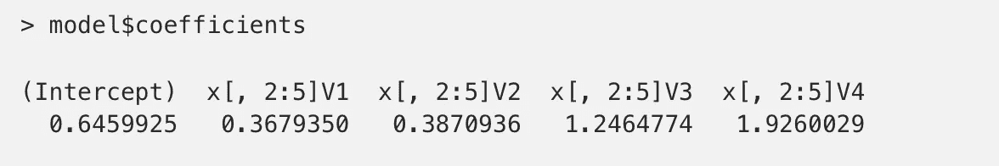

这两种方法的系数是相同的，因为它本质上是相同的方法。

现在我们知道了 PCA 和 OLS 方法是如何在简单数据集上执行的。这就完成了我们下一个主题的先决条件。

# 主成分回归

我们将使用我们之前获得的 PC，因为它们对于某些成分具有不同的符号，我们将显示，当我们将数据转换为原始形式时，系数将是相等的。

```
# Adding components from both methods to the data setdata.new <-  cbind(data, data.custom.pca, data.pca$x, y)
colnames(data.new)[5:8] <- c('cust1', 'cust2', 'cust3', 'cust4')
```

出于演示目的，将使用所有四种成分来估计模型，即使通常在 PCA 之后我们减少预测因子的数量:

```
model.cust <- lm(y~cust1+cust2+cust3+cust4, data.new)model.pca <- lm(y~PC1+PC2+PC3+PC4, data.new)
```

现在我们需要将分量旋转的系数转换到原始空间。这可以通过将它们乘以相应的特征向量来实现:

```
beta.pca <- as.matrix(model.pca$coefficients[2:5])
beta.original.pca <- as.matrix(data.pca$rotation) %*% beta.pcabeta.cust.pca <- as.matrix(model.cust$coefficients[2:5])
beta.original.cust <- as.matrix(data.custom.eigenvector) %*% beta.cust.pca
```

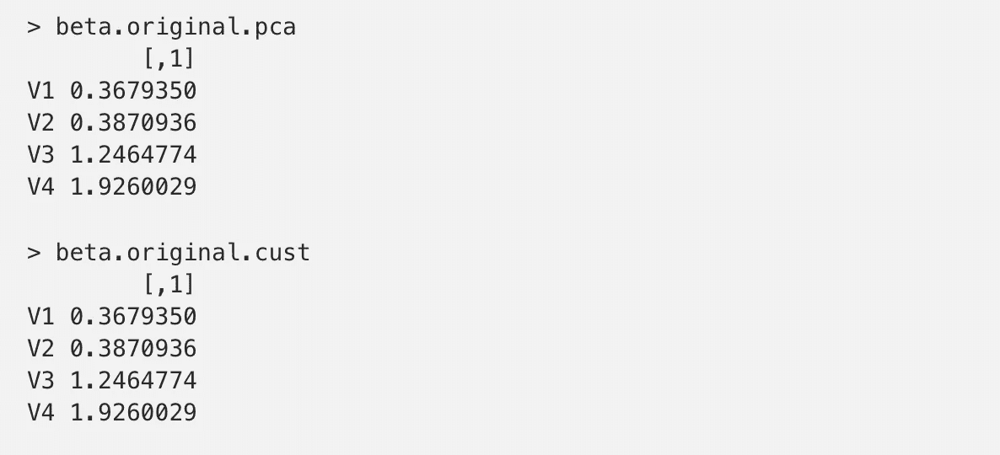

这证实了当我们将点变换到原始系统时，PCs 的相反符号将由特征向量的符号补偿。

## 现在，让我们检查来自库(pls)的内置函数 pcr()

函数 pcr()有几个参数需要调整，但是我们将构造最基本的版本，并获得系数。

```
library(pls)fit <- pcr(y ~.,  data = as.data.frame(data.scaled), center=F)
```

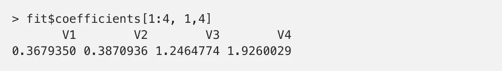

该函数计算所有 PC、特征值等，以及不同数量组件的系数。上面我们对所有四个分量进行了切片，我们可以看到，它们与我们先前得到的没有一点不同。

但是需要多少组件呢？我们可以绘制估计的 PCs 或 PCR 模型，以在图上搜索“肘”，或者尝试预测测试集/交叉验证，或者使用一些更正式的方法。

```
plot(fit, "validation", val.type = "MSEP")# orplot(data.pca, type='l')
```


从图中，我们可以看到，一台电脑足以捕捉数据的变化。从前面的观察中我们还知道，第一个分量捕获了约 93.88%的变化。因此，如果我们想对真实数据集进行回归并获得相似的结果，我们将只使用第一个分量来避免数据集中的多重共线性。

# 结论

在本文中，我们探索了一种计算 PCs 和 OLS 系数的矩阵形式方法，将这种自定义方法与 R 中的内置函数进行了比较，并通过执行 PCR 对其进行了总结。我们发现这两种技术没有区别。出于实用目的，使用 PLS 库很方便，但是出于理论目的，了解幕后的数学是很有用的。

完整代码可以在 [GitHub](https://github.com/serafimpetrov1/PCA_OLS_PCR) 上找到。

# 感谢您的阅读！

如果你有任何问题或发现了错误或错别字，请在下面留下评论。

在 [LinkedIn](http://www.linkedin.com/in/serafimpetrov) 上连接